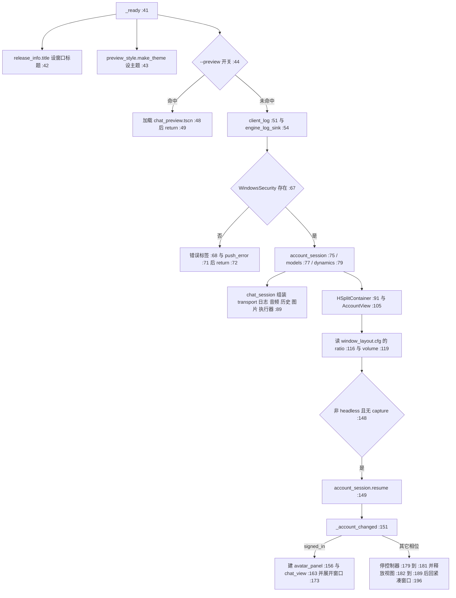
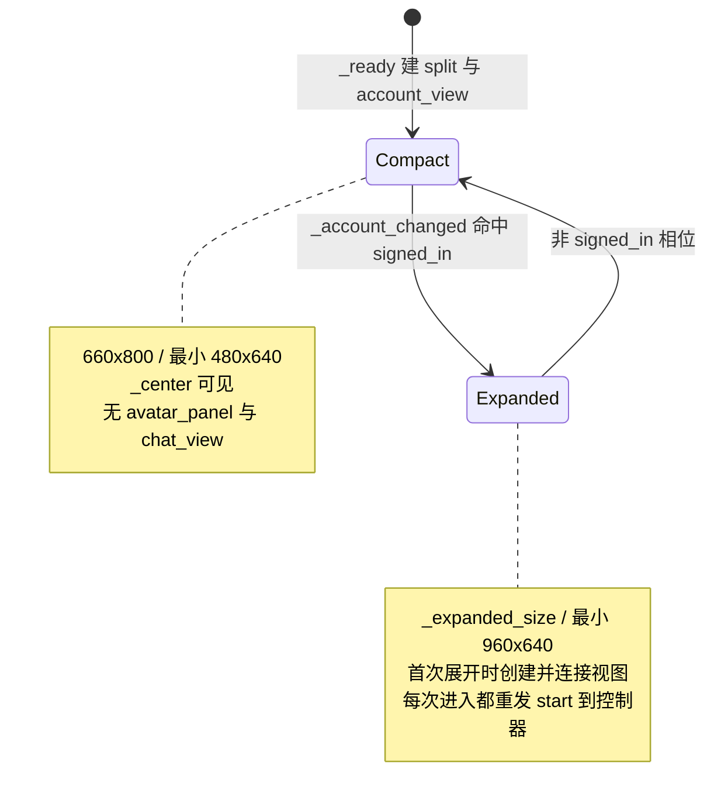

> **系列文档**：[总览](ARCHITECTURE.md) · **01 组装根** · [02 session](02-session.md) · [03 network](03-network.md) · [04 storage](04-storage.md) · [05 media](05-media.md) · [06 avatar](06-avatar.md) · [07 ui](07-ui.md) · [08 preview](08-preview.md) · [09 构建与交付](09-build-and-release.md) · [10 测试与验证](10-testing.md)
> **基线**：分支 `feat/agentluo-0.1.1` @ `42b5b1c` · 撰写日期 2026-09-20 · 只读现状分析（as-built）；除本系列 `.md` 与 `export_presets.cfg` 的导出排除项外不改动任何文件
> **路径与行号口径**：无前缀路径相对 `client_godot/`，`client_godot/…` 相对仓库根；`file:line` 为撰写时工作树行号

# 组装根

## 30 秒速览

- 这一篇只有两个文件：`src/application.gd`（273 行）与 `src/release_info.gd`（8 行）。整个客户端所有 `new()` 都发生在组装根里，别处一律通过构造参数拿依赖。
- 你要新增一个服务、一个设置窗口或一条新的提示条，第一站永远是这里：`_ready()`（`src/application.gd:41`）与 `_account_changed()`（`src/application.gd:151`）。
- 「登录前只显示账户表单、登录后展开成左角色右聊天」这条形态切换不是场景做的，是 `_account_changed()` 按账户相位增删节点做的（`src/application.gd:153` 到 `src/application.gd:197`）。
- 场景 `scenes/main.tscn` 只有一个 `Control` 加这个脚本，没有任何布局内容——所有控件都在代码里搭。
- 它承担四件容易漏掉的事：数据根注入、窗口尺寸与分隔比例的持久化、设置类窗口的缓存与草稿确认、退出时的日志收尾。

## 职责

- **建服务**：按固定顺序构造并 `add_child` 全部长期对象——账户会话来客与会话、日志与引擎日志汇、模型设置、动态控制器、音频缓存、历史同步、阅读位置、历史图片、模型执行器、聊天会话（`src/application.gd:51` 到 `src/application.gd:90`）。
- **切界面形态**：按 `_session` 的相位在「紧凑账户窗口」与「左角色右聊天」之间切换，并在登出时销毁视图（`src/application.gd:151` 到 `src/application.gd:197`）。
- **管窗口生死**：按 `preferences` / `models` / `dynamics` 三类缓存设置窗口，已存在即复用，窗口自毁时清缓存，登出与退出时统一关闭（`src/application.gd:223` 到 `src/application.gd:247`、`src/application.gd:268` 到 `src/application.gd:273`）。
- **管草稿确认**：退出与登出前先问一遍所有设置窗口的 `is_dirty()`，脏就弹确认框并默认把焦点放在「取消」（`src/application.gd:249` 到 `src/application.gd:256`）。
- **管持久化的三项**：窗口尺寸与最小尺寸（`_resize_window()`，`src/application.gd:203` 到 `src/application.gd:214`，含屏幕可用区的夹取与居中）、分隔条比例（`layout.ratio`，`:116` 到 `:118` 读、`:128` 到 `:134` 写）、音量（`audio.volume`，`:119` 到 `:121` 读、`:122` 到 `:127` 写）。三项都落在 `_layout_path` 指向的同一个 `ConfigFile`。
- **管退出**：`auto_accept_quit = false`（`:58`）拦住直接退出，`_exit_tree()` 里先摘掉引擎日志汇再结束日志（`:216` 到 `:221`）。
- **提供版本标题**：窗口标题由 `src/release_info.gd:6` 从 `res://release.json` 拼出（`src/application.gd:42`），与构建脚本共用同一份版本源（见 09 篇）。

## 为什么这样切分

- **「`new` 只出现在组装根」是硬约束，不是风格偏好**。视图层完全不带业务依赖，因此可以被测试直接 `new()` 出来（见 07 篇与 08 篇的复用情况）；控制器之间也不互相 `new`，一律由构造参数传入（例如 `src/application.gd:89` 把 transport、日志、音频、历史、阅读位置、图片、执行器七个依赖一次交给 `chat_session`）。代价是组装根会成为依赖扇出的唯一位置：`src/application.gd` 顶部 11 个 `preload`（`:3` 到 `:13`）加上内联 `preload`，共触及 20 个以上其它模块的脚本。
- **数据根由构造参数决定，而不是各处硬编码 `user://`**。`_init` 的第二个参数名为 `layout_path`，但它同时是数据根：日志目录（`:51`）、模型目录（`:77`）、音频缓存目录（`:84`）、阅读位置目录（`:86`）、历史图片目录（`:87`）、动态窗口配置（`:239`）全部由 `_layout_path.get_base_dir()` 派生。唯一例外是默认值分支：当 `_layout_path` 正好等于 `user://window_layout.cfg` 时，日志走固定的 `user://logs`（`:51`）。测试正是靠这个参数把整个数据根换到临时目录。
- **形态切换做成「增删节点」而不是「切场景」**。账户面板从一开始就存在于 `_split` 左格（`:104` 到 `:107`），登录后只是 `_center.hide()` 并往右格加角色与聊天（`:154`、`:158`、`:166`）；登出时把角色与聊天 `queue_free()` 并置空（`:182` 到 `:189`），下次登录重新创建。这样账户表单的状态（服务器地址、记住登录）不需要跨场景保存。
- **窗口尺寸是状态机的一部分**。登录前 `660×800` / 最小 `480×640`（`:50`），登录后 `_expanded_size` / 最小 `960×640`（`:173`），展开瞬间把当前尺寸记回 `_expanded_size`（`:192` 到 `:193`）——所以同一次运行里「登录 → 拉大窗口 → 登出 → 再登录」会还原被拉大的尺寸，而不是回到默认值；`tests/test_application_window.gd:92` 断言的就是这一条。
- **设置类窗口不进场景树常驻，也不自持控制器**。三类窗口共用 `open()` / `is_dirty()` / `hide()` 三约定，组装根因此不需要知道任何窗口内部结构；`preferences` 与 `models` 的控制器由组装根创建（`:232`、`:235`），`dynamics` 复用启动时就建好的共享控制器（`:239`），三者生命周期因此不同。
- **版本来源统一**：运行标题与构建脚本读同一份 `release.json`（`src/release_info.gd:4`），所以标题报的版本与包名不会分叉（见 09 篇）。

## 关键文件与符号

| 文件 | 行数 | 职责 | 关键符号 |
| --- | --- | --- | --- |
| `src/application.gd` | 273 | 唯一组装根：建服务、切界面、管窗口、管持久化、管退出 | 11 个顶层 `preload`（`src/application.gd:3` 到 `:13`）、状态字段（`:14` 到 `:34`）、`_init()`（`:36`）、`_ready()`（`:41`）、`--preview` 分支（`:44` 到 `:49`）、日志与引擎日志汇（`:51` 到 `:57`）、退出对话框（`:60` 到 `:66`）、扩展缺失兜底（`:67` 到 `:72`）、服务构造（`:74` 到 `:90`）、布局装配（`:91` 到 `:112`）、`_session.changed`（`:113`）、持久化读写（`:114` 到 `:134`）、截图模式（`:139` 到 `:147`）、自动登录（`:148` 到 `:149`）、`_account_changed()`（`:151`）、`_resize_split()`（`:199`）、`_resize_window()`（`:203`）、`_exit_tree()`（`:216`）、`_open_settings()`（`:223`）、`_request_close()`（`:249`）、`_finish_close()`（`:258`）、`_close_windows()`（`:268`） |
| `src/release_info.gd` | 8 | 读工程内版本资源；运行标题与构建脚本共用同一份来源 | `get_info()`（`src/release_info.gd:3`）、读 `res://release.json`（`:4`）、`title()`（`:6` 到 `:8`） |

组装根持有的状态字段（`src/application.gd:14` 到 `:34`）可以直接当作「它负责什么」的清单：会话与聊天（`:14` 到 `:15`）、三个视图句柄（`:16`、`:18`、`:19`）、布局比例与就绪标志（`:20` 到 `:21`）、数据根与展开状态（`:22` 到 `:24`）、日志三件套（`:25` 到 `:27`）、日志故障提示条（`:28`）、设置窗口缓存（`:29`）、退出对话框与待执行动作（`:30` 到 `:31`）、模型与动态控制器（`:32` 到 `:34`）。

## 对外接口与信号

**构造参数**（`src/application.gd:36` 到 `:38`）

| 参数 | 默认 | 作用 |
| --- | --- | --- |
| `account_session` | `null` | 注入假会话；为 `null` 时自行用 `WindowsSecurity` + `account_api` + `credential_store` 组装真会话（`src/application.gd:73` 到 `:75`） |
| `layout_path` | `user://window_layout.cfg` | 同时充当数据根；布局、比例、音量写在这里，其余子目录由它的父目录派生 |

除此之外没有任何公开 API。

**它连出去的信号**（11 条）

| 信号 | 行 | 去向 |
| --- | --- | --- |
| `_dynamics.unread_changed` | `src/application.gd:81` | 转发给 `chat_view.set_dynamics_unread()`（`:83`） |
| `_chat.expression_requested` | `:93` | 转给 `avatar_panel.avatar.apply_expression()`（`:95`） |
| `_chat.mouth_changed` | `:96` | 转给 `avatar_panel.avatar.set_mouth_openness()`（`:98`） |
| `_session.changed` | `:113` | `_account_changed()` |
| `_chat.state_changed` | `:122` | 音量变化时写盘（`:124` 到 `:127`） |
| `_split.dragged` | `:128` | 写 `layout.ratio`（`:131` 到 `:134`） |
| 自身 `resized` | `:135` | `_resize_split()` |
| 窗口 `close_requested` | `:59` | `_request_close("exit")` |
| `_exit_dialog.confirmed` | `:65` | `_finish_close(_exit_action)` |
| `_exit_dialog.canceled` | `:66` | 清空 `_exit_action` |
| 每个设置窗口的 `tree_exited` | `:242` | 清掉 `_windows` 里的对应项（`:243` 到 `:244`） |

**它消费的子视图信号**（4 条）

| 信号 | 行 | 去向 |
| --- | --- | --- |
| `account_view.log_requested` | `src/application.gd:108` | 直连 `_log_window.open` |
| `chat_view.logout_requested` | `:167` | `_request_close("logout")` |
| `chat_view.log_requested` | `:168` | 直连 `_log_window.open` |
| `chat_view.settings_requested` | `:169` | `_open_settings(kind)` |

**对窗口的三约定**（组装根只依赖这三个方法）

- `open()`：`_open_settings()` 在新建后调用（`:245`），复用时也调用（`:225`）。
- `is_dirty()`：`_request_close()` 遍历 `_windows` 逐个询问（`:251`）。
- `hide()`：`_close_windows()` 先 `hide()` 再 `queue_free()`（`:271` 到 `:272`）。

**命令行走关**

- `--preview`（`:44`）：释放 `_log_problem` 与 `_exit_dialog`（`:45` 到 `:46`）、按 1200×800 / 最小 960×640 调整窗口（`:47`）、加载 `scenes/chat_preview.tscn`（`:48`）、然后 `return`——**不会**创建日志、账户、聊天、模型、动态中的任何一个服务。
- `--capture=<路径>`（`:140` 到 `:142`）：等 1 秒 + 等一次 `frame_post_draw` 后 `save_png`，成功退 0、失败退 1（`:144` 到 `:147`），**不**走自动登录分支。
- 两者都从 `OS.get_cmdline_user_args()` 读取，因此必须写在 `--` 之后。

## 依赖与数据流

**账户相位驱动的视图切换**

展开分支每次都调 `_chat.start()`、`_models.start()`、`_dynamics.start()`（`:174` 到 `:176`），即使视图节点是复用的；而登出分支按固定顺序先 `_close_windows()` 再停三个控制器（`:178` 到 `:181`），最后才释放视图。这条顺序保证了窗口在控制器还活着时被关闭。

**依赖扇出**

| 依赖来源 | 行 | 对象 |
| --- | --- | --- |
| 顶层 `preload` | `src/application.gd:3` 到 `:13` | `account_api`、`credential_store`、`account_session`、`account_view`、`avatar_panel`、`chat_session`、`websocket_transport`、`chat_view`、`client_log`、`audio_cache`、`reply_audio` |
| 内联 `preload` | `:42`、`:43`、`:48`、`:54`、`:56`、`:77`、`:79`、`:85`、`:86`、`:87`、`:88`、`:89`、`:232`、`:233`、`:235`、`:239` | `release_info`、`preview_style`、`chat_preview.tscn`、`engine_log_sink`、`log_window`、`model_settings`、`json_request`、`model_store`、`dynamics_controller`、`history_sync`、`history_api`、`reading_position`、`history_images`、`model_executor`、`preferences_controller`、`preferences_window`、`model_window`、`dynamics_window` |
| 外部扩展类 | `:67`、`:74`、`:77` | `ClassDB.class_exists("WindowsSecurity")` 与两次 `ClassDB.instantiate("WindowsSecurity")` |

## 状态与不变量

- **启动顺序不可随意调换**：先设标题与主题（`:42` 到 `:43`），再判 `--preview`（`:44`）；确认不是样板块之后才建日志（`:51`），因为日志故障提示条要挂到 `_split` 之后（`:109`）；`WindowsSecurity` 检查（`:67`）必须在建会话之前，否则 `:75` 的 `instantiate` 会拿到 `null`。
- **扩展缺失是软失败**：只加一个红色错误标签并 `push_error`，然后 `return`（`:68` 到 `:72`）。此时窗口仍开着、主题已在，但没有任何服务与表单——`tests/check.ps1` 的启动步骤在缺扩展的环境下会因 `push_error` 触发 `ERROR:` 判定而失败（见 09 篇与 10 篇）。
- **`_exit_dialog` 与 `_log_problem` 是「先建后弃」**：两者在字段初始化时就 `new()`（`:28`、`:30`），`--preview` 分支再把它们 `free()`（`:45` 到 `:46`）。新增这类字段时样板块需要同样的释放，否则会留下无人持有的节点。
- **`auto_accept_quit = false`（`:58`）是草稿保护的开关**：它让关闭按钮不直接退出，从而一定经过 `close_requested` → `_request_close()` → 草稿判定这条链。
- **`_exit_action` 只在需要时被赋值**：脏草稿分支写入待执行动作（`:252`），取消时清空（`:66`），`_finish_close()` 执行完也清空（`:262`）；`_finish_close()` 对不在 `["exit","logout"]` 白名单里的动作直接返回（`:259` 到 `:260`），因此按下确认框时若动作已被清空不会误退出。
- **`_windows` 缓存的三条不变量**：键只有三个合法值（`:227` 白名单）；窗口被复用时只 `open()` 不重建（`:224` 到 `:226`）；窗口自毁时用「当前项就是自己」判断后再删（`:243` 到 `:244`），避免误删同键的新窗口。
- **`dynamics` 窗口与控制器是分离的**：控制器在启动时就常驻（`:79` 到 `:80`），窗口按需创建（`:239`）；所以未读提示在窗口从未打开过时也能更新（`:81` 到 `:83`）。
- **`preferences` 控制器每次打开都是新的**：`_open_settings()` 在 `preferences` 分支里现场 `new` 一个控制器（`:232`），并在窗口创建后调 `controller.start(...)`（`:246` 到 `:247`）。`models` 分支复用常驻的 `_models`，只在它已处于 `error` 相位时重启（`:236` 到 `:237`）。
- **两个持久化写入路径都会 `push_warning` 而不打断**：音量保存失败（`:127`）、布局保存失败（`:134`）。也就是说这两处失败只留一条警告，界面照常可用。
- **比例读取是有条件的**：只有值属于数字类型且有限才接受（`:117`），再夹到 0.3 到 0.6（`:118`）——夹取范围比 07 篇里动态窗口的 0.25 到 0.7 更窄。音量读取同样做类型与有限性检查，并额外要求落在 0 到 1（`:120`）；不满足则保持默认值 1.0，`tests/test_application_window.gd:77` 断言的就是这条。
- **`_layout_ready` 闸门**：`resized` 回调先注册（`:135`），但要等一帧后才把 `_layout_ready` 置真并做首次比例应用（`:136` 到 `:138`），因此启动瞬间的尺寸变化不会用错误的宽度算分隔位置。
- **`_resize_window()` 在 headless 下不做居中**：它只设 `min_size` 与 `size`，屏幕可用区查询与位置夹取被 `DisplayServer.get_name() != "headless"` 挡掉（`:209` 到 `:214`）。
- **自动登录有前置条件**：只有 `--capture=` 为空且非 headless 才调 `_session.resume()`（`:148` 到 `:149`），因此 headless 用例不会意外触发自动登录。
- **退出收尾只做两件事**：摘引擎日志汇再结束日志（`:217` 到 `:221`）。它**不**主动关闭设置窗口，也不停药控制器——那是 `_finish_close()` 的职责。
- **账户状态变化必然留痕**：`_account_changed()` 第一件事就是记一条 `account_state` 日志（`:152`），带相位与错误码。

## 验证入口

| 用例 | 编排 | 覆盖点 |
| --- | --- | --- |
| `tests/test_application_window.gd`（124 行） | `scripts/check_accounts.ps1:6` | 登录前 `660×800` / 最小 `480×640`（`tests/test_application_window.gd:57`）、未登录时没有输入框与角色绘制（`:58` 到 `:59`）、默认服务器可见（`:60`）、登录失败保持紧凑（`:67`）、登录成功 `1200×800` / 最小 `960×640`（`:72`）、展开后聊天可见且表单隐藏（`:74` 到 `:75`）、非法音量回落默认（`:77`）、音量写盘（`:81`）、登出回紧凑并释放角色资源（`:86` 到 `:87`）、重登还原本轮尺寸（`:92`）、自定义服务器优先（`:99`）、重启后仍恢复音量（`:107`）、空配置回落且不自动登录（`:115`） |
| `tests/test_application_drafts.gd`（85 行） | `scripts/check_features.ps1:6`（经 `tests/run_feature_tests.py`） | 聊天菜单暴露 `preferences`（`tests/test_application_drafts.gd:21`）、动态按钮未读封顶（`:28`）、动态窗口从聊天打开（`:36`）、模型窗口为共享设置窗口（`:42`）、偏好窗口独立且重复打开是同一个（`:47` 到 `:50`）、草稿编辑被识别（`:57`）、退出前询问（`:60`）、登出等草稿决定（`:65`）、默认取消保留草稿（`:68`）、确认放弃后完成登出（`:72`） |
| 启动与样板 | `scripts/check.ps1:4`、`:5`、`:22` | `--editor --import`、3 秒 headless 启动、`--preview` 启动 |
| 截图 | `tests/capture_release_ui.gd`（需 `--gpu`，见 10 篇） | 用真实 `application` 走登录、菜单、动态、内容缩放全流程 |

## 扩展点与已知坑

- **新服务必须既 `new` 又 `add_child`**（现例见 `src/application.gd:76`、`:78`、`:80`、`:90`），否则拿不到 `await` 与 `_exit_tree` 生命周期；只 `new()` 不进树的对象不会随窗口退出而被释放。
- **新设置类窗口需要三件事同时到位**：实现 `open()` / `is_dirty()` / `hide()` 三约定（`_open_settings()`、`_request_close()`、`_close_windows()` 各自依赖一个），并把自己加进 `_open_settings()` 的白名单（`:227`），否则调用会被**静默丢弃**——`:228` 直接 `return`，没有日志、没有提示。
- **`layout_path` 名字具有误导性**：它实际是数据根。任何新增的本机目录都应继续用 `_layout_path.get_base_dir().path_join(…)` 派生（现例见 `:77`、`:84`、`:86`、`:87`），否则测试隔离会漏掉它，用例会真的往用户目录写东西。
- **`WindowsSecurity` 会被实例化两次**：一次给 `account_session`（`:74`），一次给 `model_store`（`:77`），两处各自 `ClassDB.instantiate`，没有共享实例；推断：这会让同一进程内存在两个独立的原生对象，若将来该扩展引入全局状态就会互相不可见。
- **拖拽与音量是高频落盘**：分隔条每收到一次 `dragged` 就写一次 `ConfigFile`（`:128` 到 `:134`），音量在每次 `_chat.state_changed` 时若与盘上值不同就写一次（`:122` 到 `:127`）。推断：拖拽期间会产生大量小写入，在机械盘或实时扫描的杀毒软件下可能造成卡顿；本次未做真机测量。
- **`_log_path` 的默认值分支写死了字符串**：`:51` 比较的是 `_layout_path == "user://window_layout.cfg"` 这个字面量，与 `_init` 的默认值（`:36`）重复。改默认值必须同时改这两处，否则日志目录会跟着数据根一起漂移。
- **主题对样板目录是硬依赖**：`:43` 直接 `preload("res://src/preview/preview_style.gd")`，产品启动路径无法脱离 `src/preview/`（另见 08 篇）。
- **`--preview` 分支的清理是不完整的**：它 `free()` 了 `_log_problem` 与 `_exit_dialog`（`:45` 到 `:46`），但 `_windows` 缓存、`_session`、`_chat` 等字段仍是 `null`，且 `_exit_tree()` 对它们都做了判空（`:217`、`:220`），因此样板块退出是安全的；新增在 `_ready()` 之外初始化的字段时要确认它也能扛住「只走了样板块就退出」这条路径。
- **`_account_changed()` 会无条件调 `_chat.start()`**（`:174`），即使聊天视图刚被创建、`chat_session` 可能已经在跑；重复 `start` 的行为由 `chat_session` 决定（见 02 篇），组装根本身不做幂等判断。
- **登出顺序是先关窗口再停控制器**（`:178` 到 `:181`）：`_close_windows()` 会 `queue_free()` 所有设置窗口，若某个窗口的析构依赖控制器状态，这条顺序就会成为隐性契约。
- **截图模式的等待时间是固定的 1 秒**（`:144`），不检查首帧是否已稳定；窗口尺寸变化或首帧较慢时可能抓到未完成的画面。它也不检查图片是否全白，只检查 `save_png` 是否返回 `OK`（`:146` 到 `:147`）。
- **`_resize_split()` 只在展开且布局就绪时生效**（`:200`），因此紧凑形态下 `_ratio` 的改动不会立刻反映到分隔位置；`_ratio` 的写盘反过来也只在展开时发生（`:129` 到 `:130` 提前返回）。
- **`_finish_close()` 对未知动作静默返回**（`:259` 到 `:260`）：这条保护意味着确认对话框若在 `_exit_action` 被清空后仍被确认，程序会既不退出也不登出，停在原地。