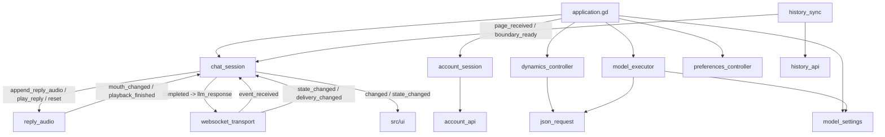
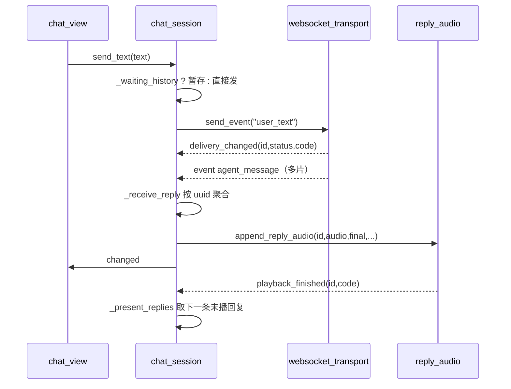

> **系列文档**：[总览](ARCHITECTURE.md) · [01 组装根](01-application.md) · **02 session** · [03 network](03-network.md) · [04 storage](04-storage.md) · [05 media](05-media.md) · [06 avatar](06-avatar.md) · [07 ui](07-ui.md) · [08 preview](08-preview.md) · [09 构建与交付](09-build-and-release.md) · [10 测试与验证](10-testing.md)
> **基线**：分支 `feat/agentluo-0.1.1` @ `42b5b1c` · 撰写日期 2026-09-20 · 只读现状分析（as-built）；除本系列 `.md` 与 `export_presets.cfg` 的导出排除项外不改动任何文件
> **路径与行号口径**：无前缀路径相对 `client_godot/`，`client_godot/…` 相对仓库根；`file:line` 为撰写时工作树行号

# src/session：流程与状态

## 30 秒速览

- 这里住着 7 个控制器：账户、聊天、历史、动态、模型设置、模型执行、相处偏好。界面只读它们的 `changed` / `state_changed` 信号，不直接碰网络。
- 其中 `chat_session.gd`（339 行）是唯一的枢纽：传输事件分流、天依回复按 UUID 聚合、回复语音串行播放、历史页归位、阅读位置/图片/模型委托转发都在它一处。
- 改「发消息、收回复、放语音」这三件事，先看 `src/session/chat_session.gd:77`（`send_text`）、`src/session/chat_session.gd:181`（`_receive_reply`）、`src/session/chat_session.gd:218`（`_present_replies`）。
- 7 个控制器写法统一：`start()` 先 `stop()`，异步回来先比 `_generation`，过期就丢弃；理解这一条就能读懂全部 7 个文件。
- 其他四个是「一件事一个文件」：历史分页（`history_sync`）、动态读写与未读（`dynamics_controller`）、模型配置（`model_settings`）、模型调用（`model_executor`）。

## 职责

- **账户会话**（`account_session.gd`，106 行）：登录/注册/改密/自动登录的状态机，凭据的存与忘，`user://account.cfg` 的原子写，`_generation` 取消在途请求。
- **聊天会话**（`chat_session.gd`，339 行）：持有传输节点并订阅它的 4 个信号（`src/session/chat_session.gd:43` 到 `src/session/chat_session.gd:46`）；对视图暴露消息列表、连接相位、思考/说话状态、音频与图片子状态；把「历史边界未就绪」这一等待条件挡在发送路径上。
- **历史同步**（`history_sync.gd`，101 行）：从末尾向前翻页拉全量历史，逐页校验，去重后交给 `chat_session` 归位。
- **动态控制器**（`dynamics_controller.gd`，314 行）：动态列表分页、评论分页与刷新、发布与评论写入、未读计数轮询与标记已读。
- **模型设置**（`model_settings.gd`，125 行）：拉取服务端模型类型清单，与本地存储的配置合并、校验、保存。
- **模型执行**（`model_executor.gd`，134 行）：承接服务端下发的 `llm_request`，按 `request_id` 去重、限流、拼请求体、解析响应。
- **相处偏好**（`preferences_controller.gd`，121 行）：加载/编辑/保存 4 个偏好字段，保存前先服务端重读再整份覆盖。

## 为什么这样切分

- **枢纽只有一个**。传输事件可以来自 6 个方向（连接相位、投递状态、回复、系统错误、朗读状态、图片/动态）。若让每个视图各自订阅，断线清理、串行播放、历史归位这些跨切面逻辑就会散到 4 个文件里；现在它们都收敛在 `chat_session` 一个 `_receive` 分流点（`src/session/chat_session.gd:170`）。
- **控制器不自己发请求**。`chat_session` 不 new HTTP，它把网络节点当构造参数收进来（`src/session/chat_session.gd:25`），自己只做编排；真正的协议细节归 `src/network/`（03 篇）。这让测试能用假传输替换掉真实 WebSocket。
- **动态/模型/偏好各自独立**，因为它们都有「用户正在编辑」的中间态：动态有 `_writing`，模型与偏好有 `is_dirty()`/`dirty`。把它们塞进 `chat_session` 只会让聊天的主链路被编辑态污染。
- **统一的代数号取消**。7 个控制器都用同一个套路：`_generation` 自增使旧回调失效（例如 `src/session/account_session.gd:38`、`src/session/history_sync.gd:51`、`src/session/dynamics_controller.gd:77`）。这样「切账号」不需要逐个回调做标记。
- **两阶段收口**。回复的聚合（把多条分片拼成一条）与播放（串行、可被打断）是两件事，代码里前者在 `_receive_reply`，后者在 `_present_replies`，中间只用一个 `_replies` 字典传状态。

## 关键文件与符号

| 文件 | 行数 | 职责 | 关键符号 |
| --- | --- | --- | --- |
| `chat_session.gd` | 339 | 聊天枢纽：分流、聚合、串行播放、历史与图片/模型转发 | `_init()`（`src/session/chat_session.gd:25`）、`send_text()`（`:77`）、`_receive()`（`:170`）、`_receive_reply()`（`:181`）、`_present_replies()`（`:218`）、`_history_page()`（`:291`） |
| `dynamics_controller.gd` | 314 | 动态列表/评论分页、发布与评论、未读轮询 | `_ready()`（`src/session/dynamics_controller.gd:23`）、`_load_posts()`（`:69`）、`load_comments()`（`:89`）、`refresh_unread()`（`:150`）、`publish()`（`:209`）、`_write()`（`:224`） |
| `model_executor.gd` | 134 | 模型调用：去重、限流、拼体、解析 | `submit()`（`src/session/model_executor.gd:32`）、`test_config()`（`:56`）、`_execute()`（`:63`）、`_parse()`（`:109`） |
| `model_settings.gd` | 125 | 模型类型清单与本地配置的合并/校验/保存 | `start()`（`src/session/model_settings.gd:16`）、`validate()`（`:67`）、`save()`（`:88`）、`enabled_types()`（`:98`）、`_default()`（`:118`） |
| `preferences_controller.gd` | 121 | 相处偏好的加载/编辑/保存 | `start()`（`src/session/preferences_controller.gd:15`）、`reload()`（`:20`）、`edit()`（`:38`）、`save()`（`:46`）、`_fields()`（`:101`） |
| `account_session.gd` | 106 | 账户相位、凭据存取、设置文件原子写 | `perform()`（`src/session/account_session.gd:27`）、`resume()`（`:62`）、`cancel()`（`:73`）、`logout()`（`:77`）、`_write_settings()`（`:92`） |
| `history_sync.gd` | 101 | 历史倒序分页、校验、去重、边界通知 | `start()`（`src/session/history_sync.gd:17`）、`retry()`（`:33`）、`skip()`（`:40`）、`_load()`（`:48`）、`_fail()`（`:90`） |

## 对外接口与信号

`chat_session`（视图主要对接层）：

- 信号：`message_audio_changed(id,state)`（`src/session/chat_session.gd:2`）、`message_image_changed`（`:3`）、`changed`（`:4`）、`state_changed(state)`（`:5`）、`expression_requested(command)`（`:6`）、`mouth_changed(value)`（`:7`）。
- 只读查询：`get_messages()`（`:100`）、`get_state()`（`:103`，内含 `history` 子状态，见 `:105`）、`get_audio_state()`（`:114`）、`get_history_state()`（`:267`）、`get_reading_state()`（`:306`）、`get_message_audio(id)`（`:244`）、`get_message_image(id)`（`:332`）、`preview_message_image(id)`（`:335`）、`get_log_directory()`（`:108`）。
- 动作：`start(session)`（`:62`）、`stop()`（`:120`）、`send_text(text) -> String`（`:77`，返回本地/线上 id，失败返回空串）、`set_volume(value)`（`:111`）、`stop_voice()`（`:117`）、`retry_history()` / `skip_history()`（`:270`、`:274`）、`request_message_image(id,retry)`（`:325`）、`replay(id)` / `pause_replay()` / `resume_replay()` / `stop_replay()`（`:247` 到 `:259`）、`clear_cache()`（`:261`）、`note_read_interaction()` / `reading_located()` / `report_visible_messages(ids,foreground)`（`:309` 到 `:317`）。

其余控制器：

- `account_session`：`perform(operation,server,fields,remember)`（`:27`）、`resume()`（`:62`）、`cancel()`（`:73`）、`logout()`（`:77`）、`get_login_defaults()`（`:86`）、`get_session()`（`:89`）；单一信号 `changed(state)`（`:2`），相位取值见 `:59`（`signed_in` / `signed_out` / `busy`）。
- `history_sync`：`page_received(messages)`（`:2`）、`boundary_ready`（`:3`）、`state_changed(state)`（`:4`）；`start/stop/retry/skip/get_state`（`:17`、`:23`、`:33`、`:40`、`:31`）。
- `dynamics_controller`：`changed`（`:2`）、`unread_changed(count)`（`:3`）；`start/stop/get_posts/get_comments/refresh/load_more/load_comments/refresh_comments/refresh_unread/mark_read/publish/comment`（`:29`、`:37`、`:56`、`:59`、`:62`、`:65`、`:89`、`:116`、`:150`、`:169`、`:209`、`:212`）。
- `model_settings`：`changed(state)`（`:2`）；`start/stop/get_types/get_config/get_state/validate/save/enabled_types/copy_config`（`:16`、`:110`、`:58`、`:63`、`:65`、`:67`、`:88`、`:98`、`:104`）。
- `model_executor`：`completed(response)`（`:2`）；`start/stop/enabled_types/submit/test_config`（`:18`、`:22`、`:29`、`:32`、`:56`）。
- `preferences_controller`：`changed(state)`（`:2`）；`start/reload/edit/save/get_state/stop`（`:15`、`:20`、`:38`、`:46`、`:85`、`:87`）。

`model_executor.completed` 的消费方是 `chat_session`：它把响应包成 `llm_response` 事件回发给服务端（`src/session/chat_session.gd:31`）。

## 依赖与数据流

一次「发消息 → 收回复」的时序（文字与语音同一条链路）：

## 状态与不变量

- **连接相位是唯一相位源**。`chat_session` 的状态字典 `_state`（`src/session/chat_session.gd:16`）里的 `phase`/`code` 直接来自传输层回调（`:145`、`:146`）；`idle` 与 `auth_rejected` 下 `send_text` 直接拒绝（`:78`）。
- **历史屏障**。`start()` 在传输成功后置 `_waiting_history = true` 并启动历史（`:72` 到 `:74`）；此时的消息先进 `_pending_history`（`:86`），状态是 `waiting_history`（`:92`），界面据此显示「未确认」。边界到达后 `_release_history_sends()` 逐条补发并把线上 id 映射到本地 id（`_wire_ids`，`:286`），随后 `changed`（`:289`）。
- **本地 id 与线上 id**：屏障期的消息用 `local-` 前缀随机 id（`:85`），补发成功后才建立 `_wire_ids[wire] = local`（`:286`）；投递状态回调先查这张表再更新（`src/session/chat_session.gd:156`）。
- **发送上限**：屏障期队列 128 条、单条 8 MB 减 1 KB（`:82`），超限记 `SEND_REJECTED` 并返回空串。
- **回复按 UUID 聚合**：`_replies[id]` 首次出现时建立固定字段结构（`:193`）；`text` 是覆盖而不是拼接（`:198` 到 `:199`）；`expression` 只保留最后一次（`:200` 到 `:201`）；`is_ephemeral` 一旦为真就锁定为真（`:195`）；`is_final_package` 或 `audio_error` 之一为真即收口（`:205`）。
- **收口后不再接受该 id 的更新**：`_finished` 是墓碑表（`:15`、`:190`），`_audio_finished` 把 `played` 置真并 `_present_replies.call_deferred()`（`:212`、`:216`）。
- **串行播放**：`_present_replies()` 遍历 `_replies`，遇到第一条未播的回复就调用 `play_reply(id)` 并 `break`（`:235` 到 `:237`），其余等 `playback_finished` 再进来；播完的条目写入 `_finished` 并从 `_replies` 删除（`:238` 到 `:239`）。
- **断线即判死在途回复**：连接相位离开 `ready` 时，所有在途回复被搬进 `_finished` 并清空 `_replies`，同时 `_media.reset()`（`:147` 到 `:152`）。这是「不留下永远播不出的语音」的兜底。
- **`stop()` 是唯一清理点**：清空消息、`_by_id`、`_replies`、`_finished`、`_pending_history`、`_wire_ids`，阅读位置回到空作用域，媒体作用域清空（`:120` 到 `:140`）。
- **历史页契约**：每页最多 50 条（`src/session/history_sync.gd:59`），且必须满足「`start_index` 与上一页首尾相接、每页恰好 50 条」的连续性（`:62`），否则 `HISTORY_INVALID`；重复 UUID 不覆盖已收内容，只把整轮标记为 `incomplete` 并给码 `HISTORY_DUPLICATE`（`:73` 到 `:83`）。
- **历史页合并规则**：同 UUID 的实时消息按「历史位置优先」搬位而不是覆盖，保留实时内容（`src/session/chat_session.gd:294` 到 `:302`）。
- **分页状态机**：`retry()` 只在 `first_failed`/`failed` 生效并回到对应的 loading 相位（`:34` 到 `:37`）；`skip()` 只允许从 `first_failed` 跳过并直接广播 `boundary_ready`（`:41` 到 `:47`），让聊天可以不带历史继续用。
- **动态互斥**：`_writing` 为真时禁止分页与评论加载（`src/session/dynamics_controller.gd:70`、`:90`、`:117`），写入返回 `BUSY`（`:227`）；游标必须前进，否则判 `INVALID_RESPONSE`（`:260`）。
- **每页条数上限**：动态 10 条（`:76`、`:262`）、评论 20 条（`:101`、`:262`）。
- **未读轮询节流**：定时器 30 秒（`:25`），且 `_unread_busy` 期间重入直接返回（`:151`）；`mark_read()` 只有服务端返回 `ok == true` 才把计数清零（`:178` 到 `:181`）。
- **并发上限**：动态与模型执行各自的在途请求上限都是 8（`:187`、`src/session/model_executor.gd:86`），超限返回 `BUSY` / `MODEL_BUSY`。
- **模型结果缓存是去重窗口**：`_results[id] = {}` 先占位表示在途（`src/session/model_executor.gd:43`），重复 `request_id` 直接回放已存结果或静默忽略（`:36` 到 `:39`）；表大小上限 4096，超限回 `MODEL_BUSY`（`:40`）。
- **模型体固定非流式**：`max_tokens=4096`、`temperature=0.7`、`top_p=0.9` 是可被配置覆盖的默认（`:88` 到 `:89`），`stream` 恒为 `false`（`:91`），请求里带 `stream` 或 `stream_options` 直接 `STREAMING_NOT_SUPPORTED`（`:84`）。
- **图片只允许 VLM**：`image_base64` 非空而模型类型不是 `vlm` 时报 `MODEL_KIND_MISMATCH`（`:80` 到 `:81`）。
- **偏好保存是「先重读再覆盖」**：`save()` 先再取一次服务端偏好（`src/session/preferences_controller.gd:53`），只把与基线不同的字段写进这份副本（`:58` 到 `:70`），最后整份 `overwrite`（`:73`）。默认关系「朋友」与默认风格「活泼可爱」在保存时被归一成空字符串（`:70`）。
- **人格描述双向兼容**：写时把 `personality_text` 拆成 `personality_traits` 数组（按中英文逗号、顿号、换行切分）并同时写 `#sym:personality_text`（`:62` 到 `:68`）；读时优先用数组、回落到符号键（`:106` 到 `:113`）。
- **账户设置文件原子写**：先写 `.tmp` 再 `rename_absolute`，失败时删临时文件（`src/session/account_session.gd:93` 到 `:103`）。
- **凭据联动**：登录成功且 `remember` 为真时存凭据，否则 `forget()`（`:47`）；`store` 或设置文件任一失败都会把 `storage_error` 置真并把 `remember` 降级为假（`:49`、`:52`），同时把凭据删掉（`:54`）。自动登录被服务端拒绝时清凭据并复位 `remember`（`:55` 到 `:58`）。
- **默认服务器**：`DEFAULT_SERVER` 是编译进代码的常量（`src/session/account_session.gd:4`），只在设置文件缺失或服务器字段非法时使用（`:24`）。

## 验证入口

- 聊天主链路：`tests/test_live_chat.gd`（真实回环 WebSocket 收发，经 `scripts/check_network.ps1:7`）、`tests/test_voice_chat.gd`（语音分片，`scripts/check_network.ps1:9`）。
- 历史：`tests/test_history_sync.gd` 与 `tests/test_history_media.gd`（`scripts/check_features.ps1:5`，经 `tests/run_history_tests.py`）。
- 偏好与模型：`tests/test_preferences.gd`、`tests/test_model_settings.gd`、`tests/test_model_execution.gd`（`scripts/check_features.ps1:6`，经 `tests/run_feature_tests.py`）。
- 动态：`tests/test_dynamics.gd`、`tests/test_dynamics_window.gd`、`tests/test_dynamics_detail.gd`（`scripts/check_features.ps1:7`，经 `tests/run_dynamics_tests.py`）。
- 账户会话：`tests/test_account_session.gd`（`scripts/check_accounts.ps1:6` 的四个账户用例之一，经 `tests/run_account_tests.py`）。
- 阅读位置（由本模块转发，存储实现见 04 篇）：`tests/test_reading_position.gd`（`scripts/check.ps1:20`）。
- 组装层面：`tests/test_application_window.gd`、`tests/test_application_drafts.gd`（`scripts/check_accounts.ps1:6`、`scripts/check_features.ps1:6`）。

## 扩展点与已知坑

- **`replies` 字典在遍历中删除**：`_present_replies()` 用 `_replies.keys()` 取快照再删（`src/session/chat_session.gd:219`、`:239`），所以在 `play_reply` 期间新到的分片不会被漏掉；但反过来，同一次遍历里改到 `reply` 字典（`:227`、`:232`）是就地修改，`hidden/display` 语义依赖这一点。
- **`expression` 只在 `_present_replies()` 里被消费一次**：读走后立即清空（`:230` 到 `:232`），因此界面错过这一帧就丢了这次表情指令；没有重发表。
- **`AUDIO_ERROR` 会被报两次**：`_audio_finished` 里报一次（`:215`），`_present_replies` 里只要 `reply.audio_error` 为真又报一次（`:233` 到 `:234`），日志里会出现连续两条同码事件。
- **`_media.set_scope("","")` 是清空作用域**：`stop()`（`:133`）和 `start()` 成功路径（`:70`）都用它；作用域切错会让语音缓存的读写命中别的账号目录（存储细节见 04 篇）。
- **`_pending_history` 只有一条出路**：屏障期内 `stop()` 会直接清空这支队列（`:126`），此时消息状态仍留在 `_messages` 里，界面看不到任何「已被丢弃」的提示。
- **`send_text` 的判空是 `strip_edges()`**：只有空白字符的输入被当成空（`:78`），因此全角空格以外的前后空白都会被裁掉再发送。
- **历史页大小写死在两处**：`history_sync` 用 50 做连续性判断（`src/session/history_sync.gd:59`、`:62`），`chat_session` 不感知这个数字；改协议要同时改服务端与这里。
- **`refresh_comments()` 是唯一会连翻多页的方法**，用 `seen` 记录访问过的游标防死循环（`src/session/dynamics_controller.gd:129`、`:137` 到 `:138`），`load_comments()` 则严格一次一页。
- **`_page()` 对 `next_cursor` 有强校验**：`has_more` 为真却没有新游标（或游标原地不动、或返回空数组）都判 `INVALID_RESPONSE`（`:260` 到 `:261`），服务端「多给一页空数据」的实现会被直接判错。
- **动态条目的必填字段**：`id`/`author_name`/`content`/`created_at`/`author_type` 缺一即整页失败（`:272` 到 `:274`）；评论还额外要求 `dynamic_id` 与当前动态一致（`:278`）。
- **`model_settings.validate()` 的码是有序的**：类型未知 → 结构错 → 类型不匹配 → 流式不支持 → 字段缺失 → 能力不足（`src/session/model_settings.gd:68` 到 `:86`），调试时按这个顺序判断谁先失败。
- **服务端类型声明是能力上限**：`requires_json`/`requires_thinking` 与本地能力位冲突时直接判 `MODEL_CAPABILITY_MISMATCH`（`src/session/model_settings.gd:85`），本地把能力位调高没有用。
- **坏配置不会让整个设置页失败**：单个类型的本地配置校验不过时会被降级为「禁用」而不是丢弃，只有降级后仍非法才回落默认值（`src/session/model_settings.gd:48` 到 `:52`），同时把整页状态码置为 `INVALID_CONFIG`（`:53`）。
- **模型执行的错误码语义**：`MODEL_DISABLED`（`:66`）、`MODEL_KIND_MISMATCH`（`:71`、`:81`）、`INVALID_INPUT`（`:73`）、`MODEL_CAPABILITY_MISMATCH`（`:78`）、`STREAMING_NOT_SUPPORTED`（`:84`）、`MODEL_BUSY`（`:87`）、`INVALID_RESPONSE`（`:113`）、`INVALID_JSON`（`:116`）。界面依据 `completed` 回包里的 `error` 字段展示。
- **`test_config()` 会临时把 `enabled` 置真**再校验（`src/session/model_executor.gd:58`），所以「未启用的配置」也能被测通，但测试请求固定要求模型回一个 JSON 对象（`:60`）。
- **`preferences_controller.reload()` 在脏状态下直接放弃**（`src/session/preferences_controller.gd:21`）：切账号时的 `stop()` → `start()` 会先复位 `dirty`（`:92`），顺序反过来就会刷新不出内容。
- **`account_session.perform()` 会先登出再登录**：已有会话时先 `logout()`（`src/session/account_session.gd:30` 到 `:31`），所以「登录第二个账号」的行为等价于「先登出再登入」。