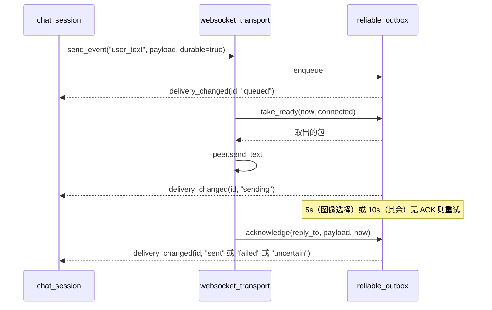

> **系列文档**：[总览](ARCHITECTURE.md) · [01 组装根](01-application.md) · [02 session](02-session.md) · **03 network** · [04 storage](04-storage.md) · [05 media](05-media.md) · [06 avatar](06-avatar.md) · [07 ui](07-ui.md) · [08 preview](08-preview.md) · [09 构建与交付](09-build-and-release.md) · [10 测试与验证](10-testing.md)
> **基线**：分支 `feat/agentluo-0.1.1` @ `42b5b1c` · 撰写日期 2026-09-20 · 只读现状分析（as-built）；除本系列 `.md` 与 `export_presets.cfg` 的导出排除项外不改动任何文件
> **路径与行号口径**：无前缀路径相对 `client_godot/`，`client_godot/…` 相对仓库根；`file:line` 为撰写时工作树行号

# src/network：协议与传输

## 30 秒速览

- 这里只有一条长连接（`websocket_transport.gd`）加三个 HTTP 适配器（`account_api` / `history_api` / `json_request`），外加一个纯内存的可靠投递队列（`reliable_outbox.gd`）。
- 改协议字段、加事件类型、调超时，先看 `src/network/websocket_transport.gd:117`（事件分流）与 `src/network/websocket_transport.gd:98`（出队发送）。
- 所有出站包都先经过 `reliable_outbox`：它管重试、ACK 超时、总龄上限；`websocket_transport` 只负责把取出的包写进 socket。
- 四个文件共用同一套结果字典 `{"ok","code","status","data"}`，调用方只认 `ok` 与 `code`，不解析 HTTP 状态以外的细节。
- 账户 HTTP 的密码从不明文出网：先取服务端公钥，再由原生扩展加密成 base64（`src/network/account_api.gd:69` 到 `src/network/account_api.gd:83`）。

## 职责

- **长连接与协议**（`websocket_transport.gd`，180 行）：建连、认证握手、心跳、收包解析、事件分流、断线重连退避、认证被拒的终止语义。
- **可靠投递**（`reliable_outbox.gd`，104 行）：出站包的入队、去重 id、重试退避、ACK/NACK 处理、总龄与断线时的收口。
- **账户 HTTP**（`account_api.gd`，143 行）：`login` / `register` / `reset` / `auto_login` 四个操作的字段校验、公钥交换、加密、响应字段校验，以及 `normalize_server()` 这一全客户端共用的地址归一化函数。
- **历史 HTTP**（`history_api.gd`，49 行）：单页历史拉取，带 `count=50` 与 `end_index`。
- **通用 JSON HTTP**（`json_request.gd`，46 行）：给动态与模型调用用的最小 HTTP 封装，支持自定义请求头与响应体积上限。

## 为什么这样切分

- **传输与投递分开**。socket 的相位（连接/认证/就绪）与「这条消息到底送到没有」是两件事：前者是连接级的，后者是消息级的。`take_ready()` 既处理重试也处理过期（`src/network/reliable_outbox.gd:21`），而 `websocket_transport` 只管相位与 IO，这样断线重连不会把「已排队未发送」的消息弄丢。
- **HTTP 也走「一请求一实例」而不是复用连接池**。三个 HTTP 适配器每次请求 `HTTPRequest.new()` 并挂到树上（`src/network/account_api.gd:103`、`src/network/json_request.gd:14`、`src/network/history_api.gd:14`），完成后 `queue_free()`；代价是每次握手，换来的是取消语义干净（`cancel_request()` 加一次信号收口）。
- **状态单点写入**。`_set_state()` 是唯一改动 `_state` 的函数（`src/network/websocket_transport.gd:163`），因此「相位叫什么」只需在这里核对。
- **地址归一化放在账户适配器里**。`normalize_server()` 被传输、历史、动态、模型、存储多处复用，放在 `account_api` 是历史结果——副作用是存储层为了它反向依赖了网络层（见 04 篇）。

## 关键文件与符号

| 文件 | 行数 | 职责 | 关键符号 |
| --- | --- | --- | --- |
| `websocket_transport.gd` | 180 | 建连/认证/心跳/收包/分流/重连 | `start()`（`src/network/websocket_transport.gd:26`）、`send_event()`（`:44`）、`_process()`（`:59`）、`_connect_socket()`（`:104`）、`_handle_event()`（`:117`）、`_disconnect()`（`:147`）、`_set_state()`（`:163`）、`_reject_auth()`（`:167`） |
| `account_api.gd` | 143 | 四个账户操作 + 地址归一化 | `FIELDS`（`src/network/account_api.gd:3`）、`normalize_server()`（`:16`）、`request()`（`:48`）、`_perform()`（`:69`）、`_exchange()`（`:102`）、`cancel()`（`:136`） |
| `reliable_outbox.gd` | 104 | 出站队列、重试、ACK 收口 | `MAX_AGE_MS`（`src/network/reliable_outbox.gd:4`）、`RETRY_DELAYS`（`:5`）、`enqueue()`（`:8`）、`take_ready()`（`:21`）、`acknowledge()`（`:51`）、`disconnected()`（`:71`）、`stop()`（`:79`） |
| `history_api.gd` | 49 | 历史单页拉取 | `fetch_page()`（`src/network/history_api.gd:8`）、`cancel()`（`:40`）、`_valid_index()`（`:48`） |
| `json_request.gd` | 46 | 通用 JSON HTTP（动态/模型用） | `_init(timeout,limit)`（`src/network/json_request.gd:6`）、`send()`（`:9`）、`cancel()`（`:39`） |

## 对外接口与信号

`websocket_transport`（`src/session/chat_session.gd` 是唯一消费者）：

- 信号：`state_changed(state)`（`src/network/websocket_transport.gd:2`）、`delivery_changed(id,state,code)`（`:3`）、`event_received(event)`（`:4`）、`system_error(code)`（`:5`）。
- 方法：`start(session) -> Error`（`:26`，要求 `server`/`username`/`message_token` 三个非空字符串且在树上，否则 `ERR_INVALID_PARAMETER`）、`send_event(type,payload,durable) -> String`（`:44`，返回 `client_msg_id`，相位为 `idle`/`auth_rejected` 时返回空串）、`get_state()`（`:49`）、`stop()`（`:52`）。
- 相位取值共 6 个：`idle`（`:56`）、`connecting`（`:113`）、`authenticating`（`:69`）、`ready`（`:124`）、`reconnecting`（`:152`）、`auth_rejected`（`:36`、`:172`）。

`reliable_outbox`：唯一信号 `delivery_changed(id,state,code)`（`src/network/reliable_outbox.gd:2`）；投递状态取值 `queued`（`:18`、`:100`）、`sending`（`:48`）、`sent`（`:59`）、`failed`（`:28`、`:69`、`:75`、`:83`、`:88`）、`uncertain`（`:26`、`:55`、`:92`、`:96`）。

三个 HTTP 适配器统一返回 `{"ok":bool,"code":String,"status":int,"data":Dictionary}`（构造点：`src/network/account_api.gd:133`、`src/network/history_api.gd:46`、`src/network/json_request.gd:45`），失败码集合在实现里是：`BUSY`、`INVALID_INPUT`、`INVALID_RESPONSE`、`TIMEOUT`、`NETWORK_ERROR`、`HTTP_ERROR`、`AUTH_REJECTED`、`CANCELLED`；账户侧另有 `PUBLIC_KEY_ERROR`、`ENCRYPTION_ERROR`。

`normalize_server(address)`（`src/network/account_api.gd:16`）是对外可见的静态工具：非法输入返回空串，规则为「去空白 → 无 scheme 补 `https://` → 正则校验 → scheme/host 小写 → 默认端口省略 → 去掉尾部斜杠」。

## 依赖与数据流

```mermaid
flowchart LR
    CS["chat_session"] -->|send_event| TR["websocket_transport"]
    TR -->|enqueue/take_ready/acknowledge| OB["reliable_outbox"]
    TR -->|WebSocketPeer| SRV["服务端 /chat_ws"]
    OB -->|delivery_changed| TR
    TR -->|event_received / state_changed / system_error| CS
    AS["account_session"] --> AA["account_api"]
    HS["history_sync"] --> HA["history_api"]
    DC["dynamics_controller"] --> JR["json_request"]
    ME["model_executor"] --> JR
    AA -->|"/auth/public_key" 后 "/auth/login"| SRV2["服务端 HTTP"]
    HA -->|"/history?count=50"| SRV2
    JR -->|"/dynamics*" 与 "/chat/completions"| SRV2
    AA -->|encrypt_password| SEC["WindowsSecurity 原生扩展"]
```

一次「带重试的发送」：



## 状态与不变量

- **握手顺序**：socket 打开后立刻切到 `authenticating` 并把认证超时设为 5 秒（`src/network/websocket_transport.gd:68`），认证包带能力声明 `["negative_ack_v1"]`（`:70` 到 `:71`）；只有在 `authenticating` 相位收到 `auth_ok` 才进 `ready`（`:121` 到 `:124`）。
- **认证被拒是终态**：`_reject_auth()` 记下当前会话指纹（`:168`），同一份 `(server,username,token)` 再次 `start()` 会直接返回 `ERR_UNAUTHORIZED` 而不建连（`:35` 到 `:37`）；服务端用关闭码 1008 拒认证时同样走这条路（`:88` 到 `:89`）。
- **控制类事件先于相位检查**：`auth_error`/`error`（认证中）/`auth_ok`/`system_ready`/`hb_pong`/`system_not_ready` 都在 `_state.phase != "ready"` 这一道检查之前处理（`:118` 到 `:130`，检查在 `:131`），否则重连期间的握手包会被自己丢掉。
- **一次轮询最多处理 64 个包**（`:75`），单包上限 8 MB（`MAX_PACKET`，`:8`；比较在 `:78`）；非文本包、超限包、JSON 解析失败、缺 `type`/`payload` 都算协议错误并断线（`:78` 到 `:84`、`:159` 到 `:161`）。
- **收包在断线判定之前**：`_process()` 先把队列里的包消费完，再根据 ready state 决定要不要重连（注释在 `:72` 到 `:73`），避免「同一次 poll 里既有最终回复又有 close 帧」时丢掉回复。
- **心跳 10 秒**，只在 `ready` 相位发（`:94` 到 `:97`），`ping_id` 自增；`hb_pong` 被吞掉不外发（`:126` 到 `:127`）。
- **超时口径**：连接 8 秒（`:111`），认证 5 秒（`:68`），两者共用一个 `_deadline`，到期按相位给出 `CONNECT_TIMEOUT` 或 `AUTH_TIMEOUT`（`:92` 到 `:93`）。
- **重连退避**：`mini(2000 * (1 << mini(attempt, 4)), 30000)`（`:150`），即 2/4/8/16/32 秒后封顶 30 秒，`attempt` 在认证成功时归零（`:122`）。
- **socket 参数**：入站/出站缓冲都是 8 MB，未处理包队列 64（`:106` 到 `:108`）；URL 由归一化后的 server 推导：`https://` 换 `wss://`、其余换 `ws://`，路径固定 `/chat_ws`（`:110`）。
- **出站包的形状由 outbox 决定**：`{type,payload,client_msg_id,ts,reply_to}`（`src/network/reliable_outbox.gd:12` 到 `:13`），控制包由传输层自己拼同样的形状（`src/network/websocket_transport.gd:142` 到 `:143`）。
- **队列上限 128 条**，超限 `enqueue()` 直接返回空串（`src/network/reliable_outbox.gd:9` 到 `:10`）；单包超过 8 MB 同样返回空串（`:14` 到 `:15`）。
- **持久消息严格串行**：`take_ready()` 一旦放行一条持久消息就置 `durable_blocked`，本次调用不再放行其它持久消息（`:34` 到 `:40`），非持久消息不受此限制。
- **ACK 语义**：「非布尔 `ok`」或 `ok == true` 都算成功（旧版 ACK 省略 `ok`，`:57` 到 `:59`）；只有布尔 `false` 是负 ACK，此时 `retryable` 为真才重试（`:64` 到 `:67`），否则立刻 `failed`。重试次数由 `attempts - 1` 索引退避表（`:90`），超出 8 档或超过总龄即判 `DELIVERY_UNCERTAIN`（`:91` 到 `:97`）。
- **ACK 超时**：图像选择类事件 5 秒，其余 10 秒（`:45` 到 `:46`）。
- **总龄上限 4 分钟**（`MAX_AGE_MS = 240000`，`:4`）：过期检查在 `take_ready()` 里**先于**连接判断执行（注释在 `:22`），因此断线期间挂着的持久消息也会到期收口。
- **断线时的收口**：非持久消息立即 `failed`/`DISCONNECTED`，持久消息进入重试或判不确定（`:71` 到 `:77`）；`stop()` 把整队清空并统一报 `failed`（`:79` 到 `:83`）。
- **账户 HTTP 的两步流程**：除 `auto_login` 外都先 `GET /auth/public_key`（`src/network/account_api.gd:71`），未取到公钥直接 `PUBLIC_KEY_ERROR`（`:75` 到 `:77`）；密码字段名随操作变化（`reset` 用 `new_password`，其余用 `password`，`:78`），加密失败报 `ENCRYPTION_ERROR`（`:81` 到 `:82`），成功后以 base64 替换原字段（`:83`）。`reset` 的端点名是 `reset_account`（`:84`）。
- **必需响应字段随操作变化**：默认 `user_id`/`login_token`/`message_token`，`register` 要 `message`/`user_id`，`reset` 要 `message`/`username`（`:90` 到 `:94`）；缺字段算 `INVALID_RESPONSE`（`:98`）。
- **请求体大小与重定向**：账户请求 `body_size_limit = 65536`、`max_redirects = 0`（`:107`、`:106`）；历史 8 MB（`src/network/history_api.gd:18`）；`json_request` 默认 8 MB 且可构造参数覆盖（`src/network/json_request.gd:6`、`:18`）。
- **一请求一实例**：三个适配器都持有 `_http` 并靠它做「同一时刻只允许一个在途请求」，重入返回 `BUSY`（`src/network/account_api.gd:49`、`src/network/history_api.gd:9`、`src/network/json_request.gd:10`）；适配器本身带 `_generation`/`_busy`（账户侧 `:64`、`:136`），取消后所有迟到回调判 `CANCELLED`。
- **历史请求参数固定**：`count=50` 写死在 URL 里（`src/network/history_api.gd:33`），`end_index` 直接拼进查询串；响应必须含数组 `history` 与合法 `start_index`（`:29`、`:48` 到 `:49`）。
- **出站包的身份字段**：`client_msg_id` 一律是 `c-` 加 16 字节随机数的十六进制（`src/network/reliable_outbox.gd:11`、`src/network/websocket_transport.gd:142`），`ts` 是 Unix 毫秒（`:13`、`:143`），`reply_to` 固定为 `null`（`:13`、`:143`）；ACK 靠服务端回填 `reply_to` 找到原包（`src/network/websocket_transport.gd:134` 到 `:135`）。
- **`start()` 的顺序**：先归一化 server 并算出声纹指纹 → `stop()` 清场 → 指纹命中 `_rejected` 就直接拒绝 → 存会话与指纹 → 立刻发起连接（`src/network/websocket_transport.gd:30` 到 `:41`）。指纹是 `sha256(JSON([base,username,token]))`（`:33`）。
- **每次重连都重建 peer**：`_connect_socket()` 先 new 一个新 `WebSocketPeer`（`:105`），旧的在 `_disconnect()` 里已经 `close()` 并置空（`:148`、`:154` 到 `:157`）；`_ping_id` 随之归零（`:112`）。

## 验证入口

- 传输：`tests/test_websocket_transport.gd`（经 `tests/run_websocket_tests.py` 拉起，`scripts/check_network.ps1:5`）；用例覆盖显式认证失败为终态、带认证策略关闭码（1008）与 close 帧同批到达时不误重连等行为（`tests/test_websocket_transport.gd:56`、`:59`、`:71`）。
- 投递队列：`tests/test_reliable_outbox.gd`，两处入口——`scripts/check.ps1:15`（纯逻辑）与 `scripts/check_network.ps1:4`（网络场景下重跑）。
- 账户协议：`tests/test_account_api.gd`（`scripts/check_accounts.ps1:6` 的四个用例之一，经 `tests/run_account_tests.py`）。
- 端到端回环：`tests/test_live_chat.gd`（`scripts/check_network.ps1:7`）与 `tests/test_voice_chat.gd`（`scripts/check_network.ps1:9`）；fixture 由 `tests/run_websocket_tests.py` 起在 127.0.0.1 的随机端口上，并加载仓库根的共享契约样本 `contracts/chat/reply_events.json`（`tests/run_websocket_tests.py:35`）作为服务端回复序列，因此同一条链路同时被新端与旧端解析器消费。

## 扩展点与已知坑

- **`event_received` 只转发「非控制类」事件**：`server_ack` 被 outbox 消费、`error` 只发 `system_error`、其它一律透传（`src/network/websocket_transport.gd:133` 到 `:139`）。新增控制类事件必须加在这里，否则它会当成业务事件发给 `chat_session`。
- **相位不是 `ready` 时业务事件被静默丢弃**（`:131` 到 `:132`）：服务端在重连窗口期补发的业务包会消失，且没有任何日志。
- **`system_not_ready` 是断线而不是错误**：它触发重连并给出码 `SYSTEM_RUNTIME_NOT_READY`（`:128` 到 `:129`），与 `system_error` 是两条不同的通路。
- **`_deadline` 被复用**：连接与认证共用一个字段，切到 `authenticating` 时才改（`:68`），因此认证阶段的 5 秒是从「socket 打开」起算而不是从「发出认证包」起算。
- **认证包的能力声明是硬编码数组**（`:71`）：`negative_ack_v1` 是唯一声明；旧版 ACK（省略 `ok`）的兼容逻辑在 outbox 侧（`src/network/reliable_outbox.gd:57` 到 `:59`），两处必须一起看。
- **`_rejected` 只记指纹不记原因**：同一凭据第二次 `start()` 直接返回 `ERR_UNAUTHORIZED` 并给出 `AUTH_REJECTED`（`src/network/websocket_transport.gd:35` 到 `:37`），要重新尝试必须先 `stop()`（`:55` 会清掉指纹）。
- **`stop()` 会丢队列**：`_outbox.stop()` 把在途消息统统标成 `failed`（`src/network/reliable_outbox.gd:79` 到 `:83`），默认码 `TRANSPORT_STOPPED`；认证被拒时用的是 `AUTH_REJECTED`（`src/network/websocket_transport.gd:173`）。
- **`enqueue()` 用两层上限但不区分原因**：队列满与包过大都返回空串（`src/network/reliable_outbox.gd:9`、`:14`），调用方只能从「id 为空」推断失败；`chat_session` 因此把它统一报成 `SEND_REJECTED`。
- **`take_ready()` 的过期检查在断线时也跑**，但只有持久消息会被判 `DELIVERY_UNCERTAIN`；非持久消息在断线时先被标 `failed`（`:27` 到 `:28`），不会走到过期分支。
- **`acknowledge()` 只处理「已经发过一次」的消息**（`:52` 到 `:53`），未发出的挂起消息收到 ACK 会被忽略；对照 `attempts == 0` 判断。
- **图像选择的 ACK 超时是 5 秒**（`:45`），这是唯一按事件类型分叉的超时；事件名写死在数组里，改名会静默退回 10 秒。
- **`normalize_server()` 拒绝反斜杠与带查询串的地址**（`src/network/account_api.gd:18`、`:23`），IPv6 只接受方括号形式且要能过 `is_valid_ip_address()`（`:29` 到 `:31`）；尾部斜杠被剥掉（`:44` 到 `:45`）。
- **`normalize_server()` 不校验 TLS 之外的风险**：`http://` 明文地址是合法输入（`:23` 允许 `https?`），只有调用方自己决定要不要用。
- **账户请求体上限 64 KB**（`:107`）：这是四个账户操作的响应体积上限，注册/重置返回的长消息若超限会以 `NETWORK_ERROR` 表现，而不是明确的「响应过大」。
- **`json_request` 不区分 2xx 之外的语义**：非 2xx 一律 `HTTP_ERROR`（401 除外，`src/network/json_request.gd:25` 到 `:26`），因此动态与模型的业务错误码只能来自响应体的 JSON。
- **`_http_finished` / `_done` / `_completed` 是私有信号**（`src/network/account_api.gd:2`、`src/network/json_request.gd:2`、`src/network/history_api.gd:2`）：它们只是 `await` 的载体，外部不应连接。
- **超时精度等于帧率**：`poll()`、心跳、outbox 出队都在 `_process()` 里（`src/network/websocket_transport.gd:59`、`:94`、`:98`），没有任何独立定时器；掉帧或长时间阻塞会把 ACK 超时与心跳周期一起拖长。
- **发送失败立即断线**：`send_text()` 返回非 `OK` 时直接 `_disconnect(now,"SEND_FAILED")` 并停止本轮发送（`:100` 到 `:102`、`:144` 到 `:145`），但包仍在 outbox 里，等重连后按退避重试。
- **`history_api` 的忙判定比账户侧粗**：它只看 `_http != null`（`src/network/history_api.gd:9`），而 `end_index < -1` 也被归到 `INVALID_INPUT`（`:12`），调用方无法区分「参数错」与「已有请求在途」之外的第三类错。
- **`json_request` 每次请求都会追加 `Content-Type`**（`src/network/json_request.gd:31` 到 `:32`），调用方传的头会保留在前面，重复头由服务端决定取舍。
- **错误码与日志登记表要对齐**：`src/storage/client_log.gd` 里有一份错误码白名单，新增网络码必须同时登记，否则日志里只留下 `UNKNOWN`（详见 04 篇）。
- **两个 64 不是一回事**：`_peer.max_queued_packets = 64`（`src/network/websocket_transport.gd:108`）限制 peer 内部待处理队列，`processed < 64`（:75）限制单帧处理量；一帧没吃完的包留到下一帧继续，不会丢。
- **存储层反向依赖本模块**：`audio_cache` / `model_store` / `reading_position` / `history_images` 为了 `AccountApi.normalize_server()` 引了本目录，这条分层破坏由 04 篇负责叙述。