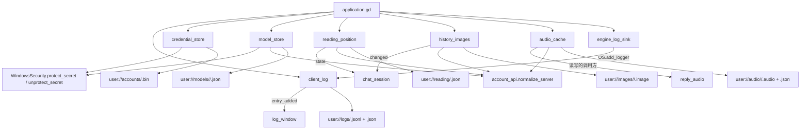
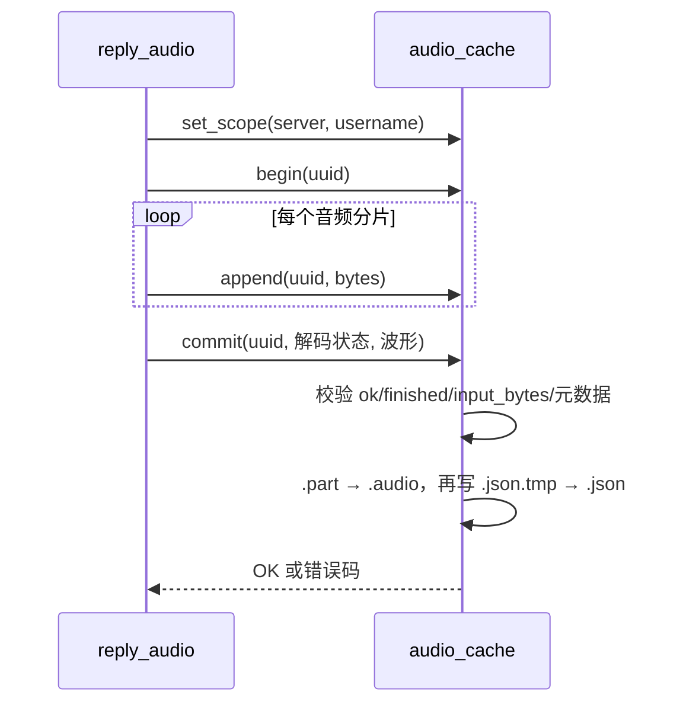

> **系列文档**：[总览](ARCHITECTURE.md) · [01 组装根](01-application.md) · [02 session](02-session.md) · [03 network](03-network.md) · **04 storage** · [05 media](05-media.md) · [06 avatar](06-avatar.md) · [07 ui](07-ui.md) · [08 preview](08-preview.md) · [09 构建与交付](09-build-and-release.md) · [10 测试与验证](10-testing.md)
> **基线**：分支 `feat/agentluo-0.1.1` @ `42b5b1c` · 撰写日期 2026-09-20 · 只读现状分析（as-built）；除本系列 `.md` 与 `export_presets.cfg` 的导出排除项外不改动任何文件
> **路径与行号口径**：无前缀路径相对 `client_godot/`，`client_godot/…` 相对仓库根；`file:line` 为撰写时工作树行号

# src/storage：本机持久化

## 30 秒速览

- 这 7 个文件是「本机文件」那一层：运行日志、登录凭据、语音缓存、历史图片缓存、阅读位置、模型配置、引擎日志转发；它们不认识界面。
- 换数据根只需注入一个路径：所有子目录都从 `_layout_path.get_base_dir()` 派生（`src/application.gd:51`、`src/application.gd:77`、`src/application.gd:84`、`src/application.gd:86`、`src/application.gd:87`），测试靠这一点把整棵树挪到临时目录。
- 改日志字段先看 `client_log.gd` 开头那四张白名单表（`src/storage/client_log.gd:5` 到 `src/storage/client_log.gd:9`）：没登记的字段会被静默丢掉，不会报错。
- 语音缓存是两阶段写入：先 `.part` 再改名成 `.audio`，随后补一份同名 `.json` 元数据（`src/storage/audio_cache.gd:44`、`src/storage/audio_cache.gd:71`）。
- 本层**反向依赖网络层**：4 个文件为了 `normalize_server()` 引了 `src/network/account_api.gd`，这是分层图里唯一的逆流（详见「扩展点与已知坑」）。

## 职责

- **运行日志**（`client_log.gd`，238 行）：把结构化事件写成 `logs/<run-id>.jsonl` 加一份 `<run-id>.json` 元数据；提供运行列表、历史读取与导出 ZIP。写入是白名单制：字段、模块、错误码、相位四张表之外的输入一律丢弃。
- **凭据**（`credential_store.gd`，57 行）：把 `login_token` 经原生 `protect_secret()` 加密后以 `accounts/<scope>.bin` 落盘，读取时用同一个 scope 解绑，登出/拒绝时删除。
- **语音缓存**（`audio_cache.gd`，170 行）：按账号隔离目录，按消息 UUID 命名，两阶段写入，读取时校验元数据与文件长度一致。
- **历史图片**（`history_images.gd`，156 行）：按需向服务端拉图、解码成纹理、落盘缓存；带并发上限、重试与内存窗口。
- **阅读位置**（`reading_position.gd`，82 行）：维护「上次读到哪条」这一个 uuid，并把它原子写盘。
- **模型配置**（`model_store.gd`，62 行）：按模型类型 id 保存配置，`api_key` 优先走原生加密，必要时可明文降级。
- **引擎日志转发**（`engine_log_sink.gd`，11 行）：实现 Godot 的 `Logger`，把引擎错误转成一条本端日志事件。

## 为什么这样切分

- **存储不认识业务**。这 7 个对象只暴露「读写一块字节/一份 JSON」的接口，不知道聊天状态机；`chat_session` 通过构造参数把 `audio_cache` 交给 `reply_audio`（`src/application.gd:84`、`src/application.gd:89`），`history_sync` 与 UI 层都不直接碰文件。
- **一个账号一棵子树**。除日志外，凭据/语音/图片/阅读位置/模型都用同一个隔离键 `sha256(JSON.stringify([server, username]))`（`src/storage/credential_store.gd:10`、`src/storage/audio_cache.gd:20`、`src/storage/history_images.gd:23`、`src/storage/reading_position.gd:17`、`src/storage/model_store.gd:13`），切账号即切目录，不需要逐个文件清理。
- **一次只写一份完整文件**。除日志追加外，所有写入都是「写 `.tmp`（或 `.part`）→ `rename_absolute` → 失败则删临时文件」（`src/storage/credential_store.gd:32`、`src/storage/model_store.gd:57`、`src/storage/history_images.gd:129`、`src/storage/reading_position.gd:70`），这样断电只会留下临时文件而不会留下半份正式文件。
- **日志是白名单而不是全量 dump**。事件名必须匹配 `^[a-zA-Z0-9_]{1,64}$`（`src/storage/client_log.gd:22`），数值字段必须在那 17 项清单里（`:5`），`code`/`phase` 必须命中枚举串（`:7`、`:8`），`reply_id` 只留 sha256 前 12 位（`:45`）。代价见「已知坑」第一条。
- **原生扩展是密文的唯一边界**。明文密码/密钥只在内存里出现，落盘形态一律是原生加密后的字节或 base64（`src/storage/credential_store.gd:16`、`src/storage/model_store.gd:39`）。

## 关键文件与符号

| 文件 | 行数 | 职责 | 关键符号 |
| --- | --- | --- | --- |
| `client_log.gd` | 238 | 结构化运行日志、运行列表、导出 ZIP | `METRICS`/`MODULES`/`CODES`/`PHASES`/`EXPLANATIONS`（`src/storage/client_log.gd:5` 到 `:9`）、`record()`（`:28`）、`finish()`（`:72`）、`list_runs()`（`:82`）、`export_run()`（`:106`）、`_prune()`（`:176`）、`_read_archive()`（`:212`）、`_safe_code()`（`:237`） |
| `audio_cache.gd` | 170 | 语音缓存两阶段读写 | `set_scope()`（`src/storage/audio_cache.gd:14`）、`begin()`（`:44`）、`append()`（`:57`）、`commit()`（`:71`）、`lookup()`（`:108`）、`_valid()`（`:127`）、`clear()`（`:153`） |
| `history_images.gd` | 156 | 历史图片拉取、解码、缓存 | `start()`（`src/storage/history_images.gd:17`）、`ensure()`（`:38`）、`_pump()`（`:64`）、`_ready_image()`（`:96`）、`_decode()`（`:135`） |
| `reading_position.gd` | 82 | 阅读位置单值持久化 | `start()`（`src/storage/reading_position.gd:10`）、`update()`（`:22`）、`report_visible()`（`:44`）、`_index()`（`:78`） |
| `model_store.gd` | 62 | 模型配置落盘与密钥加密 | `set_scope()`（`src/storage/model_store.gd:10`）、`read()`（`:14`）、`save()`（`:31`）、`_path()`（`:61`） |
| `credential_store.gd` | 57 | 登录凭据加密存取 | `_scope()`（`src/storage/credential_store.gd:9`）、`save()`（`:12`）、`read()`（`:37`）、`forget()`（`:55`） |
| `engine_log_sink.gd` | 11 | 引擎错误 → 本端日志 | `_log_error()`（`src/storage/engine_log_sink.gd:5`）、`_save()`（`:7`） |

## 对外接口与信号

- `client_log`：信号 `entry_added(entry)`（`src/storage/client_log.gd:2`）、`write_failed(error)`（`:3`）；方法 `record(event,fields) -> Error`（`:28`，事件名不合法返回 `ERR_INVALID_PARAMETER`）、`get_directory()`（`:66`，返回全局化后的绝对路径）、`get_run_id()`（`:69`）、`finish()`（`:72`）、`list_runs()`（`:82`）、`read_entries(run_id)`（`:99`）、`export_run(run_id,destination_zip) -> Error`（`:106`）。
- `audio_cache`：`set_scope(server,username) -> Error`（`src/storage/audio_cache.gd:14`）、`begin(id)`（`:44`）、`append(id,bytes)`（`:57`）、`commit(id,status,waveform)`（`:71`）、`lookup(id) -> Dictionary`（`:108`）、`abort(id)`（`:143`）、`abort_all()`（`:149`）、`clear() -> Error`（`:153`）。
- `history_images`：信号 `changed(id,state)`（`src/storage/history_images.gd:2`）；方法 `start(session)`（`:17`）、`stop()`（`:24`）、`ensure(id)`（`:38`）、`retry(id)`（`:52`）、`preview(id) -> Texture2D`（`:56`）、`get_state(id)`（`:36`）；状态字典固定三键 `{status,texture,code}`，`status` 取 `idle`/`loading`/`ready`/`error`（`:37`、`:48`、`:101`、`:112`）。
- `reading_position`：`start(server,username)`（`src/storage/reading_position.gd:10`）、`update(messages,history_state)`（`:22`）、`get_state()`（`:37`）、`interact()`（`:39`）、`located()`（`:41`）、`report_visible(ids,foreground) -> Error`（`:44`）；状态键 `{saved_id,target_id,pending,manual,located,reason}`（`:13`）。
- `model_store`：`set_scope(server,username)`（`src/storage/model_store.gd:10`）、`read(type_id) -> Dictionary`（`:14`）、`save(type_id,config,allow_plain) -> Dictionary`（`:31`）；返回码 `NOT_FOUND`、`INVALID_CONFIG`、`KEY_UNAVAILABLE`、`PLAINTEXT_CONFIRMATION_REQUIRED`、`SAVE_FAILED`、`OK`。
- `credential_store`：`save(server,username,token) -> Error`（`src/storage/credential_store.gd:12`）、`read(server,username) -> Dictionary`（`:37`，失败码 `NOT_FOUND`/`UNAVAILABLE`）、`forget(server,username) -> Error`（`:55`）。
- `engine_log_sink`：`stop()`（`src/storage/engine_log_sink.gd:10`）断开日志引用。

## 依赖与数据流

一次语音落盘（由 05 篇的播放器驱动）：

## 状态与不变量

- **用户数据根**：`project.godot:15` 打开 `config/use_custom_user_dir`、`project.godot:16` 指定目录名 `AgentLuo-Godot`；组装根默认把日志放在 `user://logs`，一旦注入了自定义 `layout_path` 就改为 `layout_path.get_base_dir()/logs`（`src/application.gd:51`），模型/语音/阅读位置/图片同理（`src/application.gd:77`、`:84`、`:86`、`:87`）。
- **日志运行 id**：`%020d_%d_%s`，即「微秒时间戳_pid_6 字节随机十六进制」（`src/storage/client_log.gd:24`），读取时用 `^[0-9]{20}_[0-9]+_[a-f0-9]{12}$` 反校验（`:23`、`:88`）。
- **日志元数据**：`id`、`started`、`pid`、`closed`、`complete`、`release`、`engine`、`os`、`architecture`（`:25` 到 `:26`）；`finish()` 先记一条 `client_stopped` 再把 `closed` 置真（`:72` 到 `:77`）。
- **「仍在运行」与「完整」是两个判断**：`list_runs()` 用 `OS.is_process_running(pid)` 决定 `active`（`:93`），用元数据 `complete` 与逐行复读结果决定 `complete`（`:94`、`:212` 到 `:235`）；坏行只被跳过并把整份标记为不完整（`:223` 到 `:225`）。
- **日志保留 50 份**：只在首次建目录时执行一次 `_prune()`（`:163`），删掉最旧的非活动运行，活动运行与本次运行跳过（`:176` 到 `:195`）。
- **没有大小轮转**：`_init()` 的第二个参数 `_legacy_max_bytes`（默认 2097152）在实现里**从未被使用**（`:20`），日志只受条数与保留份数约束。
- **单条写入失败会污染完整性标记**：任意一次 `record()` 落盘失败就把 `_meta.complete` 置假并重写元数据（`:59` 到 `:62`），同时发 `write_failed`；组装根据此在界面顶部提示（`src/application.gd:52`）。
- **导出 ZIP 固定三个条目**：`events.jsonl`、`readable.txt`、`environment.json`（`src/storage/client_log.gd:131`），其中 `environment.json` 只放 release/引擎/系统/架构/closed/complete/条数，注释明确不导出任意磁盘元数据、路径与环境变量（`:123` 到 `:126`）；目标文件已存在直接 `ERR_ALREADY_EXISTS`（`:107` 到 `:108`），写失败会删掉半成品（`:142` 到 `:143`）。
- **码值降级**：`code` 必须命中 `CODES`、`phase` 必须命中 `PHASES`，否则统一写成 `UNKNOWN`（`:237` 到 `:238`）。新增业务码如果不登记到 `CODES`（`:7`），日志里只会看到 `UNKNOWN`。
- **日志等级**：事件名里含 `error` 就默认 `ERROR`，否则 `INFO`（`:32`）；调用方可以用 `fields.level` 覆盖，但只接受 `INFO`/`WARN`/`ERROR`（`:40` 到 `:41`）。
- **凭据文件**：`accounts/<sha256([server,username])>.bin`，落盘前先做祖先路径类型检查（`_root` 若是文件则 `ERR_FILE_BAD_PATH`，`src/storage/credential_store.gd:19` 到 `:20`）；读取上限 128 KB（`:45`），解密后为空串也算失败（`:53`）。
- **语音缓存文件形态**：目录 `user://audio/<scope>/`，每个消息 uuid 对应 `<sha256(uuid)>.audio` 与 `<sha256(uuid)>.json`，临时名是 `.part` 与 `.json.tmp`（`src/storage/audio_cache.gd:12`、`:41` 到 `:42`、`:87`、`:98`）。
- **`set_scope()` 只清自己的临时文件**：切换作用域时先 `abort_all()`，再删掉目录里匹配 `^[0-9a-f]{64}\.(part|audio|json|json\.tmp)$` 且以 `.part`/`.tmp` 结尾的残留（`:15`、`:33` 到 `:38`），正式文件不动。
- **语音缓存上限与校验**：同时最多 16 路在写（`:49` 到 `:50`），单次 `append` 上限 8 MB（`:60`）；`commit()` 要求解码状态 `ok` 且 `finished`、`input_bytes` 与实写字节数一致、元数据通过 `_valid()`，否则整体作废（`:77` 到 `:81`）。
- **元数据校验口径**（`_valid()`，`:127` 到 `:141`）：`version == 1`、`waveform` 恰好 24 桶且每桶在 0..1、`sample_rate` 在 8000..192000、声道 1 或 2、位深 8/16/24/32、`frames > 0` 且不超过 `sample_rate * 1800`（30 分钟）、`bytes >= 44`。
- **读取时双重校验**：`lookup()` 先限元数据文件 8 KB 并跑 `_valid()`，再要求 `.audio` 的实际长度等于元数据里的 `bytes`（`:109` 到 `:120`），任一不符就当缓存不存在。
- **没有自动淘汰**：`audio_cache` 不按时间或体积回收，只有显式 `clear()`（`:153`）或界面上的清理入口（`chat_view` 的菜单项，见 07 篇）。
- **图片缓存**：`images/<scope>/<sha256(uuid)>.image`（`src/storage/history_images.gd:133` 到 `:134`）；并发下载 3 路（`:65`），单次响应上限 16 MB、超时 15 秒（`:70` 到 `:71`）；内存窗口只保留最近 24 条（`:104` 到 `:107`）。
- **图片解码只认三种格式**：PNG（额外先读 IHDR 宽高做预检）、JPEG（`FF D8`）、WebP（`RIFF....WEBP`）（`:140` 到 `:149`）；最终宽高都不得超过 8192、总像素不得超过 1600 万（`:143`、`:150`）。
- **图片缓存写失败不丢图**：落盘失败时把解码结果留在 `_volatile` 里，状态里的 `code` 为 `CACHE_WRITE_FAILED`（`:86` 到 `:89`）。
- **模型配置文件**：`models/<scope>/<sha256(type_id)>.json`（`src/storage/model_store.gd:13`、`:61` 到 `:62`），只保存 7 个白名单字段 `enabled/provider/base_url/model/model_kind/model_capabilities/params`（`:35` 到 `:36`）加 `version: 1` 与密钥字段（`:37`）。
- **模型密钥的两条路**：优先 `protect_secret` 后 base64 存 `api_key_dpapi`（`:39` 到 `:41`）；加密不可用且未显式允许明文时返回 `PLAINTEXT_CONFIRMATION_REQUIRED`（`:42` 到 `:43`），只有 `allow_plain` 为真才写 `api_key_plain`（`:44` 到 `:45`）。读取时解密失败会把配置标成 `enabled = false` 并给 `KEY_UNAVAILABLE`（`:26` 到 `:28`）。
- **模型文件版本字段**：`version` 不是 1 或缺 `config` 字典时判 `INVALID_CONFIG`（`:18` 到 `:19`）；`api_key` 字段在返回前会被清空再按 DPAPI/明文填回（`:21` 到 `:29`）。
- **阅读位置的收敛条件**：只有在「非 pending + 已定位 + 前台可见」时才写盘（`src/storage/reading_position.gd:45`），候选条目必须是历史消息或天依回复、且不是临时回复（`:54`），并且位置必须比已存位置更靠后（`:51`）；保存 id 找不到且历史已 complete 时记 `NOT_FOUND`（`:30` 到 `:33`），写盘失败记 `SAVE_FAILED`（`:74`）。
- **引擎日志的三级口径**：`_log_error` 只做 `call_deferred`（`src/storage/engine_log_sink.gd:6`），实际写入在 `_save()`；`error_type == 1` 记 `ENGINE_WARNING`/`WARN`，否则 `ENGINE_ERROR`/`ERROR`（`:9`），原始错误文本不落盘。

## 验证入口

- 日志：`tests/test_client_log.gd`（`scripts/check.ps1:16`）与 `tests/test_log_window.gd`（`scripts/check.ps1:17`）。
- 语音缓存：`tests/test_audio_cache.gd`（`scripts/check.ps1:14`）。
- 图片与历史媒体：`tests/test_history_media.gd`（`scripts/check_features.ps1:5`，经 `tests/run_history_tests.py`）。
- 阅读位置：`tests/test_reading_position.gd`（`scripts/check.ps1:20`）；界面侧配合 `tests/test_virtual_history.gd`（`scripts/check.ps1:19`）。
- 凭据与模型密钥（原生加密）：`tests/test_windows_security.gd`（`scripts/check.ps1:10`），以及跨端互操作 `tests/run_security_interop.py`（`scripts/check_accounts.ps1:4`）——它直接把服务端 Python 的解密函数抽出来跑，验证本端加密结果能被旧端解开。
- 模型配置的存取链路：`tests/test_model_settings.gd`（`scripts/check_features.ps1:6`）。
- 账号设置文件（`user://account.cfg` 的原子写）：`tests/test_account_session.gd`（`scripts/check_accounts.ps1:6`）。

## 扩展点与已知坑

- **白名单是静默的**：`record()` 只挑 `METRICS` 里 17 个字段（`src/storage/client_log.gd:33` 到 `:36`）、`code`/`phase` 要命中枚举（`:37` 到 `:39`）、事件名要匹配 token 正则（`:29`）。少登记一个字段的后果是「日志里没有这一列」，既不报错也不告警，排查时容易误判成「代码没跑到」。
- **`code` 表与真实码集合要手工对齐**：`CODES`（`:7`）是字符串而不是常量数组，新增码漏登记会被写成 `UNKNOWN`（`:238`）；网络、音频、模型三条链路的码都汇总在这里。
- **`reply_id` 是不可逆的哈希**：日志里只留 sha256 前 12 位（`:45`），因此不能靠日志把某条日志与真实 uuid 对上，只能靠 `elapsed_ms` 与时间顺序。
- **日志不轮转**：`_legacy_max_bytes` 参数被保留但完全未使用（`:20`），单次运行产生多少条就写多少条；唯一的规模控制是保留 50 份运行（`:178`）。
- **`_prune()` 只在首次建目录时跑一次**（`:163`），长时间运行不会二次回收；同一进程内新产生的运行目录也不会触发修剪。
- **`list_runs()` 按文件名当 id 用**：它要求文件以 `.json` 结尾且 id 匹配正则（`:87` 到 `:89`），所以手工改名的存档不会出现在日志窗口里。
- **导出不覆盖**：`export_run()` 遇到同名目标直接 `ERR_ALREADY_EXISTS`（`:107` 到 `:108`），界面必须先换名或删旧文件。
- **`audio_cache` 没有容量上限**：它不淘汰、不统计总占用（`:44` 到 `:170` 全无淘汰逻辑），清理只有显式 `clear()`；语音听得越多磁盘占用越大。
- **`commit()` 失败会连带删除同 id 的旧缓存**：失败清理列表包含 `.audio` 与 `.json`（`:99` 到 `:103`），而 `begin()` 只在「已有缓存」时拒绝重写（`:47` 到 `:48`），因此重录同一条消息的失败会把已有缓存一起清掉。
- **`set_scope("","")` 是「关掉缓存」而不是「保持原作用域」**：地址或用户名归一化后为空就返回 `ERR_INVALID_PARAMETER` 并把 `_directory` 留空（`:16` 到 `:19`），此后 `begin()` 会返回 `ERR_UNCONFIGURED`（`:45` 到 `:46`）。
- **图片磁盘缓存没有 GC**：内存窗口 24 条只影响状态表（`src/storage/history_images.gd:104` 到 `:107`），磁盘上的 `.image` 文件不会随窗口淘汰而删除。
- **图片缓存命中失败即删文件重下**：本地文件解码失败时直接删掉并转入网络拉取（`:43` 到 `:47`），所以损坏的缓存会表现为一次多余的网络请求，而不是错误状态。
- **`preview()` 的失败路径会改状态**：它解码失败时发 `INVALID_IMAGE` 并把该 id 置为错误（`:60` 到 `:62`），即使调用方只是想要缩略图。
- **凭据目录不跟随注入的数据根**：`credential_store` 的默认根是 `user://accounts`（`src/storage/credential_store.gd:5`），组装根 new 它时没有传目录参数（`src/application.gd:75`）。推断：把数据根换到临时目录的测试仍然会写到真实用户目录下的 `accounts/`，与模型/语音/图片/阅读位置的处理不一致。
- **`model_store` 的明文降级是调用方决定**：`save()` 的 `allow_plain` 由上层传入（`src/storage/model_store.gd:31`），存储层只负责在加密失败时按这个开关决定写不写明文（`:42` 到 `:45`）。
- **`reading_position` 依赖历史相位收口**：`update()` 在没有保存 id 时直接落到「最后一条」（`src/storage/reading_position.gd:34` 到 `:35`），但有保存 id 而尚未找到时必须等历史 `complete`（`:30` 到 `:33`），因此历史加载失败会一直停在 pending。
- **本层反向依赖网络层（已知分层破坏）**：`audio_cache.gd:2`、`model_store.gd:2`、`reading_position.gd:2`、`history_images.gd:3` 四行 `preload("res://src/network/account_api.gd")`，用途都只是 `AccountApi.normalize_server()`。后果是分层图里「网络层只被 session 依赖」的叶子假设不成立：网络层改动会牵动存储层，而存储层的单元测试必须连带加载网络适配器（及其 `HTTPRequest`/`WindowsSecurity` 依赖）。这四行是唯一逆流，其余依赖方向仍自上而下。