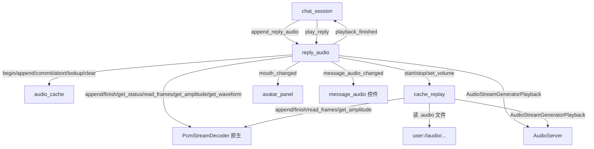
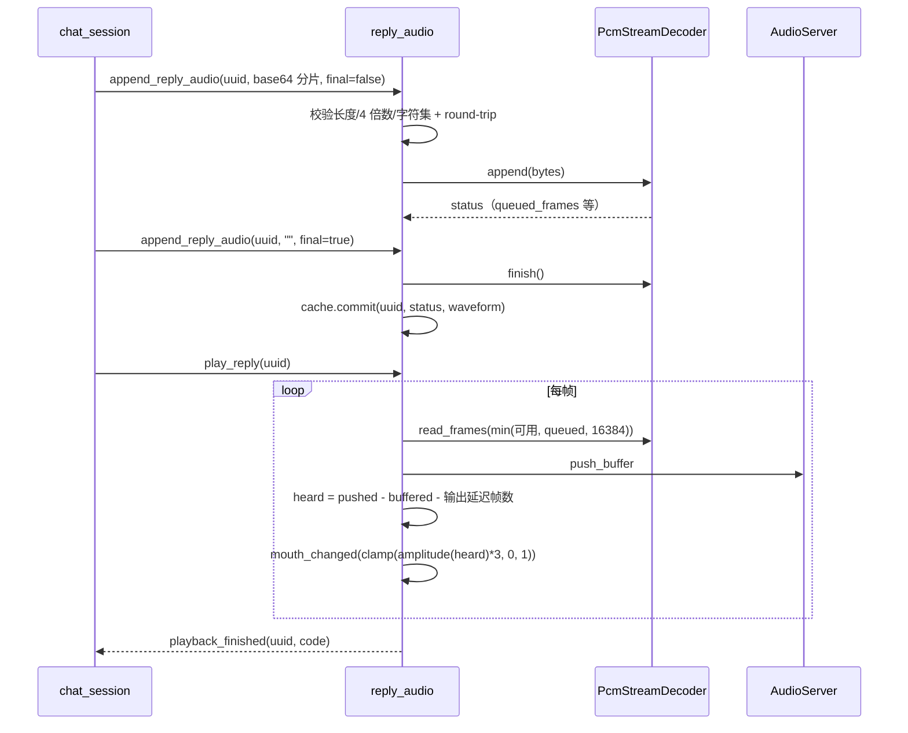

> **系列文档**：[总览](ARCHITECTURE.md) · [01 组装根](01-application.md) · [02 session](02-session.md) · [03 network](03-network.md) · [04 storage](04-storage.md) · **05 media** · [06 avatar](06-avatar.md) · [07 ui](07-ui.md) · [08 preview](08-preview.md) · [09 构建与交付](09-build-and-release.md) · [10 测试与验证](10-testing.md)
> **基线**：分支 `feat/agentluo-0.1.1` @ `42b5b1c` · 撰写日期 2026-09-20 · 只读现状分析（as-built）；除本系列 `.md` 与 `export_presets.cfg` 的导出排除项外不改动任何文件
> **路径与行号口径**：无前缀路径相对 `client_godot/`，`client_godot/…` 相对仓库根；`file:line` 为撰写时工作树行号

# src/media：音频接收与播放

## 30 秒速览

- 这个模块只有两个文件：`reply_audio.gd`（336 行）管「在线语音的接收 + 播放」，`cache_replay.gd`（122 行）管「已缓存语音的重放」；两者都建立在同一个原生解码器 `PcmStreamDecoder` 上。
- 语音从服务端来的是**流式 base64 分片**，一片片喂给解码器，边解边播；不是先收完整文件再播。
- 改播放行为先看 `src/media/reply_audio.gd:205`（`_process`，内含开播条件、口型计算、推送上限与结束判定），改解码先看 `native/pcm_stream_decoder.cpp:108`（`append` 的 RIFF 状态机）。
- 口型值从 `mouth_changed(value)` 出去，具体怎么驱动 Live2D 参数归 06 篇；本模块只负责算出一个 0..1 的音量值（或 -1 表示「交还给模型」）。
- 原生扩展缺失时整条在线语音链路会失败并给出 `DECODER_UNAVAILABLE`（`src/media/reply_audio.gd:91` 到 `:93`），不会静默无声。

## 职责

- **在线语音接收与播放**（`reply_audio.gd`，336 行）：按消息 uuid 维护并发接收流；校验 base64；把分片同时喂给缓存与解码器；在缓冲够用时开机播放；按「已听到」的帧位置推导口型；收口时发 `playback_finished`。
- **本地缓存重放**（`cache_replay.gd`，122 行）：从 `audio_cache` 给的路径读文件、按需喂解码器、播放、暂停/继续/停止，并上报播放进度。
- **原生解码**（`native/pcm_stream_decoder.{h,cpp}`）：一个 `RefCounted`，把流式 WAV（RIFF 分块）解成 `Vector2` 立体声帧，同时维护按帧的 RMS 幅度序列，供口型与波形图使用。

## 为什么这样切分

- **接收与重放分成两个文件**，因为它们的输入源不同：在线语音是「不可回退的流」（收到就必须往前推），重放是「可随机读的文件」。前者要处理超时、丢弃与抢占，后者要处理暂停与进度；混在一起会让 `_process` 出现两套互斥状态。
- **解码放在原生**。GDScript 逐样本处理 24 万帧级的数据不可行，`PcmStreamDecoder` 用 C++ 完成字节解包、能量窗计算与队列管理，GDScript 每帧只做「取一批、推给播放器」。
- **播放用 `AudioStreamGenerator` 而不是 `AudioStreamWAV`**。流式语音没有完整文件可交，`AudioStreamGeneratorPlayback` 允许边算边推（`src/media/reply_audio.gd:224` 到 `:229`）；代价是必须自己管理缓冲与结束判定。
- **口型不是独立模块**：它由「已听到的帧位置」直接推出（`:239` 到 `:240`），因为这件事只有播放器自己知道；算完只发一个浮点数出去，渲染侧不参与音频逻辑。
- **缓存写入与解码解耦**：缓存走 `audio_cache` 的两阶段 API（04 篇），解码失败不影响已写入的缓存，缓存失败也不影响本次播放（`:79` 到 `:89`、`:118` 到 `:123`）。

## 关键文件与符号

| 文件 | 行数 | 职责 | 关键符号 |
| --- | --- | --- | --- |
| `src/media/reply_audio.gd` | 336 | 在线语音接收、解码、播放、口型、缓存联动、重放转发 | `append_reply_audio()`（`src/media/reply_audio.gd:45`）、`play_reply()`（`:126`）、`get_state()`（`:131`）、`stop_current()`（`:142`）、`reset()`（`:152`）、`_fail()`（`:175`）、`_process()`（`:205`）、`set_scope()`（`:262`）、`replay()`（`:277`）、`clear_cache()`（`:311`） |
| `src/media/cache_replay.gd` | 122 | 缓存文件重放（播放/暂停/继续/停止/进度） | `start()`（`src/media/cache_replay.gd:23`）、`pause()`（`:38`）、`resume()`（`:45`）、`stop()`（`:52`）、`_end()`（`:70`）、`_process()`（`:75`） |
| `native/pcm_stream_decoder.h` | 39 | 解码器对外声明 | `Phase` 枚举与 RIFF 状态字段（`native/pcm_stream_decoder.h:12` 到 `:22`）、六个绑定方法（`:29` 到 `:34`） |
| `native/pcm_stream_decoder.cpp` | 199 | RIFF 状态机、PCM 解码、能量窗、读取与波形 | `_bind_methods()`（`native/pcm_stream_decoder.cpp:14`）、`get_status()`（`:22`）、`parse_format()`（`:46`）、`decode()`（`:71`）、`append()`（`:108`）、`finish()`（`:157`）、`read_frames()`（`:165`）、`get_amplitude()`（`:176`）、`get_waveform()`（`:183`） |

## 对外接口与信号

`reply_audio`（消费方是 `src/session/chat_session.gd` 与 `src/ui/message_audio.gd`）：

- 信号：`message_audio_changed(id,state)`（`src/media/reply_audio.gd:2`）、`replay_finished(id,code)`（`:3`）、`receive_finished(id,code)`（`:4`）、`playback_finished(id,code)`（`:5`）、`mouth_changed(value)`（`:6`）、`state_changed(state)`（`:7`）。
- 接收：`append_reply_audio(id,encoded,final,audio_error,ephemeral)`（`:45`）——这是唯一的入口，分片与收口都走它。
- 播放：`play_reply(id)`（`:126`，只是把 id 设为活动流，真正开播在 `_process`）、`stop_current()`（`:142`）、`reset()`（`:152`）。
- 重放：`replay(id) -> Error`（`:277`）、`pause_replay()`（`:296`）、`resume_replay()`（`:301`）、`stop_replay()`（`:306`）、`clear_cache() -> Error`（`:311`）。
- 查询与设置：`get_state()`（返回 `{active_id,playing,queued,volume}`，`:131` 到 `:132`）、`get_message_audio(id)`（返回 `{available,duration,waveform,blocked,status,position,code}`，`:268` 到 `:275`）、`set_volume(value)`（`:134`，钳到 0..1）、`set_scope(server,username)`（`:262`）。

`cache_replay`（只被 `reply_audio` 使用，注释明确「只有 ReplyAudio 才有权仲裁声音与口型的所有权」，`src/media/cache_replay.gd:2`）：

- 信号 `changed`（`:3`）、`finished(id,code)`（`:4`）、`mouth_changed(value)`（`:5`）；公开字段 `id`、`status`（`idle`/`playing`/`paused`）、`position`（`:6` 到 `:8`）。
- 方法 `start(reply_id,metadata) -> Error`（`:23`）、`pause()`（`:38`）、`resume()`（`:45`）、`stop()`（`:52`）、`set_volume(value)`（`:35`）。

原生解码器（`ClassDB` 名字 `PcmStreamDecoder`）：`append(bytes) -> Dictionary`、`finish() -> Dictionary`、`get_status() -> Dictionary`、`read_frames(max_count) -> PackedVector2Array`、`get_amplitude(frame_index) -> float`、`get_waveform(buckets = 24) -> PackedFloat32Array`（绑定见 `native/pcm_stream_decoder.cpp:15` 到 `:20`）。状态字典的键固定为 `ok/code/sample_rate/channels/bits/queued_frames/decoded_frames/input_bytes/finished`（`:22` 到 `:33`），其中 `ok` 就是「没有错误码」（`:24`）。

## 依赖与数据流

一次在线语音从进入到播完：

## 状态与不变量

- **单流状态字段**：每条在收的流有 `{decoder,final,code,stopped,updated,format_logged,cache_started,cache_suppressed}`（`src/media/reply_audio.gd:57` 到 `:58`）；`_completed` 是已收口消息的墓碑表（`:15`、`:46`）。
- **同时最多 16 路接收流**：超过就整条判 `BUFFER_LIMIT` 并立刻收口（`:49` 到 `:56`），日志里会同时补三条（`audio_error`、`audio_receive_finished`、`audio_playback_finished`）。
- **单流 60 秒无更新即超时**：`_process` 每帧检查 `final == false` 且 `now - updated >= 60000` 的流并判 `AUDIO_TIMEOUT`（`:208` 到 `:209`）。
- **base64 三重校验 + 二次确认**：长度不超过 12 MB、长度是 4 的倍数、只含 `[A-Za-z0-9+/]` 与最多两个 `=`（正则编译在 `:42`，判定在 `:71`）；解出来再重新编码比对一次，不相等同样判 `INVALID_BASE64`（`:74` 到 `:77`）。
- **解码器缺失是可诊断的失败**：`ClassDB.class_exists("PcmStreamDecoder")` 为假时判 `DECODER_UNAVAILABLE`（`:91` 到 `:93`），不会静默丢弃音频。
- **全局缓冲上限**：把当前所有流解码器里排队未读的帧加总，超过 `128 MB / 8` 字节（即 1600 万帧）就把当前流判 `BUFFER_LIMIT`（`:105` 到 `:111`）。
- **缓存写入与解码的顺序**：先 `begin` → 每个分片 `append` → 收口时 `commit`（`:79` 到 `:89`、`:118` 到 `:123`）。`begin` 返回 `ERR_ALREADY_EXISTS` 表示这条消息已经有缓存，于是把本流的缓存写入整体关掉（`cache_suppressed`），不影响播放（`:82` 到 `:83`）。
- **临时回复不落盘**：`ephemeral` 为真的那一刻就把 `cache_suppressed` 置真并 `_cache.abort(id)`（`:63` 到 `:66`），此后该流的音频只进解码器。
- **开播条件**：解码器已给出采样率、队列里有帧，且（已收口 或 缓冲达到 0.08 秒）才建流（`:219` 到 `:220`）；`AudioStreamGenerator` 的 `mix_rate` 用解码器实际采样率、`buffer_length` 固定 0.25 秒（`:224` 到 `:226`）。
- **口型公式**：`heard = _pushed - buffered - 输出延迟帧数`（`:239`），再取该帧的幅度乘 3 并夹到 0..1 发出（`:240`）；`heard` 为负或越界时解码器返回 0（`native/pcm_stream_decoder.cpp:177`）。
- **单帧推送上限**：一次最多推 `min(可用帧, 队列帧, 16384)`（`src/media/reply_audio.gd:245`），避免长帧阻塞。
- **播放结束判定要等两层**：队列帧为零且 `buffered == 0` 时先记一个 `drain_at`，等「输出延迟 + 下一次混音时间」再加 10 ms 之后才判定完成（`:253` 到 `:257`），确保最后一段真的播出去而不是被截断。
- **在线语音抢占重放**：开播前若本地重放正在工作，先记 `replay_preempted` 再 `stop_replay()`（`:221` 到 `:223`）。
- **停止与失败都清口型**：`_stop_player()` 会发 `mouth_changed(-1.0)`（`:191`），负数即「交还给模型」的约定；`reset()` 对每条在途流补一条 `INTERRUPTED` 的播放结束日志再全部清空（`:152` 到 `:161`）。
- **`set_scope()` 是切账号的唯一切换点**：先 `reset()` 再清元数据与错误表，最后把作用域转给 `audio_cache`（`:262` 到 `:266`）。
- **重放的状态机**：`cache_replay.status` 只在 `idle`/`playing`/`paused` 之间变（`src/media/cache_replay.gd:31`、`:41`、`:48`、`:61`）；`resume()` 会把 `_drain_at` 归零（`:49`），暂停时不发口型值而发 -1（`:42`）。
- **重放按需读盘**：只有队列低于 `max(4096, sample_rate/2)` 帧才从文件再读 64 KB（`src/media/cache_replay.gd:79` 到 `:84`），读完文件即 `finish()`。
- **重放进度是估算值**：`position = min(duration, heard / sample_rate)`（`:101`），`heard` 用与在线播放相同的公式（`:100`）；进度上报每 50 ms 一次（`:117` 到 `:119`）。
- **原生解码器的格式口径**（`native/pcm_stream_decoder.cpp:46` 到 `:68`）：只接受 `fmt ` 里的 PCM（`format == 1`，位深 8/16/24/32）与 IEEE float（`format == 3`，位深 32）；`0xfffe` 可扩展格式要整体 GUID 校验通过才认；单声道复制成双声道（`:96`）；采样率 8000..192000、声道 1..2，`alignment` 与字节率必须自洽（`:64` 到 `:66`）。
- **原生解码器的三道上限**：单次 `append` 不超过 8 MB（`:115`）、头部累计不超过 1 MB（`HEADER_LIMIT`，`:9`、`:131`、`:136`）、未读队列不超过 `128 MB / sizeof(Vector2)` 帧且总解码帧数不超过 `sample_rate * 1800`（`:8`、`:73` 到 `:75`）。
- **`finish()` 的收口判定**：仍在头部阶段、还有未消费字节、或声明长度没读满都判 `TRUNCATED_AUDIO`；一帧都没解出来判 `EMPTY_AUDIO`（`:157` 到 `:162`）。失败是粘性的：失败后再 `append` 只会拿到同一个码（`:109`）。
- **能量窗**：`window_frames = max(1, rate / 100)`（`:67`），每窗算一次 RMS 存进 `amplitudes`（`:99` 到 `:102`），因此口型的时间分辨率固定 10 ms。
- **波形只对已完成的流可用**：`get_waveform()` 要求 `ended` 且无错误码，桶数必须在 1..128 之间（`:185`），否则返回空数组；`audio_cache` 固定存 24 桶（04 篇）。

## 验证入口

- 在线语音接收与生命周期：`tests/test_reply_audio.gd`（`scripts/check.ps1:12`）与 `tests/test_audio_lifecycle.gd`（`scripts/check.ps1:13`）。
- 原生解码器：`tests/test_pcm_decoder.gd`（`scripts/check.ps1:11`），覆盖分片头、单声道复制、立体声符号与缩放、可扩展格式 GUID、非有限浮点、字节率/对齐不自洽、截断与空流、头部与队列上限、波形桶边界等（`tests/test_pcm_decoder.gd:58` 到 `:128`）。
- 缓存与重放：`tests/test_audio_cache.gd`（`scripts/check.ps1:14`）与 `tests/test_voice_replay.gd`（`scripts/check.ps1:17`）。
- 端到端语音（真实 socket 分片）：`tests/test_voice_chat.gd`（`scripts/check_network.ps1:9`）。
- 采样数据来源：`tests/support/audio_samples.gd` 生成合成 WAV，被上述用例复用。
- 界面侧消费：`tests/capture_voice_ui.gd`（真实 GPU 截图，见 10 篇）。

## 扩展点与已知坑

- **`_process` 是唯一推进点，且靠帧率驱动**：开播、口型、推送与结束全部在 `src/media/reply_audio.gd:205` 到 `:257`；`process_mode` 设为 `PROCESS_MODE_ALWAYS`（`:41`），因此暂停场景也会继续播。
- **超时只对「还没收口」的流生效**（`:208`）：服务端明确收口却不出帧的流不会被超时清理，只能靠 `reset()` 或下一次 `set_scope()`。
- **口型是估算而不是精确同步**：`heard` 用输出延迟估算（`:239`），实际听到的位置与估算差一帧以内，且 `get_amplitude` 对未到窗口的帧返回当前能量窗值（`native/pcm_stream_decoder.cpp:180`），因此口型在流末尾会保持最后一个窗口的幅度。
- **`-1.0` 是口型的「交还给模型」信号**（`:191`、`src/media/cache_replay.gd:42`、`:66`），渲染侧必须自己识别这个约定（06 篇）。
- **`BUFFER_LIMIT` 会连发三条结束事件**（`:51` 到 `:55`）：`receive_finished` 与 `playback_finished` 都会触发，界面与 `chat_session` 两侧都会收到，重复处理要幂等。
- **抢占只在开播那一瞬间发生**：`replay_preempted` 与 `stop_replay()` 都在「`_playback == null`」的分支里（`:221` 到 `:223`），已经在播的在线语音不会因为新的重放请求而让路——重放侧自己会返回 `ERR_BUSY`（`:278` 到 `:279`）。
- **`replay()` 的失败会污染缓存错误表**：起播失败或缓存不存在时写 `REPLAY_FAILED` / 不存在（`:283` 到 `:291`），这个码通过 `get_message_audio().code` 一直显示在控件上，直到该 id 的元数据被清掉。
- **`clear_cache()` 只清缓存不清在途流**：它把当前所有流的 `cache_suppressed` 置真（`:313` 到 `:314`），正在接收的语音仍会解码并播放，只是不再落盘。
- **`get_message_audio()` 有内存缓存**：`_metadata[id]` 命中后不再查磁盘（`:269` 到 `:270`），因此外部删除缓存文件不会立刻反映到界面；`replay()` 会先 `erase` 再重查（`:282`）。
- **`set_scope()` 依赖注入的 cache 对象**：没有 cache 时返回 `ERR_UNCONFIGURED`（`:266`），此时在线播放仍可用但重放不可用。
- **原生解码器的失败会丢光已解帧**：`fail()` 直接清空 `pending`/`frames`/`amplitudes` 并重置 `read_offset`（`native/pcm_stream_decoder.cpp:36` 到 `:44`），所以失败后 `read_frames()` 返回空——这是刻意的，避免播放半段坏音频。
- **`QUEUE_FRAMES` 与 GDScript 侧的上限是两套**：原生限 `128 MB / sizeof(Vector2)` 帧（`:8`），GDScript 侧另外用「全体流排队帧总和」做全局上限（`src/media/reply_audio.gd:106` 到 `:110`），两者对不上时先触发哪一个取决于并发流数量。
- **可扩展格式的 GUID 只认一种**：`0xfffe` 分支要求子格式 GUID 命中硬编码后缀且子格式大小 ≥22（`native/pcm_stream_decoder.cpp:50` 到 `:57`），其它合法但少见的扩展头会被判 `UNSUPPORTED_FORMAT`。
- **`data` 块长度为 `0xffffffff` 视为「流式未知长度」**（`:132`），此时 `finish()` 不会再校验长度（`:159`）；已知长度却提前结束时判 `TRUNCATED_AUDIO`。
- **浮点 WAV 遇非有限值直接失败**（`:86`），不会钳制（`std::clamp` 只作用于有限值，`:94`）。
- **`reset()` 会打断重放**：`reset()` 第一件事就是 `stop_replay()`（`src/media/reply_audio.gd:153`），而 `chat_session` 在断线时会调 `_media.reset()`（02 篇），因此断线必然中断正在进行的本地重放。