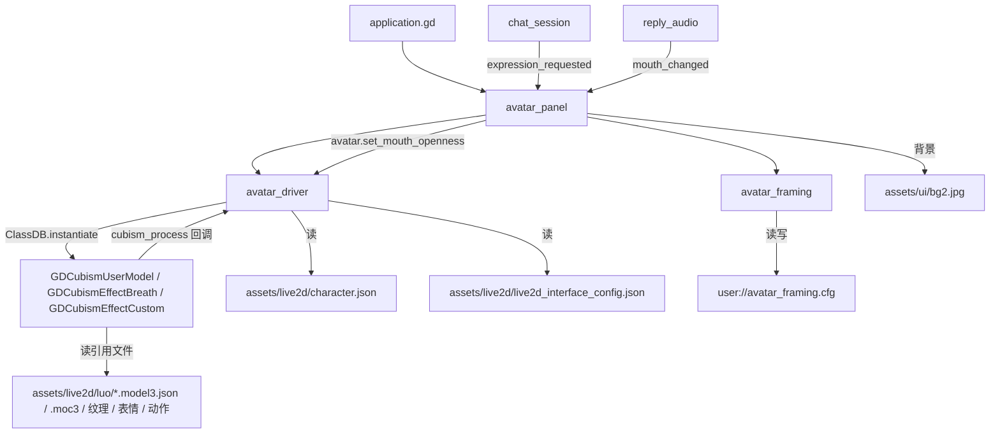
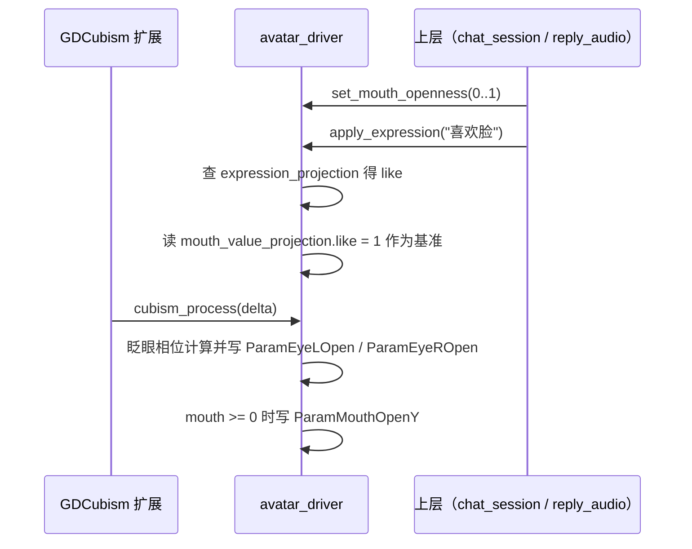

> **系列文档**：[总览](ARCHITECTURE.md) · [01 组装根](01-application.md) · [02 session](02-session.md) · [03 network](03-network.md) · [04 storage](04-storage.md) · [05 media](05-media.md) · **06 avatar** · [07 ui](07-ui.md) · [08 preview](08-preview.md) · [09 构建与交付](09-build-and-release.md) · [10 测试与验证](10-testing.md)
> **基线**：分支 `feat/agentluo-0.1.1` @ `42b5b1c` · 撰写日期 2026-09-20 · 只读现状分析（as-built）；除本系列 `.md` 与 `export_presets.cfg` 的导出排除项外不改动任何文件
> **路径与行号口径**：无前缀路径相对 `client_godot/`，`client_godot/…` 相对仓库根；`file:line` 为撰写时工作树行号

# src/avatar：角色呈现与构图

## 30 秒速览

- 三个角色：`avatar_driver.gd` 是「与 Live2D 原生扩展的唯一边界」，`avatar_framing.gd` 是纯粹的构图数学与持久化，`avatar_panel.gd` 是装背景、接鼠标手势、把两者拼起来的控件。
- 改表情/动作先看 `assets/live2d/live2d_interface_config.json` 与 `src/avatar/avatar_driver.gd:87`（`apply_expression`）；改缩放平移看 `src/avatar/avatar_framing.gd:22`（`get_transform`）。
- 口型不在这里算：`set_mouth_openness(value)` 只是把 05 篇算好的 0..1 值写进 `ParamMouthOpenY`；传负数表示「交还给模型」。
- 本模块的很多参数由扩展在 `cubism_process` 回调里被逐帧改写（`src/avatar/avatar_driver.gd:126`），所以驱动只允许在主线程调用（`src/avatar/avatar_driver.gd:2` 的注释）。
- 原生扩展缺失时 `load_avatar()` 返回 `ERR_UNAVAILABLE`（`src/avatar/avatar_driver.gd:39` 到 `:40`），界面用一行提示文案兜底，不会崩。

## 职责

- **驱动**（`avatar_driver.gd`，137 行）：解析角色描述符与映射表，校验模型引用文件是否齐全，实例化 `GDCubismUserModel`，接呼吸/自定义效果，暴露表情、动作、口型三个动作入口与一个状态查询入口。
- **构图**（`avatar_framing.gd`，49 行）：维护缩放与归一化偏移，算出模型应有的 `Transform2D`，并把这两个值存进 `user://avatar_framing.cfg`。
- **面板**（`avatar_panel.gd`，95 行）：背景图与遮罩、挂载驱动、滚轮缩放与右键拖动平移、重置按钮、窗口最小化时停绘、错误文案。
- **预览场景脚本**（`avatar_preview.gd`，16 行）：复用面板，加载失败直接退出码 1，支持 `--capture=` 截图后退出。

## 为什么这样切分

- **把「扩展调用」集中在一处**。所有 `ClassDB.instantiate("GDCubism*")`、`call("get_parameters")`、参数写入都只出现在 `avatar_driver.gd`，上层（面板、UI、测试）只用 `load_character` / `apply_expression` / `play_motion` / `set_mouth_openness` / `get_status` 五个方法。
- **构图与面板分开**，因为构图是纯函数式的：`get_transform(panel, canvas)` 只依赖两个尺寸与自身状态（`src/avatar/avatar_framing.gd:22` 到 `:26`），可以脱离引擎对象单测；面板负责手势与界面反馈。
- **归一化偏移而不是像素偏移**。`pan_by()` 把像素位移除以面板尺寸再夹到 ±0.4（`src/avatar/avatar_framing.gd:11` 到 `:14`），因此拉伸窗口后构图不会跑偏（测试 `tests/test_avatar_framing.gd:20` 正是这条）。
- **映射表放在资源里而不是代码里**。服务端下发的表情指令是中文名（如「喜欢脸」），模型表情是英文 id（如 `like`），二者的对应与每个表情的嘴型基准值都在 `assets/live2d/live2d_interface_config.json`（读取点 `src/avatar/avatar_driver.gd:36` 到 `:38`）。
- **身份与模型资源分离**。`assets/live2d/character.json` 只放 `character_id`/`resource_id`/`model_path`/`mapping_path` 四个字段（校验在 `src/avatar/avatar_driver.gd:22` 到 `:24`），换模型不改代码。

## 关键文件与符号

| 文件 | 行数 | 职责 | 关键符号 |
| --- | --- | --- | --- |
| `src/avatar/avatar_driver.gd` | 137 | Live2D 边界：加载、表情、动作、口型、状态 | `MAPPING_PATH`（`src/avatar/avatar_driver.gd:4`）、`load_character()`（`:16`）、`load_avatar()`（`:31`）、`apply_expression()`（`:87`）、`play_motion()`（`:99`）、`set_mouth_openness()`（`:109`）、`get_status()`（`:114`）、`_apply_parameters()`（`:126`） |
| `src/avatar/avatar_panel.gd` | 95 | 背景、手势、重置、最小化处理 | `SETTINGS`（`src/avatar/avatar_panel.gd:5`）、`_ready()`（`:12`）、`_layout_avatar()`（`:53`）、`_handle_pointer()`（`:59`）、`_save()`（`:81`）、`_notification()`（`:86`）、`_process()`（`:92`） |
| `src/avatar/avatar_framing.gd` | 49 | 缩放/偏移与构图变换、配置读写 | `zoom_by()`（`src/avatar/avatar_framing.gd:6`）、`pan_by()`（`:11`）、`reset()`（`:17`）、`get_transform()`（`:22`）、`save_settings()`（`:29`）、`load_settings()`（`:36`） |
| `src/avatar/avatar_preview.gd` | 16 | 独立截图/冒烟场景 | `_ready()`（`src/avatar/avatar_preview.gd:5`）、`--capture=` 分支（`:11` 到 `:16`） |
| `assets/live2d/character.json` | 5 | 角色描述符 | `character_id`=luotianyi、`resource_id`=original、`model_path`、`mapping_path` |
| `assets/live2d/live2d_interface_config.json` | 19 | 表情投影与嘴型基准 | `expression_projection`（9 条中文指令 → 表情 id）、`mouth_value_projection`（8 个表情 → 嘴型基准） |
| `assets/live2d/luo/model.model3.json` | 17 | Live2D 模型清单 | 被 `load_avatar()` 校验并交给扩展加载（`src/avatar/avatar_driver.gd:41` 到 `:67`） |

## 对外接口与信号

`avatar_driver`（无信号，全部是同步方法）：

- `load_character(descriptor_path) -> Error`（`src/avatar/avatar_driver.gd:16`）：文件不存在 `ERR_FILE_NOT_FOUND`、结构或字段不合法 `ERR_INVALID_DATA`，成功后再记录 `character_id`/`resource_id`（`:26` 到 `:28`）。
- `load_avatar(model_path,mapping_path = MAPPING_PATH) -> Error`（`:31`）：额外可能返回 `ERR_UNAVAILABLE`（扩展缺失，`:39`）；失败时保留原模型（先建 candidate，成功后才替换 `_model`，`:62` 到 `:74`）。
- `apply_expression(command) -> bool`（`:87`）：未加载或表情不存在返回 `false`，且不改动当前表情（`:91` 到 `:92`）。
- `play_motion(group,index = 0) -> bool`（`:99`）：组不存在或下标越界返回 `false`。
- `set_mouth_openness(value) -> void`（`:109`）：`value < 0` 表示交还模型控制，否则夹到 0..1。
- `get_status() -> Dictionary`（`:114`）：键固定为 `loaded`、`canvas_size`、`character_id`、`resource_id`、`expression`、`motion_groups`、`mouth_openness`（未加载时返回同构默认值，`:116` 到 `:117`）。

`avatar_framing`（纯 `RefCounted`）：`zoom_by(factor)`（`src/avatar/avatar_framing.gd:6`）、`pan_by(delta,panel_size)`（`:11`）、`reset()`（`:17`）、`get_transform(panel,canvas) -> Transform2D`（`:22`）、`save_settings(path) -> Error`（`:29`）、`load_settings(path) -> Error`（`:36`）。

`avatar_panel`（`extends Control`）：对外只有公开字段 `avatar`（驱动实例，`src/avatar/avatar_panel.gd:6`）与 `framing`（构图实例，`:7`），因为 `chat_view` 只把它当控件塞进布局；口型与表情由上层直接调 `avatar.*`。

## 依赖与数据流

一帧内的参数写入顺序：

## 状态与不变量

- **加载是「先建后换」**：`load_avatar()` 先校验文件与清单、建好 candidate 并取到画布信息，全部通过后才替换 `_model` 并把旧模型 `free()`（`src/avatar/avatar_driver.gd:62` 到 `:74`）；任一步失败返回错误码且不动现有模型（测试 `tests/test_avatar_driver.gd:43` 到 `:44` 覆盖这条）。
- **清单校验清单**：模型路径必须以 `.model3.json` 结尾（`:42`），`FileReferences` 必须含 `Moc` 且 `Textures` 非空（`:45`），随后把 `Moc`、`Textures`、可选 `Physics`/`Pose`/`UserData`、全部 `Expressions[].File` 与 `Motions[].File` 逐个查存在性（`:47` 到 `:61`）；纹理允许命中已导入资源（`FileAccess.file_exists` 或 `ResourceLoader.exists`，`:59` 到 `:60`）。
- **映射表结构是硬要求**：`expression_projection` 与 `mouth_value_projection` 必须都是字典，否则 `ERR_INVALID_DATA`（`:37` 到 `:38`）。
- **嘴型的三级取值**：`_mouth_override`（上层给的实时值）→ `_base_mouth`（当前表情的基准值）→ 模型自身 `ParamMouthOpenY`（`：118` 到 `:120`）；基准值为负表示不接管嘴型。
- **基准值来自映射表，缺省为 -1**：`apply_expression()` 用 `mouth_value_projection.get(selected, -1.0)`（`:95`），因此像 `sing` 这种只在 `expression_projection` 里出现、没有嘴型条目的表情会落到 -1（交还模型）。
- **口型只在非负时写入**：`_apply_parameters` 里 `mouth >= 0` 才写 `ParamMouthOpenY`（`:135` 到 `:137`），负数时完全不碰这个参数。
- **眨眼是自实现的**：周期 4.5 秒，用 `fmod(_elapsed, 4.5)` 的前 0.18 秒做一次三角闭合，直接写 `ParamEyeLOpen`/`ParamEyeROpen`（`:128` 到 `:134`），注释说明该模型没有 EyeBlink 组。
- **驱动挂载固定两个效果**：`GDCubismEffectBreath` 与 `GDCubismEffectCustom`（`:63` 到 `:65`），自定义效果发 `cubism_process` 连接到 `_apply_parameters`（`:81`）。
- **构图公式**：`factor = min(panel.x / canvas.x, panel.y / canvas.y) * zoom`，原点为 `panel * (0.5 + offset)`，旋转与斜切为零（`src/avatar/avatar_framing.gd:25` 到 `:26`）；任一边长非正时返回单位变换（`:23` 到 `:24`）。
- **缩放与偏移的限幅**：缩放 0.6..2.4（`:8`、`:47`），偏移在归一化坐标下 ±0.4（`:14`、`:48`）；`zoom_by()` 忽略非有限或非正的倍数（`:7`），`pan_by()` 忽略非正的面板尺寸与非有限位移（`:12` 到 `:13`）。
- **配置损坏不覆盖内存状态**：`load_settings()` 对字段类型与有限性逐项校验，失败返回 `ERR_INVALID_DATA` 且不改动当前 `_zoom`/`_offset`（`:41` 到 `:48`）；文件缺失单独返回 `ERR_FILE_NOT_FOUND`（`:40`）。
- **面板的持久化时机**：拖动结束（`:62` 到 `:64`）、滚轮缩放（`:69`）、重置（`:49`）、拖动中窗口失焦（`_notification`，`:87` 到 `:89`）四处写盘；写失败改成提示文案而不打断操作（`:82` 到 `:83`）。
- **只有右键拖动**平移，左键不参与（`src/avatar/avatar_panel.gd:61` 到 `:65`）；滚轮步进固定 1.1 倍（`:67`）。
- **最小化时停绘**：`_process` 每帧检查窗口是否为最小化，是则把驱动 `visible = false` 且 `process_mode = PROCESS_MODE_DISABLED`（`:92` 到 `:95`），避免后台继续跑 Cubism 物理。
- **加载失败只出文案**：`character.json` 加载失败就写 `_error_label` 并 `return`（`:31` 到 `:33`），面板仍可用（背景、按钮在），但后续手势不会生效。
- **构图恢复失败是软失败**：`load_settings` 返回 `ERR_FILE_NOT_FOUND` 之外的错误才提示「已使用默认构图」（`:34` 到 `:36`）。

## 验证入口

- 驱动与映射：`tests/test_avatar_driver.gd`（`scripts/check.ps1:6`）——覆盖未加载状态、真实模型加载、中文表情指令映射到 `like`、非法表情不改状态、动作越界拒绝、口型钳制与「负数交还」语义、缺文件时保留原模型、描述符解析出 `luotianyi`/`original` 身份（`tests/test_avatar_driver.gd:25` 到 `:48`）。
- 构图与配置：`tests/test_avatar_framing.gd`（`scripts/check.ps1:7`）——覆盖默认居中与等比缩放、缩放上限、平移限幅、拉伸后面板尺寸变化仍保持归一化位置、非有限输入不改状态、配置往返、损坏配置与缺失文件（`tests/test_avatar_framing.gd:17` 到 `:42`）。
- 图形冒烟与截图：`scenes/avatar_preview.tscn` 配合 `src/avatar/avatar_preview.gd:11` 的 `--capture=<路径>`，加载失败退出码 1、截图失败退出码 1；界面整体截图另见 `tests/capture_voice_ui.gd`（需要真实 GPU，见 10 篇）。

## 扩展点与已知坑

- **`assets/live2d/luo/model.model3_copy.json` 是死资源**：全仓检索没有任何引用（`character.json` 指向的是 `model.model3.json`），它不会被加载、也不会被校验；改动它没有任何效果。
- **映射表覆盖不全模型资源**：`assets/live2d/luo/expressions/` 下有 13 个表情文件，`expression_projection` 只用到 9 个；`sing` 有表情没有嘴型基准，`resonate`/`excited`/`yanndere`/`sleepy` 等表情没有中文入口——服务端下发未登记的指令会被 `apply_expression()` 判 `false`（`src/avatar/avatar_driver.gd:91` 到 `:92`）。
- **`load_avatar()` 会清空身份字段**：它在成功路径上把 `_character_id`/`_resource_id` 置空（`:76` 到 `:77`），只有经 `load_character()` 进来才会重新填上（`:26` 到 `:28`）；直接调 `load_avatar()` 的调用方拿不到身份。
- **`_parameters` 的键空间来自扩展**：`get_status()` 与 `_apply_parameters()` 都按名字查表并做 `has()` 判断（`:120`、`:133`、`:136`），换模型导致参数名缺失时会静默降级成「不写这个参数」，而不是报错。
- **眨眼覆盖扩展的动作**：`_apply_parameters` 在回调里无条件写眼睛参数（`:130` 到 `:134`），若某个动作自带眼睛关键帧，本实现会在眨眼相位内盖掉它。
- **`_elapsed` 只在回调里累加**（`:127`），所以面板停绘（最小化）期间眨眼相位会暂停，恢复后从暂停点继续。
- **构图的 `canvas` 是模型自带画布尺寸**，不是面板尺寸（`src/avatar/avatar_panel.gd:55` 用 `get_status().canvas_size`），因此换模型会自动重新适配比例。
- **重置按钮的位置是手工摆的**：它用 `size.y - 50` 在 `_ready()` 与每次 `resized` 时手算（`src/avatar/avatar_panel.gd:45`、`:50`），面板尺寸为 0 时按钮会跑到角落外。
- **面板不裁剪模型变换以外的内容**：`clip_contents = true`（`:13`）只保证不溢出面板；模型放大到 2.4 倍时的清晰度由纹理与扩展决定，本层不做兜底。
- **错误提示是单行 Label，且会被后续成功操作覆盖**：`_error_label.text` 在构图保存失败、加载失败、恢复失败三处被改写（`:32`、`:36`、`:83`），后写覆盖先写，不保留多条。
- **`avatar_preview` 失败即退出进程**：加载失败 `quit(1)` 并 `push_error`（`src/avatar/avatar_preview.gd:7` 到 `:10`），所以它只能当冒烟/截图场景用，不适合当长期运行的预览窗口。
- **截图有 2 秒固定等待**（`:13` 到 `:15`），比 `application` 的截图模式（1 秒）更宽松；两者都不检查首帧是否为空白帧，只检查 `save_png` 是否成功。