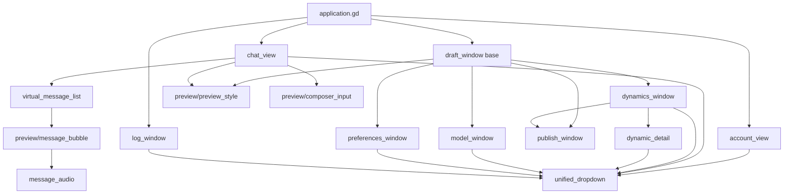
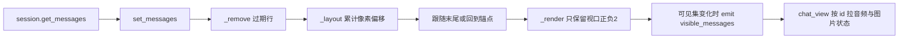

> **系列文档**：[总览](ARCHITECTURE.md) · [01 组装根](01-application.md) · [02 session](02-session.md) · [03 network](03-network.md) · [04 storage](04-storage.md) · [05 media](05-media.md) · [06 avatar](06-avatar.md) · **07 ui** · [08 preview](08-preview.md) · [09 构建与交付](09-build-and-release.md) · [10 测试与验证](10-testing.md)
> **基线**：分支 `feat/agentluo-0.1.1` @ `42b5b1c` · 撰写日期 2026-09-20 · 只读现状分析（as-built）；除本系列 `.md` 与 `export_presets.cfg` 的导出排除项外不改动任何文件
> **路径与行号口径**：无前缀路径相对 `client_godot/`，`client_godot/…` 相对仓库根；`file:line` 为撰写时工作树行号

# src/ui：视图与窗口

## 30 秒速览

- 这一层是控制台：把控制器状态画成控件，把点击翻译成对控制器的一次调用，自己几乎不持有业务状态。
- 界面改动最常落到两个文件——主聊天界面 `src/ui/chat_view.gd`，以及四个设置类窗口的共同基类 `src/ui/draft_window.gd`。
- 四个独立窗口（`dynamics_window` / `model_window` / `preferences_window` / `publish_window`）都继承 `draft_window.gd`；组装根只按 `open()` / `is_dirty()` / `hide()` 三个约定与它们打交道。
- `account_view.gd` 不是窗口，而是嵌在左栏的一块 `PanelContainer`；`log_window.gd` 直接 `extends Window`，不走草稿基类。
- `virtual_message_list.gd` 是自绘虚拟列表：消息再多，树上也只有视口附近的十来个气泡节点在活着。

## 职责

- **主聊天界面**（`chat_view.gd`，246 行）：顶部身份与「更多 ···」菜单、历史同步状态条、语音音量条、虚拟消息列表、输入框与发送按钮、未读定位按钮、图片浮层入口。它是产品里唯一常驻的视图。
- **账户表单**（`account_view.gd`，134 行）：登录 / 注册 / 邀请码重置三种模式切换、五个输入框、记住登录、取消请求、已登录态展示、错误码到中文文案。
- **窗口基类**（`draft_window.gd`，25 行）：给四个设置类窗口提供统一主题、统一尺寸约定、统一「关闭时若有未保存草稿则先确认」的行为。
- **动态双栏**（`dynamics_window.gd` 202 行 + `dynamic_detail.gd` 226 行）：左栏列表（头像、类型名 + 时间、正文摘要、加载更多 / 刷新 / 全部已读），右栏详情（正文、留言草稿、评论分页、按条回复、回复对象切换）。
- **发布窗口**（`publish_window.gd`，54 行）：一条文字动态的草稿框与发布按钮。
- **模型设置窗口**（`model_window.gd`，202 行）：按用途切换的模型配置（服务商、Base URL、API Key、模型名、两个能力勾选、高级 JSON 参数），草稿复制、手动测试、明文保存确认。
- **相处模式窗口**（`preferences_window.gd`，100 行）：四个字段（关系、表达风格、性格关键词、补充上下文），前两个带预设下拉，保存与重新加载。
- **日志窗口**（`log_window.gd`，131 行）：运行列表、模块与级别筛选、全文搜索、跟随最新、复制显示记录、导出诊断 ZIP。
- **共享控件**（`unified_dropdown.gd` 184 行、`message_audio.gd` 56 行）：稳定 ID 的选择器 / 动作菜单（全仓共用），以及单条消息的语音播放条。

## 为什么这样切分

- **窗口与视图分开**。`account_view.gd:1` 是 `PanelContainer`，`chat_view.gd:1` 是 `MarginContainer`，它们被组装根直接塞进主窗口的栏位；只有需要浮到桌面上、需要独立标题栏与最小尺寸的东西才做成 `Window` 子类。因此「是不是窗口」对应的是「用户能不能同时看见它」，而不是「它重不重要」。
- **草稿保护做成基类而不是复制四遍**。四个窗口都要回答同一个问题：关闭时有没有没保存的东西？答案的形态统一收敛为 `is_dirty()`（`src/ui/draft_window.gd:24` 给出默认 `false`），确认对话框与 `close_requested` 拦截全部由基类在 `:9` 到 `:20` 一次性搭好。子类只需要覆写 `is_dirty()` 与 `_ready()`（且必须先 `super._ready()`）。
- **组装根只认三个方法**。`src/application.gd:225` / `:245` 只调 `open()`，`:251` 只调 `is_dirty()`，`:271` 只调 `hide()`。这带来一个直接后果：`log_window` 与 `account_view` 之所以不在这个约定里，不是因为它们是例外，而是因为组装根根本没有按窗口协议去管理它们——`log_window` 在启动时创建一次（`src/application.gd:56` 到 `:57`）并把 `open` 直接接到两个信号上（`:108`、`:168`）；`account_view` 是常驻表单，靠可见性随登录态切换（`src/ui/account_view.gd:106` 到 `:109`）。`dynamic_detail` 更彻底：它是 `dynamics_window` 内部按需 new 出来的右栏内容（`src/ui/dynamics_window.gd:103`），生命周期跟着选中项。
- **虚拟化与滚动语义绑在同一个类里**。`virtual_message_list.gd` 同时管三件事——像素总高、可见区间、以及「当前读到哪条」的锚点。把锚点交给上层算会让每次翻页都多一次坐标往返，所以 `get_reading_anchor()`（`:57`）与 `is_at_latest()`（`:63`）都留在这里。
- **下拉菜单做成通用控件**。设置窗口、日志筛选、账户模式、模型用途、聊天「更多」菜单用的是同一个 `unified_dropdown.gd`，靠 `_init(actions)` 的布尔参数区分「选择器」（带当前值标题与勾选）与「动作菜单」（纯按钮，`src/ui/unified_dropdown.gd:15` 到 `:20`）。
- **消息气泡与外观常量继续放在 `src/preview/`**。`virtual_message_list.gd:7` 直接 preload `src/preview/message_bubble.gd`，`chat_view.gd:5` / `:6` 引 `preview_style` 与 `composer_input`。产品界面因此复用样板工程的外观层，代价见 08 篇。

## 关键文件与符号

| 文件 | 行数 | 职责 | 关键符号 |
| --- | --- | --- | --- |
| `src/ui/chat_view.gd` | 246 | 主聊天界面：菜单、历史状态、音量、消息列表、输入与发送 | `signal` 三连（`src/ui/chat_view.gd:2` 到 `:4`）、`_menu`（`:15`）、`set_dynamics_unread()`（`:25`）、菜单项清单（`:49`）、清理缓存对话框（`:50` 到 `:53`）、`_send()`（`:149`）、`_refresh()`（`:154`）、`_visible_audio()`（`:161`）、`_state_changed()`（`:173`）、`_audio_action()`（`:207`）、`_jump_reading()`（`:224`）、`_image_action()`（`:238`）、图片浮层 preload（`:244`） |
| `src/ui/virtual_message_list.gd` | 172 | 消息虚拟化：像素索引、行复用、滚动锚点、可见集上报 | 五个信号（`src/ui/virtual_message_list.gd:2` 到 `:6`）、`set_messages()`（`:30`）、`scroll_to_message()`（`:45`）、`scroll_to_latest()`（`:51`）、`get_visible_ids()`（`:54`）、`get_reading_anchor()`（`:57`）、`is_at_latest()`（`:63`）、`set_audio_state()`（`:66`）、`set_image_state()`（`:70`）、`_layout()`（`:104`）、`_render()`（`:125`）、`_at()` 二分（`:163`） |
| `src/ui/dynamic_detail.gd` | 226 | 右栏详情：正文、留言草稿、评论分页、按条回复 | `_init()`（`src/ui/dynamic_detail.gd:23`）、`_setup_input()`（`:94`）、`update_post()`（`:101`）、`is_dirty()`（`:110`）、`update_comments()`（`:113`）、`_place_reply()`（`:163`）、`_submit()`（`:173`）、`refresh_comments()`（`:192`）、静态 `avatar_path()`（`:203`）、静态 `relative_time()`（`:206`） |
| `src/ui/dynamics_window.gd` | 202 | 动态双栏窗口：列表、未读、分页、右栏装配 | `TYPES`（`src/ui/dynamics_window.gd:3`）、`_init()` 读布局（`:21`）、`get_selected_id()`（`:92`）、`select_post()`（`:95`）、`is_dirty()`（`:112`）、`_update_unread()`（`:116`）、`_update()`（`:122`）、`_select_style()`（`:158`）、`_refresh()`（`:166`）、`_open_publisher()`（`:173`）、`_save_layout()`（`:192`）、`_ignore_mouse()`（`:199`） |
| `src/ui/model_window.gd` | 202 | 模型设置窗口：用途切换、字段草稿、复制、测试、明文确认 | `_init()`（`src/ui/model_window.gd:24`）、`is_dirty()`（`:109`）、`_as_draft()`（`:115`）、`_update()`（`:120`）、`_select()`（`:137`）、`_edit()`（`:152`）、`_config()`（`:163`）、`_save()`（`:173`）、`_copy_selected()`（`:188`）、`_test()`（`:196`）、明文确认框（`:100` 到 `:105`） |
| `src/ui/unified_dropdown.gd` | 184 | 稳定 ID 的选择器 / 动作菜单 | `signal activated`（`src/ui/unified_dropdown.gd:3`）、`_init(actions)`（`:15`）、`set_items()`（`:44`）、`set_selected_id()`（`:66`）、`set_item_enabled()`（`:75`）、`_available()`（`:81`）、`_build()`（`:91`）、`open_menu()`（`:115`）、`_key_input()`（`:163`）、`close_menu()`（`:151`）、`_process()` 自动收起（`:180`） |
| `src/ui/account_view.gd` | 134 | 账户表单：三模式、字段、错误码文案 | `signal log_requested`（`src/ui/account_view.gd:2`）、`_ready()`（`:18`）、模式项（`:29`）、`_apply_mode()`（`:73`）、`_send()`（`:79`）、`_update_state()`（`:103`）、`_clear_secrets()`（`:123`）、静态 `_error_text()`（`:127`） |
| `src/ui/log_window.gd` | 131 | 日志窗口：运行列表、筛选、搜索、导出 | `_init(logger)`（`src/ui/log_window.gd:15`）、标题取 `release_info`（`:17`）、`_ready()`（`:23`）、级别项（`:38`）、模块项（`:40` 到 `:43`）、等宽字体（`:54` 到 `:56`）、导出按钮（`:70` 到 `:73`）、`file_selected` 回调（`:82` 到 `:84`）、`open()`（`:91`）、`_refresh()`（`:111`）、`_matches()`（`:122`）、`_append()`（`:125`） |
| `src/ui/preferences_window.gd` | 100 | 相处模式窗口：四字段、预设联动、保存 / 重载 | `_init()`（`src/ui/preferences_window.gd:9`）、字段循环（`:26`）、预设下拉（`:37` 到 `:50`）、保存 / 重载（`:63` 到 `:69`）、`is_dirty()`（`:72`）、`_edit()`（`:74`）、`_update()`（`:81`） |
| `src/ui/message_audio.gd` | 56 | 单条消息的语音播放条与波形 | `signal action`（`src/ui/message_audio.gd:2`）、内嵌 `Waveform`（`:12` 到 `:22`）、按钮映射（`:29`）、`update_state()`（`:44`） |
| `src/ui/publish_window.gd` | 54 | 发布文字动态 | `signal published`（`src/ui/publish_window.gd:2`）、`_init()`（`:8`）、`is_dirty()`（`:38`）、`_publish()`（`:40`） |
| `src/ui/draft_window.gd` | 25 | 窗口基类：主题、草稿确认、`open()` 协议 | `_init()`（`src/ui/draft_window.gd:4`）、`_ready()`（`:7`）、`open()`（`:21`）、`is_dirty()`（`:24`） |

## 对外接口与信号

**`draft_window.gd` 的协议（四个子类共用）**

- `open()`（`src/ui/draft_window.gd:21`）：`show()` + `grab_focus()`。子类不覆写。
- `is_dirty() -> bool`（`:24`）：默认 `false`；`dynamics_window.gd:112`、`model_window.gd:109`、`preferences_window.gd:72`、`publish_window.gd:38` 各自覆写。
- 关闭行为：基类在 `:15` 到 `:20` 拦截 `close_requested`，脏则弹确认框，干净直接 `queue_free()`。`confirmed` 接的是 `queue_free`（`:14`），所以四个窗口都是「放弃修改即销毁」，下次打开由组装根重新 new。
- 基类还提供 `Style` 常量（`:2`）与 `theme`（`:8`）。子类里直接写 `Style.xxx` 而不自己 preload——`preferences_window.gd:20`、`publish_window.gd:20`、`dynamics_window.gd:41`、`model_window.gd:45` 都是这条继承链的消费点。

**`chat_view.gd` 的信号**

- `logout_requested`（`:2`）→ `src/application.gd:167` 走退出流程。
- `log_requested`（`:3`）→ `src/application.gd:168` 直连 `_log_window.open`。
- `settings_requested(kind)`（`:4`）→ `src/application.gd:169` 到 `_open_settings`；`kind` 取值 `preferences` / `models` / `dynamics`，白名单在 `src/application.gd:227` 校验。

**「更多 ···」菜单**（`src/ui/chat_view.gd:49` 的 `set_items`，`:56` 到 `:67` 的分派）

| id | 文案 | 去向 | 条件 |
| --- | --- | --- | --- |
| `logs` | 打开日志 | `log_requested.emit()`（`:58`） | 日志目录为空时禁用（`:49` 里的 `disabled`） |
| `cache` | 清理本账号语音缓存 | 弹 `_clear_dialog`（`:60`），确认后 `_session.clear_cache()`（`:55`） | — |
| `preferences` | 相处模式 | `settings_requested.emit("preferences")`（`:65`） | — |
| `models` | LLM / VLM 模型设置 | `settings_requested.emit("models")`（`:66`） | — |
| （分隔符） | — | 不产生行 | `set_items` 里跳过（`src/ui/unified_dropdown.gd:48`） |
| `logout` | 退出登录 | `logout_requested.emit()`（`:63`） | — |

清理缓存对话框的标题、正文、两个按钮文案在 `:50` 到 `:53`；弹出后焦点落在取消按钮（`:61`）。

**`chat_view` 对会话的调用面**（全部是「视图 → 控制器」的单向调用）

`get_log_directory()`、`clear_cache()`、`retry_history`、`skip_history`、`get_audio_state().volume`、`set_volume()`、`stop_voice()`、`note_read_interaction()`、`send_text()`、`get_messages()`、`get_message_audio()`、`request_message_image(id, retry)`、`get_message_image()`、`preview_message_image()`、`replay()`、`pause_replay()`、`resume_replay()`、`stop_replay()`、`get_state()`、`get_reading_state()`、`reading_located()`、`report_visible_messages()`。
反向只有信号：`message_audio_changed`（`:138`）、`message_image_changed`（`:139`）、`changed`（`:140`）、`state_changed`（`:141`）。

**`virtual_message_list.gd` 的信号**（`:2` 到 `:6`）

- `visible_messages(ids)`（`:2`）——只在可见集**变化**时 emit（`:153` 到 `:155`），`chat_view` 用它按需拉取语音与图片状态（`src/ui/chat_view.gd:161` 到 `:165`）。
- `interacted`（`:3`）——滚轮 / 点击 / 按键都算（`:74` 到 `:80`），接到 `_session.note_read_interaction`（`src/ui/chat_view.gd:108`）。
- `audio_action(id, action)`（`:4`）、`image_action(id, action)`（`:5`）——气泡内按钮往上传，`chat_view` 再翻成会话调用（`:207` 到 `:212`、`:238` 到 `:246`）。
- `image_opened(texture)`（`:5`）——独立于 `image_action` 的一条通路。注意 `chat_view` 没有连它：`_image_action` 自己取纹理并 new 浮层（`src/ui/chat_view.gd:242` 到 `:246`），这条信号在当前产品路径上是悬空的。

**`unified_dropdown.gd` 的公开面**

`activated(id)`（`:3`）、`set_items(Array) -> Error`（`:44`，校验重复 id / 非字符串 / 空 id）、`get_items()`（`:63`）、`set_selected_id()`（`:66`，**不**发信号，见 `tests/test_dropdown.gd:22`）、`get_selected_id()`（`:72`）、`set_item_enabled()`（`:75`）、`open_menu()`（`:115`）、`is_menu_open()`（`:154`）、`close_menu()`（`:151`）、`action_menu` 字段（`:5`）。

**其它控件的对外面**

- `dynamics_window`：`get_selected_id()`（`:92`）、`select_post(id) -> bool`（`:95`）。
- `dynamic_detail`：`update_post(post)`（`:101`）、`update_comments()`（`:113`）、`refresh_comments()`（`:192`）、`is_dirty()`（`:110`）、静态工具 `avatar_path(item)`（`:203`）与 `relative_time(raw)`（`:206`）。
- `message_audio`：`action(value)` 信号（`:2`）与 `update_state(state)`（`:44`）。
- `publish_window`：`published(id)` 信号（`src/ui/publish_window.gd:2`）。
- `account_view`：`log_requested` 信号（`src/ui/account_view.gd:2`）。
- `log_window`：只有 `open()`（`src/ui/log_window.gd:91`）是给外部的入口，其余靠构造参数拿 logger。

## 依赖与数据流

`dynamics_window` 与 `publish_window` 之间不是继承关系，是组装关系：`dynamics_window.gd:175` 用 `preload("res://src/ui/publish_window.gd").new(_controller)` 造出发布窗口，并在 `:177` 到 `:180` 把 `published` 接到「刷新 + 选中新动态 + 滚到顶」。

**消息列表的一帧**

`_layout`（`src/ui/virtual_message_list.gd:104`）先按 `_heights` 累加出每条消息的像素起点并写入 `_offsets`，再把 `_canvas` 撑到总高（`:113` 到 `:114`）、同步滚动条上限与页高（`:115` 到 `:117`），最后二选一决定落点：跟随末尾就滚到底（`:119`），否则按锚点 id 复位（`:120` 到 `:121`）。`_render`（`:125`）用 `_at()` 二分定位当前视口首尾（`:129` 到 `:130`），两端各放宽 2 条作为缓冲，区间内的行要么复用已有节点要么 new 一个 `message_bubble`（`:135` 到 `:144`），区间外的行 `_remove`（`:150` 到 `:152`）。

**用户操作的下行通路**

视图从不直接调网络或存储：`chat_view._send()`（`src/ui/chat_view.gd:149`）先 `note_read_interaction()` 再 `send_text()`；`_audio_action()`（`:207`）把 `play` / `pause` / `resume` / `stop` 四个字符串翻成会话方法；`dynamics_window` 的三个按钮分别接 `mark_read`（`:53`）、`refresh`（`:52`）、`load_more` / `refresh`（`:70` 到 `:71`）；`dynamic_detail._submit()`（`src/ui/dynamic_detail.gd:173`）把留言或回复交给 `_controller.comment()`。

## 状态与不变量

- **界面不缓存业务状态**。`chat_view` 每次 `changed` 都整体重画（`:140` 到 `:143`）：`_refresh()` 从 `_session.get_messages()` 重新取全量数组，`_state_changed()` 从 `get_state()` 重新取状态字典。视图中唯一跨帧保存的是「输入框里的文字」与「最后选中的动态 id」。
- **草稿三处，判定口径不同**。`publish_window.is_dirty()`（`src/ui/publish_window.gd:38`）看「正在写或草稿非空」；`dynamic_detail.is_dirty()`（`src/ui/dynamic_detail.gd:110`）同时看留言框与回复框；`model_window.is_dirty()`（`src/ui/model_window.gd:109`）则是把每个用途的本地草稿与「服务器配置的字符串化形态」逐项比对，而不是看输入框——所以**手打过又删回原值不算脏**。`dynamics_window.is_dirty()`（`src/ui/dynamics_window.gd:112`）是聚合：自己没草稿，把发布窗口与所有详情实例的 `is_dirty()` 或起来。
- **`preferences_window` 的脏由控制器说了算**（`src/ui/preferences_window.gd:72` 直接返回 `_controller.get_state().dirty`）；它用 `_refreshing` 标志位（`:74` 到 `:76`、`:82` 到 `:88`）把「程序回填」与「用户编辑」分开，否则每次 `_update()` 都会让控制器变脏。
- **`model_window` 用同一手法**：`_refreshing` 在 `_select()`（`:139`）置位、`:149` 复位，`_edit()`（`:152` 到 `:153`）在置位期间直接返回。
- **虚拟列表的高度是「估算 + 实测」两阶段**。首次出现用默认 100px（`:112`、`:145`）；`_process`（`:90` 到 `:102`）每帧比较真实最小高度，行高下限是 `maxf(54, 最小高度) + 17`（`:97`），差值超过 1px 才重排。宽度变化超过 1px 会清空全部高度缓存（`:85` 到 `:87`）——文字换行数变了，旧高度全部作废。
- **行复用靠 id**。`_nodes`、`_heights`、`_indices` 三个字典都以消息 id 为键（`:11` 到 `:13`）；`set_messages` 先重建 `_indices`，再删掉不再存在的 id（`:34` 到 `:42`）。同一 id 的内容变化走 `update_message`（`:144`）而不是重建节点。
- **重排期间禁止回调**。`_laying` 在 `_layout` 全程为真（`:107`、`:122`），滚动条回调用它挡掉自己触发的重入（`:23` 到 `:25`）。
- **可见集只在变化时上报**（`:153` 到 `:155`）。数组比较是整体比较，`_visible` 的顺序由渲染顺序决定，因此顺序变化也会触发一次上报。
- **下拉弹出层用屏幕像素坐标**。`open_menu()` 先记下宿主窗口的几何（`:118`），再把「画布坐标」经 `Transform2D(0, owner.position) * owner.get_final_transform() * get_global_transform_with_canvas()` 变换到屏幕像素（`:121` 到 `:123`），宽度按缩放取本控件宽度与 230px 的较大者再逐行放宽（`:125` 到 `:128`），高度上限 420px 且不超过屏幕（`:129`），越下边界则翻到上方（`:131`）并对屏幕做夹取（`:132`）。
- **弹出层的缩放靠 `content_scale_factor`**（`:133` 到 `:135`），下限 0.5。
- **键盘交互由弹出窗口自己收**（`window_input`，`:38`）：Esc 关闭、回车 / 小键盘回车激活当前焦点项、上下键循环且**跳过禁用项**（`:169` 到 `:176`，用 `posmod` 环绕），全部按键结束后标记已处理（`:178`）。首次打开时焦点落在当前选中项（`:143` 到 `:144`）；没有选中项时焦点索引为 -1，此时回车不动作（`:167` 到 `:168`）。
- **程序性选中不发信号**（`:159` 的 `set_selected_id` 只在 `_activate` 里，而 `_activate` 才 emit `activated`），对应 `tests/test_dropdown.gd:22`。
- **弹出层在下列情况自动收起**（`:180` 到 `:184`）：不可见、被禁用、宿主窗口最小化、宿主窗口几何变化。
- **`dynamics_window` 的布局持久化**：窗口尺寸与左右比 `_ratio`（夹在 0.25 到 0.7，`:35`、`:82`）写进 `ConfigFile`（`:192` 到 `:197`），最小化时跳过保存（`:193`）。构造时读回（`:30` 到 `:35`），尺寸不小于 `min_size`（`:33`）。
- **列表行懒建 + 复用**：`_update()` 只为没见过的 id 建行（`:130` 到 `:153`），然后用 `move_child` 把顺序对齐（`:154`），最后整批重刷选中样式（`:158` 到 `:164`）。行内文字用 `OVERRUN_TRIM_ELLIPSIS`（`:151`），行内所有子控件被递归设成「忽略鼠标」（`:199` 到 `:202`），保证点击总落到行按钮本身。
- **`dynamic_detail` 的回复框会搬家**：`_place_reply()`（`:163` 到 `:171`）按 `_parent` 决定把回复框 reparent 到具体评论行还是整列；取消回复对象时保留已输入文字并把它降级成留言草稿（`:166` 到 `:168`）。
- **`message_audio` 消费的状态字段**：`available`、`code`、`status`、`blocked`、`duration`、`position`、`waveform`（全部在 `:44` 到 `:55`）。可见性规则：整条 `available or code 非空` 才显示（`:45`），按钮区只在 `available` 时显示（`:46`），错误行只在 `code` 非空时显示（`:47`）。文案映射：`status` 三态 → 重放 / 暂停 / 继续（`:50`），`code == "CACHE_WRITE_FAILED"` → 「语音未能保存」、其它非空 code → 「语音暂时无法重放」（`:48`）；`blocked` 直接禁用按钮（`:51`）；停止按钮在非 idle 时出现（`:52`）；时间文案 idle 时是总长、否则是当前位置 / 总长（`:53`）；波形进度按 `position / duration`（`:55`）。
- **`log_window` 的筛选只影响显示**：导出永远包含整次启动（提示文案在 `src/ui/log_window.gd:117`）。`_matches()`（`:122`）是级别、模块、搜索三个条件的与，搜索对整条记录的 JSON 小写化做包含匹配。
- **`log_window` 的实时追加有条件**：只有窗口可见、且当前选中的就是正在写入的那次运行、且通过筛选时才追加（`:86` 到 `:88`）。
- **`log_window` 的关闭是 `hide` 而不是销毁**（`:85`），因为它由组装根在启动时创建一次。
- **`account_view` 的密码类字段每次结束都被清空**：`_clear_secrets()`（`:123` 到 `:125`）在登录成功（`:117`）、注册 / 重置应答后（`:95`）、点退出登录前（`:58`）各调一次。**失败的登录不清空**密码框，`tests/test_account_view.gd:56` 就是这条。
- **`account_view` 的错误码文案表在 `:127` 到 `:134`**，`HTTP_ERROR` 会带上 HTTP 状态码（`:133`）。`state.storage_error` 为真时覆盖一切文案（`:119` 到 `:120`）。
- **`chat_view` 的绘制背景**：`_draw()`（`:146` 到 `:147`）直接画一块 `SURFACE` 色矩形，不依赖 stylebox。
- **未读定位是一次性的**：`_apply_reading()`（`:214` 到 `:222`）在读到「手动定位」时只显示「定位未读」按钮并立刻 `reading_located()` 交还控制权；`_jump_reading()`（`:224` 到 `:232`）成功后隐藏按钮并延迟上报一次可见集。

## 验证入口

| 用例 | 编排行 | 覆盖点 |
| --- | --- | --- |
| `tests/test_dropdown.gd` | `scripts/check.ps1:18` | 稳定 id 校验、初始选中第一项、程序性选中不发信号、禁用项拒绝选中、重排改名保持身份、弹出与键盘路径（`tests/test_dropdown.gd:20` 到 `:38`） |
| `tests/test_virtual_history.gd` | `scripts/check.ps1:19` | 虚拟列表存在性与可见集语义（`tests/test_virtual_history.gd:10` 到 `:14`） |
| `tests/test_log_window.gd` | `scripts/check.ps1:17` | 日志窗口标题宽度可读、实时追加、筛选与搜索（`tests/test_log_window.gd:52` 到 `:64`） |
| `tests/test_dynamics_window.gd` | 不在 `check.ps1`（需要 loopback 夹具，见 10 篇） | 动态窗口构造与列表行为（`tests/test_dynamics_window.gd:32`） |
| `tests/test_dynamics_detail.gd` | 同上 | 双栏选择、留言草稿（`tests/test_dynamics_detail.gd:14` 到 `:28`） |
| `tests/test_account_view.gd` | 同上 | 表单可用性、拒绝文案、失败保留草稿、模式切换（`tests/test_account_view.gd:48` 到 `:60`） |
| `tests/test_application_window.gd` | 同上 | 窗口尺寸随登录 / 退出在紧凑与展开之间切换（`tests/test_application_window.gd:57`、`:72`、`:86`、`:92`） |
| `tests/test_application_drafts.gd` | 同上 | 组装根对窗口草稿的保护（`tests/test_application_drafts.gd:85`） |
| `tests/test_preferences.gd` | 同上 | 偏好窗口草稿保护存在性（`tests/test_preferences.gd:41` 到 `:44`） |
| `tests/test_model_settings.gd` | 同上 | 模型设置窗口可用性（`tests/test_model_settings.gd:54` 到 `:56`） |
| `tests/test_live_chat.gd` / `test_voice_chat.gd` / `test_history_media.gd` | 同上 | 经 `chat_view` 走真实聊天链路（`tests/test_live_chat.gd:4`、`tests/test_voice_chat.gd:4`、`tests/test_history_media.gd:67`） |

**截图脚本直接 `load()` 这些控件**：`tests/capture_dropdown_ui.gd:13`（下拉）、`tests/capture_dynamics_ui.gd:15` 到 `:17`（动态窗口，先 `root.add_child` 再 `window.open()`）、`tests/capture_voice_ui.gd:6`（聊天界面）。控件侧的前置要求是两条：其一，图标与主题要在截图前到位——`capture_dropdown_ui.gd:12` 自己给 `root.theme` 赋 `preview_style.make_theme()`，`capture_voice_ui.gd:26` 给 split 赋同一主题，否则 `Style.avatar()` 载入的 `res://assets/ui/*.png` 与控件自查的字号都会退化；其二，`chat_view` / `dynamics_window` 这类控件按宿主尺寸算布局，所以脚本必须先把 `root.size` 设成目标尺寸（`capture_voice_ui.gd:19` 用 1200x800，`capture_dynamics_ui.gd` 用带 `window.position` 的独立窗口）。这三个脚本都需要真实 GPU，因此不在 `check.ps1` 中（见 10 篇）。

## 扩展点与已知坑

- **`virtual_message_list` 的 `image_opened` 信号在当前产品路径上没有接收者**。`chat_view` 用的是自己那条通路（`src/ui/chat_view.gd:242` 到 `:246`），`image_opened`（`src/ui/virtual_message_list.gd:5`）只在 `_render` 里被转发（`:140`）而无人连接。
- **`chat_view` 的「回到最新」与「定位未读」两个按钮的显隐时机不一致**：`_latest` 在 `_visible_audio()` 里按 `is_at_latest()` 直接赋值（`src/ui/chat_view.gd:166`），而 `_unread` 只在 `_apply_reading()` 的手动分支里被设置（`:219`），其余分支不主动隐藏。
- **`_report_reading()` 依赖窗口焦点**（`src/ui/chat_view.gd:236`）：只有「在树里 + 可见 + 窗口有焦点 + 窗口未最小化」才上报已读。`src/application.gd` 里那条 `get_window().focus_entered` 连接（`src/ui/chat_view.gd:144`）就是为了在重新获得焦点时补报一次。
- **`virtual_message_list` 的行高下限是硬编码的 54 + 17**（`:97`）。消息气泡若比这更矮，多余 17px 会变成行间空白；改气泡边距时必须同步改这里。
- **宽度变化 1px 就清空全部高度缓存**（`:85` 到 `:87`），窗口拉伸时全部可见行会重排一次。
- **`dynamics_window` 的行对象永不回收**：`_rows`（`:17`）只在 `_update()` 里增补，从未删除；翻到底部再刷新不会释放任何行节点。
- **`dynamic_detail` 的详情实例在 `dynamics_window` 里也永不回收**：`_details`（`:16`）按 id 累积，切来切去只做 `hide()` / `show()`（`:101` 到 `:106`）。
- **`dynamic_detail.is_dirty()` 把回复框也算进去**（`src/ui/dynamic_detail.gd:111`），因此「取消回复对象后遗留的回复草稿」也会拦住窗口关闭。
- **`dynamic_detail._rows` 里的评论行也不回收**（`:128` 到 `:161`），只按 index 重排。
- **`relative_time()` 假定东八区**：它把 `Time.get_unix_time_from_system()` 与「解析出的时间减 8 小时」相减（`:220`），并先把字符串重新校验成 `YYYY-MM-DD HH:MM:SS` 且能被 `Time.get_datetime_string_from_unix_time` 原样还原（`:219`），任一不满足就原样返回。非东八区环境下的相对时间会偏移。
- **`log_window` 的三个下拉都是 `unified_dropdown`**（`src/ui/log_window.gd:4`、`:6`、`:7`），因此它们的标题宽度决定筛选条的可读性——`tests/test_log_window.gd:57` 到 `:60` 专门断言这一点；`unified_dropdown` 的 `custom_minimum_size.x` 在选择器模式下固定 140（`src/ui/unified_dropdown.gd:18`），中文长模块名会被 `clip_text` 截断。
- **`log_window` 的导出对话框用系统原生**（`src/ui/log_window.gd:80`），并且 `file_selected` 回调只打印错误码（`:84`），不重试。
- **`message_audio` 的 `_status` 只在 `update_state` 时赋值**（`src/ui/message_audio.gd:49`），若调用方传了未知 `status`，`_play.text`（`:50`）与停止按钮可见性（`:52`）都会索引失败——当前两条映射表都是完整三态，因此实际不会命中。
- **`unified_dropdown` 的宽度估算依赖 `scale_y`**（`src/ui/unified_dropdown.gd:125` 到 `:129`），在 DPI 缩放不等于 1 的屏幕上，宽度与高度会按缩放同时放大后再夹到屏幕内，因此高 DPI 下弹出层可能比预期窄。
- **`unified_dropdown._process` 每帧都在跑**（`:180` 到 `:184`），即使菜单关着也只做一次 `is_menu_open()` 判断；页面上同时存在多个下拉时是多个每帧回调。
- **`preferences_window` 的关系 / 表达风格是「下拉 + 手输」组合**（`src/ui/preferences_window.gd:28` 到 `:50`）：下拉选预设会覆盖输入框（`:49`），选「自定义」不覆盖；`_update()` 反向把输入框当前文字回填成下拉的选中项（`:91` 到 `:95`），没有匹配项时回落到 `custom`（`:93`）。
- **`model_window` 的配置草稿按用途分别保存**（`src/ui/model_window.gd:4` 的 `_drafts`），切换用途不丢草稿；但保存成功后会用返回值重整草稿（`:179`）并回到当前选中项（`:180`）。
- **`model_window` 的明文保存是二次确认**：`PLAINTEXT_CONFIRMATION_REQUIRED` 只弹框（`:182` 到 `:184`），确认按钮才带 `allow_plain = true` 重新保存（`:105`）。
- **`model_window` 的手动测试会快照当前草稿**（`:91` 到 `:92`），测试期间按钮禁用（`:197`）并在结束时清空快照（`:200`）；`_executor` 为 `null` 时整条测试链路连同按钮一起不创建（`:81`）。
- **窗口的 `transient` 设置不一致**：基类默认 `transient = false`（`src/ui/draft_window.gd:6`），`publish_window` 改成 `true`（`src/ui/publish_window.gd:13`），动态、模型、偏好窗口保持基类值，`log_window` 自己设 `false`（`src/ui/log_window.gd:21`）。推断：`transient = true` 的窗口会跟随主窗口一起最小化 / 关闭，这是发布窗口与其它三个窗口行为差异的来源。
- **子类 `_init` 不显式调 `super._init()`**（例如 `src/ui/publish_window.gd:8`、`src/ui/preferences_window.gd:9`），但基类在 `:4` 到 `:6` 设的 `visible = false` 仍然生效——`tests/test_dynamics_detail.gd:25` 与 `tests/capture_dynamics_ui.gd:17` 都依赖窗口在 `open()` 之前不可见。推断：GDScript 会自动调用无参基类构造，因此这条依赖成立；若将来给基类 `_init` 加参数，四个子类都会一起失效。
- **`src/application.gd:43` 给整个应用设了主题**，来源是 `src/preview/preview_style.gd`。四个窗口与 `account_view`、`chat_view`、`log_window` 又各自在 `_ready()` 里再设一次（`src/ui/draft_window.gd:8`、`src/ui/chat_view.gd:29`、`src/ui/account_view.gd:19`、`src/ui/log_window.gd:24`），`unified_dropdown` 则只给自己的弹出层设主题（`src/ui/unified_dropdown.gd:26`）。改配色要同时动这几处。