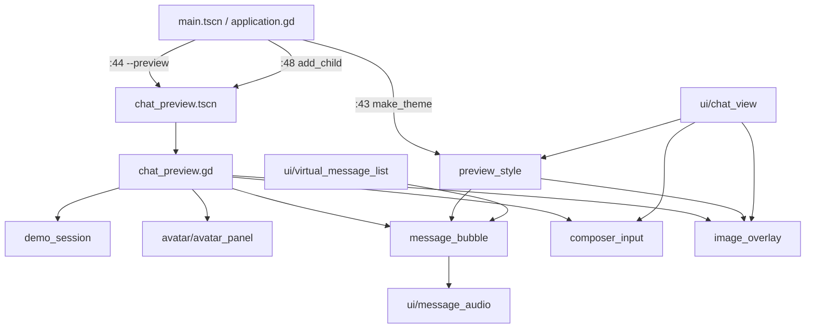
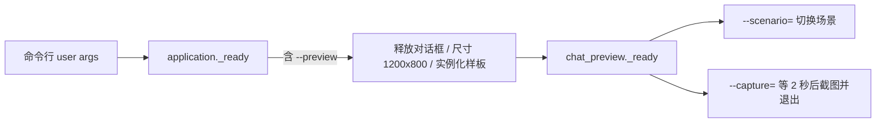
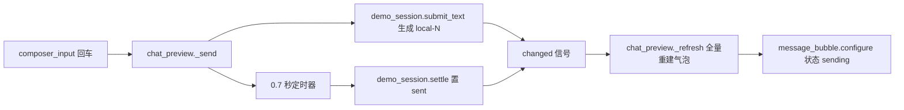

> **系列文档**：[总览](ARCHITECTURE.md) · [01 组装根](01-application.md) · [02 session](02-session.md) · [03 network](03-network.md) · [04 storage](04-storage.md) · [05 media](05-media.md) · [06 avatar](06-avatar.md) · [07 ui](07-ui.md) · **08 preview** · [09 构建与交付](09-build-and-release.md) · [10 测试与验证](10-testing.md)
> **基线**：分支 `feat/agentluo-0.1.1` @ `42b5b1c` · 撰写日期 2026-09-20 · 只读现状分析（as-built）；除本系列 `.md` 与 `export_presets.cfg` 的导出排除项外不改动任何文件
> **路径与行号口径**：无前缀路径相对 `client_godot/`，`client_godot/…` 相对仓库根；`file:line` 为撰写时工作树行号

# src/preview：离线样板与共享外观层

## 30 秒速览

- 这个目录只有 6 个文件、562 行，却被两种完全不同的东西共用：**离线样板**（`chat_preview` + `demo_session`）和**产品也在用的共享外观层**（`preview_style`、`message_bubble`、`composer_input`、`image_overlay`）。
- 产品界面的所有配色、字体、按钮样式都来自 `src/preview/preview_style.gd`——组装根在 `src/application.gd:43` 用它给整个应用设了主题。**改这个文件等于改产品外观**。
- `message_bubble.gd` 是产品消息列表的每一行（`src/ui/virtual_message_list.gd:7`），`composer_input.gd` 是产品输入框（`src/ui/chat_view.gd:6`），`image_overlay.gd` 是产品图片浮层（`src/ui/chat_view.gd:244`）。
- 先看这两个文件：`src/preview/preview_style.gd`（外观源头）和 `src/preview/message_bubble.gd`（产品复用面最大的控件）。
- `--preview` 走的是 `scenes/chat_preview.tscn`，完全不碰账户与网络；它只在 `src/application.gd:44` 起的那个分支里被实例化。

## 职责

- **共享外观层**（`preview_style.gd`，101 行）：四个语义色常量、`make_theme()` 全局主题装配、`box()` 圆角面板工厂、`label()` / `button()` / `primary()` / `avatar()` 控件工厂，以及两个内部绘制辅助（聚焦框、滑杆圆点）。
- **消息气泡**（`message_bubble.gd`，106 行）：一条消息的完整呈现——角色决定左右对齐与头像、系统消息走居中小字、气泡正文、状态脚注、可选的历史图片位与图片按钮、可选的语音播放条挂载点。
- **输入框**（`composer_input.gd`，17 行）：只做两件事——判断回车该不该当发送（要排除输入法合成态），以及判断 Ctrl+V 该不该当图片粘贴。
- **图片浮层**（`image_overlay.gd`，46 行）：占满父级的图片查看层，放大 / 缩小 / 关闭，`pending` 模式下多一个发送按钮与一行反馈文案。
- **离线样板会话**（`demo_session.gd`，43 行）：五个固定场景（日常聊天 / 空白 / 断网 / 加载失败 / 思考中）、七条固定消息、本地发送与结算，全部在内存里，不发任何请求。
- **离线样板界面**（`chat_preview.gd`，249 行）：左侧角色面板 + 右侧聊天列的完整离线界面，含场景切换、表情下拉、图片选择、模拟口型、`--capture=` 截图。

## 为什么这样切分

- **「样板」和「外观层」共处一个目录，但边界是清楚的**：只有 `chat_preview.gd` 与 `demo_session.gd` 不被产品路径引用；另外四个文件都被 `src/ui/` 或组装根引用。这条边界不是靠目录表达，而是靠引用关系表达，所以看目录名容易误判。
- **外观层从样板里长出来，而不是反过来**。`preview_style.gd` 的默认字体是 `Microsoft YaHei UI`（`src/preview/preview_style.gd:20`），主色是 `#66ccff`（`:2`）；这套值在 `PREVIEW.md` 里被当作产品外观契约写明。产品界面沿用它是刻意选择，代价是产品外观的源头位于一个以 `preview` 命名的目录。
- **气泡控件不自己做虚拟化**。`message_bubble.gd` 只管「一条消息长什么样」，行复用、像素索引、可见集全在 `src/ui/virtual_message_list.gd`。离线样板走的是另一条路：`chat_preview._refresh()` 每次把全部气泡拆掉重建（`src/preview/chat_preview.gd:163` 到 `:178`），因为它只有 7 条固定消息。
- **输入键位判断做成独立控件**。`composer_input.gd` 只 17 行，但它是「回车发送 vs 输入法确认」这条判断的唯一实现点，产品与样板共用同一套行为，因此这条逻辑不需要写两遍。
- **图片浮层的两种模式用一个布尔参数表达**：`pending = true` 是样板里的「待发送图片」（多一个发送按钮与 `feedback` 标签），`pending = false` 是产品的纯预览（`src/ui/chat_view.gd:244` 传 `false`）。产品当前没有发图路径，所以 `confirmed` 信号在产品侧无人连接。
- **样板会话是纯内存 `RefCounted`**，不是 `Node`：`demo_session.gd:1` 表明它只持有消息数组与一个 `changed` 信号，`chat_preview.gd:8` 直接 `Session.new()` 持有，不需要进场景树。

## 关键文件与符号

| 文件 | 行数 | 产品路径是否引用 | 职责 | 关键符号 |
| --- | --- | --- | --- | --- |
| `src/preview/chat_preview.gd` | 249 | 否（仅 `scenes/chat_preview.tscn:3`） | 离线样板界面 | `_ready()`（`src/preview/chat_preview.gd:24`）、`--preview` 场景读取（`scenes/chat_preview.tscn:3`）、`_build_character_header()`（`:67`）、表情下拉（`:74` 到 `:79`）、`_build_chat()`（`:81`）、场景下拉（`:96` 到 `:101`）、`_resize_split()`（`:142`）、`_change_scenario()`（`:146`）、`_refresh()`（`:155`）、`_send()`（`:197`）、`_pick_image()`（`:204`）、`_preview_image()`（`:215`）、`_open_image()`（`:221`）、`_toggle_play()`（`:241`）、`_process()` 模拟口型（`:247`） |
| `src/preview/message_bubble.gd` | 106 | **是**——`src/ui/virtual_message_list.gd:7`、`src/preview/chat_preview.gd:5` | 单条消息气泡 | `signal audio_action`（`src/preview/message_bubble.gd:3`）、`signal image_opened`（`:5`）、`signal image_action`（`:6`）、`configure()`（`:14`）、系统消息分支（`:17` 到 `:22`）、图片位（`:43` 到 `:54`）、`_resize_bubble()`（`:75`）、`update_message()`（`:78`）、状态脚注映射（`:82`）、`set_audio_state()`（`:87`）、`set_image_state()`（`:97`） |
| `src/preview/preview_style.gd` | 101 | **是**——13 处引用（见下） | 颜色常量 + 全局主题装配 + 控件工厂 | `ACCENT`（`src/preview/preview_style.gd:2`）、`INK`（`:3`）、`SURFACE`（`:4`）、`USER_BUBBLE`（`:5`）、`box()`（`:7`）、`make_theme()`（`:17`）、`_focus()`（`:58`）、`_dot()`（`:64`）、`primary()`（`:73`）、`avatar()`（`:76`）、`label()`（`:90`）、`button()`（`:97`） |
| `src/preview/image_overlay.gd` | 46 | **是**——`src/ui/chat_view.gd:244` | 图片查看 / 待发送浮层 | `signal confirmed`（`src/preview/image_overlay.gd:3`）、`feedback` 字段（`:7`）、`_init()`（`:9`）、缩放按钮（`:19` 到 `:20`）、发送按钮（`:34`）、`_resize_image()`（`:37`）、`_input()` Esc 关闭（`:43` 到 `:46`） |
| `src/preview/demo_session.gd` | 43 | 否（仅 `src/preview/chat_preview.gd:3` 与 `tests/test_demo_session.gd:2`） | 离线固定数据与模拟发送 | `signal changed`（`src/preview/demo_session.gd:2`）、`select_scenario()`（`:7`）、七条固定消息（`:13` 到 `:21`）、`get_messages()`（`:25`）、`submit_text()`（`:28`）、`settle()`（`:37`） |
| `src/preview/composer_input.gd` | 17 | **是**——`src/ui/chat_view.gd:6` | 回车发送与图片粘贴判定 | `signal send_requested`（`src/preview/composer_input.gd:2`）、`signal image_pasted`（`:3`）、`_gui_input()`（`:5`）、输入法合成态判断（`:9` 到 `:11`）、Ctrl+V 分支（`:15` 到 `:17`） |

**`preview_style.gd` 的全部引用点**（实测检索）：

| 引用方 | 行 |
| --- | --- |
| `src/application.gd` | `:43`（整个应用的全局主题） |
| `src/preview/chat_preview.gd` | `:2` |
| `src/preview/message_bubble.gd` | `:2` |
| `src/preview/image_overlay.gd` | `:2` |
| `src/ui/chat_view.gd` | `:5` |
| `src/ui/draft_window.gd` | `:2` |
| `src/ui/account_view.gd` | `:3` |
| `src/ui/dynamic_detail.gd` | `:2` |
| `src/ui/log_window.gd` | `:2` |
| `src/ui/message_audio.gd` | `:3` |
| `src/ui/unified_dropdown.gd` | `:4` |
| `tests/capture_dropdown_ui.gd` | `:12` |
| `tests/capture_voice_ui.gd` | `:26` |

**`message_bubble.gd`** 的引用点是 `src/ui/virtual_message_list.gd:7` 与 `src/preview/chat_preview.gd:5`；**`composer_input.gd`** 是 `src/ui/chat_view.gd:6` 与 `src/preview/chat_preview.gd:6`；**`image_overlay.gd`** 是 `src/ui/chat_view.gd:244` 与 `src/preview/chat_preview.gd:7`。

## 对外接口与信号

**`preview_style.gd`（全静态）**

- `box(color, radius = 12, padding = 12) -> StyleBoxFlat`（`:7` 到 `:15`）：四条内容边距统一取 `padding`，圆角统一取 `radius`。
- `make_theme() -> Theme`（`:17` 到 `:56`）：见下节清单。
- `primary(node: Button)`（`:73` 到 `:74`）：唯一动作是把 `theme_type_variation` 设为 `PrimaryButton`，而该变体在 `make_theme()` 里用 `set_type_variation` 注册（`:37`）。
- `avatar(path, pixels = 38) -> TextureRect`（`:76` 到 `:88`）：`load(path)` + 圆形遮罩着色器；着色器把透明像素染成淡蓝 `vec3(0.91,0.97,1.0)`（`:84`）。
- `label(text, size = 15, color = Color("344c59")) -> Label`（`:90` 到 `:95`）。
- `button(text, action) -> Button`（`:97` 到 `:101`）：建按钮并直接连 `pressed`。

**`make_theme()` 覆盖的控件类型**

| 分组 | 覆盖内容 |
| --- | --- |
| 全局 | 默认字体（`Microsoft YaHei UI` / `Microsoft YaHei`，`:20`）、默认字号 15（`:22`） |
| `Label` / `Button` / `OptionButton` / `LineEdit` / `TextEdit` / `RichTextLabel` / `PopupMenu` / `CheckBox` | `font_color = INK`（`:23` 到 `:24`） |
| `RichTextLabel` | `default_color = INK`（`:25`）；占位色分别给 `TextEdit`（`:26`）与 `LineEdit`（`:27`） |
| `Button` / `OptionButton` / `MenuButton` | 四个状态 stylebox + `focus`（`:28` 到 `:33`）、四个字体色 + `font_disabled_color`（`:34` 到 `:36`） |
| `PrimaryButton`（`Button` 的变体） | `normal` = ACCENT、`hover` = `#8ad8ff`、`pressed` = `#43b8f0`（`:37` 到 `:39`） |
| `TextEdit` / `LineEdit` | `normal` 白底、`focus` 聚焦框、`selection_color`、`caret_color`（`:40` 到 `:44`） |
| `PopupMenu` | `panel`、`hover`、`font_hover_color`、`v_separation = 12`（`:45` 到 `:48`） |
| `HSlider` | `slider` / `grabber_area` / `grabber_area_highlight` / `focus` 四个 stylebox（`:49` 到 `:52`）与三个圆点图标（`:53` 到 `:55`） |

`_focus()`（`:58` 到 `:62`）产出透明底 + 2px ACCENT 边框；`_dot(color)`（`:64` 到 `:71`）用 16x16 图像逐像素画半径为 6 的圆再包成 `ImageTexture`。

**`message_bubble.gd` 的四类入口与三个信号**

- `configure(message, image_texture = null)`（`:14` 到 `:73`）：**一次性构建**。`role == "system"` 时只加一行居中小字然后 `return`（`:17` 到 `:22`），此时 `_body` 保持 `null`。非系统消息按 `role == "user"` 决定 `alignment`（`:24`）、头像图（`:25`：用户 `user_icon.png`、角色 `tianyi_icon.png`）、气泡底色（`:32`：用户 `USER_BUBBLE`、角色白色）；用户消息的头像加在**右**侧（`:70`），角色消息加在**左**侧（`:29`）。
- `update_message(message)`（`:78` 到 `:85`）：**复用路径**，只更新正文文本与状态脚注。
- `set_audio_state(state)`（`:87` 到 `:95`）：`_body` 为空直接返回（`:88`）；首次且「可用或带错误码」时才 `preload("res://src/ui/message_audio.gd").new()` 挂到气泡里（`:90` 到 `:93`），之后每次转发给 `update_state`。
- `set_image_state(state)`（`:97` 到 `:106`）：`_history_picture` 为空直接返回（`:98`），即只有 `message.get("type") == "image"` 的消息才会响应（`:43`）。
- 信号：`audio_action(action)`（`:3`，由挂载的 `message_audio` 透传，`:93`）、`image_opened(texture)`（`:5`，点击已加载的图片时发，`:63` 到 `:65`）、`image_action(action)`（`:6`，取值 `preview` 或 `retry`，`:50` 到 `:53`）。
- 状态脚注文案（`:82`）：`waiting_history` → 等待历史同步…、`queued` → 等待发送…、`sent` → 已发送、`sending` → 发送中…、`failed` → 发送失败、`uncertain` → 无法确认送达，请勿重复发送；未知状态得到空串。`failed` 与 `uncertain` 用红色（`:85`）。

**`composer_input.gd`**

`send_requested`（`:2`）与 `image_pasted(image)`（`:3`）两个信号。`_gui_input`（`:5`）先丢弃非按键、非按下、长按重复的事件（`:6`）。回车路径：合成态初值取 `has_ime_text()`（`:9`），若引擎支持 IME 特性再或上「`DisplayServer.ime_get_text()` 非空」（`:10` 到 `:11`），**只有非 Shift 且非合成态**才吞掉事件并发 `send_requested`（`:12` 到 `:14`）；Shift+Enter 落空，交给 `TextEdit` 自己插入换行。粘贴路径：`KEY_V + ctrl_pressed + DisplayServer.clipboard_has_image()` 三者同时成立才发 `image_pasted`（`:15` 到 `:17`）。

**`image_overlay.gd`**

构造参数 `(texture, pending)`（`:9`）。`confirmed(texture)`（`:3`）只在 `pending` 模式下有按钮连接（`:34`）。工具栏三个按钮：`－` 缩放 0.8、`＋` 缩放 1.25、`取消`/`关闭` 直接 `queue_free`（`:19` 到 `:21`）。Esc 关闭并把事件标记为已处理（`:43` 到 `:46`）。`feedback` 字段（`:7`）只在 `pending` 模式存在，供调用方写失败原因。

**`demo_session.gd`**

`changed`（`:2`）、`select_scenario(name) -> bool`（`:7`，白名单见 `:8`）、`get_messages() -> Array[Dictionary]`（`:25`，返回深拷贝）、`submit_text(text) -> String`（`:28`，返回新消息 id 或空串）、`settle(id, success) -> bool`（`:37`）。

**场景文件**

| 场景 | 挂载脚本 | 角色 |
| --- | --- | --- |
| `scenes/main.tscn` | `src/application.gd`（`scenes/main.tscn:3`） | **产品入口**，由 `project.godot` 指定 |
| `scenes/chat_preview.tscn` | `src/preview/chat_preview.gd`（`scenes/chat_preview.tscn:3`） | 离线样板，仅 `--preview` 分支实例化（`src/application.gd:48`） |
| `scenes/avatar_preview.tscn` | `src/avatar/avatar_preview.gd`（`scenes/avatar_preview.tscn:2`） | 角色面板冒烟 / 截图（见 06 篇） |

三个场景都是 `Control` + 全屏锚点，没有预置子节点，全部界面在脚本 `_ready()` 里搭。

## 依赖与数据流

注意两条反向依赖：产品 `src/ui/*` 引用 `src/preview/*`（正常方向），而 `src/preview/message_bubble.gd:91` 又反过来引用 `src/ui/message_audio.gd`，所以 `src/ui` 与 `src/preview` 两个目录之间存在环。

**`--preview` 与 `--capture=` 的进入路径**

`src/application.gd:44` 判的是 `"--preview" in OS.get_cmdline_user_args()`——即必须写在 `--` 之后。命中后它先释放两个对话框（`:45` 到 `:46`，样板不需要草稿保护），再按 1200x800 / 最小 960x640 调整窗口（`:47`），最后 `add_child(load("res://scenes/chat_preview.tscn").instantiate())` 并 `return`（`:48` 到 `:49`），因此样板路径下**不会**创建日志、账户、聊天、模型、动态中的任何一个服务。`--capture=` 完全由样板自己处理（`src/preview/chat_preview.gd:60` 到 `:65`）：等 2 秒、等一次 `frame_post_draw`、`save_png`，成功退出码 0、失败 1。

**一条离线消息的往返**

`_send()`（`src/preview/chat_preview.gd:197` 到 `:202`）拿不到 id（空文本或离线场景）就直接返回；拿到则清空输入框并挂一个 0.7 秒定时器自动结算成功。`_refresh()`（`:155` 到 `:191`）带重入保护：`_refresh_pending` 期间的再次触发只置 `_refresh_again`（`:156` 到 `:158`），本轮结束后再补一次（`:189` 到 `:191`）。

## 状态与不变量

- **`make_theme()` 每次调用都新建一套对象**：`Theme`、`SystemFont`、每个 stylebox、HSV 圆点纹理都是新实例（`:18`、`:19`、`:29` 到 `:55`、`:65`）。全仓有 9 处 `make_theme()` 调用点：`src/application.gd:43`、`src/ui/draft_window.gd:8`、`src/ui/chat_view.gd:29`、`src/ui/account_view.gd:19`、`src/ui/log_window.gd:24`、`src/ui/unified_dropdown.gd:26`、`src/preview/chat_preview.gd:25`、`tests/capture_dropdown_ui.gd:12`、`tests/capture_voice_ui.gd:26`，彼此不共享实例。
- **`preview_style.label()` 的默认颜色与 `INK` 不是一个值**：`INK` 是 `#304553`（`:3`），`label()` 默认是 `#344c59`（`:90`）。因此不显式传色的 `Style.label(...)` 与主题默认的 `Label` 颜色并不一致。
- **`Style.avatar()` 不做缺图兜底**：`load(path)`（`:78`）返回 `null` 时 `TextureRect` 会变成空方块，且圆角着色器照常生效（透明区域显示淡蓝底）。`res://assets/ui/` 下的四张图（`tianyi_icon.png`、`user_icon.png`、`bg2.jpg`）是硬编码路径。
- **气泡宽度是父级宽度的 76% 且下限 140px**（`src/preview/message_bubble.gd:76`），并且它在 `resized` 时重算（`:72`）。因为 `_body.custom_minimum_size.x` 只在 `_resize_bubble` 里被赋值，所以 `configure` 末尾必须先调一次（`:73`）。
- **`configure()` 与 `update_message()` 的分工**：前者建节点，后者只改文本。`virtual_message_list` 对已在树上的行调 `update_message`（`src/ui/virtual_message_list.gd:144`），对新建行调 `configure`（`:138`），因此 `update_message` 必须能容忍 `_body` 已存在的一切字段。
- **状态脚注只给用户消息**：`_caption` 只在 `own` 为真时创建（`src/preview/message_bubble.gd:66` 到 `:69`），所以角色消息没有「已发送」这类脚注。
- **`set_audio_state` 是惰性挂载**：只有第一次遇到「可用或带错误码」的状态才创建播放条（`:90`），此后即使状态变回不可用也只更新不卸载（`:94` 到 `:95`）。播放条自身的可见性由 `update_state` 内的规则决定（见 07 篇）。
- **`set_image_state` 与图片位是绑定的**：图片位只在 `message.get("type") == "image"` 时创建（`:43` 到 `:54`），所以不带 `type` 的图片消息永远拿不到图片按钮。产品路径的状态取值是 `idle` / `loading` / `ready` / `error`（`:103` 到 `:104`）。
- **`demo_session` 的 id 单调递增且不随场景重置**：`_next_id` 只在 `submit_text` 里自增（`:31`），`select_scenario` 只清消息列表（`:11`）不改计数器，所以 id 序列跨场景连续——`tests/test_demo_session.gd:37` 断言的正是这条。
- **`demo_session` 的固定数据有七条**（`:13` 到 `:21`）：`fixture-1` 是 `system`（触发居中无气泡分支）、`fixture-2` / `fixture-4` 是 `assistant`、`fixture-3` / `fixture-5` 是 `user`、`fixture-6` 是 `sending`、`fixture-7` 是 `failed`；`fixture-5` 带 `image` 字段指向 `res://assets/ui/bg2.jpg`，因此离线样板会真的加载出一张图。七个状态取值覆盖了脚注映射表的四个分支。
- **`demo_session.get_messages()` 返回深拷贝**（`:26`），所以调用方改返回值不会影响内部状态（`tests/test_demo_session.gd:24`）。
- **`demo_session.submit_text()` 的两道闸门**（`:29`）：空白输入（`strip_edges()` 后为空）与 `disconnected` / `error` 两个场景都返回空串，且**不产生任何副作用**（`tests/test_demo_session.gd:13` 到 `:14`、`:34`）。
- **`demo_session.settle()` 只结算处于 `sending` 的消息**（`:39`），重复结算或结算陈旧 id 都返回 `false`（`tests/test_demo_session.gd:26`、`:38`）。
- **离线样板的发送状态全是模拟**，界面文案直接写明这一点（`src/preview/chat_preview.gd:180`）。
- **`chat_preview` 有独立的布局配置文件**：`user://preview_layout.cfg`（`:39`、`:46`），比例夹在 0.3 到 0.6（`:42`），与产品的 `user://window_layout.cfg` 无关。
- **`chat_preview` 有一个「布局就绪」闸门**：`_layout_ready`（`:20`）在 `_ready()` 里等两帧之后才置真（`:51` 到 `:52`），`_resize_split()` 在置真前不生效（`:143` 到 `:144`）；紧接着再等两帧并把滚动位置复位到 0（`:54` 到 `:56`）。
- **`_refresh()` 全量重建气泡**（`:163` 到 `:178`），并且重建前先记录「是否跟随末尾」与旧的滚动像素（`:160` 到 `:162`），重建后按需滚到底或恢复原位置（`:184` 到 `:188`）。`_images` 字典（`:16`）保存「本地提交的图片消息 id → 纹理」，重建时按 id 取回（`:175` 到 `:177`）。
- **`_open_image()` 让浮层浮在样板之上**（`:224` 到 `:231`）：加到自身、给全屏锚点后再收 60px 边距。`pending` 模式下的确认回调会提交一条 `[图片]` 消息（`:233`），提交失败时把原因写进 `overlay.feedback`（`:235`）。
- **模拟口型靠 `_process` 驱动**（`:247` 到 `:249`）：每帧写 `absf(sin(Time.get_ticks_msec() * 0.008)) * 0.8`，停止时写 `-1` 交还模型（`:245`）。这只是一条演示通路，真实口型数据来自 05 篇。
- **图片浮层的缩放范围是 0.3 到 4.0**（`src/preview/image_overlay.gd:38`），每次从原图尺寸重算，不做累乘，因此不会漂移；可用区域是父级尺寸减 60 与 130（`:40`），下限 100px。
- **`sending` / `failed` 这类状态是呈现层的输入**，消息的真实状态由各自的控制器决定（见 02 篇）。

## 验证入口

| 用例 | 编排行 | 覆盖点 |
| --- | --- | --- |
| `tests/test_demo_session.gd` | `scripts/check.ps1:8` | 场景白名单、空白输入拒绝、id 唯一且跨场景连续、深拷贝隔离、结算幂等与陈旧结算、断网场景拒绝发送、固定数据至少六条（`tests/test_demo_session.gd:12` 到 `:40`） |
| `tests/test_preview_input.gd` | `scripts/check.ps1:9` | 真起 `scenes/chat_preview.tscn`：合成器只有一个、回车提交并清空、提交内容出现在气泡里、Shift+Enter 插入换行、空白输入保留（`tests/test_preview_input.gd:23` 到 `:47`） |
| 离线样板整体 | `scripts/check.ps1:22` | `--quit-after 3 -- --preview`，验证样板能起得来并跑满 3 秒不崩 |
| `tests/capture_dropdown_ui.gd` | 不在 `check.ps1`（需真实 GPU，见 10 篇） | 给 `root` 赋 `make_theme()` 后对下拉控件截图（`tests/capture_dropdown_ui.gd:12`） |
| `tests/capture_voice_ui.gd` | 同上 | 给 split 赋 `make_theme()` 后对 `chat_view` 与其气泡截图（`tests/capture_voice_ui.gd:26`） |

`preview_style` 自身没有专门用例，它的回归由「用它的每个界面用例」隐式覆盖；`message_bubble` / `composer_input` / `image_overlay` 亦然——`tests/test_virtual_history.gd`（`scripts/check.ps1:19`）与 `tests/test_preview_input.gd` 是覆盖面最大的两条。

## 扩展点与已知坑

- **产品外观的源头在 `preview` 目录**。`src/application.gd:43` 用 `preview_style.make_theme()` 给整个应用设主题，所以这个「样板目录」的文件实际上是产品主题的唯一来源；改动它会同时影响产品与离线样板，且没有单独的测试会拦下外观回归。
- **`src/ui` 与 `src/preview` 之间存在目录级循环依赖**：产品方向是 `src/ui/*` 引用 `src/preview/*`（13 处），反向是 `src/preview/message_bubble.gd:91` 引用 `src/ui/message_audio.gd`。因此 `src/preview` 无法独立于 `src/ui` 装载。
- **`chat_preview` 与产品消息列表是两套实现**。产品走虚拟化（`src/ui/virtual_message_list.gd`），样板走每次全量重建（`src/preview/chat_preview.gd:163`）。在样板里看到的滚动与行高行为不代表产品行为，反之亦然。
- **`chat_preview._refresh()` 会加载真实图片资源**（`:177` 的 `load(message.image)`），所以离线样板对 `res://assets/ui/bg2.jpg` 是硬依赖；该文件缺失会让这条消息的图片位是空的 `TextureRect`。
- **`chat_preview` 的表情下拉写死了七个中文表情名**（`:75`），并用它做 `apply_expression` 的输入（`:79`）。这份名单与 06 篇描述的映射表是两份独立清单，改动其一时另一处不会自动跟随。
- **样板的「发送图片」会把图片存在内存字典里**（`:237` 的 `_images[id] = value`），随场景切换被清空（`:152`），不落盘。
- **`chat_preview` 的布局只有比例被持久化**，窗口尺寸不存；比例夹取下限 0.3 与产品动态窗口的 0.25 不同（`src/preview/chat_preview.gd:42` 对 `src/ui/dynamics_window.gd:35`）。
- **`composer_input` 的粘贴分支只认 Ctrl+V**（`src/preview/composer_input.gd:15`）：`KEY_V + ctrl_pressed`，未排除 Shift，也未处理 `Cmd`；`DisplayServer.clipboard_has_image()` 为假时不吞事件，交给 `TextEdit` 走纯文本粘贴。
- **`composer_input` 的合成态判断依赖平台**：`has_ime_text()` 与 `DisplayServer.ime_get_text()` 在 `FEATURE_IME` 不可用时只有前者生效（`:10`），因此非 IME 平台上的「中文候选未上屏时按回车」不会被拦截——推断：这会让某些输入法在回车确认候选时误触发发送。
- **`image_overlay` 的 `feedback` 是公开字段**（`src/preview/image_overlay.gd:7`）且只在 `pending` 模式下存在，调用方必须先判空再写（样板在 `src/preview/chat_preview.gd:235` 这么用）。
- **`image_overlay` 的 `confirmed` 在产品侧没有接收者**：`src/ui/chat_view.gd:244` 传的是 `pending = false`，该模式下不创建发送按钮（`:34`），信号永远不发。
- **`message_bubble` 的图片按钮文案由状态决定**（`:104`），其中 `CACHE_WRITE_FAILED` 会再追加「 · 未能缓存」（`:105` 到 `:106`）；这两个字符串与 05 篇、07 篇里同名错误码的表述必须一起改。
- **`message_bubble` 的 `image_opened` 与 `image_action("preview")` 是两条并行的预览通路**（`:52` 传字符串、`:65` 传纹理）。产品 `chat_view` 走的是后者（`src/ui/chat_view.gd:238` 到 `:246`），前者在 `chat_view` 里没有连接，只有样板连了它（`src/preview/chat_preview.gd:179`）。
- **`preview_style.make_theme()` 不覆盖 `Tree`、`SpinBox`、`TabBar`、`ScrollContainer` 的滚动条**等类型，这些控件会落到 Godot 默认主题上，与整体配色不一致。
- **`preview_style.box()` 只有四条内容边距**（`:11` 到 `:14`），不设置边框；需要边框的调用方得自己改返回的 `StyleBoxFlat`（`src/ui/unified_dropdown.gd:28` 到 `:31` 就是这么做的）。
- **`preview_style._dot()` 是逐像素循环**（`:67` 到 `:70`），每次 `make_theme()` 会执行三次（`:53` 到 `:55`）；9 处调用点意味着启动路径上会重复构建这些纹理。