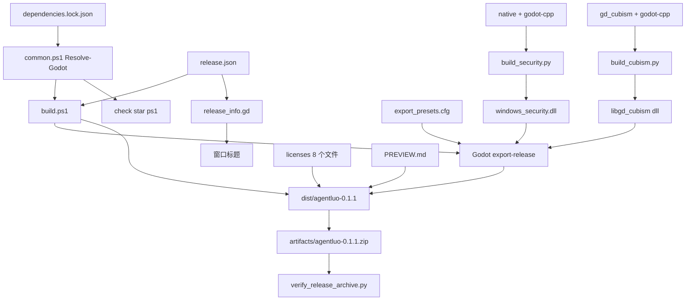
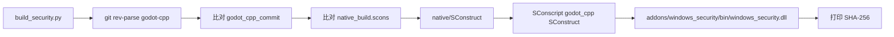

> **系列文档**：[总览](ARCHITECTURE.md) · [01 组装根](01-application.md) · [02 session](02-session.md) · [03 network](03-network.md) · [04 storage](04-storage.md) · [05 media](05-media.md) · [06 avatar](06-avatar.md) · [07 ui](07-ui.md) · [08 preview](08-preview.md) · **09 构建与交付** · [10 测试与验证](10-testing.md)
> **基线**：分支 `feat/agentluo-0.1.1` @ `42b5b1c` · 撰写日期 2026-09-20 · 只读现状分析（as-built）；除本系列 `.md` 与 `export_presets.cfg` 的导出排除项外不改动任何文件
> **路径与行号口径**：无前缀路径相对 `client_godot/`，`client_godot/…` 相对仓库根；`file:line` 为撰写时工作树行号

# 构建、版本化与交付

## 30 秒速览

- 版本号只有一个来源：`release.json` 的 `product` / `version` 两个字段；构建脚本与运行时窗口标题都读它。
- 改交付产物形态看 `scripts/build.ps1`（54 行）；改「什么算绿灯」看 `scripts/common.ps1` 的 `Invoke-GodotChecked`（判定口径在 `:54`）。
- 构建前的第一道闸门是引擎版本：`Resolve-Godot` 跑一次 `--version` 并与 `dependencies.lock.json` 的 `engine.version_output` **逐字**比对（`scripts/common.ps1:13`）。
- 两个原生扩展各有构建入口，都以 `dependencies.lock.json` 里的 git commit 为锚，版本不符直接抛错。
- 产物目录 `dist/` 与日志目录 `artifacts/` 都被 git 忽略（`.gitignore:2`、`:3`），仓库里不留构建产物。

## 职责

- **版本与产品元数据**：`release.json`（唯一版本源）、`src/release_info.gd`（运行时读取与标题拼接）。
- **引擎与依赖锁定**：`dependencies.lock.json`（引擎、导出模板、上游插件、Cubism SDK、原生构建工具的版本与哈希）、`scripts/common.ps1`（把锁定值变成实际校验）。
- **构建与打包**：`scripts/build.ps1`（import → 导出 → 导出件冒烟 → 拷附带文件 → 可选 ZIP 打包）。
- **导出配置**：`export_presets.cfg`（preset 名、包含 / 排除过滤器、架构、外置 PCK、输出路径）。
- **原生扩展构建**：`native/SConstruct`（编自有扩展）、`scripts/build_security.py`（自有扩展入口）、`scripts/build_cubism.py`（上游 Live2D 插件入口）。
- **检查编排入口**：`scripts/check.ps1` / `check_features.ps1` / `check_network.ps1` / `check_accounts.ps1`（把用例组织成可重复的一条命令；单个用例的判定口径归 10 篇）。
- **交付物校验**：`tests/verify_release_archive.py`（ZIP 逐条目 CRC 与字节比对）、`tests/verify_native_dynamics.py`（窗口原生属性）。

## 为什么这样切分

- **版本只有一处可写**。`release.json` 是单行 JSON，`build.ps1:5` 与 `src/release_info.gd:4` 都从它读。它在 `res://` 下，`include_filter` 里显式列了 `*.json`（`export_presets.cfg:9`），因此打包时会跟着进 PCK——导出件里读到的版本与构建时的版本是同一份。
- **校验逻辑集中在 `common.ps1` 而不是复制进每个脚本**。`Resolve-Godot` 与 `Invoke-GodotChecked` 被 `build.ps1`（`:3`、`:13`、`:14`、`:18`）与四个 `check*.ps1` 共用（各文件的第 3 行），脚本本身只描述「跑什么」与「日志叫什么名字」。
- **导出走 Godot 自己的 preset，而不是自己拼命令行**。preset 名 `Windows Desktop`（`export_presets.cfg:2`）在 `build.ps1:14` 被硬编码引用，改 preset 名必须同步改脚本。
- **原生扩展分两个入口，因为源码归属不同**：`native/` 是自有源码（`SConstruct` 直接编 `windows_security.cpp` 与 `pcm_stream_decoder.cpp`），`build_cubism.py` 编的是上游 `gd_cubism` 仓库（含它自带的 `godot-cpp`），产物只是被拷回 `addons/gd_cubism/bin/`。两者都锁到同一个 godot-cpp 提交（`dependencies.lock.json:21`），保证两份二进制用同一份头文件。
- **打包不用 `Compress-Archive`**。`build.ps1:23` 到 `:24` 的注释写明原因：`Compress-Archive` 可能发出非终止错误并漏掉被占用的 EXE。因此改用 `IO.Compression.ZipFile` 手工逐条目写、再逐条目比长度、最后用不覆盖的 `[IO.File]::Move` 落名。

## 关键文件与符号

| 文件 | 行数 | 职责 | 关键符号 |
| --- | --- | --- | --- |
| `scripts/common.ps1` | 58 | 引擎解析、版本锁定校验、受检执行与日志 | `$ProjectRoot`（`scripts/common.ps1:3`）、`Resolve-Godot()`（`:5`）、`GODOT_BIN` 回退（`:6`）、缺失报错（`:7` 到 `:9`）、版本比对（`:13` 到 `:15`）、`Invoke-GodotChecked()`（`:19`）、三个日志名（`:24` 到 `:26`）、120 秒超时（`:42` 到 `:45`）、合并日志（`:53`）、失败正则（`:54`） |
| `scripts/build.ps1` | 54 | 构建、导出、冒烟、附带文件、ZIP 打包 | `param`（`scripts/build.ps1:1`）、读版本（`:5`）、元数据校验（`:6`）、名称串（`:7`）、已存在即拒绝（`:9`）、目标目录（`:10` 到 `:11`）、可执行名（`:12`）、import（`:13`）、导出（`:14`）、产物检查（`:15` 到 `:17`）、导出件启动（`:18`）、拷贝三样（`:19` 到 `:21`）、打包块（`:22` 到 `:53`）、临时 zip 名（`:27`）、条目名（`:33` 到 `:34`）、条目数比对（`:40`）、逐条目长度比对（`:41` 到 `:45`）、原子落名（`:48`）、清理（`:49` 到 `:51`） |
| `scripts/check.ps1` | 22 | 22 步 headless 回归编排 | `param`（`scripts/check.ps1:1`）、引入 common（`:2`）、`Resolve-Godot`（`:3`）、import（`:4`）、3 秒启动（`:5`）、逐条 `res://tests/test_*.gd`（`:6` 到 `:21`）、离线样板（`:22`） |
| `scripts/check_features.ps1` | 14 | 三组「runner → 用例」映射 | 映射表（`scripts/check_features.ps1:4` 到 `:8`）、循环（`:9` 到 `:13`）、调用（`:11`）、失败即抛（`:12`） |
| `scripts/check_accounts.ps1` | 9 | 互操作 + 四个账户用例 | 互操作（`scripts/check_accounts.ps1:4`）、四个用例循环（`:6` 到 `:9`） |
| `scripts/check_network.ps1` | 10 | 队列 + 三组 WebSocket 用例 | 队列自测（`scripts/check_network.ps1:4`）、默认链路（`:5`）、真实聊天（`:7`）、语音聊天（`:9`） |
| `scripts/build_cubism.py` | 53 | 编译上游 gd_cubism 并把 DLL 拷回 | 读锁定（`scripts/build_cubism.py:21`）、双 commit 校验（`:23` 到 `:27`）、SCons 版本校验（`:29` 到 `:30`）、OEM 代码页兜底（`:31` 到 `:37`）、scons 参数（`:39`）、产物路径（`:46`）、拷贝与哈希（`:47` 到 `:49`） |
| `scripts/build_security.py` | 34 | 编译自有 WindowsSecurity 扩展 | godot-cpp 修订校验（`scripts/build_security.py:18` 到 `:20`）、SCons 版本（`:21` 到 `:23`）、OEM 兜底（`:24`）、工作目录（`:25`）、scons 参数（`:26`）、产物哈希（`:33` 到 `:34`） |
| `native/SConstruct` | 9 | 自有扩展的链接与宏 | `ARGUMENTS["godot_cpp"]`（`native/SConstruct:3`）、`SConscript`（`:4`）、`LIBS`（`:5`）、`CPPDEFINES`（`:6`）、`CXXFLAGS /utf-8`（`:7`）、`SharedLibrary` 源列表与输出（`:8`） |
| `export_presets.cfg` | 22 | 导出 preset | preset 名（`export_presets.cfg:2`）、`export_filter`（`:8`）、`include_filter`（`:9`）、`exclude_filter`（`:10`）、`export_path`（`:11`）、`embed_pck`（`:17`）、`architecture`（`:18`）、纹理格式（`:19` 到 `:20`） |
| `release.json` | 1 | 版本单一来源 | `product` / `version`（`release.json:1`） |
| `dependencies.lock.json` | 44 | 全量依赖锁 | `schema_version` / `feature_baseline`（`:2` 到 `:3`）、`engine.version_output`（`:6`）、`export_templates`（`:12`）、`gd_cubism`（`:17`）、`godot_cpp_commit`（`:21`）、`cubism_sdk`（`:24`）、`windows_security`（`:29`）、`native_build`（`:36`） |
| `src/release_info.gd` | 8 | 运行时读取版本 | `get_info()`（`src/release_info.gd:3`）、读 `res://release.json`（`:4`）、`title()`（`:6` 到 `:8`） |
| `addons/windows_security/windows_security.gdextension` | 7 | 自有扩展清单 | `entry_symbol`（`addons/windows_security/windows_security.gdextension:2`）、`compatibility_minimum`（`:3`）、`reloadable`（`:4`）、库路径（`:7`） |
| `addons/gd_cubism/gd_cubism.gdextension` | 6 | 上游插件清单 | `entry_symbol`（`addons/gd_cubism/gd_cubism.gdextension:2`）、`compatibility_minimum`（`:3`）、库路径（`:6`） |

## 对外接口与信号

本模块没有信号或运行时对象接口；它的对外面是命令行与文件契约。

**入口与参数**

| 入口 | 参数 | 作用 |
| --- | --- | --- |
| `scripts/build.ps1` | `-Godot <exe>`、`-OutputDirectory <dir>`（默认 `<项目根>/dist`）、`-Package` | 构建导出件；带 `-Package` 时另出 ZIP |
| `scripts/check.ps1` | `-Godot <exe>` | 22 步 headless 回归 |
| `scripts/check_features.ps1` | `-Godot <exe>`、`-Python <exe>`（必填） | 三组 features / dynamics / history 用例 |
| `scripts/check_network.ps1` | 同上 | 队列 + 三组 WebSocket 用例 |
| `scripts/check_accounts.ps1` | 同上 | 互操作 + 四个账户用例 |
| `scripts/build_security.py` | `--godot-cpp <dir>` | 编自有扩展 |
| `scripts/build_cubism.py` | `--source <dir>`、`--jobs N`（默认 8）、`--console-encoding {utf-8,gbk}` | 编上游插件 |

`-Godot` 可以留空，此时 `common.ps1:6` 回退到环境变量 `GODOT_BIN`；两者都没有、或路径不是文件时抛 `Supply -Godot <Godot 4.7.1 executable> or set GODOT_BIN.`（`:7` 到 `:9`）。

**`Resolve-Godot` 的三件事**（`scripts/common.ps1:5` 到 `:17`）

1. 从参数或 `GODOT_BIN` 取路径，`Resolve-Path` 归一化（`:6`、`:10`）。
2. 跑 `<exe> --version`（`:11`）。
3. 与 `dependencies.lock.json` 的 `engine.version_output` 逐字比较（`:12` 到 `:13`）。不匹配或退出码非 0 时抛 `Expected 4.7.1.stable.official.a13da4feb; got: <实际输出>`（`:14`）。

**`Invoke-GodotChecked` 的失败判定**（`scripts/common.ps1:19` 到 `:57`）

四类判定任一命中即抛错（`:54` 到 `:55`）：

1. 退出码非 0（`:46`、`:54`）。
2. 合并文本匹配 `SCRIPT ERROR:`。
3. 合并文本匹配 `Parse Error:`。
4. 合并文本匹配行首的 `ERROR:` 或 `USER ERROR:`（`(?m)` 多行模式）。

另外，进程 120 秒内不退出就 `Kill` 后抛 `Godot <名字> timed out after 120 seconds.`（`:42` 到 `:45`）。

日志落盘四个文件，都在 `<项目根>/artifacts/`：`<名字>.engine.log`（`:24`，先清空再由 Godot 通过 `--log-file` 自己写，`:27` 到 `:28`）、`<名字>.stdout.log`（`:25`）、`<名字>.stderr.log`（`:26`），以及三者拼接后的 `<名字>.log`（`:50` 到 `:53`）。进程以 `UseShellExecute=$false`、`CreateNoWindow=$true`、`WindowStyle='Hidden'` 启动（`:32` 到 `:34`），因为 GUI 子系统的导出件不提供编辑器控制台那样的 stdout（`:22` 到 `:23` 的注释）。

**`build.ps1` 的完整流程**

| 行 | 动作 |
| --- | --- |
| `:5` | 读 `release.json` |
| `:6` | `product -cne 'agentluo'`（**大小写敏感**比较）或 `version` 不匹配 `^\d+\.\d+\.\d+$` 就抛 `Invalid release metadata.` |
| `:7` | 名称串写死为 `agentluo-<version>`——**不取 `$release.product`** |
| `:8` | ZIP 落在 `<项目根>/artifacts/<名称串>.zip` |
| `:9` | 带 `-Package` 且该 ZIP 已存在即抛 `Delivery already exists: <path>` |
| `:10` 到 `:11` | 目标目录 `<OutputDirectory>/<名称串>`，不存在则建 |
| `:12` | 可执行文件名固定 `agentluo.exe` |
| `:13` | `--headless --editor --import` |
| `:14` | `--headless --export-release "Windows Desktop" <目标目录>/agentluo.exe` |
| `:15` 到 `:17` | `agentluo.exe` 与 `agentluo.pck` 任一不存在即抛 `Export did not produce agentluo.exe and agentluo.pck.` |
| `:18` | 直接运行导出件 `--headless --quit-after 3` |
| `:19` 到 `:21` | 拷 `licenses/`（递归）、`PREVIEW.md`、`release.json` |
| `:22` 到 `:53` | 可选的 ZIP 打包块 |

**ZIP 打包的防残缺流程**（`scripts/build.ps1:22` 到 `:53`）

1. 临时文件名为 `<项目根>/artifacts/<名称串>.<32 位 GUID>.building.zip`（`:27`），不复用固定名。
2. 先列出目标目录下全部文件（`:29`，`-File -Recurse`），据此写条目；条目名前缀是 `<名称串>/`，分隔符统一成 `/`（`:33` 到 `:34`）。
3. 用 `ZipArchiveMode::Create` 写完后立刻用 `OpenRead` 重开（`:37`），比对条目数与文件数一致（`:39` 到 `:40`），再逐条目比长度（`:41` 到 `:45`），任一不符即抛。
4. 全部通过才 `[IO.File]::Move` 到最终 `packagePath`（`:48`）——`Move` 不覆盖已有文件，因此也防另一个并发构建抢名。
5. `finally` 里删除临时文件（`:49` 到 `:51`），失败时不留半成品。

**`export_presets.cfg` 的每个键**

| 行 | 键 | 值 / 含义 |
| --- | --- | --- |
| `:2` | `name` | `Windows Desktop`——被 `build.ps1:14` 以字符串引用 |
| `:3` | `platform` | `Windows Desktop` |
| `:4` | `runnable` | `true`（编辑器里可直接运行） |
| `:8` | `export_filter` | `all_resources`（导出全部资源） |
| `:9` | `include_filter` | `*.json,*.moc3`——版本文件与 Live2D 模型必须显式纳入 |
| `:10` | `exclude_filter` | `scripts/*,tests/*,architecture/*,artifacts/*,dist/*,native/*` |
| `:11` | `export_path` | `dist/AgentLuo.exe`（编辑器手动导出时的路径） |
| `:14` 到 `:15` | `custom_template/*` | 空——使用本机安装的导出模板 |
| `:16` | `debug/export_console_wrapper` | `0`（不生成控制台包装） |
| `:17` | `binary_format/embed_pck` | `false`——**PCK 外置**，与同目录的 exe / DLL / release.json 配套分发 |
| `:18` | `binary_format/architecture` | `x86_64` |
| `:19` 到 `:20` | `texture_format/bptc`、`s3tc` | 均 `true` |
| `:21` 到 `:22` | `codesign/enable`、`application/modify_resources` | 均 `false` |

**本次唯一的配置改动**

`exclude_filter`（`export_presets.cfg:10`）增加了 `architecture/*`。它的性质是**防御性声明**，不是在修复实际泄漏：实测当前工作树导出 PCK 后，包内 `architecture/` 条目与任意 `.md` 条目均为 0 条（`rg -a "architecture/"` 与 `.md` 文件名检索都无命中），且本次复测的 PCK SHA-256 为 `1D76FBF57B50545E7748053349B9AA82E441282C4B5129198CE7FC74C319C62A`、与改动前的记录值一致——说明这条排除项在当前导出配置下不改变产物字节。原因是 `export_filter="all_resources"` 本身就不收录 Markdown 这类非资源文件。

**两个原生扩展的构建与加载**

| 项 | `WindowsSecurity`（自有） | `gd_cubism`（上游） |
| --- | --- | --- |
| 构建入口 | `scripts/build_security.py` | `scripts/build_cubism.py` |
| 源码根 | `native/`（`native/SConstruct:3` 读 `ARGUMENTS["godot_cpp"]`） | `--source` 指向的上游仓库 |
| 链接库 | `bcrypt`、`crypt32`（`native/SConstruct:5`） | 上游自带 |
| 编译宏 | `WIN32_LEAN_AND_MEAN`、`NOMINMAX`（`native/SConstruct:6`）；`/utf-8`（`:7`） | 上游自带 |
| 源文件 | `windows_security.cpp`、`pcm_stream_decoder.cpp`（`native/SConstruct:8`） | 上游 |
| 输出 | `addons/windows_security/bin/windows_security.dll` | 拷到 `addons/gd_cubism/bin/libgd_cubism.windows.release.x86_64.dll`（`scripts/build_cubism.py:46` 到 `:48`） |
| 版本锚 | godot-cpp `HEAD` == `gd_cubism.godot_cpp_commit`（`scripts/build_security.py:18` 到 `:20`） | 仓库 `HEAD` == `gd_cubism.commit`，且 `godot-cpp/HEAD` == `godot_cpp_commit`（`scripts/build_cubism.py:23` 到 `:27`） |
| 工具链锚 | SCons == `native_build.scons`（`scripts/build_security.py:21` 到 `:23`） | SCons == `native_build.scons`（`scripts/build_cubism.py:29` 到 `:30`） |
| 清单入口符号 | `windows_security_init`（`addons/windows_security/windows_security.gdextension:2`） | `gd_cubism_library_init`（`addons/gd_cubism/gd_cubism.gdextension:2`） |
| 库路径写法 | `res://addons/windows_security/bin/windows_security.dll`（`:7`） | `bin/libgd_cubism.windows.release.x86_64.dll`（`:6`，**相对清单所在目录**，无 `res://` 前缀） |
| 最低兼容 | `4.3`（`:3`） | `4.3`（`:3`） |

**`dependencies.lock.json` 的顶层字段**

| 字段 | 行 | 内容 |
| --- | --- | --- |
| `schema_version` | `:2` | `1` |
| `feature_baseline` | `:3` | `79ae2c0`——功能基线提交 |
| `engine` | `:4` 到 `:11` | `4.7.1` / `version_output` `4.7.1.stable.official.a13da4feb` / `edition` `standard` / `architecture` `x86_64` / `executable_sha256` / 下载 `url` |
| `export_templates` | `:12` 到 `:16` | `4.7.1.stable` 与 `.tpz` 的 `sha256` / `url` |
| `gd_cubism` | `:17` 到 `:23` | `0.9.1` / `commit` `60e9c61…` / `godot_cpp_commit` `fbbf9ec…` / `binary_sha256` / `url` |
| `cubism_sdk` | `:24` 到 `:28` | `5-r.1` / `url` / `sha256` |
| `windows_security` | `:29` 到 `:35` | `binary_sha256` / `source` `native/windows_security.cpp` / `audio_sources` = `native/pcm_stream_decoder.h`、`native/pcm_stream_decoder.cpp` / `system_libraries` = `bcrypt`、`crypt32` / `msvc_version` `14.44.35207` |
| `native_build` | `:36` 到 `:43` | `python` `3.11.9`（含 `python_url`、`python_sha256`）/ `scons` `4.7.0` / `msvc_family` `14.3` / `configuration` `platform=windows arch=x86_64 target=template_release` |

注意 `windows_security.audio_sources`（`:32`）把 `pcm_stream_decoder.*` 登记为**自有扩展的音源解码部分**——它和凭据加密编进同一个 DLL，而不是独立扩展。

**`src/release_info.gd` 与窗口标题**

`get_info()`（`src/release_info.gd:3` 到 `:4`）用 `FileAccess.get_file_as_string("res://release.json")` + `JSON.parse_string` 直接读，**没有解析失败兜底**；`title()`（`:6` 到 `:8`）拼成 `"<product> <version>"`（即 `agentluo 0.1.1`）。两个消费点：主窗口标题 `src/application.gd:42`，日志窗口标题 `src/ui/log_window.gd:17`（拼成 `客户端日志 · agentluo 0.1.1`）。

## 依赖与数据流

**原生扩展的编译链路**

`native/SConstruct:3` 从 `ARGUMENTS["godot_cpp"]` 取路径，因此这个文件**不能被单独调用**：不传 `godot_cpp=` 会在第一行就失败。`scripts/build_security.py:25` 先 `os.chdir(project / "native")`，再把 `godot_cpp=<绝对路径>` 拼进 `sys.argv` 调 SCons（`:26` 到 `:29`）。

## 状态与不变量

- **`release.json` 是唯一可写版本源**：`build.ps1:5` 与 `release_info.gd:4` 都只读它，没有第二处硬编码版本号。但**产品名有两处不同口径**：`build.ps1:6` 校验它等于 `agentluo`，而 `:7` 直接写死 `agentluo-` 前缀（不取 `$release.product`）——即使通过了校验，名称串也不会跟随 `product` 字段变化。
- **`version` 必须形如 `x.y.z`**（`build.ps1:6` 的正则 `^\d+\.\d+\.\d+$`），带预发布后缀会直接失败。
- **文件名口径分两套**：脚本产物是**小写** `agentluo.exe` / `agentluo.pck`（`build.ps1:12`、`:15`），编辑器手动导出是**驼峰** `dist/AgentLuo.exe`（`export_presets.cfg:11`），PCK 名由 exe 名派生为 `AgentLuo.pck`。两者不是同一个东西。
- **版本比较是逐字比较**：锁的是完整输出 `4.7.1.stable.official.a13da4feb`（含构建哈希），因此任何其它 4.7.1 构建都会被拒。
- **`Invoke-GodotChecked` 的判定包含「日志里不能出现行首 ERROR:」**（`:54`）：这是合并日志的全文匹配，因此任何被记为 `ERROR:` 的良性输出都会让该步失败。
- **`Set-StrictMode -Version Latest` 与 `$ErrorActionPreference = 'Stop'`**（`common.ps1:1` 到 `:2`）对引入它的会话生效，五个脚本都因此对未定义变量与静默错误零容忍。
- **打包的三个数字必须自洽**：条目数 == 目标目录文件数（`:40`）、每个条目长度 == 对应文件长度（`:44`）、最终 ZIP 名 == `<名称串>.zip`（`:8`、`:48`）。`tests/verify_release_archive.py:14` 到 `:17` 在更晚的环节用 CRC 与逐条目 SHA-256 再验一遍。
- **ZIP 条目名带 `<名称串>/` 前缀**（`build.ps1:34`），因此解压后一定多出一层目录；`tests/verify_release_archive.py:7` 用同一规则算期望前缀。
- **`-Package` 不覆盖已有 ZIP**（`:9` 抛错，`:48` 用不覆盖的 `Move`）。要重出同名交付包必须先手工删掉旧产物。
- **`export_presets.cfg` 只有一个 preset**：`[preset.0]`（`:1`），没有 debug preset；`custom_template/debug` 与 `release` 都是空串（`:14` 到 `:15`），所以依赖本机已安装 4.7.1 导出模板。
- **外置 PCK 是交付形态的一部分**：`binary_format/embed_pck=false`（`:17`），`build.ps1:15` 把 `agentluo.pck` 的存在当作构建成功的必要条件，`PREVIEW.md` 也要求用户保留同目录的 PCK 与 DLL。
- **`dist/` 里混着两类来源不同的产物**。脚本产物在 `dist/agentluo-0.1.0/` 与 `dist/agentluo-0.1.1/`（各含 `agentluo.exe`、`agentluo.pck`、两个 DLL、`PREVIEW.md`、`release.json`、`licenses/`）；`dist/` 根下另有一组编辑器手动导出的产物（`AgentLuo.exe` 109,212,160 字节、`AgentLuo.pck` 5,161,700 字节、`libgd_cubism.windows.release.x86_64.dll` 885,248 字节、`windows_security.dll` 332,288 字节、`PREVIEW.md`、`licenses/`）。实测 `dist/AgentLuo.pck`（5,161,700 字节）小于 `dist/agentluo-0.1.1/agentluo.pck`（5,276,256 字节），也小于本次从当前工作树导出的 PCK（同样 5,276,256 字节）——推断：根下那组手动导出产出于更早的源码状态，与 `agentluo-0.1.1/` 不同源。
- **`dist/` 与 `artifacts/` 都不进版本库**（`.gitignore:2` 到 `:3`），`native/*.obj`、`native/*.os`、`native/.sconsign*`、`native/godot-cpp/` 同样被排除（`:5` 到 `:8`），`addons/windows_security/bin/*.lib *.exp` 也是（`:9` 到 `:10`）；但 `addons/*/bin/*.dll` 是**入库**的（`windows_security.dll` 332,288 字节、`libgd_cubism.windows.release.x86_64.dll` 885,248 字节）。
- **仓库根 `.gitattributes` 规定 `*.ps1` 用 CRLF**（`.gitattributes:20`），而 `*.py`（`:6`）、`*.gd`（`:7`）、`*.json`（`:12`）、`*.md`（`:15`）统一 LF；二进制扩展名一律不做换行转换（`:23` 到 `:38`，含 `*.exe`、`*.dll`、`*.pck`）。
- **两个 `.gdextension` 的库路径写法不一致**：`windows_security.gdextension:7` 用 `res://` 绝对形式，`gd_cubism.gdextension:6` 用相对清单目录的形式。两者都能解析，但风格不统一。
- **`addons/windows_security/windows_security.gdextension:4` 的 `reloadable = false`**，而 `gd_cubism.gdextension` 没有这个键——推断：自有扩展默认不可热重载，改完必须重启编辑器。
- **`native/` 下有 SCons 残留**：`pcm_stream_decoder.windows.template_release.x86_64.obj`、`windows_security.windows.template_release.x86_64.obj`、`.sconsign.dblite`、`.gdignore`。前三者被 `.gitignore` 覆盖（`:5` 到 `:7`），`.gdignore` 用来阻止 Godot 扫描这个目录。
- **`native/godot-cpp/` 是未入库目录**：本次读取被文件系统拒绝（`Access denied`），`.gitignore:8` 明确排除它。构建自有扩展前必须先把它准备好，否则 `build_security.py:18` 的 `git rev-parse` 会失败。

## 验证入口

| 检查 | 位置 | 覆盖 |
| --- | --- | --- |
| 引擎版本闸门 | `scripts/common.ps1:13` | 任何 `check*.ps1` / `build.ps1` 的第一步 |
| 22 步 headless 回归 | `scripts/check.ps1:4` 到 `:22`（19 次 `Invoke-GodotChecked`） | 见下表 |
| features / dynamics / history | `scripts/check_features.ps1:4` 到 `:13` | 9 个用例，三组 runner |
| 网络与实时链路 | `scripts/check_network.ps1:4` 到 `:10` | 队列自测 + WebSocket + 真实聊天 + 语音聊天 |
| 账户与原生互操作 | `scripts/check_accounts.ps1:4` 到 `:9` | `run_security_interop.py` + 四个账户用例 |
| 交付包逐条目校验 | `tests/verify_release_archive.py:12` 到 `:20` | CRC、版本名、条目集合、逐条目 SHA-256，末行打印 PASS |
| 原生窗口属性校验 | `tests/verify_native_dynamics.py:8` 到 `:14` | 主窗口确实最小化、动态窗口仍可见且未最小化、无 owner、非 TOOLWINDOW |

`scripts/check.ps1` 的 19 次调用依次是：`import`（`:4`）、3 秒启动（`:5`，标签 `startup`）、`avatar-contract`（`:6`）、`framing-contract`（`:7`）、`preview-contract`（`:8`）、`preview-input`（`:9`）、`windows-security`（`:10`）、`pcm-decoder`（`:11`）、`reply-audio`（`:12`）、`audio-lifecycle`（`:13`）、`audio-cache`（`:14`）、`reliable-outbox`（`:15`）、`client-log`（`:16`）、`log-window`（`:17`）、`unified-dropdown`（`:18`）、`virtual-history`（`:19`）、`reading-position`（`:20`）、`voice-replay`（`:21`）、`offline-preview`（`:22`，`--quit-after 3 -- --preview`）。

**交付包的两个独立校验点**

- `tests/verify_release_archive.py`（24 行）接收 `archive` 与 `source` 两个路径参数：校验 ZIP 名等于 `<product>-<version>.zip`（`:8`）、期望条目集合等于 `source` 递归出的全部文件加前缀（`:9`、`:15`）、`agentluo.exe` 与 `agentluo.pck` 必须存在（`:10`）、`.dll` 恰好 2 个（`:11`）、`testzip()` 校验 CRC（`:13`）、逐条目 SHA-256 与源文件字节比对（`:16` 到 `:17`），最后打印含字节数、条目数、ZIP 哈希与两个 DLL 哈希的 JSON（`:18` 到 `:20`）。
- `tests/verify_native_dynamics.py`（14 行）用 `ctypes` 调 `user32`，从命令行取两个 HWND：断言两者不同且非零（`:9`）、主窗口确实处于最小化（`:10`，`IsIconic`）、动态窗口可见且未最小化（`:11`）、`GetWindow(hwnd, GW_OWNER=4)` 为空即无 owner（`:12`）、扩展样式里没有 `WS_EX_TOOLWINDOW`（`0x80`，`:13`）。这是**只在 Windows 上可跑**的校验，用来证明动态窗口能独立出现在任务栏。

## 扩展点与已知坑

- **`Resolve-Godot` 的报错文案写死了 4.7.1**（`scripts/common.ps1:8`），但实际比较用的是锁定文件里的 `version_output`。升级引擎时这两处必须一起改，否则报错信息会误导。
- **`Invoke-GodotChecked` 的失败正则会把良性 `ERROR:` 当失败**（`:54`）：被测代码自己打印一行以 `ERROR:` 开头的文本就会让整步失败，且异常消息是三份日志全文拼接（`:55`），刷屏很长。
- **120 秒超时对 `--import` 与首次导出可能偏紧**（`:42`）：超时后进程被 `Kill`，日志仍落盘但只到被杀为止。
- **`build.ps1` 不清理目标目录**：`:11` 只做 `New-Item -Force`，因此上一轮留在 `dist/<名称串>/` 里的多余文件会被一起打进 ZIP，并可能让 `verify_release_archive.py:15` 的条目集合比对失败。
- **`build.ps1:7` 的名称串不跟随 `product`**：改 `release.json` 的 `product` 只会让 `:6` 的校验失败，不会改变产物名。
- **`build.ps1` 只有 `--export-release`，没有 debug 导出**：想产出带控制台包装的调试版必须手工在编辑器里导出（`export_presets.cfg:16` 当前也是 `0`）。
- **`exclude_filter` 的每一项都是通配前缀**（`export_presets.cfg:10`）：`scripts/*` 只排除该目录下一层，若 `scripts/` 下出现子目录，其内容不会自动被排除。
- **`architecture/*` 这一项在当前导出配置下不改变产物**：`export_filter="all_resources"` 本就不收录 `.md`，本次改动前后导出的 PCK 字节一致（SHA-256 `1D76FBF5…C62A`）。它是防御性声明——若将来把 `export_filter` 改成 `all_files` 或往 `include_filter` 里加 `*.md`，这条排除项才会开始起作用。
- **`include_filter` 是白名单式的补充**（`:9`）：只有 `*.json` 与 `*.moc3` 被显式纳入。新增非标准扩展名的资源必须同步加进这一行，否则不会进 PCK；`.json` 被纳入正是为了让 `res://release.json` 在导出件里可读。
- **`export_path` 与脚本产物名不一致**（`:11` 对 `build.ps1:12`）是双口径遗留；两者都在 `dist/` 下，容易误取。按 `PREVIEW.md` 的口径，用户拿到的是**小写** `agentluo.exe`。
- **`src/release_info.gd` 无解析失败兜底**（`:4`）：`release.json` 缺失或非法时 `get_info()` 返回 `null`，随后 `title()` 在 `:8` 上索引 `null` 会报错。因为该文件在 `include_filter` 内且随 PCK 分发，正常情况下不会发生。
- **`native/SConstruct` 依赖命令行参数**（`:3`）：直接在 `native/` 里跑 SCons 而不传 `godot_cpp=` 会立即失败；`scripts/build_security.py:26` 是唯一正确调用方式。
- **`build_cubism.py` 的产物路径写死上游 demo 目录**（`:46`）：上游若调整 `demo/addons/` 布局，脚本会在这里失败，且失败发生在编译成功之后——SCons 已经跑完，只是拷不到文件。
- **两个构建脚本都改了 `encodings.oem.oem_decode`**（`scripts/build_cubism.py:36` 到 `:37`、`scripts/build_security.py:24`），这是对全局模块打补丁；两边注释都说明它只在本次进程内生效（`scripts/build_cubism.py:31` 到 `:33`），但同一进程内再跑别的依赖 OEM 代码页的逻辑会受影响。
- **`build_cubism.py` 的 `-j` 可配置（默认 8），`build_security.py` 的 `-j8` 写死**（`scripts/build_cubism.py:39` 对 `:26`），两者不一致。
- **`tests/verify_native_dynamics.py` 只断言窗口属性、不断言内容**（`:10` 到 `:13`）：它需要调用方先把两个 HWND 传进来，本身不起进程、不截图。
- **`tests/verify_release_archive.py` 要求 `source` 目录恰好等于 ZIP 内容**（`:9`、`:15`）：源目录里多出任何文件（例如手工放进去的日志）都会让条目集合比对失败。
- **窗口标题的版本来自 PCK 内的 `release.json`**（`release_info.gd:4`），不是编译进二进制的常量。