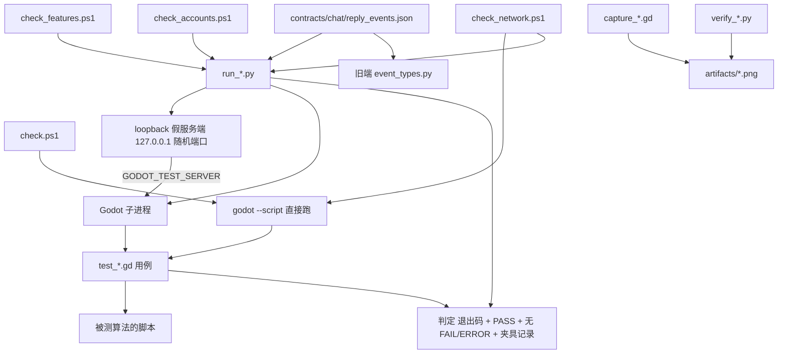
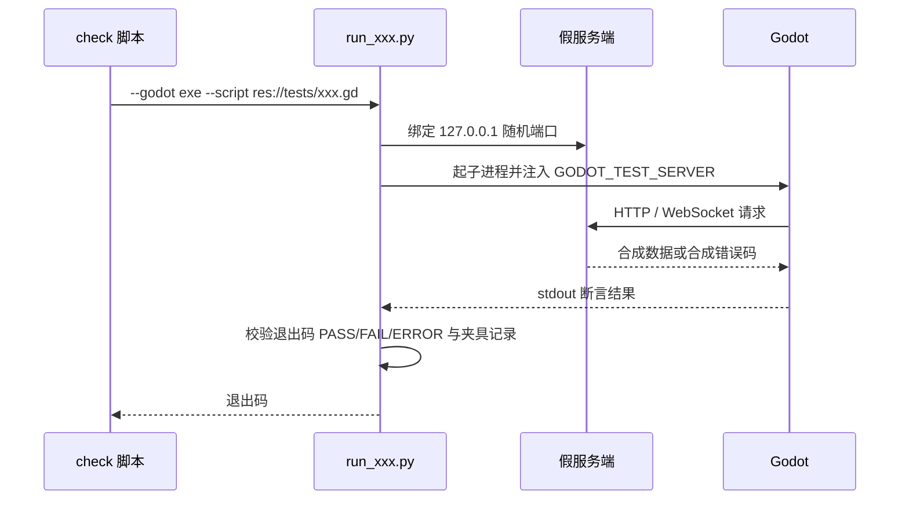

> **系列文档**：[总览](ARCHITECTURE.md) · [01 组装根](01-application.md) · [02 session](02-session.md) · [03 network](03-network.md) · [04 storage](04-storage.md) · [05 media](05-media.md) · [06 avatar](06-avatar.md) · [07 ui](07-ui.md) · [08 preview](08-preview.md) · [09 构建与交付](09-build-and-release.md) · **10 测试与验证**
> **基线**：分支 `feat/agentluo-0.1.1` @ `42b5b1c` · 撰写日期 2026-09-20 · 只读现状分析（as-built）；除本系列 `.md` 与 `export_presets.cfg` 的导出排除项外不改动任何文件
> **路径与行号口径**：无前缀路径相对 `client_godot/`，`client_godot/…` 相对仓库根；`file:line` 为撰写时工作树行号

# 测试与验证体系

> 本文保留42b5b1c时的历史快照。2026-09-21后的现行入口与合并映射见[测试入口](../tests/README.md)，下文旧脚本名及数量不作为当前执行清单。

## 30 秒速览

- `tests/` 提供四类东西：**合约与行为回归**（32 个 `test_*.gd`）、**GPU 截图核验**（4 个 `capture_*.gd`）、**loopback fixture 与互操作驱动器**（6 个 `run_*.py`）、**独立交付校验**（2 个 `verify_*.py`）。
- 日常回归只需要一条命令：`scripts/check.ps1 -Godot <exe>`（22 行，19 步 headless）；另外三份 `check*.ps1` 分主题把 Python fixture 挂上去。
- 所有本地服务只绑 `127.0.0.1` 的随机端口，通过环境变量 `GODOT_TEST_SERVER` 注入给 Godot 进程——**没有一条用例会连公共服务或收费供应商**。
- 判定不止看退出码：两个 runner 还要求 stdout 里出现 `: PASS`，并禁止出现 `FAIL:` 与 `ERROR:`（`tests/run_dynamics_tests.py:61`、`tests/run_feature_tests.py:90`）。
- 先看这两个文件：`scripts/check.ps1`（默认回归面）与 `tests/run_websocket_tests.py`（最复杂的一份 fixture，含 wire 契约）。

## 职责

- **GDScript 合约与行为回归**（32 个 `test_*.gd`）：每个用例是 `extends SceneTree` 的独立脚本，直接 `preload` 被测算法的脚本，用断言数组收集失败，最后以退出码表达结果。
- **loopback 服务端夹具**（6 个 `run_*.py`）：起一个只监听回环地址的假服务端，用 `GODOT_TEST_SERVER` 把它注入给 Godot 进程，再对 Godot 的 stdout 与自己的协议校验记录做二次判定。
- **互操作验证**（`tests/run_security_interop.py`）：把服务端 `account.py` 的三个加解密函数**抽出来单独执行**，验证自有原生扩展产出的密文能被既有服务端解密。
- **GPU 截图核验**（4 个 `capture_*.gd`）：需要真实窗口与 GPU，输出 PNG 到 `artifacts/`，同时断言原生窗口属性（`tests/capture_dynamics_ui.gd:58` 调 `verify_native_dynamics.py`）。
- **交付物校验**（2 个 `verify_*.py`）：ZIP 逐条目字节比对与原生窗口属性断言（语义见 09 篇）。
- **夹具支撑**（`tests/support/audio_samples.gd`，21 行）：按公式合成一段 440 Hz 的单声道 16 位 WAV（`tests/support/audio_samples.gd:3` 到 `:21`），给音频用例提供可重复的输入。

## 为什么这样切分

- **GDScript 用例走 `SceneTree` 而不是测试框架**。每个 `test_*.gd` 的第一行都是 `extends SceneTree`，用 `--script res://tests/xxx.gd` 直接跑。这样零依赖、零插件，代价是断言、夹具、挑选用例全部要自己写。
- **两种模板变体并存**。凡是要 `await` 的用例都在 `_initialize()` 里延迟一帧再跑（24 个用 `_run.call_deferred()`，例如 `tests/test_dropdown.gd:8`；4 个用 `call_deferred("run")`，例如 `tests/test_preview_input.gd:10`；`tests/test_avatar_driver.gd:9` 用 `call_deferred("_run")`）。剩下 8 个用例全程同步，直接在 `_initialize()` 里跑完——它们是 `test_audio_cache`、`test_avatar_framing`、`test_client_log`、`test_demo_session`、`test_pcm_decoder`、`test_reading_position`、`test_reliable_outbox`、`test_windows_security`。这就是为什么这两个模板能共存：**是否需要 `await` 决定了用哪一种**。
- **服务端一律假造，只有回环**。`run_*.py` 全部在 `('127.0.0.1', 0)` 上监听让内核分配端口，再把实际端口拼进 `GODOT_TEST_SERVER` 传给子进程；Godot 侧只读这一个环境变量（33 处引用点，见 `tests/test_account_api.gd:21`、`tests/test_websocket_transport.gd:29` 等）。这让「回归需要联网」这个前提彻底消失。
- **runner 做两遍判定，因为退出码不足以证明用例真的跑完**。`run_dynamics_tests.py:61` 与 `run_feature_tests.py:90` 同时要求：退出码为 0、stdout 含 `: PASS`、stdout 不含 `FAIL:`、stdout + stderr 不含 `ERROR:`，并且夹具自己的协议校验记录为空。这样「脚本被加载但断言一个都没跑」也会被判失败。
- **互操作复用服务端函数而不是复制一份算法**。`run_security_interop.py` 用 `ast.parse` 抽出 `server/src/system/user_interface/account.py` 里的三个函数，再 `exec` 到自定义命名空间（`:20` 到 `:27`）。这样验证的是「服务端真的能解开」，而不是「两端各写一份实现后自证自洽」。
- **动态夹具用合成数据覆盖界面分支**。`run_dynamics_tests.py:10` 造出的正文是七行（含换行），首条 `allow_comment=False`（`i != 1` 为假），`comment_count=22`，`visibility='private'`。这三项分别触发「多行正文截断」「不可评论提示与禁用发送」「评论分页上限 20 < 22」三条界面分支。
- **截图与断言拆开**。`capture_*.gd` 既要产出人看的 PNG，也要做机器可判的检查（窗口数量、原生句柄属性、内容缩放下的分区比例），因此它们既 `check()` 又 `save_png`。

## 关键文件与符号

| 文件 | 行数 | 职责 | 关键符号 |
| --- | --- | --- | --- |
| `tests/run_websocket_tests.py` | 169 | WebSocket loopback 夹具 + 旧端解析器互验 | 合成 PCM（`:25` 到 `:26`）、`run()`（`:30`）、加载 wire 契约（`:35`）、加载旧端解析器（`:37` 到 `:40`）、逐事件互验（`:41` 起）、绑定回环端口（`:142`）、`subprocess.run` + 环境注入（`:147` 到 `:150`）、判定（`:152` 到 `:156`）、`--gpu` 参数（`:167`） |
| `tests/run_account_tests.py` | 102 | 账户 HTTP loopback 夹具 | 复用 `server_crypto`（`:10`）、`run()`（`:15`）、字段集合白名单（`:53` 到 `:54`）、解密比对（`:58` 到 `:59`）、账号分支（`:70` 到 `:77`）、绑端口（`:79`）、环境注入（`:83`）、判定（`:87`）、`--gpu`（`:100`） |
| `tests/run_history_tests.py` | 90 | 历史分页 + 图片缓存夹具（asyncio / aiohttp） | 业务消息前置检查（`:59`）、`web.Application`（`:63` 到 `:66`）、`TCPSite('127.0.0.1', 0)`（`:69`）、动态端口（`:71`）、`asyncio.create_subprocess_exec`（`:73`）、40 秒超时（`:74` 到 `:76`）、判定（`:79`）、边界断言（`:81` 到 `:85`） |
| `tests/run_dynamics_tests.py` | 65 | 动态与评论夹具 | 合成动态（`:10`）、合成评论（`:12`）、Bearer 校验（`:22`）、分页 limit 校验（`:30`、`:37`）、写令牌校验（`:49`）、绑端口（`:56`）、环境注入含 `GODOT_TEST_PYTHON`（`:59`）、判定（`:61`） |
| `tests/run_feature_tests.py` | 95 | 相处模式 / 模型配置与委托夹具 | 供应商非流式校验（`:62`）、私密字段不外泄（`:65`）、偏好合并校验（`:81` 到 `:83`）、绑端口（`:86`）、判定（`:90`） |
| `tests/run_security_interop.py` | 56 | 原生扩展与服务端解密互验 | 服务端源码路径（`:20`）、`ast.parse`（`:21`）、函数名集合（`:22` 到 `:24`）、命名空间（`:25` 到 `:26`）、`exec`（`:27`）、口令样本（`:34`）、fixture 落盘（`:36` 到 `:37`）、调 Godot（`:38` 到 `:40`）、读回密文（`:44`）、逐条解密比对（`:46` 到 `:47`）、OAEP 随机性（`:48`）、PASS（`:49`） |
| `tests/verify_release_archive.py` | 24 | 交付 ZIP 逐条目校验 | 见 09 篇 |
| `tests/verify_native_dynamics.py` | 14 | 原生窗口属性校验 | 见 09 篇 |
| `tests/capture_release_ui.gd` | 59 | 发布界面截图 | headless 自退 2（`tests/capture_release_ui.gd:6` 到 `:8`）、起真实 application（`:13` 到 `:15`）、菜单三项截图（`:21` 到 `:29`）、动态窗口与内容缩放 125% / 150%（`:37` 到 `:41`）、清理（`:44` 到 `:51`）、`capture()`（`:55` 到 `:59`） |
| `tests/capture_voice_ui.gd` | 88 | 语音与角色截图 | headless 或缺夹具即退 1（`tests/capture_voice_ui.gd:14` 到 `:18`）、起真实 `chat_session`（`:37`）、尺寸与缩放（`:19` 到 `:22`、`:48` 到 `:59`） |
| `tests/capture_dynamics_ui.gd` | 70 | 动态窗口截图 + 原生句柄校验 | 起 `dynamics_controller`（`:10` 到 `:13`）、分区比例断言（`:21`）、调 `verify_native_dynamics.py`（`:58`）、`capture()`（`:67`） |
| `tests/capture_dropdown_ui.gd` | 64 | 下拉控件截图 | 给 `root` 赋主题（`:12`）、缩放因子循环（`:48` 到 `:49`） |
| `tests/support/audio_samples.gd` | 21 | 合成 WAV 夹具 | `tone()`（`:3` 到 `:21`） |

## 对外接口与信号

### 三种运行方式

| 方式 | 形态 | 适用面 |
| --- | --- | --- |
| 直接跑单个 GDScript | `<godot> --headless --path client_godot --script res://tests/xxx.gd` | 纯脚本级用例（无网络、无第三方依赖） |
| Python runner 驱动 | `<python> tests/run_xxx.py --godot <exe> --script res://tests/xxx.gd [--gpu]` | 需要假服务端或需要额外协议校验的用例 |
| PowerShell 编排 | `scripts/check.ps1` / `check_features.ps1` / `check_network.ps1` / `check_accounts.ps1` | 日常回归与分主题回归 |

第三种方式内部就是前两种的批量组合：`check.ps1` 全部用第一种（唯一例外是最后一步带 `--`，把 `--preview` 传给应用），另外三份全部用第二种。`scripts/check_network.ps1:4` 先用第一种跑一遍队列用例，再用第二种跑三组 WebSocket 用例。

### 退出码与判定口径

- **GDScript 用例**：末尾统一 `quit(0 if failures.is_empty() else 1)`（例如 `tests/test_dropdown.gd:47`、`tests/test_preview_input.gd:52`）；`tests/test_demo_session.gd:42`、`tests/test_avatar_framing.gd`、`tests/test_log_window.gd:77` 等同形。中途发现前置条件不成立时提前 `quit(1)`（例如 `tests/test_dropdown.gd:12`、`tests/test_dynamics_detail.gd:19`）。
- **`check.ps1` 的每一步**都过 `Invoke-GodotChecked`，判定为「退出码 0 且合并日志里不出现 `SCRIPT ERROR:` / `Parse Error:` / 行首 `ERROR:` / `USER ERROR:`」，并有 120 秒超时（`scripts/common.ps1:42`、`:54`）。
- **Python runner**：`run_dynamics_tests.py:61` 与 `run_feature_tests.py:90` 要求 `: PASS` 出现、`FAIL:` 与 `ERROR:` 不出现、退出码为 0、夹具记录为空；`run_account_tests.py:87`、`run_websocket_tests.py:152`、`run_history_tests.py:79` 只查退出码、`ERROR:` 与夹具记录（**不**要求 `: PASS`）。因此用例是否打印 PASS 行只在两个 runner 下是硬要求。

### 环境变量契约

| 变量 | 生产者 | 消费者 | 含义 |
| --- | --- | --- | --- |
| `GODOT_TEST_SERVER` | 全部 5 个服务类 runner（`run_dynamics_tests.py:59`、`run_feature_tests.py:88`、`run_history_tests.py:73`、`run_account_tests.py:83`、`run_websocket_tests.py:149`） | 33 处 Godot 侧读取点 | 假服务端根地址，形如 `http://127.0.0.1:<随机端口>` |
| `GODOT_TEST_PYTHON` | 仅 `run_dynamics_tests.py:59`（`sys.executable`） | `tests/capture_dynamics_ui.gd:58` | 让 Godot 进程能再用同一个解释器调 `verify_native_dynamics.py` |
| `GODOT_BIN` | 操作者环境 | `scripts/common.ps1:6` | `-Godot` 的替代来源 |

Godot 侧读取点覆盖了账户、聊天、历史、动态、模型、偏好六条链路；`capture_voice_ui.gd:14` 还把「`GODOT_TEST_SERVER` 为空」当作拒绝启动的条件之一。

### 三个 `check*.ps1` 的分工

- `scripts/check_features.ps1` 只有一张三组映射表（`:4` 到 `:8`）与一个双层循环（`:9` 到 `:13`）：`run_history_tests.py` → `test_history_sync.gd` + `test_history_media.gd`；`run_feature_tests.py` → `test_preferences.gd` + `test_application_drafts.gd` + `test_model_settings.gd` + `test_model_execution.gd`；`run_dynamics_tests.py` → `test_dynamics.gd` + `test_dynamics_window.gd` + `test_dynamics_detail.gd`。合计 9 个用例。
- `scripts/check_accounts.ps1` 先跑互操作（`:4` 到 `:5`），再对四个账户用例循环（`:6` 到 `:9`）：`test_account_api.gd`、`test_account_session.gd`、`test_account_view.gd`、`test_application_window.gd`。
- `scripts/check_network.ps1` 三次调用 `run_websocket_tests.py`：默认（`:5`）、`test_live_chat.gd`（`:7`）、`test_voice_chat.gd`（`:9`）；外加先用第一种方式直跑一次 `test_reliable_outbox.gd`（`:4`）。

### `contracts/chat/reply_events.json` 的消费方

这份样本位于**仓库根**的 `contracts/chat/`（不在 `client_godot/` 内），1 426 字节、9 条事件，覆盖 `agent_state_changed` 的 `thinking` / `waiting` 两端，以及 `agent_message` 的分片、空文本、`display_in_chat=false` + `is_ephemeral=true`、`audio_error` + `error_code`、无 `error_code` 的音频错误、临时可见消息等分支。

- **旧端解析器**：`tests/run_websocket_tests.py:35` 读入后，从 `client/src/network/event_types.py` 动态加载旧 Python 客户端的 `parse_server_message`（`:37` 到 `:40`）逐条解析（`:41` 起），断言每条都能得到非空 `event_type`。
- **新端收包链路**：同一个 runner 把这份序列当作假服务端的回复脚本喂给真实 Godot WebSocket 链路（`test_live_chat.gd` / `test_voice_chat.gd`），因此「同一条 wire 数据同时被新端与旧端解析」是被实际执行的，而不是文档承诺。

## 依赖与数据流

**一次带夹具的用例执行**

## 状态与不变量

- **没有用例连公共服务**：全部假服务端都绑 `127.0.0.1` 且端口为 0（由内核分配）——`run_dynamics_tests.py:56`、`run_feature_tests.py:86`、`run_account_tests.py:79`、`run_websocket_tests.py:142`、`run_history_tests.py:69`。端口随后通过 `GODOT_TEST_SERVER` 注入，不用固定端口，因此并行跑不会撞车。
- **夹具会主动校验客户端协议**，不只回放数据：`run_dynamics_tests.py:22` 校验 `Authorization: Bearer fixture-token`、`:30` 校验分页 `limit=10`、`:37` 校验评论 `limit=20`、`:49` 校验写令牌；`run_feature_tests.py:61` 校验供应商令牌、`:62` 校验 `stream=False`（非流式）。这些错误都进入 `errors` 列表，最终参与判定。
- **`run_websocket_tests.py` 用 8 MB 的帧上限**（`:142` 的 `max_size=8 * 1024 * 1024`），与产品侧单包上限同量级。
- **`run_websocket_tests.py` 有两条跨语言硬断言**（`:154` 到 `:156`）：丢包重试恰好产生 2 条稳定 ID（首次与重试），认证被拒的连接恰好重连 1 次。
- **`run_history_tests.py` 断言的是具体分页数字**（`:81`）：正常场景请求过的游标序列必须等于 `[-1, 70, 20]`；跳过后只能有 `[-1]`（`:82`），即「跳过后不得再导入历史」。图片侧断言同一张图在同一账号下只下载一次、且不同账号各自下载一次（`:84` 到 `:85`）——这直接验证缓存与账号隔离。
- **`run_history_tests.py` 会主动拦截业务提前发送**：`user_text` 到达时若该用户还没打开过 first history boundary 就记错（`:59`），对应产品的「首批历史完成前发送要排队」。
- **`run_feature_tests.py` 的偏好合并断言是逐字段的**（`:81` 到 `:83`）：`unknown` 必须是服务器的新值、`speaking_style` 必须保留服务器值、`relationship` 必须是被清空的旧值、`personality_traits` 必须是合并后的四项，且 legacy 字段 `#sym:personality_text` 必须同步。
- **`run_security_interop.py` 只抽三个函数**（`:22` 到 `:24`），并断言抽出来的名字集合完全等于期望集合——服务端改名会让这条断言直接失败，而不是静默抽到 0 个函数。
- **互操作的口令样本覆盖四类边界**（`:34`）：ASCII、含 emoji 的中文、190 字符长串，以及同一个输入重复两次；最后两条用来断言 OAEP 随机化（`:48`）——同样的明文必须产出不同密文。
- **`run_account_tests.py` 的字段白名单是精确相等**（`:53` 到 `:54`、`:56` 用 `set(fields) == allowed[operation]`）：多一个或少一个字段都会让协议校验失败；`reset_account` 走的是 `new_password` / `new_username` 字段名。
- **Godot 侧判定与夹具侧判定是两套独立的事实**：Godot 的断言结果表现为退出码与 `FAIL:` 行，夹具的协议校验表现为 `errors` 列表；runner 把两者与 `: PASS` 一起判定，任一不满足即抛错。
- **`Invoke-GodotChecked` 的日志四件套**（`scripts/common.ps1:24` 到 `:26`、`:53`）对每一步都以标签命名，标签与用例一一对应（`scripts/check.ps1` 的第二参数），因此失败时可以从 `artifacts/<标签>.log` 直接定位。
- **8 个同步用例不可能测异步行为**：`test_audio_cache`、`test_avatar_framing`、`test_client_log`、`test_demo_session`、`test_pcm_decoder`、`test_reading_position`、`test_reliable_outbox`、`test_windows_security` 都在 `_initialize()` 里一次性跑完，没有事件循环推进，因此它们只覆盖纯函数与可同步观察的状态。
- **`test_reliable_outbox.gd` 被覆盖两次**：`scripts/check.ps1:15`（无夹具）与 `scripts/check_network.ps1:4`（同样无夹具、仍是直跑），因此它实际只被测一遍，只是出现在两份编排里。
- **动态夹具的三项形态各触发一条界面分支**：七行正文（`run_dynamics_tests.py:10`）验证列表行截断；首条 `allow_comment=False`（同行的 `i != 1`）验证「此动态不可评论」提示与发送按钮禁用；`comment_count=22` 与评论分页 `limit=20` 验证「加载更多评论」出现。
- **`capture_*` 用的是真实 application 与真实会话**：`capture_release_ui.gd:13` 直接 `load("res://src/application.gd").new(...)` 并挂到 root，`capture_voice_ui.gd:6` 引 `chat_view`，`capture_dynamics_ui.gd:15` 起真窗口。它不是把控件孤立地画出来，而是让整条装配路径参与。

## 验证入口

### 四个编排脚本的覆盖面

| 编排 | 位置 | 用例数 | 特点 |
| --- | --- | --- | --- |
| `scripts/check.ps1` | `:4` 到 `:22` | 19 步（import、启动、16 个用例、离线样板） | 唯一不需要 Python 的完整回归；日志标签逐条命名 |
| `scripts/check_features.ps1` | `:4` 到 `:13` | 9 个用例（3 组 runner） | 需要 `-Python` 与 `aiohttp` |
| `scripts/check_network.ps1` | `:4` 到 `:10` | 4 个用例（其中队列为直跑） | 需要 `-Python` 与 `websockets` |
| `scripts/check_accounts.ps1` | `:4` 到 `:9` | 互操作 + 4 个用例 | 需要 `-Python` 与 `cryptography`、`fastapi` |

`scripts/check.ps1` 的 19 次调用与标签：`import`（`:4`）、`startup`（`:5`，3 秒启动）、`avatar-contract`（`:6`）、`framing-contract`（`:7`）、`preview-contract`（`:8`）、`preview-input`（`:9`）、`windows-security`（`:10`）、`pcm-decoder`（`:11`）、`reply-audio`（`:12`）、`audio-lifecycle`（`:13`）、`audio-cache`（`:14`）、`reliable-outbox`（`:15`）、`client-log`（`:16`）、`log-window`（`:17`）、`unified-dropdown`（`:18`）、`virtual-history`（`:19`）、`reading-position`（`:20`）、`voice-replay`（`:21`）、`offline-preview`（`:22`，`--quit-after 3 -- --preview`）。

### 32 个用例与模块的对应

| 用例 | 行数 | 编排 | 覆盖的模块 |
| --- | --- | --- | --- |
| `test_account_api.gd` | 66 | `check_accounts.ps1:6` | `src/network/account_api.gd` + `json_request.gd` |
| `test_account_session.gd` | 74 | 同上 | `src/session/account_session.gd` + `storage/credential_store.gd` |
| `test_account_view.gd` | 82 | 同上 | `src/ui/account_view.gd` |
| `test_application_drafts.gd` | 85 | `check_features.ps1:6` | `src/application.gd` 的窗口草稿保护 |
| `test_application_window.gd` | 124 | `check_accounts.ps1:6` | `src/application.gd` 的窗口尺寸切换 |
| `test_audio_cache.gd` | 89 | `check.ps1:14` | `src/storage/audio_cache.gd` |
| `test_audio_lifecycle.gd` | 79 | `check.ps1:13` | 音频接收与播放的生命周期 |
| `test_avatar_driver.gd` | 54 | `check.ps1:6` | `src/avatar/avatar_driver.gd` |
| `test_avatar_framing.gd` | 44 | `check.ps1:7` | `src/avatar/avatar_framing.gd` |
| `test_client_log.gd` | 66 | `check.ps1:16` | `src/storage/client_log.gd` |
| `test_demo_session.gd` | 42 | `check.ps1:8` | `src/preview/demo_session.gd` |
| `test_dropdown.gd` | 47 | `check.ps1:18` | `src/ui/unified_dropdown.gd` |
| `test_dynamics.gd` | 75 | `check_features.ps1:7` | `src/session/dynamics_controller.gd` |
| `test_dynamics_detail.gd` | 92 | 同上 | `src/ui/dynamic_detail.gd`（经 `dynamics_window`） |
| `test_dynamics_window.gd` | 63 | 同上 | `src/ui/dynamics_window.gd` + `publish_window.gd` |
| `test_history_media.gd` | 96 | `check_features.ps1:5` | `src/storage/history_images.gd` + `network/history_api.gd` |
| `test_history_sync.gd` | 81 | 同上 | `src/session/history_sync.gd` |
| `test_live_chat.gd` | 104 | `check_network.ps1:7` | `src/session/chat_session.gd` + `chat_view.gd` |
| `test_log_window.gd` | 77 | `check.ps1:17` | `src/ui/log_window.gd` + `storage/client_log.gd` |
| `test_model_execution.gd` | 99 | `check_features.ps1:6` | `src/session/model_executor.gd` |
| `test_model_settings.gd` | 80 | 同上 | `src/session/model_settings.gd` + `ui/model_window.gd` |
| `test_pcm_decoder.gd` | 134 | `check.ps1:11` | 原生 PCM 解码（`native/pcm_stream_decoder.*`） |
| `test_preferences.gd` | 62 | `check_features.ps1:6` | `src/session/preferences_controller.gd` + `ui/preferences_window.gd` |
| `test_preview_input.gd` | 52 | `check.ps1:9` | `scenes/chat_preview.tscn` + `preview/composer_input.gd` |
| `test_reading_position.gd` | 53 | `check.ps1:20` | `src/storage/reading_position.gd` |
| `test_reliable_outbox.gd` | 120 | `check.ps1:15`、`check_network.ps1:4` | `src/network/reliable_outbox.gd` |
| `test_reply_audio.gd` | 99 | `check.ps1:12` | `src/media/reply_audio.gd` |
| `test_virtual_history.gd` | 54 | `check.ps1:19` | `src/ui/virtual_message_list.gd` |
| `test_voice_chat.gd` | 145 | `check_network.ps1:9` | `src/media/reply_audio.gd` + `session/chat_session.gd` |
| `test_voice_replay.gd` | 141 | `check.ps1:21` | `src/media/cache_replay.gd`（经 `reply_audio`） |
| `test_websocket_transport.gd` | 77 | `check_network.ps1:5` | `src/network/websocket_transport.gd` |
| `test_windows_security.gd` | 48 | `check.ps1:10` + `run_security_interop.py:38` | 原生 `WindowsSecurity` 扩展 |

**32 个用例全部被某个 `check*.ps1` 覆盖**，没有孤儿用例。4 个 `capture_*.gd` 与 2 个 `verify_*.py` **不在任何编排内**，需手工按 `README.md` 里的命令跑（见下）。

### 没有被用例直接引用的源文件

按 `res://src/**/*.gd` 逐个检索用例里的 `preload` / `load`，有 12 个文件从未被用例直接引用：`src/release_info.gd`、`src/avatar/avatar_preview.gd`、`src/media/cache_replay.gd`、`src/preview/chat_preview.gd`、`src/preview/composer_input.gd`、`src/preview/image_overlay.gd`、`src/preview/message_bubble.gd`、`src/storage/engine_log_sink.gd`、`src/ui/draft_window.gd`、`src/ui/dynamic_detail.gd`、`src/ui/message_audio.gd`、`src/ui/publish_window.gd`。

其中多数是被间接走到的：`test_preview_input.gd:24` 加载 `scenes/chat_preview.tscn` 于是 `chat_preview.gd` 与 `composer_input.gd` 一起进场；`chat_view.gd`（被 3 个用例引用）会带出 `image_overlay.gd`；`virtual_message_list.gd` 带出 `message_bubble.gd` 与 `message_audio.gd`；`dynamics_window.gd` 带出 `detail`、`publish_window.gd` 与 `draft_window.gd`；`application.gd` 带出 `release_info.gd` 与 `engine_log_sink.gd`；`reply_audio.gd` 带出 `cache_replay.gd`。**真正的空白只有 `src/avatar/avatar_preview.gd`**——它只服务 `scenes/avatar_preview.tscn` 与截图，没有任何用例加载它。

### 手工命令（来自 `README.md`）

- 音频类用例需要真实音频驱动：`README.md:69` 给 `test_reply_audio.gd` 加了 `--audio-driver WASAPI`，`:78` 同样给了 `test_voice_replay.gd`。
- 原生窗口验证：`README.md:74` 给 `run_account_tests.py --script res://tests/test_application_window.gd --gpu`；`:78` 给 `run_websocket_tests.py --script res://tests/capture_voice_ui.gd --gpu`；`:84` 给 `run_feature_tests.py --script res://tests/capture_release_ui.gd --gpu`；`:88` 给 `run_dynamics_tests.py --gpu --script res://tests/capture_dynamics_ui.gd`。
- `README.md:88` 还给出下拉截图的最简形式：直接 `--script res://tests/capture_dropdown_ui.gd`。

### 生成物

- **`tests/*.gd.uid`**（36 个）是 Godot 4 为脚本资源生成的 UID 映射，由编辑器 / `--import` 自动维护，**不应手改**；它们与 `.godot/` 里的缓存配套，删除后会重新生成。
- **`tests/__pycache__/`** 是 Python runner 被导入时的字节码缓存（`run_account_tests.py:10` 直接 `from run_security_interop import server_crypto` 就会产生），不是源码。
- **`artifacts/`** 收日志与截图，被 `.gitignore:3` 排除（见 09 篇）。

### 未验证范围

- **真实 GPU 与真机 DPI / IME**：`capture_*.gd` 只在内容缩放层面验证（`capture_release_ui.gd:37` 到 `:41` 手工设 125% / 150% 与 `content_scale_factor`），`README.md:78` 明确写「内容缩放检查不能替代操作系统 DPI 切换与跨显示器验收」。
- **与真实公共服务的联调**：所有夹具只监听回环，`README.md:84` 写明「无公共服务写入或收费供应商」。
- **真实听感与长期性能**：合成 PCM 只验证解码与波形链路，不验证主观听感。
- **`tests/requirements-*.txt` 锁定的 Python 版本面**：`requirements-auth.txt` 锁 `cryptography==49.0.0` 与 `fastapi==0.141.1`，`requirements-websocket.txt` 锁 `websockets==16.0`，`requirements-features.txt` 再叠加 `aiohttp==3.14.1`；`native_build.python` 锁的是 `3.11.9`（见 09 篇），但没有脚本自动核对运行期解释器版本。

## 扩展点与已知坑

- **没有测试框架，断言全靠手写 `check()`**：每个用例自带一份 `failures` 数组与 `check()`（例如 `tests/test_dropdown.gd:2` 到 `:5`）。因此失败信息只有一行标签，没有堆栈、没有用例分组、没有参数化。
- **`ERROR:` 是一票否决**：runner 与 `Invoke-GodotChecked` 都把它当失败。任何被测代码在日志里打印 `ERROR:` 前缀的文本都会让整步失败（见 09 篇）。
- **`: PASS` 只在两个 runner 里是硬要求**：`run_dynamics_tests.py:61`、`run_feature_tests.py:90` 要求它出现；`run_account_tests.py:87`、`run_websocket_tests.py:152`、`run_history_tests.py:79` 不要求。改 runner 时若不注意，会让「用例根本没跑完」这一类失败漏过。
- **4 个截图脚本的 headless 处理不一致**：只有 `tests/capture_release_ui.gd:6` 到 `:8` 会在 headless 下 `quit(2)`，`tests/capture_voice_ui.gd:14` 到 `:18` 判 headless **或缺 `GODOT_TEST_SERVER`** 后退 1，而 `tests/capture_dropdown_ui.gd` 与 `tests/capture_dynamics_ui.gd` **没有任何 headless 判断**。因此这三个脚本在 headless 下不会自退，必须带上 `--gpu` 手工跑。
- **`scripts/check_network.ps1` 只有 10 行**：任何指向该文件 `:11` 及以后的行号都是越界引用。这份文档里对它的引用上限就是 `:10`。
- **`tests/run_websocket_tests.py` 依赖旧端源码**（`:37` 的 `client/src/network/event_types.py`）：旧 Python 客户端被删或改名时，这条互验会直接失败，而它验证的正是「同一条 wire 数据两端都能解析」。
- **`tests/run_security_interop.py` 依赖服务端源码**（`:20` 的 `server/src/system/user_interface/account.py`）：它用 `ast` 抽函数再 `exec`，因此服务端这些函数一旦引入模块级依赖（例如新增一个装饰器或全局常量），抽取出来的代码会在 `exec` 时 `NameError`。`:25` 到 `:26` 的命名空间是手工列举的，需要跟着改。
- **互操作断言依赖 `cryptography` 与 `fastapi`**（`run_security_interop.py:11` 到 `:13`），因此账户链路不是纯 Godot 回归，必须装 `requirements-auth.txt`。
- **`run_history_tests.py` 的断言写死了具体页号**（`:81` 的 `[-1, 70, 20]`）：分页实现改批次大小时这条断言必然要改，属于「故意写死以便发现契约漂移」的取舍。
- **`run_dynamics_tests.py` 与 `run_feature_tests.py` 各自造一份假服务端**，两者的 `Handler`、`reply()`、绑定方式都是复制关系（`run_dynamics_tests.py:13` 到 `:55` 对 `run_feature_tests.py` 的同类代码），改一处不会同步另一处。
- **夹具的回环服务端有固定延时注入**：`run_dynamics_tests.py:23` 对 `username=slow` 延迟 0.5 秒、`:40` 对 `slow-comments` 延迟 0.3 秒，`run_feature_tests.py:63` 对 `model=slow` 延迟 0.8 秒，`run_account_tests.py:36` 到 `:37`、`:50` 到 `:51` 对 `/slow/` 与 `/slowpost/` 延迟 0.5 秒。这些延时与 runner 的 40 / 45 / 60 秒超时、`Invoke-GodotChecked` 的 120 秒超时是同一条时间预算链，加长延时要一起复核。
- **`run_history_tests.py` 的 40 秒超时最紧**（`:74`），且它用 `asyncio.wait_for` 而不是子进程自带超时，超时后会 `proc.kill()` 再 `raise`（`:75` 到 `:76`）。
- **`run_websocket_tests.py` 用原始 `send/recv` 手写 WebSocket 帧**（`:47` 到 `:50` 手工拼 `129,126` 与长度头），因此它同时是对「帧解析」的隐式测试；但这也意味着它不校验掩码、分片等协议细节。
- **`run_account_tests.py` 把 `server_crypto` 直接 import 复用**（`:10`），所以它与 `run_security_interop.py` 是本仓 Python 侧唯一的跨文件 import 关系；`tests/__pycache__/` 就来自这里。
- **`capture_dynamics_ui.gd:58` 用 `OS.execute` 起 `verify_native_dynamics.py`**，依赖 `GODOT_TEST_PYTHON` 被正确注入；`run_dynamics_tests.py:59` 注入的是 `sys.executable`，因此**只有经 `run_dynamics_tests.py` 启动时这条链路才可用**，直接跑该截图脚本会让 `OS.execute("")` 失败。
- **`tests/capture_release_ui.gd:58` 把截图写到 `res://artifacts/`**，也就是写进项目目录；`artifacts/` 被 git 忽略，但在导出配置里也属于被 `exclude_filter` 排除的路径（`export_presets.cfg:10`）。
- **`capture_release_ui.gd` 的菜单截图依赖窗口标题前缀匹配**（`:24` 用 `n.title.begins_with(item[1])` 找窗口，`:33` 用精确相等找动态窗口）：改窗口标题会静默让截图缺失并记一条 `window missing` 失败（`:26`）。
- **合成音频只有一个频率**：`tests/support/audio_samples.gd:20` 固定 440 Hz、`run_websocket_tests.py:25` 同样是 440 Hz。因此音频链路的正确性依赖的是「帧数、时长、边界」而不是音色多样性。
- **`run_feature_tests.py:90` 的判定包含 `'FAIL:' in result.stdout`**，与 `run_dynamics_tests.py:61` 一致，但**两者都不检查 stderr 里的 `FAIL:`**（只对 stdout 查）。断言若把失败信息打到 stderr，会被漏掉。
