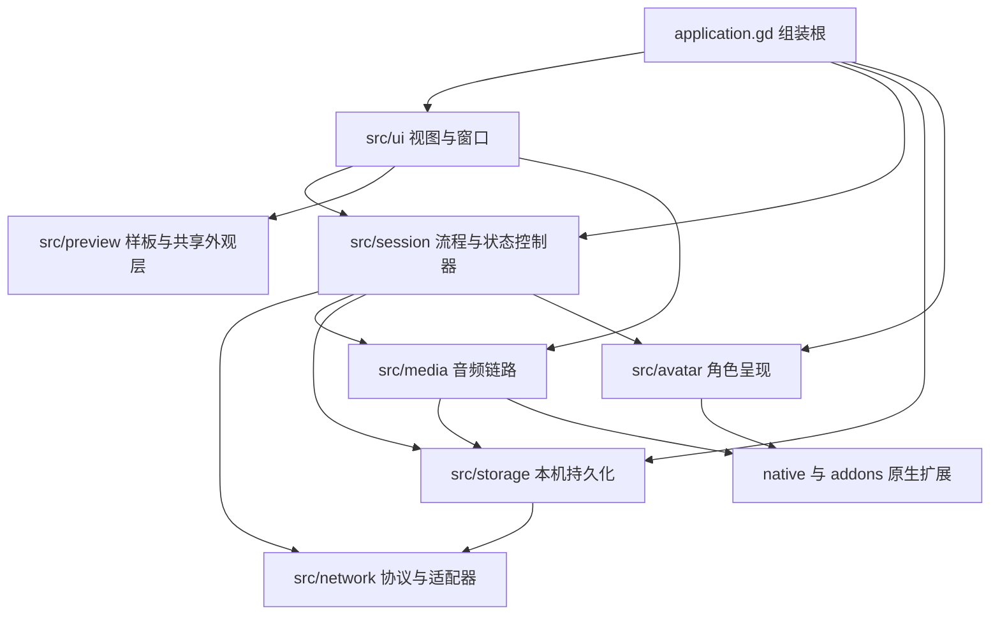
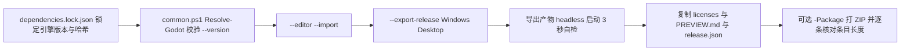

# agentluo Godot 客户端架构分析（总览）

> **历史快照说明（2026-09-20 场景化后）**：本文及本目录 01–10 篇描述的是 `42b5b1c`，作为迁移前架构背景保留。以下行号、脚本构造视图、三个薄场景与 preview_style.gd 的描述不代表当前实现。现行 UI 契约见 [客户端 interface](../../docs/项目说明/项目架构与接口（spec）/接口文档/client_godot/README.md) 中的场景化收尾条目；实际交付与验证见 [进度](../../docs/开发进程文档/开发进度/Godot-Windows客户端.md)。

当前 UI 由 `scenes/main.tscn`、`scenes/ui/`、`scenes/avatar/`、`scenes/preview/` 的节点树承载，行为脚本以唯一节点名绑定；业务依赖通过 `instantiate() → setup() → add_child()` 注入，主场景无注入时保留用户目录默认值。主题唯一来源是 `theme/app_theme.tres`，旧 `preview_style.gd` 已删除。固定子视图内嵌，数据驱动的气泡、动态行、菜单项实例化对应场景；仅草稿确认框与 Live2D 模型/特效节点沿用已批准的运行时创建。

| 项 | 内容 |
| --- | --- |
| 分析对象 | `client_godot/`（Godot 4.7.1 Windows x64 客户端） |
| 基线 | 分支 `feat/agentluo-0.1.1` @ `42b5b1c35ad0006818a654575caaca10279a0ad2` |
| 撰写日期 | 2026-09-20 |
| 性质 | 只读现状分析（as-built）。除本系列 `.md` 与 `export_presets.cfg` 的导出排除项外不改动任何文件 |
| 行号口径 | `file:line` 为撰写时工作树行号；无前缀路径相对 `client_godot/` |
| 契约权威顺序 | `../../docs/项目说明/项目架构与接口（spec）/Godot客户端总体设计.md` → `../../docs/项目说明/项目架构与接口（spec）/接口文档/client_godot/README.md` |
| 交付事实权威 | `../../docs/开发进程文档/开发进度/Godot-Windows客户端.md` |

本文只描述工程实现现状与风险，不复述行为契约。契约内容一律以上表两份文档为准。

## 系列文档索引

| 篇 | 主题 | 状态 |
| --- | --- | --- |
| **总览** | 本文 | 已重写（2026-09-20） |
| 01 | 组装根 | 已重写（2026-09-20，格式样板） |
| 02 | `src/session`：流程与状态 | 已重写（2026-09-20） |
| 03 | `src/network`：协议与传输 | 已重写（2026-09-20） |
| 04 | `src/storage`：本机持久化 | 已重写（2026-09-20） |
| 05 | `src/media`：音频接收与播放 | 已重写（2026-09-20） |
| 06 | `src/avatar`：角色呈现与构图 | 已重写（2026-09-20） |
| 07 | `src/ui`：视图与窗口 | 已重写（2026-09-20） |
| 08 | `src/preview`：离线样板与共享外观层 | 已重写（2026-09-20） |
| 09 | 构建、版本化与交付 | 已重写（2026-09-20） |
| 10 | 测试与验证体系 | 已重写（2026-09-20） |

模块任务书写在 `tasks/` 下，每份自包含，可独立交给另一个对话执行。10 篇模块文档均已于 2026-09-20 按任务书重写完毕，与代码同一时间点。

## 阅读路径

**新人路径（30 分钟建立地图）**：本文 §2 模块归属表 → §3 启动与生命周期 → 各自模块文档的「30 秒速览」→ §5 挑一条与自己任务相关的数据流读完。不要从 `src/ui/` 开始读，那里的控件细节最多但依赖最少。

**改动前评估路径（改代码前必走）**：先定位模块归属（§2），再进对应模块文档看「对外接口」与「状态与不变量」，然后读 §5 里受影响的数据流，最后对照 §10 已知坑确认没有踩到共享外观层、日志白名单、数据根这几个陷阱。

## 1. 技术基线

### 1.1 引擎与渲染

- 引擎锁定 Godot **4.7.1 standard / Windows x64**，`dependencies.lock.json` 记录 `engine.version_output` 必须是 `4.7.1.stable.official.a13da4feb`、可执行文件 SHA-256 与导出模板 SHA-256（`dependencies.lock.json:4` 到 `:14`）。`scripts/common.ps1:12` 用版本号输出而不是文件名做校验。
- 渲染器固定 `gl_compatibility`（`project.godot:28`），面向集显与 8 GB 内存机器；主题色 `#66CCFF` 定义在 `src/preview/preview_style.gd:2`。
- 窗口初始 `660×800`（`project.godot:21`、`project.godot:22`），运行时按账户状态在紧凑与展开两种形态间切换（`src/application.gd:50`、`src/application.gd:173`）。

### 1.2 本机数据隔离

- 使用自定义用户目录 `AgentLuo-Godot`（`project.godot:15`、`project.godot:16`），与旧 Python 客户端、手机 App 完全隔离，不回读旧端凭据或缓存。
- 所有数据的物理根由组装根的 `layout_path` 派生（`src/application.gd:51`、`src/application.gd:77`、`src/application.gd:84`、`src/application.gd:86`、`src/application.gd:87`、`src/application.gd:239`）：`logs/`、`models/`、`audio/`、`reading/`、`images/`、`dynamics-window.cfg`。测试正是靠这个参数把整棵数据树换到临时目录（`tests/test_application_window.gd:52`）。
- 隔离键统一是 `sha256(JSON.stringify([server, username]))`：凭据（`src/storage/credential_store.gd:9`）、语音缓存目录（`src/storage/audio_cache.gd:20`）、阅读位置（`src/storage/reading_position.gd:17`）。语音文件本身再按消息 UUID 的 SHA-256 命名（`src/storage/audio_cache.gd:42`）。
- 凭据与模型密钥通过原生扩展加密：`protect_secret(plain, scope)` / `unprotect_secret(cipher, scope)`（`native/windows_security.cpp:63`、`native/windows_security.cpp:64`），scope 参与绑定，因此换服务器或换账号的密文不可互换。

### 1.3 原生扩展与第三方插件

两个 GDExtension，都是 Windows x86_64 专用：

| 插件 | 入口 | 二进制 | 来源 |
| --- | --- | --- | --- |
| `WindowsSecurity` | `windows_security_init`（`addons/windows_security/windows_security.gdextension:2`） | `addons/windows_security/bin/windows_security.dll` | 自有源码，`native/windows_security.cpp` + `native/pcm_stream_decoder.cpp` |
| `gd_cubism` | `gd_cubism_library_init`（`addons/gd_cubism/gd_cubism.gdextension:2`） | `addons/gd_cubism/bin/libgd_cubism.windows.release.x86_64.dll` | 上游锁定版 0.9.1 @ `60e9c61` |

自有插件在一次注册里导出两个类（`native/windows_security.cpp:110`、`native/windows_security.cpp:111`）：

- `WindowsSecurity`：`encrypt_password`（CNG RSA-OAEP/SHA256，用于登录密码）、`protect_secret` / `unprotect_secret`（当前用户 DPAPI）。
- `PcmStreamDecoder`：流式 WAV/PCM 解析器，接口为 `append` / `finish` / `get_status` / `read_frames` / `get_amplitude` / `get_waveform`（`native/pcm_stream_decoder.h:32` 到 `:37`），内部带 RIFF 分块状态机与能量窗（`native/pcm_stream_decoder.h:12`）。

两者都由 `native/SConstruct` 一次编出，链接 `bcrypt` 与 `crypt32`（`native/SConstruct:5`）。

### 1.4 导出与交付

- 预设只有一个：`Windows Desktop`，`export_filter="all_resources"`，`include_filter="*.json,*.moc3"`，`exclude_filter="scripts/*,tests/*,architecture/*,artifacts/*,dist/*,native/*"`（`:10`，其中 `architecture/*` 为本次新增的防御性声明，见 09 篇），外置 PCK（`export_presets.cfg:1` 到 `:11`）。
- 脚本侧另有 `scripts/build_cubism.py`、`scripts/build_security.py` 用于重建两个插件，二者都会先比对 `dependencies.lock.json` 里的 commit 与 SCons 版本再动手（`scripts/build_security.py:17`、`scripts/build_cubism.py:8`），失败即中止，不允许无声替换二进制。

## 2. 全局架构总览

### 2.1 分层与依赖方向



三条必须记住的方向规则：

1. **构造只有一个扇出点**：`new()` 只出现在 `src/application.gd`（`src/application.gd:56` 到 `src/application.gd:89`）与按需设置窗口处（`src/application.gd:232` 到 `src/application.gd:239`）。视图通过构造参数拿控制器，不自己造业务对象。
2. **视图不持有协议**：`src/ui/` 只调用控制器公开方法与信号，看不到 WebSocket 事件名或 HTTP 路由。
3. **存储层存在一次反向依赖**：`src/storage/` 的四个文件为了复用 `AccountApi.normalize_server()` 而 `preload` 了 `src/network/account_api.gd`（`src/storage/audio_cache.gd:2`、`src/storage/model_store.gd:2`、`src/storage/reading_position.gd:2`、`src/storage/history_images.gd:3`）。这是「叶子层」假设不成立的地方：存储层不能脱离网络层单独编译或理解（详见 §10.2）。

### 2.2 模块归属表

| 模块 | 目录 | 文件数 | 行数合计 | 一句话职责 |
| --- | --- | --- | --- | --- |
| 组装根 | `src/application.gd`、`src/release_info.gd` | 2 | 281 | 建服务、切界面形态、管窗口与退出 |
| 流程与状态 | `src/session/` | 7 | 1240 | 账户、聊天、历史、动态、模型、偏好的控制器 |
| 协议与传输 | `src/network/` | 5 | 522 | 账户 HTTP、历史分页、WebSocket 与投递队列 |
| 本机持久化 | `src/storage/` | 7 | 776 | 凭据、语音缓存、历史图片、阅读位置、日志 |
| 音频 | `src/media/` | 2 | 458 | 流式接收、原生解码、播放与缓存重放 |
| 角色 | `src/avatar/` | 4 | 297 | Live2D 加载、构图、表情动作、口型 |
| 视图与窗口 | `src/ui/` | 12 | 1732 | 账户、聊天、动态、设置、日志的控制台 |
| 样板与外观层 | `src/preview/` | 6 | 562 | 离线样板，以及被产品复用的外观与气泡控件 |
| 原生与插件 | `native/`、`addons/` | — | — | `WindowsSecurity`、`PcmStreamDecoder`、`gd_cubism` |
| 构建与交付 | `scripts/`、`export_presets.cfg`、`release.json`、`dependencies.lock.json` | — | — | 锁定、构建、打包、发布 |
| 测试与验证 | `tests/` | 44 | — | 32 个合约脚本、4 个 GPU 截图、8 个 Python 驱动 |

### 2.3 跨切片不变量

- **账户状态是唯一的界面开关**：只有 `signed_in` 才创建 `avatar_panel` 与 `chat_view`（`src/application.gd:153` 到 `src/application.gd:176`），其它相位一律销毁（`src/application.gd:182` 到 `src/application.gd:189`）。
- **组件缺失即停**：`WindowsSecurity` 或 `GDCubismUserModel` 不存在时不进入对应功能，只在界面显示可读错误（`src/application.gd:67`、`src/avatar/avatar_driver.gd:39`）。
- **每次进入新会话先 `stop()` 再 `start()`**：账户（`src/session/account_session.gd:30` 到 `src/session/account_session.gd:31`）、聊天（`src/session/chat_session.gd:63`）、历史（`src/session/history_sync.gd:18`）、动态（`src/session/dynamics_controller.gd:30`）都遵循这条，因此迟到回调靠 `_generation` 代数号丢弃。
- **服务端数据一律先校验再落状态**：历史每行必须满足 uuid/source/type/timestamp 结构（`src/session/history_sync.gd:67`），动态每项必须满足五个字符串字段（`src/session/dynamics_controller.gd:272`），模型类型必须满足 id/name/model_kind 与重复检查（`src/session/model_settings.gd:32`）。校验失败统一降级为 `INVALID_RESPONSE`，而不是部分采纳。
- **投递只有一条队列**：所有 WebSocket 出站包都经 `reliable_outbox`（`src/network/websocket_transport.gd:47`），没有旁路。

## 3. 启动、装配与生命周期

启动顺序（`src/application.gd:41` 起）：

1. 设置窗口标题与主题——标题来自 `release.json`（`src/application.gd:42`），主题来自共享外观层（`src/application.gd:43`）。
2. 若是 `--preview`：释放为正式路径准备的标签与对话框，把窗口调到 `1200×800`，加载 `scenes/chat_preview.tscn` 后直接 `return`（`src/application.gd:44` 到 `src/application.gd:49`）。样板路径**不会**创建日志、账户、网络等任何正式服务。
3. 正式路径先建日志：`ClientLog` → `engine_log_sink` 注册为引擎 Logger（`src/application.gd:51` 到 `src/application.gd:55`），随后创建日志窗口。写盘失败的降级提示就地展示在一条红字标签上（`src/application.gd:52`）。
4. 关掉自动退出并接管关闭请求，建好「放弃未保存内容」确认框，默认焦点在取消（`src/application.gd:58` 到 `src/application.gd:66`）。
5. 检查 `WindowsSecurity`；缺失则显示错误并 `return`（`src/application.gd:67` 到 `src/application.gd:72`）。
6. 建服务：账户会话（可注入）、模型设置与存储、动态控制器、聊天会话（内部挂载传输、音频、历史、阅读位置、历史图片、模型执行器）（`src/application.gd:73` 到 `src/application.gd:90`）。
7. 建界面骨架：分隔容器 + 居中容器 + 账户表单，读 `window_layout.cfg` 恢复比例与音量（`src/application.gd:91` 到 `src/application.gd:121`）。
8. 绑定持久化：音量在 `chat.state_changed` 时落盘（`src/application.gd:122` 到 `src/application.gd:127`），比例在拖拽时落盘（`src/application.gd:128` 到 `src/application.gd:134`）。
9. 等一帧让布局生效后对齐分隔条（`src/application.gd:136` 到 `src/application.gd:138`）。
10. 若给了 `--capture=`，等 1 秒抓帧保存后退出（`src/application.gd:139` 到 `src/application.gd:147`）；否则**在非 headless 时**才自动登录（`src/application.gd:148` 到 `src/application.gd:149`）。

生命周期要点：

- 退出时先摘掉引擎 Logger 再结束日志（`src/application.gd:216` 到 `src/application.gd:221`），保证异常退出也留下已写记录。
- 登出与退出共用同一条确认路径，只有 `exit` 与 `logout` 两个动作被接受（`src/application.gd:258` 到 `src/application.gd:266`）。
- 账户相位变化会写一条 `account_state` 日志（`src/application.gd:152`）。

## 4. 模块划分与索引

划分依据是「谁在谁的允许依赖方向里」，而不是目录好看：

- `src/session/` 收所有有状态、有生命周期的流程控制器；它们共同特征是「有 `start/stop`、有 `_generation`、向视图暴露 `changed` 信号」。
- `src/network/` 只放「把字节变成项目内字典」的适配器与队列，不放业务判断。五个文件里三个 HTTP 适配器共享同一套 `{"ok","code","status","data"}` 结果字典。
- `src/storage/` 只放「落在磁盘上、需按账号隔离」的东西，外加日志基础设施。
- `src/media/` 与 `src/avatar/` 各自是一个完整子系统，都直接依赖原生扩展。
- `src/ui/` 全是 `Control`/`Window` 子类，不含 `await` 网络调用，只消费控制器信号。
- `src/preview/` 名义上是样板，实际同时承担「共享外观层」职责（见 §10.1）。

各模块的详细职责、接口、数据流与坑，见 `tasks/` 下对应任务书；按任务书产出的 10 份模块文档与本文共同构成完整系列。

## 5. 跨模块关键数据流

### 5.1 启动与自动登录

```
application._ready → account_session(读取 saved server/remember)
    → 非 headless 且非 capture → account_session.resume()
        → credential_store.read(server, username)  [DPAPI 解出 login_token]
        → account_api.request("auto_login", ...)
    → changed(phase=signed_in) → 建 avatar_panel + chat_view
        → chat_session.start → transport.start + history.start + reading.start + images.start + media.set_scope
```

自动登录失败且服务端明确拒绝时，会删掉本地凭据并把 `remember` 置回 false（`src/session/account_session.gd:55` 到 `src/session/account_session.gd:58`），避免下次登录反复撞同一凭据。

### 5.2 文字聊天：发送屏障与回复合并

- 历史首批边界没建立前，发送不会直接上路：消息先落到 `_pending_history` 并标 `waiting_history`（`src/session/chat_session.gd:81` 到 `src/session/chat_session.gd:86`），等 `boundary_ready` 再逐条补发，并把服务端回的 wire id 映射回来（`src/session/chat_session.gd:278` 到 `src/session/chat_session.gd:289`）。这样做是为了让历史与实时消息在同一处按 UUID 归并。
- 天依的回复按 UUID 聚合到 `_replies` 再一次性呈现：文本累积、表情暂存、音频流按分片追加，`is_final_package` 或 `audio_error` 才收口（`src/session/chat_session.gd:192` 到 `src/session/chat_session.gd:206`）。
- 播放是串行的：`_present_replies()` 遇到第一条还没播放的回复就 `break`（`src/session/chat_session.gd:235` 到 `src/session/chat_session.gd:237`），播完才把该条移入 `_finished`，下一次进入函数再放行下一条。
- 断线时所有在途回复被就地判死并清空（`src/session/chat_session.gd:147` 到 `src/session/chat_session.gd:152`），避免旧回复在新连接上续播。

### 5.3 回复语音：接收 → 缓存 → 播放 → 重放

```
chat_session._receive_reply → media.append_reply_audio(id, base64, final, audio_error, ephemeral)
    ├─ audio_cache.begin/append/commit      （逐个分片同时落盘，final 时提交）
    ├─ PcmStreamDecoder.append/finish       （原生解码成 frames + 24 桶波形）
    └─ _process 里按已听位置取幅度 → mouth_changed → avatar_driver.set_mouth_openness
```

- 播放用 `AudioStreamGenerator`，`.25` 秒缓冲，按解码器实际采样率开流（`src/media/reply_audio.gd:224` 到 `src/media/reply_audio.gd:229`）。
- 口型用的是**已听到**的帧位置而不是已推送位置：`heard = pushed - buffered - 输出延迟帧数`（`src/media/reply_audio.gd:239`），再乘 3 倍并夹到 0..1（`src/media/reply_audio.gd:240`）交给角色层。
- 在线语音会抢占本地重放并记一条 `replay_preempted`（`src/media/reply_audio.gd:221` 到 `src/media/reply_audio.gd:223`）。
- 只有完整且提交成功的语音才有重放能力：缓存查找要求元数据版本 1、24 桶波形、采样率 8000–192000、帧数上限为采样率×1800（`src/storage/audio_cache.gd:128` 到 `src/storage/audio_cache.gd:141`）。
- 临时回复（`is_ephemeral`）会主动抑制缓存（`src/media/reply_audio.gd:63` 到 `src/media/reply_audio.gd:66`）。

### 5.4 历史分页与阅读位置

- 历史每页固定请求 50 条（`src/network/history_api.gd:33`），从最新向最早翻，直到 `start_index == 0`（`src/session/history_sync.gd:82`）。
- 分页连续性有硬校验：`end - start` 必须等于本页条数，否则整轮判 `HISTORY_INVALID`（`src/session/history_sync.gd:62`）。重复 UUID 不报错，但会把整体标成 `incomplete`（`src/session/history_sync.gd:73` 到 `src/session/history_sync.gd:77`）。
- 归位以 UUID 为准：历史页里若已存在同 UUID 的实时消息，就把实时那条搬到历史位置并保留其实时内容，绝不按文本或时间匹配（`src/session/chat_session.gd:291` 到 `src/session/chat_session.gd:304`）。
- 阅读位置只在历史状态推进、用户尚未手动干预、且前台可见时才写盘（`src/storage/reading_position.gd:44` 到 `src/storage/reading_position.gd:58`），写入用 `.tmp` + rename 原子替换（`src/storage/reading_position.gd:61` 到 `src/storage/reading_position.gd:70`）。

### 5.5 动态：读取、未读、发布与评论

- 未读由 30 秒定时器轮询（`src/session/dynamics_controller.gd:24` 到 `:27`），只有 `/dynamics/read` 明确成功才把计数清零（`src/session/dynamics_controller.gd:180` 到 `src/session/dynamics_controller.gd:183`）。
- 分页游标必须前进：`has_more` 为真但游标为空或原地不动，整页判非法（`src/session/dynamics_controller.gd:260`），`refresh_comments` 另外维护已见游标集合防死循环（`src/session/dynamics_controller.gd:129`、`src/session/dynamics_controller.gd:137`）。
- 列表每页 10 条、评论每页 20 条，服务端给多了直接判非法（`src/session/dynamics_controller.gd:262`）。
- 评论按 `created_at` 字符串排序（`src/session/dynamics_controller.gd:300`），同秒再按 id。
- 写入期间（`_writing`）会挡住分页与评论加载（`src/session/dynamics_controller.gd:70`、`src/session/dynamics_controller.gd:227`），避免发布成功后又立刻把旧分页盖回去。

### 5.6 模型委托

```
服务端 llm_request 事件 → chat_session._receive → model_executor.submit
    → 按 request_id 去重（重复请求直接重发上次结果）
    → model_settings.validate + get_config（含能力位校验）
    → OpenAI 兼容 /chat/completions 非流式调用
    → completed(response) → transport.send_event("llm_response", ..., durable=false)
```

- 结果按 `request_id` 缓存，最多 4096 条；超出或并发超过 8 个直接回 `MODEL_BUSY`（`src/session/model_executor.gd:36` 到 `src/session/model_executor.gd:43`、`src/session/model_executor.gd:86`）。
- 能力位是双向校验的：配置保存时校验一次（`src/session/model_settings.gd:85`），每次执行前再校验一次（`src/session/model_executor.gd:77`）。
- 请求参数优先级固定为「服务端参数覆盖本地默认」，且默认 `max_tokens=4096 / temperature=0.7 / top_p=0.9` 会被服务端参数合并覆盖（`src/session/model_executor.gd:88` 到 `src/session/model_executor.gd:89`）。
- 有图就必须是 vlm 类型，否则 `MODEL_KIND_MISMATCH`（`src/session/model_executor.gd:80`）。

## 6. 外围与边界

### 6.1 `native/`：自有 C++ 与 vendored 依赖

- 自有源码只有三个文件：`native/windows_security.cpp`（6138 B）、`native/pcm_stream_decoder.h` / `.cpp`、构建脚本 `native/SConstruct`。
- `native/godot-cpp/` 是 vendored 的 godot-cpp，已被 `.gitignore` 排除（`client_godot/.gitignore:6`），只在重建插件时需要，且必须检出 lock 里记录的 commit。
- 两个 obj 与 `.sconsign.dblite` 也在忽略列表里（`client_godot/.gitignore:4`、`:5`、`:7`）。

### 6.2 `addons/`：两个 GDExtension

- `addons/windows_security/` 只有 `.gdextension` 与 DLL；`.lib` / `.exp` 是编译副产物，被忽略（`client_godot/.gitignore:8`、`:9`）。
- `addons/gd_cubism/` 含 DLL 与 8 个遮罩/归一化 shader（`addons/gd_cubism/res/shader/`）。这些 shader 是必带资源，`export_filter="all_resources"` 会收进 PCK。

### 6.3 `scenes/`：三个薄场景

`scenes/main.tscn`（12 行）、`scenes/avatar_preview.tscn`、`scenes/chat_preview.tscn` 都只挂脚本、不含布局。界面全部在 GDScript 里构建，这是「测试能直接 `new()` 被测类而不加载场景」的前提。

### 6.4 `assets/` 与 `licenses/`

- `assets/live2d/character.json` 是角色描述符（character_id / resource_id / model_path / mapping_path），由 `avatar_panel` 加载（`src/avatar/avatar_panel.gd:31`）。
- `assets/live2d/live2d_interface_config.json` 把服务端表情名映射到模型表情，并给出每个表情的嘴型基准值（`expression_projection` / `mouth_value_projection`），由 `avatar_driver` 读取（`src/avatar/avatar_driver.gd:4`）。
- 模型资源 `assets/live2d/luo/`：13 个表情、7 个动作、1 张纹理、物理与 cdi3 参数文件。
- `licenses/` 含 Cubism SDK / CubismCore / gd_cubism / godot-cpp / Godot 的许可与 `RESOURCES.md` 素材来源，构建时整目录复制进交付包（`scripts/build.ps1:19`）。

## 7. 构建、版本化与交付



- 版本唯一来源是 `release.json`（`{"product":"agentluo","version":"0.1.1"}`）：构建脚本读它做名字与格式校验（`scripts/build.ps1:5`），运行时读它做窗口标题（`src/release_info.gd:3`）。
- 版本格式必须是三段数字（`scripts/build.ps1:6`），且构建不自动递增。
- 打包用「先写临时名、逐条核对条目与长度、最后 Move 到正式名」的方式，避免留下残缺的正式包（`scripts/build.ps1:27` 到 `scripts/build.ps1:51`）。正式包已存在时直接拒绝（`scripts/build.ps1:9`）。
- 交付目录必须整体分发：EXE、PCK、两个 DLL、`licenses/`、`PREVIEW.md`、`release.json`。`tests/verify_release_archive.py:11` 强制恰好 2 个 DLL，并逐字节比对。
- **本次变更说明**：`exclude_filter` 增加了 `architecture/*`（改动前为 `scripts/*,tests/*,artifacts/*,dist/*,native/*`）。实测结论：改动前用 `--export-pack` 生成的 PCK 中检索 `architecture/`、`01-application`、`ARCHITECTURE` 命中均为 0，说明 `all_resources` 本来就不打包 `.md`。因此该项是**防御性声明**，不是修复了实际的资源泄漏。09 篇必须如实这样写。

## 8. 测试与验证体系

- 32 个 `test_*.gd` 合约脚本，统一 `extends SceneTree`，`_initialize()` 里跑断言，退出码即结论（0 通过 / 1 失败）。它们直接 `new()` 被测类，不加载场景。
- 4 个 `capture_*.gd` GPU 截图脚本，在 headless 下直接 `quit(2)`，保证 `check*.ps1` 永远不需要显卡。
- 6 个 `run_*.py` loopback fixture：`run_account_tests.py`、`run_security_interop.py`、`run_websocket_tests.py`、`run_feature_tests.py`、`run_history_tests.py`、`run_dynamics_tests.py`。全部只监听随机端口的 127.0.0.1，不连公共服务；`run_dynamics_tests.py` 文件头明确写「no requests to the public server」。
- 2 个 `verify_*.py` 做独立验证：`verify_release_archive.py` 校验交付 ZIP 的条目与逐字节一致性；`verify_native_dynamics.py` 用 Win32 API 校验动态窗口的 HWND 所有权、任务栏独立项与最小化独立性。
- 编排由 `scripts/check*.ps1` 负责：`check.ps1` 覆盖导入、3 秒启动、16 个合约脚本与离线样板；`check_accounts.ps1` 覆盖原生互操作与 4 个账户脚本；`check_network.ps1` 覆盖投递队列与 3 个真实 socket 脚本；`check_features.ps1` 按 runner 分组覆盖历史、设置、动态共 9 个用例。
- 共享 wire 契约样本 `contracts/chat/reply_events.json` 由新端收包链路与旧 Python 客户端解析器共同消费，避免只在新端自证。

## 9. 上手索引表

| 我想…… | 先读这里 |
| --- | --- |
| 加一个后台服务 | `src/application.gd:77` 一带的装配区；然后 `src/session/` 里找一个同类控制器照抄 `start/stop/_generation` 结构 |
| 加一个设置窗口 | `src/application.gd:223`；窗口要实现 `open()` / `is_dirty()` / `hide()` 三约定，并在 `:227` 的白名单登记 |
| 改聊天输入或消息气泡 | `src/ui/chat_view.gd`、`src/ui/virtual_message_list.gd`、`src/preview/message_bubble.gd`（注意后者在产品路径下也被用） |
| 改配色或字号 | `src/preview/preview_style.gd`（全产品共用） |
| 改协议或加重连逻辑 | `src/network/websocket_transport.gd`；控制类事件必须在 `_handle_event` 前段处理 |
| 改投递重试策略 | `src/network/reliable_outbox.gd` 的 `RETRY_DELAYS` 与 `MAX_AGE_MS` |
| 查某条日志为什么没字段 | `src/storage/client_log.gd:5` 到 `:9` 的四张白名单表 |
| 改角色表情或动作 | `assets/live2d/live2d_interface_config.json` + `src/avatar/avatar_driver.gd:87` |
| 改语音播放或口型 | `src/media/reply_audio.gd:205` 的 `_process` |
| 出包 | `client_godot/README.md` 的构建段，然后 `scripts/build.ps1` |

## 10. 已知坑与脆弱点

### 10.1 共享外观层寄住在 `src/preview/`（高危：改样板会打到产品）

`src/preview/preview_style.gd` 里的 `make_theme()`、`box()`、`label()`、`button()`、`avatar()` 被产品界面广泛依赖：`src/application.gd:43`、`src/ui/chat_view.gd:5`、`src/ui/account_view.gd:3`、`src/ui/log_window.gd:2`、`src/ui/dynamic_detail.gd:2`、`src/ui/dynamics_window.gd`、`src/ui/message_audio.gd:3`、`src/ui/unified_dropdown.gd:4`、`src/ui/model_window.gd`、`src/ui/preferences_window.gd`、`src/ui/publish_window.gd`、`src/ui/draft_window.gd`。同理 `src/preview/message_bubble.gd` 与 `src/preview/composer_input.gd` 也被 `src/ui/virtual_message_list.gd:7`、`src/ui/chat_view.gd:6` 复用。目录名会让人以为「只动样板」，实际是全产品外观。

### 10.2 存储层反向依赖网络层（中危：分层图的叶子假设不成立）

`src/storage/audio_cache.gd:2`、`src/storage/model_store.gd:2`、`src/storage/reading_position.gd:2`、`src/storage/history_images.gd:3` 都 `preload("res://src/network/account_api.gd")`，用途只有一个：复用静态方法 `normalize_server()`（`src/network/account_api.gd:16`）。代价是存储层的隔离键语义被网络层的地址规范化规则绑死——改 `normalize_server` 的规则会让所有已存语音、模型密钥、阅读位置、历史图片的目录名迁移，等于让用户数据「失联」。这是本项目最容易低估的耦合。

### 10.3 客户端日志的字段是硬编码白名单（高危：静默丢数据）

`record()` 只接受四张表里的键：数值字段必须在 `METRICS`（`src/storage/client_log.gd:5`）、`phase`/`code` 必须匹配 token 正则（`src/storage/client_log.gd:22`、`:37`）、`module` 必须在 `MODULES`（`src/storage/client_log.gd:6`）、事件名必须能在 `EXPLANATIONS` 里找到中文说明（`src/storage/client_log.gd:9`，找不到就退化成「客户端活动」）。任何新增日志字段若忘记登记，不会被报错，只会静默消失——排查线上问题时表现为「这个值从来没记过」。

### 10.4 `chat_session.gd` 是单一枢纽（中危：改动面大）

`src/session/chat_session.gd` 同时承担：传输事件分流、回复聚合与串行播放、历史页归位、阅读位置转发、图片按需拉取转发、模型委托转发（`src/session/chat_session.gd:170` 到 `:339`）。任何一条链路的改动都要经过这个文件，它是冲突高发区。

### 10.5 动态详情控件按「打开过的动态」常驻（低危：内存随浏览增长）

`src/ui/dynamics_window.gd:16` 的 `_details` 字典按动态 id 缓存 `dynamic_detail` 实例，`select_post()` 只隐藏不释放（`src/ui/dynamics_window.gd:101` 到 `src/ui/dynamics_window.gd:106`）。浏览越多动态，常驻控件越多。同理 `src/session/dynamics_controller.gd:13` 的 `_comments` 也只在 `stop()` 时清空。

### 10.6 拖拽与音量调参会高频写盘（中危：与磁盘/杀毒软件相关）

分隔条每次 `dragged` 都写一次 `ConfigFile`（`src/application.gd:128` 到 `src/application.gd:134`），音量每次 `chat.state_changed` 都写一次（`src/application.gd:122` 到 `src/application.gd:127`）。推断：在机械硬盘或开启实时扫描的环境下可能造成拖拽卡顿；本次未做真机测量。

### 10.7 `layout_path` 名字具有误导性，实际是数据根（低危：理解成本）

`_init` 的第二个参数名为 `layout_path`，但它同时决定日志、模型、音频、阅读位置、历史图片、动态窗口配置的目录（`src/application.gd:51`、`:77`、`:84`、`:86`、`:87`、`:239`）。新增任何本机目录都必须继续从它派生，否则测试隔离会漏。

### 10.8 动态评论排序依赖服务端时间字符串（低危：契约依赖）

`_sort_comments` 直接比较 `created_at` 字符串（`src/session/dynamics_controller.gd:300`）。只要服务端时间格式不是等宽可比较的形态，排序就会错；当前可见样本是 `2026-09-19 10:00:00` 这类定长格式（`tests/run_dynamics_tests.py` 的合成数据）。

### 10.9 `dist/` 根目录混有非版本化导出产物（低危：交付纪律）

`export_presets.cfg:11` 的 `export_path` 指向 `dist/AgentLuo.exe`，手工导出会直接在 `dist/` 根留下 `AgentLuo.exe`、`AgentLuo.pck` 与两个 DLL，与 `dist/agentluo-<version>/` 的版本化目录混在一起（`dist/` 本身被 gitignore）。发布前只应认 `dist/agentluo-<version>/`。

### 10.10 `assets/live2d/luo/model.model3_copy.json` 无引用（低危：死资源）

全仓检索不到对 `model3_copy` 的引用；真正被加载的是 `assets/live2d/luo/model.model3.json`（经 `assets/live2d/character.json`）。

### 10.11 组装根里 `WindowsSecurity` 被实例化两次（低危：多余实例）

`src/application.gd:74` 为账户会话实例化一次，`src/application.gd:77` 为模型存储再 `ClassDB.instantiate` 一次，两者不共享。

### 10.12 少数控制器的 `_exit_tree()` 紧贴上一函数结尾（低危：可读性）

例如 `src/session/preferences_controller.gd:120`、`src/session/model_settings.gd:124`、`src/session/dynamics_controller.gd:313`，函数之间缺少空行，是格式问题，无行为影响。

### 10.13 headless 通过 ≠ 视觉与真机通过（中危：验证盲区）

`check*.ps1` 全部 headless，覆盖不到 GPU 截图、真机 DPI/IME、集显性能与公共服务联调。`src/application.gd:148` 明确只在非 headless 下自动登录，因此 headless 测试永远不会走真实自动登录路径。

### 10.14 截图模式用固定 1 秒等待抓帧（低危：可能抓到未稳定画面）

`src/application.gd:144` 到 `src/application.gd:147` 固定等 1 秒后取帧。机器慢或窗口尺寸变化时可能抓到中间态。

## 11. 未验证范围

- GPU 截图核验（4 个 `capture_*.gd`）、真机 DPI 100/125/150/200%、中文输入法组词行为、多屏与最小化行为。
- 真实公共服务联调：聊天、图片、TTS、唱歌、动态、自备模型供应商实际调用。
- 长期性能：30 分钟连续音频与聊天、1000 条历史滚动、集显帧率与内存曲线。
- WASAPI 音频设备切换、输出延迟实测、口型同步偏差目标（不超过 150 ms）。
- 本文所有结论基于静态阅读与一次 `--export-pack` 探针，未运行 32 个合约脚本、未执行构建、未做真机验收。