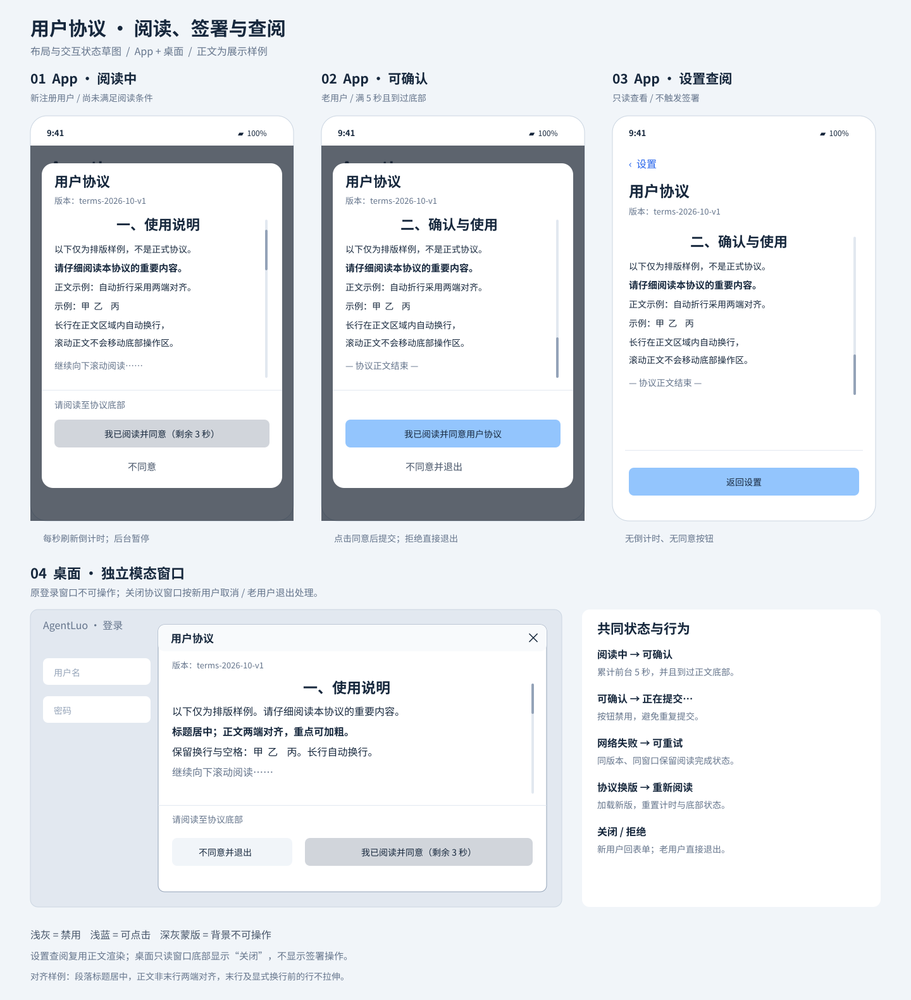
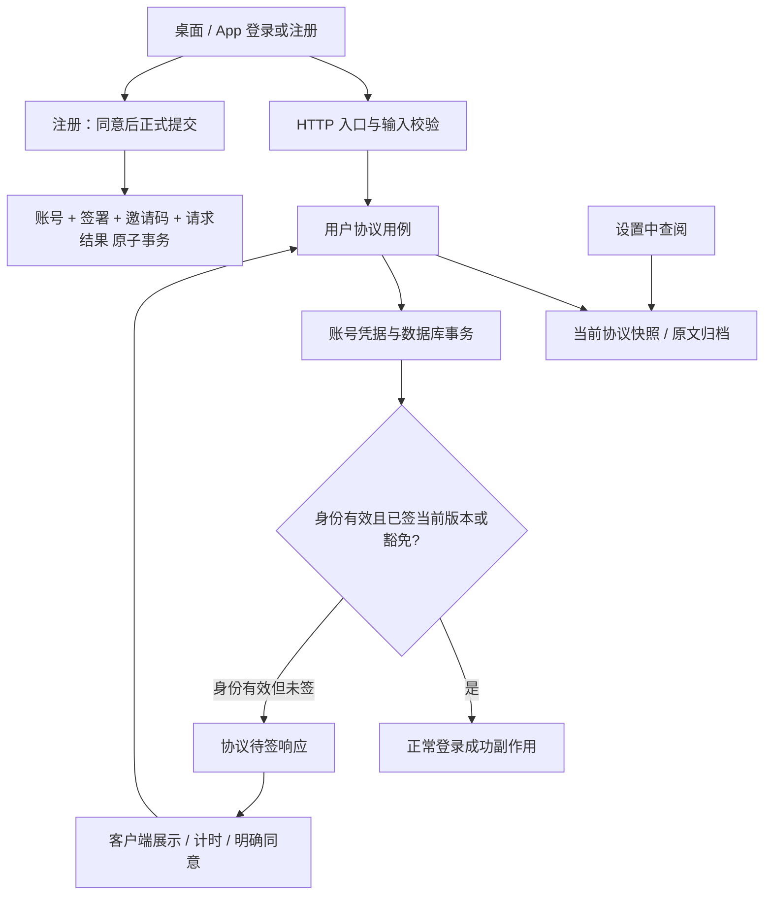
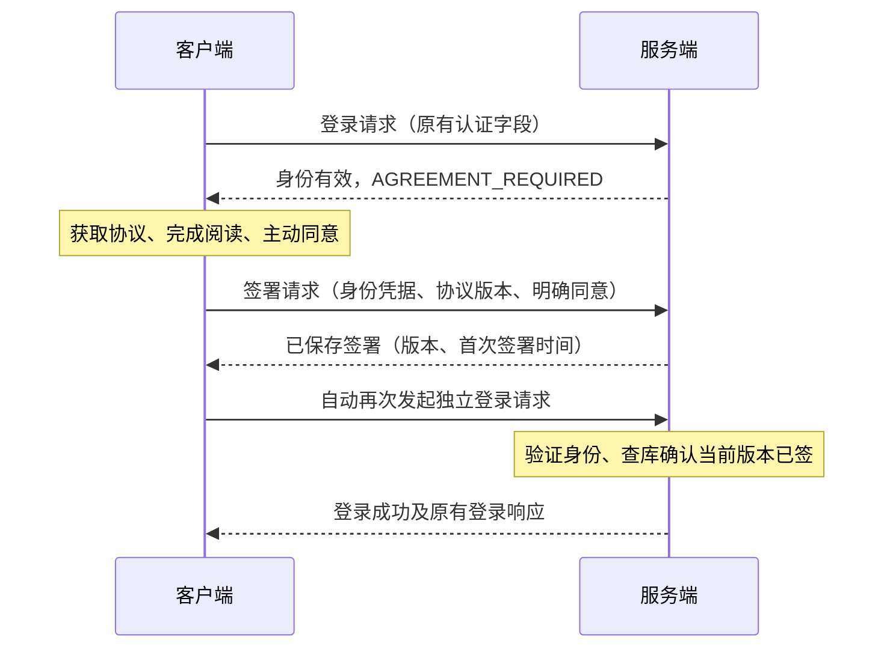

# 用户协议签署与登录门禁

> 状态：产品需求已确认，未实现。  
> 确认日期：2026-10-10。  
> 范围：服务端、PySide6 桌面端、Expo / React Native App；CLI 使用测试账号豁免。  
> 时间约定：签署时间由服务端生成，固定 UTC+8、精确到秒，序列化携带 `+08:00`。  
> 本文遵循 [Spec 模板](../spec文档模板.md)；术语见 [CONTEXT.md](../../CONTEXT.md)。接口及数据结构为本次设计契约，不表示现有实现已经支持。

## 用户故事

1. 作为新用户，我希望点击注册后阅读协议并明确同意，以便在了解协议后完成注册；取消阅读时不创建账号、不消耗邀请码。
2. 作为老用户，我希望登录时被告知需要同意当前协议，完成签署后继续本次登录，以便无需重复输入正确的账号密码。
3. 作为用户，我希望看清协议的标题、字号、重点加粗及采用居中或两端对齐的段落，在达到阅读条件后自主选择同意或拒绝，以便明确表达自己的决定。
4. 作为用户，我希望在设置中点击“用户协议”随时查阅当前正文，以便在签署后也能查看内容。
5. 作为网络不稳定的用户，我希望签署或注册提交失败后能够重试并确认实际结果，以便不会重复消耗邀请码或丢失已成功的签署。
6. 作为使用多个客户端的用户，我希望同一账号签署当前协议后不必在其他设备重复签署，并仍能使用旧客户端，以便保持原有使用方式。
7. 作为运维人员，我希望发布不可覆盖的协议版本并保存签署历史，以便明确每个账号同意的正文和时间。
8. 作为调试人员，我希望指定测试账号免于签署，以便继续通过 CLI 做端到端调试，同时保留豁免与实际签署的区别。

### UI/UX 草图

以下为布局与状态示意，不是像素级视觉稿。颜色建议值：禁用按钮 `#D1D5DB`，可用按钮 `#93C5FD`；文字须有足够对比度。App 蒙版采用深灰半透明层，例如 `rgba(31,41,55,0.72)`。



[打开 SVG 原图](assets/用户协议签署-ui.svg)。草图覆盖 App 阅读中、可确认、设置只读查阅和桌面独立模态窗口；双端共同状态见下表。

| 状态 | 确认按钮 | 辅助信息 |
| --- | --- | --- |
| 正文加载中／失败 | 禁用 | 加载中，或“用户协议加载失败，请重试”及重试入口 |
| 累计不足 5 秒 | 浅灰，禁用：“我已阅读并同意（剩余 N 秒）” | 未到过底部时提示“请阅读至协议底部” |
| 已满 5 秒、未到过底部 | 浅灰，禁用：“我已阅读并同意用户协议” | “请阅读至协议底部” |
| 已满 5 秒、到过底部 | 浅蓝，可用：“我已阅读并同意用户协议” | 无阅读要求提示 |
| 提交中 | 禁用：“正在提交…” | 拒绝／关闭操作暂时禁用，等待结果；请求超时后恢复操作 |
| 同版本提交失败 | 恢复可点击的确认按钮 | 明确错误；保留本窗口的阅读状态 |

确认与拒绝操作区固定，不随正文滚动；App 避开安全区域，桌面调整窗口和 App 字体缩放后正文仍可完整滚动阅读。正文长行自动换行，不要求水平滚动。

## 验收标准

以下每行均为可独立验证的状态、输入、输出。V1/V2 代表不同的不可变协议版本，U 代表非豁免账号。

### AC-01 签署记录与时间

| 状态 | 输入 | 输出 |
| --- | --- | --- |
| U 未签 V1，V1 为当前版本 | U 通过身份校验并明确提交同意 V1 | 持久保存 U、V1 和服务端签署时间，重启后仍可查询；单纯下载、滚动、计时完成均不生成签署记录 |
| 服务端当前时间为 `2026-10-10T14:30:25.987+08:00` | 首次有效同意提交 | 时间为 `2026-10-10T14:30:25+08:00`，不含小数秒，代表的时刻不晚于生成时服务端当前时刻 |
| 接口允许提交同意 | 请求携带自定 `accepted_at`（字符串、未来值或任意时间值） | 拒绝额外时间字段；客户端不能指定、覆盖签署时间 |
| U 已签 V1 | 同账号重复或并发同意 V1 | 仅一条 U/V1 记录，返回首次签署时间，不覆盖为重试时间 |
| U 已签 V1，当前为 V2 | 同意 V2 | 新增 V2 签署记录，V1 记录与正文不变 |
| U 忘记账号密码 | 使用原邀请码重置用户名及密码 | 原账号 ID 与所有签署记录保留；后续按当前版本判定 |

### AC-02 身份校验、登录及副作用

| 状态 | 输入 | 输出 |
| --- | --- | --- |
| U 未签当前版本 | 正确密码登录或有效自动登录凭据 | 返回协议待签状态；不签发业务 token、不轮换自动登录 token、不更新成功登录时间、不触发登录记录与历史预热 |
| 账号身份未验证 | 错误密码或失效自动登录 token | 返回原身份验证失败，不泄露该账号的协议状态，不允许以用户名直接签署 |
| 新客户端已连接服务器且本地有有效自动登录凭据 | 启动自动登录 | 验证身份后发现未签，显示协议；不得将协议待签误作凭据失效而清除有效 token |
| 新客户端无有效本地凭据 | 找到服务器 | 显示登录页；输入正确账号密码后才进入该账号的签署流程 |
| U 在登录流程签署成功 | 客户端继续原登录请求 | 无须重新输入账号密码，正常完成登录；只有登录真正成功才执行成功副作用 |
| U 未签当前版本且身份有效 | 单独调用签署接口并成功，尚未再次调用登录接口 | 只新增签署记录，不返回登录成功、不轮换 token、不更新登录时间、不触发登录记录或历史预热 |
| U 已签当前版本或属于豁免名单 | 登录请求仅携带原有认证字段，无协议状态、版本或能力字段 | 服务端自行查库及判定豁免，正常登录；不依赖客户端声明签署状态 |
| 新客户端收到待签错误 | HTTP 403，`code` 为 `AGREEMENT_REQUIRED`，`detail` 为统一升级提示 | 识别错误码后直接进入协议流程，不向用户弹出升级提示；其他 403 不进入协议流程 |
| U 已签当前版本 | 在另一设备、重装后或旧客户端登录 | 不再要求签署，按现有登录逻辑处理 |
| 签署期间凭据因账号重置等原因失效 | 再次提交签署 | 返回身份失效并引导重新登录，不用失效凭据写记录 |

### AC-03 门禁生效范围与旧客户端

| 状态 | 输入 | 输出 |
| --- | --- | --- |
| U 已登录，随后发布 V2 | 继续使用已有有效业务会话或通过原有效业务凭据重连 WS | 不因 V2 主动中断、拒绝业务或要求重签；原有鉴权和过期规则仍有效 |
| U 仅签 V1，当前为 V2 | 下一次调用密码登录或自动登录 | 要求签署 V2；“下一次登录”以登录接口调用为界，不等同于每次业务请求或 WS 重连 |
| U 未签当前版本，使用旧客户端 | 点击登录，提交正确账号密码 | 文本错误：“请升级到支持用户协议签署的版本，阅读并同意用户协议后再登录。” |
| 旧客户端自动登录失败 | 退回登录页，再手动登录 | 手动登录显示上述升级提示；本次不承诺无法修改的旧客户端在自动登录失败瞬间显示提示 |
| 新客户端连接生产服务端 | 正常启动 | 按服务端已支持本功能的部署前提工作；不实现旧服务端适配、降级放行或客户端最低版本门禁 |

### AC-04 新用户注册与邀请码原子性

| 状态 | 输入 | 输出 |
| --- | --- | --- |
| 注册表单缺少必填项或两次密码不一致 | 点击注册 | 先提示表单错误，不打开协议、不提交正式注册 |
| 表单本地校验通过 | 点击注册 | 打开协议；此时不创建账号、不占用或消耗邀请码 |
| 阅读尚未完成 | 点击禁用确认、点击不同意、关闭窗口或 Android 返回 | 禁用按钮不能提交；拒绝则返回原注册表单并保留输入，无账号及邀请码副作用 |
| 阅读条件完成、邀请码有效且用户名可用 | 点击同意并完成提交 | 创建账号、记录当前版本签署、消耗邀请码及登记注册重试结果在同一事务成功；显示“注册成功，请登录”，回登录页并预填用户名，不自动登录 |
| 注册提交期间邀请码被其他注册占用，或数据库写入失败 | 提交注册 | 整体失败回滚，不留下本次账号、签署或邀请码部分写入；显示错误，表单信息不丢失 |
| 旧客户端不提交同意信息 | 调用注册接口 | 返回需升级签署的文本错误，不创建账号、不消耗邀请码；测试账号豁免不绕过注册要求 |

### AC-05 阅读计时、底部与生命周期

| 状态 | 输入 | 输出 |
| --- | --- | --- |
| 正文刚成功渲染、仍在顶部 | 前台可见阅读 5 秒，未到过底部 | 倒计时结束，但按钮仍禁用，提示阅读到底部 |
| 正文刚成功渲染 | 1 秒内滚到底部，再前台阅读 4 秒 | 两项条件都满足后启用；不要求到达底部后额外等 5 秒 |
| 正文一屏完整显示 | 前台阅读满 5 秒 | 自动满足底部条件，启用按钮 |
| 已阅读 2 秒 | App 切后台或桌面协议窗口最小化／应用失去前台 10 秒，再返回 | 返回时仍需累计 3 秒，不计后台时间 |
| 已到过底部 | 向上回看正文并达到 5 秒 | 仍满足底部条件；同一次打开中“到过底部”是保持状态 |
| 尚未成功签署 | 关闭后重新打开、重启应用，或协议换版 | 阅读计时与到过底部状态重置；没有成功保存的本地状态不能代替签署 |

计时使用单调时钟累计有效前台区间，每秒刷新剩余秒数，剩余值为 `ceil(max(0, 5 - elapsed))`。调整系统时间或定时器延迟不能让实际不足 5 秒的窗口提前启用。底部按滚动容器可视范围到达正文末尾判定，容许不超过 2 个布局单位的舍入误差；内容重排前不得提前判定正文已加载。

### AC-06 拒绝与提交失败

| 状态 | 输入 | 输出 |
| --- | --- | --- |
| 老用户正在签署 | 点击“不同意并退出”、桌面关闭按钮或 Android 返回键 | 直接退出客户端，不二次确认，不写签署；App 的退出验收针对当前 Android 目标 |
| App 正在显示协议 | 点击深灰蒙版 | 不关闭，不穿透操作原界面 |
| 提交尚无结果 | 连点确认 | 同一请求只进入一次提交状态；采用有限请求超时，超时恢复可操作状态 |
| 同版本提交网络失败或超时，窗口未关闭 | 点击重试 | 保留阅读状态，无须重读；先前已保存的签署返回原时间 |
| 新注册已提交成功但响应丢失 | 使用同一注册请求标识及相同注册内容重试 | 返回原注册成功结果，不重复创建、不再次消耗邀请码，不仅返回“邀请码已使用” |
| 新注册请求尚未成功，客户端重启 | 重新打开注册流程 | 重新阅读；客户端可继续同一次未决请求的恢复，不能通过缓存自行宣布注册成功 |

### AC-07 协议版本变化、加载与设置查阅

| 状态 | 输入 | 输出 |
| --- | --- | --- |
| 窗口显示 V1，服务器启用 V2 | 提交同意 V1（注册或老用户签署） | 提示“用户协议已更新，请重新阅读”，获取 V2，重置计时与底部；不新增旧版签署、不创建账号、不消耗邀请码 |
| 当前版本未变、正文获取失败 | 新用户注册或未签老用户打开协议 | 显示“用户协议加载失败，请重试”，确认禁用，可重试；取消／退出遵循新老用户规则 |
| U 已签当前版本或已豁免 | 客户端无法下载协议正文但登录接口正常 | 正常登录，不能额外以正文下载为前提 |
| 用户处于已登录状态 | 桌面设置菜单或 App 设置入口点击“用户协议” | 显示服务端当前版本和正文，无同意、拒绝、倒计时；关闭返回原界面 |
| 会话仍有效但当前协议已更新 | 在设置查看新版，或查阅加载失败 | 仅查阅／提示失败，不写签署、不退出、不提前触发登录门禁 |

### AC-08 富文本渲染

| 状态 | 输入 | 输出 |
| --- | --- | --- |
| 双端协议渲染器可用 | 24 号标题、16 号正文、局部粗体、“甲  乙\n丙”以及超长一行的样例 | 字号层级和局部加粗可辨；甲乙之间两个空格保留，丙另起一行；超长行自动换行，所有内容均可读 |
| 双端打开签署窗口或设置查阅 | 标题段落 `align: "center"`，正文段落 `align: "justify"`，正文含自动折行、局部粗体及显式换行 | 标题每行在正文可用宽度内居中；正文自动折行的非末行两端对齐，段落末行及显式换行前的行靠左、不强制拉伸；局部粗体不打断段落对齐 |
| 段落未指定对齐方式 | 不带 `align` 的合法 block | 默认按两端对齐渲染，规则与显式 `justify` 一致；单行短段落靠左、不强制拉伸 |
| 协议配置含非法对齐值或层级 | `align: "right"`、`align: null`，或在 run 内设置 `align` | 启动校验失败并明确指出字段错误，不静默回退；对齐只能按 block 选择 `center` 或 `justify` |
| 正文包含连续空格且使用两端对齐 | 渲染“甲  乙”所在的长段落，并调整窗口宽度或系统字体大小 | 保留原文空格与换行，重新计算折行和对齐；允许排版增加字间距，不删除字符、不拉伸字形、不通过插入空格修改原文 |
| 正文包含类似 HTML 的普通文本 | 文本 `<script>alert(1)</script>` | 作为文字显示，不执行、不解释为 HTML；图片、表格、任意 HTML 不属于支持格式 |
| App 深色／浅色主题及桌面常规窗口 | 打开、滚动、提交协议 | 正文、版本、辅助文案可辨，底部操作区固定，禁用与可用颜色符合约定 |

### AC-09 迁移、豁免与协议发布

| 状态 | 输入 | 输出 |
| --- | --- | --- |
| 部署前已有账号且无签署数据 | 首次迁移并启动 | 不补造签署记录；非豁免账号下一次登录要求签署；既有用户、邀请码及重置能力保留 |
| 稳定账号 ID 位于白名单 | 从 CLI、桌面、App 或旧客户端登录 | 身份仍须有效，协议门禁豁免，不伪造签署记录 |
| 原豁免账号没有当前版本签署 | 从白名单移除并重启，随后登录 | 恢复普通协议检查；已有会话仍遵循 AC-03，不额外强制失效 |
| 配置缺失、无效字号、缺少当前正文，或历史版本原文被覆盖 | 启动服务 | 启动校验失败并报告明确配置错误，不以空协议或默认放行继续服务；部署前校验可使用同一校验器 |
| 正确添加 V2，保留 V1 | 部署并重启 | 当前版本为 V2，V1 原文和签署记录仍存在；各进程使用相同完整配置，不支持混合版本对外服务 |

### 验证与交付证据

- 服务端：使用可控时钟检查 UTC+8、秒精度；以真实数据库事务验证邀请码竞争、失败回滚、重启后重试、唯一签署及历史不变；覆盖密码和自动登录两个真实入口及其成功副作用边界。
- 协议契约：覆盖未鉴权签署、错误凭据、错误版本、重复提交、重试内容冲突、旧客户端文本错误及账号豁免；对注册响应丢失做端到端故障注入。
- 客户端：分别验证前台计时、滚动、重新打开、加载失败、返回／退出、自动登录恢复、设置只读、连续空格、字号和段落对齐渲染；两端对齐样例覆盖中文、英文单词、混合粗体、自动折行及显式换行。实际运行 PySide6 与 Android App 验证窗口和生命周期，不能仅以组件单测替代。
- 回归：账号重置保留签署，已签账号旧客户端登录，协议更新后现有会话继续使用，下一次登录拦截。数据库迁移使用真实旧结构样本。
- 本文是设计文档，未声称以上实现、自动化测试或设备验收已经完成。

## 模块与架构

### 模块划分

| 模块 | 职责与现有归属 |
| --- | --- |
| HTTP 入口 | `server/src/web/http/routes.py`、`types.py`、`user_interface.py`：协议读取和签署路由、输入校验、文本兼容错误、现有认证限流；不把协议流程放入 Agent 或 Stage |
| 用户协议用例 | 在 `server/src/application/user/` 内新增协议用例：协调当前正文、账号身份、签署与重试结果；对外提供读取当前协议、接受协议及登录资格判定的小接口 |
| 账号持久化 | `credential_service.py`：拆开“验证凭据”和“轮换登录会话”；在轮换前检查协议资格，注册事务负责全部原子写入，重置不删除签署 |
| 数据模型与迁移 | `server/src/infrastructure/persistence/database/sql_database.py` 及数据库装配：协议版本归档、签署记录、注册请求结果和增量迁移 |
| 配置与装配 | 服务端配置层读取协议清单和账号白名单，启动校验归档；`server_runtime.py` 组合装配，启动后使用固定当前版本快照 |
| 桌面端 | `client/src/network/auth.py` 处理协议状态与重试；`client/src/gui/login_dialog.py` 编排注册和登录；新增复用协议窗口；`main_ui.py` 设置菜单增加查阅入口 |
| App | `app/hooks/useAuth.ts`、`app/app/login.tsx` 编排；新增复用富文本和协议弹窗；`app/app/index.tsx` 现有设置菜单区域增加“用户协议”，不重构整体导航 |
| CLI | 本次不增加签署交互；继续调用现有认证接口，使用预先创建的豁免测试账号 |



### 接口规范

以下路径相对于现有 HTTP 路由前缀；保留现有 `/auth/login`、`/auth/auto_login`、`/auth/register`。新增接口与字段命名是本 Spec 的实现契约。

#### 1. 协议正文

`GET /auth/agreement`：无需登录，返回当前协议；签署与设置查阅共用。服务端仅公开正文，不公开账号签署历史。返回 `Cache-Control: no-store`，客户端不可用未经校验的本地旧正文代替当前版本。

```json
{
  "version": "terms-2026-10-v1",
  "title": "用户协议",
  "format": "agreement.richtext.v1",
  "blocks": [
    {"font_size": 24, "align": "center", "runs": [{"text": "一、使用说明", "bold": true}]},
    {"font_size": 16, "align": "justify", "runs": [
      {"text": "请阅读", "bold": false},
      {"text": "重要内容", "bold": true},
      {"text": "。\n甲  乙", "bold": false}
    ]}
  ]
}
```

每个 block 为独立段落，`font_size` 为 12–32 的整数、默认 16，客户端映射到各自逻辑字号；允许系统无障碍缩放，不要求双端像素一致。`runs` 非空，`text` 为原样文本，`bold` 为布尔值、默认 false。换行统一为 `\n`，连续普通空格保留；不支持图片、表格、脚本、链接交互和任意样式字段。标题和版本非空，正文至少有一个非空白字符；不认识的格式版本或配置字段在启动校验时拒绝。

段落级 `align` 仅允许 `"center"`（居中）或 `"justify"`（两端对齐），缺省为 `"justify"`。服务端协议维护者逐段选择，客户端忠实渲染，不提供用户自行修改协议排版的设置。该字段不作用于弹窗标题、版本标签或按钮，也不允许出现在单个 run 上。

`center` 使该段落的每个显示行居中；`justify` 使自动折行的非末行贴齐正文区域左右边缘，段落最后一行和 `\n` 前的行靠左且不强制拉伸。短单行视为末行。对齐使用排版间距调整，不缩放字形、不改写原始空格；同一段内不同粗细文本共同参与折行与对齐。窗口／字号变化时重新排版；若正文高度变化，阅读底部检测采用重排后的尺寸，仍遵循“同次打开到过底部即保持”的规则。双端签署与设置只读查阅共用此契约，不允许某一端将两端对齐静默降级为普通左对齐。

#### 2. 登录资格与兼容错误

密码登录及自动登录请求保持原字段，不新增协议状态、协议版本或客户端协议能力字段。服务端验证身份后，根据数据库中该账号是否存在当前协议版本的签署记录以及账号豁免名单判定登录资格；不接受客户端声明代替签署事实。协议版本只在签署或注册时提交，用于明确用户同意的正文。

处理顺序：限流及参数校验 → 验证密码或自动登录凭据 → 查询当前签署／豁免 → 成功时调用原会话轮换与登录副作用。身份验证成功不等于登录成功；待签状态不得签发业务凭据。不得先调用现有会轮换 token 的方法再补查协议。

身份有效但未签时返回 HTTP 403：

```json
{
  "detail": "请升级到支持用户协议签署的版本，阅读并同意用户协议后再登录。",
  "code": "AGREEMENT_REQUIRED",
  "agreement_version": "terms-2026-10-v1"
}
```

新旧客户端收到同一响应，服务端不为提示文案判断客户端版本或能力。旧客户端原样显示字符串 `detail`；新客户端识别 `AGREEMENT_REQUIRED` 后直接打开协议，不弹出其中的升级文案，也不能把所有 403 都当作协议待签。身份错误沿用现有 401；成功响应维持现有字段。

#### 3. 老用户签署

签署与登录是两个独立 HTTP 请求。签署的业务结果是“保存该账号对指定版本的同意”，登录的业务结果是“建立可使用业务功能的会话”。两者可独立成功，签署接口不能隐式调用完成登录的逻辑。



`POST /auth/agreement/accept`：提交 `agreement_version`、严格布尔 `accepted: true`，以及下列两种凭据之一：

```json
{
  "agreement_version": "terms-2026-10-v1",
  "accepted": true,
  "credential": {"kind": "password", "username": "example", "password": "现有RSA流程加密后的密码"}
}
```

自动登录使用 `credential: {"kind":"auto_login", "username":"example", "token":"现有自动登录token"}`。两种凭据互斥；不能传任意用户 ID 代签。这里的 `credential` 只用于确认谁在签署，不表示同时登录。签署接口重新验证身份，复用认证限流及密码解密方式，但不轮换会话、不发放业务 token、不更新成功登录时间、不触发登录记录或历史预热。本次不另建短期签署凭证体系。

客户端仅在本次流程内存中保留继续流程所需的密码，退出或结束后清除，不新增明文密码落盘。自动登录 token 沿用既有安全存储；服务端重启导致公钥改变时重新获取公钥并重新加密内存中的密码，不能无限重放旧密文。

成功 HTTP 200：

```json
{"agreement_version":"terms-2026-10-v1","accepted_at":"2026-10-10T14:30:25+08:00"}
```

收到签署成功响应后，客户端自动以原登录方式另行调用 `/auth/login` 或 `/auth/auto_login`，无需用户重新输入凭据；服务端再次验证身份并查库检查当前版本。如果期间又发布新版，继续进入新版签署；如果凭据失效，返回登录页。签署成功但后续登录网络失败不撤销签署。未收到签署成功响应时先按签署重试规则确认结果，不能仅凭点击同意在本地宣布登录成功。

重复同意当前版本返回原时间。提交版本不是当前版本时返回 409 `AGREEMENT_CHANGED`，即使该旧版历史上已签过也不得借此开始一次新的登录。异常字段、`accepted: false`、缺少明确同意或自带签署时间返回 422；身份无效返回 401。

#### 4. 注册与结果恢复

新用户尚无账号身份，首次签署与注册合并为一个正式提交请求，不先创建未签账号，也不先创建无账号归属的签署。注册用例协调账号、协议签署和邀请码的各自职责，并以同一数据库事务提交；拆分内部职责不要求拆成多个客户端请求。成功后回登录页，不自动登录。

`POST /auth/register` 在现有用户名、RSA 加密密码、邀请码之外增加：

```json
{
  "registration_request_id": "客户端生成的随机UUID",
  "agreement_version": "terms-2026-10-v1",
  "accepted": true
}
```

上述为附加字段示例，不是完整注册请求。旧请求缺少同意字段时由业务层返回 403 `AGREEMENT_REQUIRED` 和升级文本，不以不透明的字段缺失错误代替。新请求同意值错误返回 422。

客户端在首次正式提交前生成请求 ID，同一次提交的网络重试复用。请求 ID 与用户名等非秘密恢复信息可落盘，不能额外落盘明文密码或邀请码；重启后的完整重试需用户补齐凭据并重新阅读。修改用户名、密码、邀请码或协议版本后开始新请求；若旧提交结果未知，应先以原提交重试确认结果，不能自动把未知成功当作失败。

服务端将请求 ID 与创建账号 ID、所签版本、原成功响应关联，在注册事务内持久化。对于已成功的请求 ID，先核验原注册用户名、密码与邀请码确实对应所创建账号及原操作，再返回原成功响应；不能仅凭请求 ID 取回结果，不能比较随机 RSA 密文判断是否同一密码。不同内容复用同一 ID 返回 409 `REGISTRATION_REQUEST_CONFLICT`，不修改原结果。

恢复已成功注册的结果优先于“邀请码已消耗”和当前版本检查：例如原 V1 注册已成功，响应丢失后启用 V2，重试仍返回原注册成功，随后登录时要求签 V2；这不构成新增旧版签署。未成功提交的 V1 请求遇到 V2 则返回 `AGREEMENT_CHANGED`，无注册副作用。并发相同 ID 必须最终归一为同一结果；不同 ID 竞争同一邀请码最多一笔成功。

成功继续返回现有 `{"message":"注册成功","user_id":"example"}`；一般邀请码／用户名错误沿用现有 400 文本。成功注册请求记录保留至账号删除，不以短期内存缓存作为恢复依据；账号发生重置后若无法验证原操作，提示重新登录确认，不创建替代账号。

#### 5. 统一失败约定

| HTTP / code | 含义 | 客户端行为 |
| --- | --- | --- |
| 403 / `AGREEMENT_REQUIRED` | 身份有效但未签，或旧注册缺少同意 | 新端进入协议，旧端显示 detail |
| 409 / `AGREEMENT_CHANGED` | 未提交成功的同意针对旧版本 | 显示“用户协议已更新，请重新阅读”，获取新版并重置阅读状态 |
| 409 / `REGISTRATION_REQUEST_CONFLICT` | 已用注册请求 ID 与本次内容不同 | 不盲目重试，保留输入并提示请求不一致 |
| 401 / 现有身份错误 | 密码或自动登录凭据失效 | 返回登录页，不写签署 |
| 422 / 输入错误 | 非法同意、额外时间等 | 显示输入错误，不提交成功 |
| 网络超时、429、5xx | 本次结果未确认或暂不可用 | 有限超时后恢复操作；同版本窗口保留阅读状态，遵守限流后重试 |

错误均有文本 `detail`；版本变化响应另携带当前 `agreement_version`，不直接相信客户端请求的版本。签署不接受客户端上报的阅读秒数或滚动状态作为服务端安全证据，本次没有服务端阅读凭证。

#### 6. 持久化、时间及发布契约

| 数据 | 关键字段与约束 |
| --- | --- |
| 协议版本归档 | `version` 主键、`title`、`format`、完整规范化正文、内容 SHA-256；同版本原文不可变，归档不因下个版本发布删除 |
| 签署记录 | `user_uuid`、`agreement_version` 外键、`accepted_at`；联合唯一约束；时间非空，固定格式 `YYYY-MM-DDTHH:mm:ss+08:00` |
| 注册操作结果 | `registration_request_id` 唯一、账号 ID、协议版本、原成功响应及验证原操作所需关联；不存明文密码；和注册同事务提交 |
| 当前策略 | 当前协议版本及账号 ID 白名单，默认白名单为空；启动后固定快照 |

“是否已签当前协议”由当前版本对应记录是否存在计算，不另存可能与版本记录失配的布尔值。豁免判定独立于签署判定。

每个账号对每个已签版本保留一条首次成功签署记录；不只保存最近一次，也不为每次点击或重试新增签署记录。未签版本没有对应记录，豁免没有虚构记录。协议换版新增记录，不覆盖历史时间；每条记录始终能够关联当时不可变的协议原文。

签署时由服务端受控时钟取得固定 `timezone(timedelta(hours=8))` 的当前时间，截断微秒并立即在事务内写入。使用带 `+08:00` 的规范字符串存储和返回，避免 SQLite 无时区 DateTime 或机器本地时区导致丢失偏移。写入边界验证其可解析、偏移正确、无小数秒且不晚于该次服务端当前时间；测试覆盖非法日期与未来值。服务器时钟是权威，运维负责校时；不声称能证明主机时钟与外部真实时间绝对一致。该规则只针对签署时间，不顺带迁移现有其他时间字段。

协议文件建议置于 `server/res/user_agreements/`，清单指定当前版本和各版文件；白名单位于服务端配置，不下发到客户端。启动先校验完整清单、正文和已有归档一致性，再原子写入新版本归档并开始服务。已有归档缺失于发布清单、同版本改正文、引用不存在当前版本、白名单非有效账号 ID 均视为部署配置错误。数据库迁移只新增结构，不把既有用户标为已签。

服务端由项目负责人唯一部署并保持最新；先部署服务端再发布客户端。协议与白名单变更需要重启，不做热更新。正常重启可能按既有机制导致客户端重新登录，这时属于“下一次登录”，需要签署；“不主动中断已有会话”不承诺进程重启后保持物理连接。

## 备注

### 关键技术选型

- 受限 JSON 富文本供双端原生渲染；不执行任意 HTML，不引入完整网页渲染器作为协议要求。
- 身份校验与完成登录分离，协议门禁位于现有登录成功副作用之前；签署复用密码／自动登录凭据，无需新增临时业务会话。
- 关系数据库唯一约束和事务承载签署、注册及邀请码一致性；注册成功结果持久化支持丢响应重试。
- 已确认产品行为以验收标准为准；文中技术契约供非作者开发者审核，可在保持验收行为的前提下评审调整具体内部实现。

### 非目标

- 正式用户协议条款的起草、法律有效性判断、手写签名或电子签章。正式正文由项目负责人提供；开发样例不得当作正式条款发布。
- 服务端证明用户真实阅读、服务端强制五秒计时或防止自定义客户端绕过阅读 UI。
- 协议更新时主动中断业务、逐业务请求门禁、强制旧客户端升级或最低客户端版本管理。
- 新客户端适配旧服务端、管理后台签署门禁、CLI 阅读界面、协议／白名单管理后台、热更新或定时发布。
- 签署撤回流程、历史协议用户界面、签署历史后台查询和现有账号删除语义重构。
- 新增 App 平台支持；App 退出及设备验收按现有 Android 目标执行。

### 未来目标

- 增加客户端版本更新提示；本次允许已签账号回退旧客户端。
- 如后续确有需求，再独立讨论协议发布管理、签署记录查询及其他客户端的阅读交互，不作为本次交付条件。
