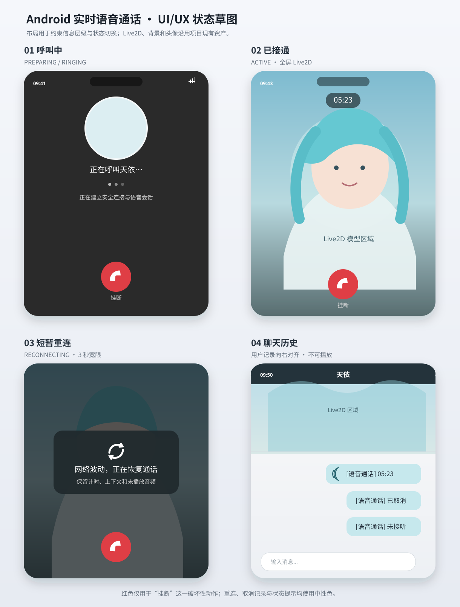
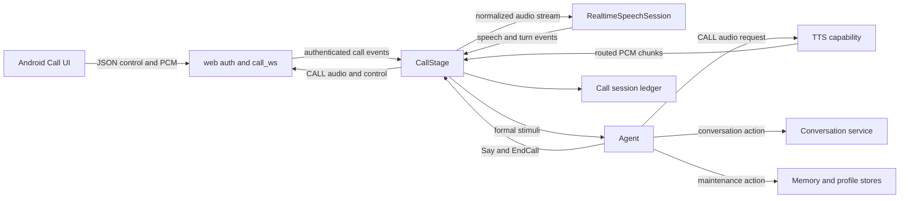
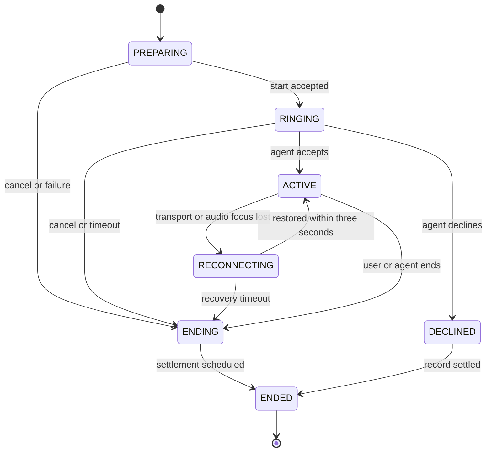

# Android 用户实时语音通话

> 状态：需求已确认，待实现  
> 平台：仅 Android 手机端  
> 协议版本：`call.v1`  
> UI 草图：[实时语音通话 UI 草图](assets/用户实时语音通话-ui.svg)

## 用户故事

1. 作为 Android 用户，我希望从聊天页菜单点击“给天依打电话”，以便进入实时语音通话。
2. 作为正在呼叫的用户，我希望看到头像、呼叫状态并听到呼叫音，也能在接通前挂断，以便明确系统正在建立通话且始终保有退出权。
3. 作为已经接通的用户，我希望全屏看到 Live2D 与背景、通话时长和挂断按钮，以便获得接近电话的沉浸体验。
4. 作为用户，我希望直接说话并快速听到天依的语音回答，以便自然连续交流，而不需要阅读或发送文字。
5. 作为用户，我希望说话时能打断天依，以便实时纠正、补充或改变话题。
6. 作为处于弱网环境的用户，我希望短暂断线后通话能继续，以便网络波动不直接丢失后续语音。
7. 作为沉默中的用户，我希望天依能在合适的时候主动提起话题，但不会仅因固定沉默次数机械挂断。
8. 作为结束通话的用户，我希望聊天历史出现一条简洁的通话记录，以便知道何时发生过通话及通话时长；通话内容只以概要参与后续上下文。
9. 作为隐私敏感的用户，我希望通话原始音频和完整逐字转录不被长期保存，以便降低敏感数据暴露风险。
10. 作为开发者，我希望通话协议、实时语音供应商、Agent 决策、TTS 和持久化边界彼此清晰，以便独立测试、替换和演进。
11. 作为开发者，我希望聊天与通话共用一致的认知维护机制，以便只在压缩点或交互结束时更新长期记忆和用户画像。

### UI/UX 草图



草图是布局和状态约束，不是像素级视觉稿。实现必须满足：

- `PREPARING` 与 `RINGING` 均使用深灰背景、居中头像、白色状态文字和底部红色挂断按钮，并循环播放呼叫音。
- `ACTIVE` 全屏展示现有背景图与 Live2D；顶部居中显示 `mm:ss`，底部保留红色挂断按钮。
- `RECONNECTING` 保持原通话画面和计时，在其上覆盖深色半透明提示层，不重新播放接通动画。
- 历史通话记录使用用户消息样式并向右对齐；已接通显示电话图标和 `[语音通话] 05:23`，接通前挂断显示 `[语音通话] 已取消`，拒接显示 `[语音通话] 未接听`，均不提供播放按钮。

## 验收标准

### AC-01 平台、入口与互斥

**状态**：Android 用户处于聊天页且不存在活动中的聊天请求或呼叫会话。  
**输入**：点击菜单按钮，再点击“给天依打电话”。  
**输出**：客户端进入通话页并请求麦克风权限；iOS、Web 和桌面端不显示该入口。

**状态**：同一用户与同一角色已有活动 `chat_ws` 或 `call_ws` 交互。  
**输入**：任意设备再次发起聊天或通话。  
**输出**：服务端原子地拒绝新交互，不抢占已有交互，不允许聊天和通话并存。

### AC-02 权限与呼叫建立

**状态**：首次进入通话页。  
**输入**：用户允许麦克风权限。  
**输出**：客户端断开 `chat_ws`，建立独立 `call_ws`，由 `web` 模块完成鉴权，然后发送带 `client_request_id` 的 `call.start`。

**状态**：用户拒绝麦克风权限。  
**输入**：普通拒绝或永久拒绝。  
**输出**：普通拒绝返回聊天页；永久拒绝额外提供前往系统设置的入口；两者均不创建通话记录。

**状态**：服务端收到重复的同用户、同角色、同 `client_request_id` 的 `call.start`。  
**输入**：客户端因超时重试发起相同请求。  
**输出**：返回相同 `call_id`，不新建第二个 CallStage、呼叫账本或 Conversation 条目。

### AC-03 接通前体验

**状态**：呼叫处于 `PREPARING` 或 `RINGING`。  
**输入**：等待服务端初始化实时语音会话、CallStage 和 Agent 接听决策。  
**输出**：显示深灰背景、现有天依头像、呼叫状态和红色挂断按钮，并循环播放呼叫音；从 `call.start` 起最迟 10 秒得到接通或终止结果，权限交互时间不计入该 10 秒。

**状态**：呼叫尚未进入 `ACTIVE`。  
**输入**：用户点击挂断。  
**输出**：立即停止呼叫音并返回聊天页；创建结果为 `CANCELLED_BEFORE_ANSWER` 的通话记录。

**状态**：呼叫尚未进入 `ACTIVE`。  
**输入**：Agent 返回拒接。  
**输出**：停止呼叫音并返回聊天页；创建结果为 `DECLINED` 的通话记录。第一版 Agent 默认接听，但接口必须保留拒接能力。

**状态**：呼叫在接通前因鉴权、并发占用、供应商初始化或系统故障失败。  
**输入**：服务端返回稳定错误码。  
**输出**：返回聊天页并提示失败，不创建 Conversation 通话记录。

### AC-04 接通与音频环境

**状态**：服务端确认进入 `ACTIVE`。  
**输入**：客户端收到 `call.active`。  
**输出**：停止呼叫音；全屏展示现有背景与 Live2D；顶部显示从 `connected_at` 开始的 `mm:ss`；底部显示红色挂断按钮；保持屏幕常亮并锁定竖屏。

**状态**：通话进入 `ACTIVE`。  
**输入**：系统允许通信音频会话。  
**输出**：Android 启用通信音频模式、AEC 和噪声抑制，遵循系统路由；第一版不提供静音、扬声器或设备选择按钮，音量键调节通话播放音量。

**状态**：首次进入 `ACTIVE`。  
**输入**：CallStage 向 Agent 提交 `CallStarted`。  
**输出**：Agent 产生简短开场语并经 CALL 音频通道播放；不在聊天界面显示文字气泡。

### AC-05 实时理解与轮次

**状态**：通话为 `ACTIVE` 且用户说话。  
**输入**：客户端持续发送 PCM16、16 kHz、单声道音频。  
**输出**：实时语音适配器输出规范事件 `speech_started`、`speech_stopped`、`turn_completed`、`turn_invalid`、`ambient_audio` 或 `provider_failed`；供应商生成的回答文本或音频一律取消并丢弃。

**状态**：适配器完成一个有效用户轮次。  
**输入**：`transcript`、`emotion`、`sound_description` 三个字段，其中至少一个非空。  
**输出**：CallStage 生成 `CallTurnCompleted` 刺激；Agent 获得统一的音频语义描述，不接触供应商 SDK 类型。

音频语义拼接规则：

| transcript | emotion | sound_description | Agent 上下文文本 |
| --- | --- | --- | --- |
| 有 | 有 | 可选 | `用户带着{emotion}的情绪说：“{transcript}”`，有声音描述时追加 `；{sound_description}` |
| 有 | 无 | 可选 | `用户说：“{transcript}”`，有声音描述时追加 `；{sound_description}` |
| 无 | 可选 | 有 | `{sound_description}`，有明确情绪时追加 `；情绪：{emotion}` |

模型应尽可能逐字转写；缺失的情绪或声音描述可以为 `null`，不得为了补齐字段额外调用一次大模型。

### AC-06 快速决策、记忆召回与首包延迟

**状态**：Agent 收到 `CallTurnCompleted`。  
**输入**：当前通话上下文、用户画像和容量默认 10 的通话记忆池。  
**输出**：`CallRecallDecisionSkill` 返回 `DIRECT` 或 `RECALL`，同时返回 `ack_style`；该 Skill 不生成正式回复、不写记忆、不直接改变 Stage。

**状态**：快速决策为 `DIRECT`。  
**输入**：当前上下文和整个通话记忆池。  
**输出**：回复 Agent 直接作答，不额外查询向量数据库，也不改变记忆池的使用顺序。

**状态**：快速决策为 `RECALL`。  
**输入**：`memory_queries` 和 `ack_style`。  
**输出**：系统立即播放与 `ack_style` 对应的预批准短过渡语，同时执行一次向量记忆召回；正式回答在过渡语播放结束后开始且不重叠。过渡语标记为 `provisional`，不参与概要、画像或长期记忆提取。

**状态**：向量召回返回新命中。  
**输入**：命中的记忆标识与内容。  
**输出**：命中按顺序放到记忆池尾部；再次命中已有记忆时将其移动到尾部；超出容量时淘汰头部最旧记忆。

**状态**：正常网络和设备条件下完成一个有效轮次。  
**输入**：`turn_completed` 时间点。  
**输出**：服务端发出第一个有效 TTS 音频块的 P95 不高于 2 秒；Android 开始播放的 P95 不高于 2.3 秒。`RECALL` 的过渡语可计入首包指标，但必须另记 `formal_reply_latency`；端点判断延迟单独统计。

### AC-07 Agent 回复与双通道路由

**状态**：Agent 在通话中执行 `Say`。  
**输入**：正式回复或回忆过渡语。  
**输出**：输出必须带 `audio_route=CALL`、`display_in_chat=false`、`is_ephemeral=true`；客户端只播放音频并驱动口型，不显示文字、不落客户端媒体缓存、不写普通聊天气泡。

**状态**：客户端收到服务端音频。  
**输入**：包含 `audio_route`、`stream_id`、`response_id`、`audio_id`、`seq`、编码、采样率、声道数和结束标记的消息。  
**输出**：`CHAT` 进入现有聊天音频处理器，`CALL` 进入独立通话音频处理器；两个处理器不共享队列和取消状态。旧 `agent_message` 缺少路由时仅可兼容为 `CHAT`，绝不得猜测为 `CALL`。

### AC-08 用户打断

**状态**：天依音频正在合成或播放。  
**输入**：实时语音供应商确认 `speech_started`。  
**输出**：服务端立即发送 `playback.stop(response_id)`，取消当前 Agent 处理与 TTS 请求，丢弃迟到音频，并记录 `UserInterrupted` 交互事实；客户端立即停止当前播放源并清空所有尚未播放的该回复音频。

**状态**：TTS 已在生成一个尚未完成的音频块。  
**输入**：收到取消。  
**输出**：200 ms 内停止发送新块；无法中止生成的半成品块不得发送。客户端保留已取消 `response_id` 的 tombstone，重连或迟到包不得恢复该回复。

### AC-09 沉默、角色挂断与通话上限

**状态**：天依回复播放完毕后连续 5 秒没有有效用户声音。  
**输入**：CallStage 生成 `CallSilenceElapsed`。  
**输出**：Agent 或快速判断返回 `SPEAK`、`WAIT` 或 `END_CALL`；不得使用固定沉默次数直接挂断。

**状态**：Agent 决定挂断。  
**输入**：`EndCall` 动作。  
**输出**：Agent 先自然告别，待告别音频播放完成后由 CallStage 结束通话。

**状态**：已接通时长达到可配置上限，默认 30 分钟。  
**输入**：距上限 30 秒或达到上限。  
**输出**：距上限 30 秒时通过 Agent 给出提示；达到上限时服务端强制进入结束流程。

### AC-10 挂断、返回键与后台

**状态**：通话页为任意非终止状态。  
**输入**：用户点击红色挂断按钮。  
**输出**：立即停止采集与播放并返回聊天页，服务端进入结束与异步结算流程。

**状态**：通话页为任意非终止状态。  
**输入**：用户按 Android 返回键。  
**输出**：显示确认对话框；返回键本身不等效于挂断。

**状态**：App 进入后台、进程被杀或系统不再允许前台通信音频。  
**输入**：生命周期事件。  
**输出**：结束通话，不提供后台通话或进程恢复。

### AC-11 三秒恢复

**状态**：`call_ws` 意外断开或音频焦点丢失。  
**输入**：客户端在 3 秒内使用同一 `call_id`、同一已鉴权用户和同一角色重新连接。  
**输出**：恢复原 CallStage、InteractionContext、记忆池、计时和音频流；不产生新的 Stimulus，也不要求 Agent 额外回复。

**状态**：恢复期间服务端仍在生成 TTS。  
**输入**：未发送或未确认的服务端音频。  
**输出**：每个回复最多保留 30 秒音频，全通话最多保留 4 MiB；达到上限时暂停消费 TTS，不淘汰最旧未确认包。恢复后先重放缺失包，再发送新包。

**状态**：恢复期间用户仍在说话。  
**输入**：客户端最多缓存 3 秒尚未确认的麦克风 PCM。  
**输出**：恢复后重发，服务端先按序号去重和排序，再交给实时语音供应商。

**状态**：3 秒内未恢复。  
**输入**：恢复宽限期结束。  
**输出**：客户端和服务端都执行结束流程，丢弃未完成用户轮次；有效通话时长截止到初次断开时刻。成功恢复的波动计入同一次通话时长。

恢复不使用恢复令牌。每次新 `call_ws` 都必须正常鉴权，并同时校验 `call_id`、用户和角色；生产环境必须使用 TLS。更强的恢复凭证列为未来安全目标。

### AC-12 通话结束、概要与历史记录

**状态**：呼叫进入过 `ACTIVE`。  
**输入**：用户挂断、Agent 挂断、超时、供应商故障或无法恢复。  
**输出**：创建一条用户来源的 Conversation 通话记录；历史界面只显示通话时长，Agent 上下文显示 `[语音通话]<内容概要>`。

**状态**：呼叫未进入 `ACTIVE`，但用户主动挂断或 Agent 拒接。  
**输入**：终止结果。  
**输出**：分别创建 `[语音通话] 已取消` 或 `[语音通话] 未接听` 的用户 Conversation 条目，不显示 `00:00`。

**状态**：用户已经离开通话页。  
**输入**：服务端执行概要与认知维护。  
**输出**：UI 不等待结算；后台最多执行 15 秒。通话概要失败时重试一次，仍失败则使用固定内容“本次通话未能形成可用概要”；历史记录允许稍后通过刷新出现。

**状态**：概要生成成功。  
**输入**：已完成的正式通话轮次。  
**输出**：生成不超过 200 个中文字符的第三人称中性概要，包含主要话题、重要用户事实、明确情绪、约定和未决事项；不得包含过渡语、网络技术细节或无依据推断。没有有效对话时使用“本次通话未形成有效对话内容”。

### AC-13 CallContent 与逻辑身份

```python
class CallOutcome(Enum):
    CONNECTED = "connected"
    CANCELLED_BEFORE_ANSWER = "cancelled_before_answer"
    DECLINED = "declined"


@dataclass(frozen=True)
class CallContent:
    call_id: UUID
    outcome: CallOutcome
    active_duration_ms: int
    summary: str | None
    end_reason: str
    text: str = field(init=False)
```

**状态**：服务端结算可记录的呼叫。  
**输入**：`user_id`、`character_id`、`call_id` 和 `CallContent`。  
**输出**：Conversation `entry_id` 使用 UUIDv5 从 `(user_id, character_id, call_id)` 稳定派生；`source=USER`、`type=call`、时间为 `requested_at`。同一逻辑身份重复写入幂等且不重复增加计数；内容冲突返回稳定错误。

数据库 `content` 保存 Agent 上下文渲染文本，结构化字段保存到元数据；历史接口根据结构化字段返回展示文本，绝不把概要返回给客户端。

### AC-14 呼叫账本与崩溃结算

呼叫账本至少保存：

| 字段 | 说明 |
| --- | --- |
| `call_id`、`client_request_id` | 呼叫身份和启动幂等键 |
| `user_id`、`character_id` | 所有权与角色边界 |
| `state`、`outcome`、`end_reason` | 生命周期与结果 |
| `requested_at`、`connected_at`、`disconnected_at`、`ended_at` | 时间事实 |
| `active_duration_ms` | 有效通话时长 |
| `summary_status`、`maintenance_status` | 两条独立结算进度 |
| `conversation_id` | 幂等关联 Conversation |
| `maintenance_turn_seq` | 已完成认知维护的最后通话轮次 |
| `created_at`、`updated_at` | 审计时间 |

账本不保存原始音频和完整逐字转录。

**状态**：服务端启动时发现陈旧呼叫账本。  
**输入**：账本状态为 `PREPARING`、`RINGING`、`ACTIVE`、`RECONNECTING` 或 `ENDING`。  
**输出**：`PREPARING/RINGING` 标记系统失败且不建 Conversation；其余状态标记异常结束，按最后更新时间估算有效时长，并创建概要为“本次通话因服务中断，未能形成可用概要”的用户通话记录，不恢复实时会话。

### AC-15 认知维护与现有聊天迁移

现有 `ReflectionSkill` 重命名并深化为 `CognitiveMaintenanceSkill`：

```python
async def maintain_if_compaction_needed(
    context: InteractionContext,
) -> MaintenanceReport: ...


async def maintain(
    context: InteractionContext,
    *,
    reason: MaintenanceReason,
) -> MaintenanceReport: ...
```

**状态**：ChatStage 或 CallStage 完成一次正式 Agent 回复。  
**输入**：Agent 行动计划中的认知维护动作。  
**输出**：调用 `maintain_if_compaction_needed`；未达到当前条目数阈值时不更新长期记忆或用户画像。当前阈值沿用超过 60 条、压缩后保留 30 条，按 Token 判断列为未来计划。

**状态**：达到压缩阈值。  
**输入**：上下文中待压缩前缀以及持久化认知维护进度。  
**输出**：被覆盖前缀全部参与摘要，但仅把进度之后的新记录用于提取向量记忆和更新用户画像；所有写入成功后，在同一数据库事务中应用压缩并把持久化维护进度推进至该批最后一条被覆盖记录。

**状态**：Stage 即将销毁。  
**输入**：`InteractionEnding` 刺激。  
**输出**：Agent 产生认知维护动作并调用 `maintain`，即使短对话未达到压缩阈值也处理进度之后的全部新内容；Stage 不得直接调用 Skill。

**状态**：向量记忆或画像写入失败。  
**输入**：维护批次。  
**输出**：不推进持久化维护进度；ChatStage 在后续生命周期重试。CallStage 重试一次，仍失败则记录失败并在 15 秒期限后清除临时转录和记忆池。

向量候选使用 `(maintenance_id, candidate_index)` 幂等；画像使用完整值幂等写入。只有数据库成功后，才通过 InteractionContext 的正式接口更新当前用户画像。通话概要生成与认知维护基于同一不可变终态快照并行执行，彼此成功与否互不阻塞；本次通话概要不参与本次维护，但作为 Conversation 条目参与以后全局聊天上下文的维护。

现有显式“请记住这些事”能力保持原行为；本功能不新增一句话级别的“请记住”识别，也不把它并入通话快速决策。

### AC-16 失败降级

| 失败点 | 第一版行为 |
| --- | --- |
| 实时语音初始化失败且未接通 | 结束呼叫，不创建 Conversation |
| `ACTIVE` 中供应商失败 | 结束通话，使用已完成轮次生成概要并创建记录 |
| 快速决策失败 | 降级为 `RECALL` |
| 向量召回失败 | 使用当前上下文与现有记忆池正式回复 |
| 主回复失败一次 | 播放预录歉意语，保持通话 |
| 单次 TTS 失败 | 重试一次；仍失败则客户端播放内置错误音，保持通话 |
| 主回复或 TTS 连续失败两轮 | 结束通话 |
| 概要失败 | 重试一次，再使用固定失败概要 |
| 认知维护失败 | 不阻塞 Conversation 记录，按 AC-15 重试与清理 |

### AC-17 隐私、删除与日志

**状态**：实时通话进行或结算。  
**输入**：PCM、转录、上下文、概要。  
**输出**：原始 PCM、Base64、完整转录和完整上下文不得写入普通日志；日志仅记录尺寸、序号、时长、状态、稳定错误码和关联 ID。阿里云实时语音服务会接收用户音频，隐私说明必须披露该事实。

**状态**：通话结束并完成或超时结算。  
**输入**：CallStage 临时数据。  
**输出**：服务端不保存音频文件；清除临时逐字转录和通话记忆池。默认管理界面不展示概要或逐字转录。

**状态**：执行账户完全重置或账户删除。  
**输入**：用户所有权范围。  
**输出**：删除呼叫账本、Conversation 通话记录、通话概要，以及由对应维护批次生成的长期记忆和画像数据；不得残留孤立关联。

### AC-18 可观测性

必须按 `call_id` 关联并采集以下无内容指标：状态耗时、供应商端点判断耗时与错误、首个有效音频延迟、正式回复延迟、TTS 耗时、打断次数、停止确认耗时、重连次数与结果、缓冲字节、概要和认知维护结果、供应商用量与成本。指标与日志不得包含音频、逐字转录、完整概要或完整上下文。

### AC-19 测试

- 单元测试：状态机、快速决策、记忆池近似 LRU、`CallContent` 渲染、UUIDv5 身份、概要约束、认知维护进度和幂等。
- 服务端集成测试：鉴权、进程内交互租约、混合帧协议、ACK/NACK、重传、3 秒恢复、打断、异步结算、账户重置。
- Agent 集成测试：`DIRECT`、`RECALL`、回忆过渡语、沉默决策、结束维护动作。
- Android 自动化测试：权限、入口、系统音频路由、打断停止、返回键确认、重连覆盖层、历史右对齐记录。
- 端到端测试：使用假的实时语音适配器、Agent 和 TTS，覆盖完整呼叫；允许提供仅测试用途的 `call_ws` 驱动器，不提供面向用户的 CLI 通话功能。
- 真实阿里云、真实设备 AEC、蓝牙路由和 2 秒延迟目标通过独立 smoke/performance 测试验证，不作为普通 CI 的稳定前提。

## 模块与架构

### 当前基线

- 服务端目前只有 `/chat_ws`，Stage 以 ChatStage 为主，没有 CallStage 与 `call.v1`。
- Android 聊天页目前没有电话入口；现有 WebView 音频链路面向普通聊天播放。
- 现有 Conversation 内容类型没有通话内容。
- 现有反思流程会在普通聊天回复后频繁执行记忆、压缩和画像更新，本功能要求迁移为统一认知维护边界。
- 现有 TTS 链路需要补充请求级取消、未完成块丢弃和 CALL 路由字段。

### 目标架构图



图中 `web` 负责鉴权和连接边界，CallStage 负责实时生命周期，Agent 负责理解后的认知决策；`RealtimeSpeechSession` 只做语音感知，不产生可见回答。

### 生命周期



`FAILED` 是未形成可记录业务结果的终态，例如鉴权失败、并发拒绝和接通前供应商初始化失败。实现可以把 `DECLINED`、`FAILED` 作为终态结果而非长期驻留状态，但对外事件与持久字段必须稳定。

### 模块划分

| 模块 | 归属 | 职责 | 禁止承担 |
| --- | --- | --- | --- |
| Android Call UI | `app` | 状态页面、权限、采集、系统音频模式、计时、挂断与重连提示 | Agent 决策、概要、长期保存音频 |
| ChatAudioProcessor | `app` | 普通聊天 TTS、气泡、历史重放和现有缓存 | 播放 CALL 音频 |
| CallAudioProcessor | `app` | CALL PCM 播放、口型、取消 tombstone、ACK 与恢复 | 聊天气泡、媒体落盘 |
| call_ws endpoint | `web` | HTTP/WS 鉴权、协议协商、帧收发、稳定错误映射 | 业务接听、语音理解、Agent 决策 |
| InteractionLeaseRegistry | 应用服务 | 单进程内原子保证同用户同角色 chat/call 严格互斥 | 分布式协调 |
| CallStage | Stage | 状态机、PCM 顺序与背压、轮次、沉默、打断、恢复、播放结算、资源关闭 | 直接访问阿里 SDK、直接调用 Skill |
| RealtimeSpeechSession | `infrastructure/models/realtime_speech` | 把供应商实时 ASR/VAD 事件归一化为稳定领域事件 | 生成天依回复、写 Conversation |
| CallRecallDecisionSkill | Agent Skill | 判定 `DIRECT/RECALL`，生成检索条件与过渡语类别 | 正式回答、写记忆、改变 Stage |
| Agent | Agent | 接听、回复、沉默行动、挂断、概要和认知维护行动计划 | 处理 PCM 包序与 WS 帧 |
| TTS capability | Agent/infrastructure | 合成 24 kHz 单声道 PCM，支持请求级取消 | 聊天与通话路由猜测 |
| CognitiveMaintenanceSkill | Agent Skill | 压缩、记忆提取、画像更新、维护批次幂等 | 每轮无条件写长期记忆 |
| Call session repository | 数据层 | 呼叫账本、启动幂等、恢复与结算进度 | 保存音频或完整转录 |
| Conversation service | 应用服务 | 稳定 UUID 身份、CallContent 入库、历史投影 | 返回通话概要给客户端 |

第一版仅支持单一 ServerRuntime。若配置为多 worker，启动检查必须禁用通话或拒绝启动通话能力，不能静默依赖进程内互斥。分布式租约属于极远期且低概率需求。

### 呼叫建立顺序

1. 用户从菜单进入通话页，客户端申请麦克风权限。
2. 权限允许后断开 `chat_ws`，再连接 `call_ws`。
3. `web` 模块完成正常鉴权，客户端发送带 `client_request_id` 的 `call.start`。
4. 服务端先幂等建立呼叫身份，再原子获取同用户、同角色的交互租约。
5. CallStage 初始化上下文、预热近期 Conversation 与基础画像，并创建实时语音会话。
6. 系统能力准备完成后，才请求 Agent 的接听决策；第一版固定接受，但保留拒接动作。
7. Agent 接受后进入 `ACTIVE` 并发送开场语；任一接通前终止路径都关闭 `call_ws` 并恢复 `chat_ws`。

### Agent 与 Stage 职能边界

CallStage 只向 Agent 提交以下正式刺激：

```python
CallStarted(call_id, started_at)
CallTurnCompleted(call_id, turn_seq, audio_content)
CallSilenceElapsed(call_id, silence_ms)
CallEnding(call_id, reason, final_snapshot)
InteractionEnding(interaction_id, reason)
```

`speech_started` 和原始 PCM 不进入 Agent。Agent 第一版允许产生 `Say`、`ChangeExpression`、`EndCall` 以及不向聊天 UI 显示的常规长期业务动作；`Sing`、预制长音频和聊天气泡不允许在通话中执行。

Stage 销毁链路必须为：

```text
Stage
  -> Agent.handle_stimulus(InteractionEnding)
  -> CognitiveMaintenance ActionPlan
  -> Agent.realize_action_plan(...)
  -> CognitiveMaintenanceSkill.maintain(...)
  -> close InteractionContext
```

### 实时语音抽象

```python
class RealtimeSpeechSession(Protocol):
    async def start(self, config: RealtimeSpeechConfig) -> None: ...
    async def push_audio(self, frame: AudioFrame) -> None: ...
    def events(self) -> AsyncIterator[RealtimeSpeechEvent]: ...
    async def close(self) -> None: ...


class RealtimeSpeechSessionFactory(Protocol):
    async def create(self, call_id: UUID) -> RealtimeSpeechSession: ...
```

首个实现位于 `infrastructure/models/realtime_speech`，可使用支持实时端点判断的阿里云模型，但 Spec 不绑定具体 Qwen Realtime 型号。另提供内存测试适配器。供应商若自动生成回答，适配器必须立即取消并丢弃，禁止进入 Agent、客户端或 Conversation。

### 快速决策接口

```python
class RecallMode(Enum):
    DIRECT = "direct"
    RECALL = "recall"


class AckStyle(Enum):
    NONE = "none"
    THINKING = "thinking"
    EMPATHY = "empathy"
    CONFIRMING = "confirming"


@dataclass(frozen=True)
class CallRecallDecision:
    mode: RecallMode
    memory_queries: tuple[str, ...]
    ack_style: AckStyle
```

第一版可由现有快速模型实现。未来应优先调研独立本地 Judge；候选包括社区项目 AgentJev-0.6B。它是基于 Qwen3-0.6B 的社区决策模型，不等同于 TypeSafe 官方 Jev 的本地发行，不能在完成本项目数据集验证前直接用于生产路由。

### 接口规范

#### 1. call.start

```json
{
  "protocol": "call.v1",
  "type": "call.start",
  "seq": 1,
  "client_request_id": "018f4ca2-4c9d-7ad8-8f2f-941f73d6d82a",
  "character_id": "luotianyi",
  "client": {
    "platform": "android",
    "app_version": "0.5.0"
  },
  "audio": {
    "encoding": "pcm_s16le",
    "sample_rate": 16000,
    "channels": 1
  }
}
```

成功响应必须包含服务端生成的 `call_id`。未知协议版本使用稳定错误码拒绝，不进行猜测兼容。

#### 2. call.resume

```json
{
  "protocol": "call.v1",
  "type": "call.resume",
  "seq": 18,
  "call_id": "606ec5e6-a330-4e6c-b07a-8432a5716c8f",
  "character_id": "luotianyi",
  "last_received": {
    "server_control_seq": 42,
    "server_audio_seq": 317
  },
  "last_acked_client_seq": 96
}
```

恢复授权依赖新连接的正常鉴权，以及同一 `call_id`、同一用户、同一角色三项同时匹配。第一版不使用恢复令牌。

#### 3. 服务端音频流开始

```json
{
  "protocol": "call.v1",
  "type": "audio.stream_started",
  "seq": 43,
  "audio_route": "CALL",
  "stream_id": 12,
  "response_id": "resp_01k",
  "audio_id": "audio_01k",
  "encoding": "pcm_s16le",
  "sample_rate": 24000,
  "channels": 1
}
```

#### 4. 二进制帧头

二进制帧由固定长度帧头和 PCM payload 组成。具体字节布局在实现 ADR 中冻结，但第一版必须包含：

| 字段 | 约束 |
| --- | --- |
| protocol version | 可拒绝未知版本 |
| audio route | `CHAT` 或 `CALL`，通话帧必须为 `CALL` |
| direction | `CLIENT_TO_SERVER` 或 `SERVER_TO_CLIENT` |
| stream id | 与 `audio.stream_started` 绑定的短整数 |
| seq | 该方向跨控制帧和音频帧单调递增 |
| flags | 至少包含 final 与 retransmit |
| payload length | 与实际 payload 严格一致 |

每个方向的控制帧和二进制帧共享一条单调序列。重复帧幂等忽略；发现缺口时发送 NACK 请求重传；ACK 表示已连续接收的最高序号并允许批量确认。

#### 5. 播放停止

```json
{
  "protocol": "call.v1",
  "type": "playback.stop",
  "seq": 61,
  "call_id": "606ec5e6-a330-4e6c-b07a-8432a5716c8f",
  "response_id": "resp_01k",
  "reason": "user_interrupted"
}
```

客户端回传停止确认；确认耗时纳入指标。取消 tombstone 的生命周期至少覆盖整个呼叫会话。

#### 6. 结束事件

```json
{
  "protocol": "call.v1",
  "type": "call.ended",
  "seq": 88,
  "call_id": "606ec5e6-a330-4e6c-b07a-8432a5716c8f",
  "outcome": "connected",
  "end_reason": "user_hangup",
  "active_duration_ms": 323000
}
```

### 数据一致性与结算顺序

1. `call.start` 先用 `client_request_id` 建立或读取呼叫账本，再获取交互租约。
2. 获取租约后创建 CallStage、InteractionContext 和实时语音会话。
3. 进入 `ACTIVE` 时持久化 `connected_at`；所有终止路径先冻结不可变终态快照。
4. 实时媒体资源关闭且终态快照冻结后释放交互租约；客户端立即收到结束事件、返回聊天页并可重新连接 `chat_ws`，服务端在后台并行执行概要和认知维护。
5. 概要或固定回退文本准备好后，以稳定 UUID 写 Conversation，并关联 `conversation_id`。
6. 两条结算任务完成或达到 15 秒期限后清除临时转录与记忆池；后台结算不得继续占用实时交互租约。

## 备注

### 关键技术选型

- Android 原生通信音频模式、AEC 与噪声抑制；16 kHz 单声道上行、24 kHz 单声道下行。
- 独立 `call_ws` 与 `call.v1` 混合 JSON/二进制协议；`chat_ws` 与 `call_ws` 严格互斥。
- 阿里云实时语音能力作为首个 `RealtimeSpeechSession` 实现，但领域接口不绑定具体模型。
- Agent 主导回复、记忆、主动说话和挂断；实时语音供应商只负责语音感知。
- 延续现有 TTS 能力，新增请求级取消、CALL 路由、序号和未完成块丢弃。
- 通过呼叫账本与稳定 Conversation UUID 实现启动、恢复和结算幂等，不保存音频或完整逐字转录。
- Reflection 重命名并深化为 Cognitive Maintenance，只在压缩点和 Stage 销毁时提取记忆、更新画像。

### 非目标

- iOS、Web、桌面端电话入口或通话实现。
- 来电、后台通话、进程被杀后的实时恢复。
- 通话字幕、逐轮文字展示、音频下载、通话录音或重放。
- 静音、扬声器开关、手动蓝牙或音频设备选择。
- 唱歌、预制长音频、通话内普通聊天气泡。
- 说话人识别、声纹认证。
- 阿里云 AOQ 或 WebRTC 迁移。
- 客户端模型 Key、本地音频理解或本地图片理解。
- 多 worker、多节点和分布式租约。
- 按 Token 驱动上下文压缩。
- 面向用户的 CLI 实时通话。

### 未来目标

1. **优先调研独立 Judge**：尽快验证 Jev 思路的本地部署可行性，包含社区 [AgentJev-0.6B 代码仓库](https://github.com/malevrigns/agent-jev)及其[公开权重](https://huggingface.co/aimeigaoshou/agent-jev)等候选；建立项目自己的 `DIRECT/RECALL`、`SPEAK/WAIT/END_CALL` 标注集，评估中文能力、置信度校准、P95 延迟、资源占用和失败回退。先 shadow 运行，不能因“结构化概率输出”而假定判断正确。
2. 支持更强的通话恢复凭证与重放攻击防护；当前同 call、同用户、同角色恢复是第一版安全折中。
3. 评估阿里云 AOQ、WebRTC 或其他实时媒体通道，但不改变 Agent 与语音感知边界。
4. 支持 iOS、桌面端、来电、后台通话与设备路由控制。
5. 评估声纹与说话人识别，单独设计明确的注册、撤销、隐私和误识别边界。
6. 支持客户端配置模型 Key，在本地完成音频或图片理解并上传结构化理解结果。
7. 将上下文压缩阈值从条目数演进为 Token 与模型上下文预算。
8. 仅在确有多进程部署需求时评估分布式交互租约；该方向为极远期、低概率需求。

### 开发前置与文档同步

- 实现前为 `call.v1` 二进制帧布局建立 ADR，并冻结字节序、字段宽度、最大 payload 和稳定错误码。
- 实现时同步更新代码地图、数据库迁移说明、客户端与服务端协议测试夹具。
- `CognitiveMaintenanceSkill` 是跨聊天与通话的迁移，必须先用现有 ChatStage 回归测试锁定行为，再接入 CallStage。
- AgentJev-0.6B 是社区候选，其公开模型卡和仓库可用于调研起点，但不得把它表述为官方 Jev 的本地权重或未经验证的生产依赖。
