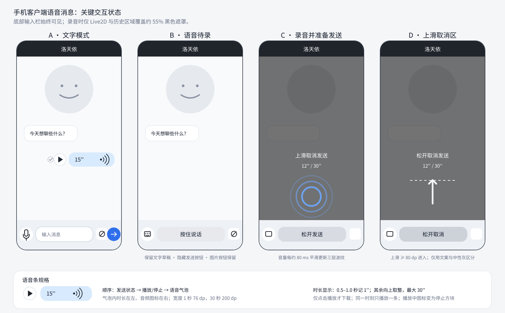
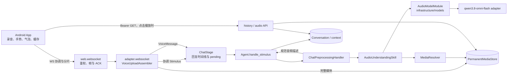
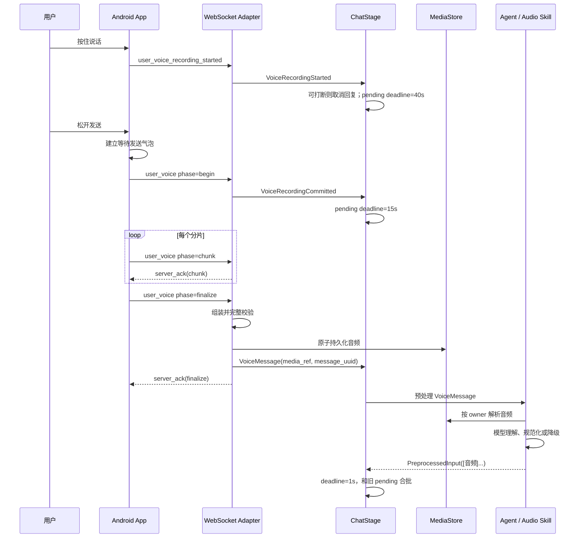
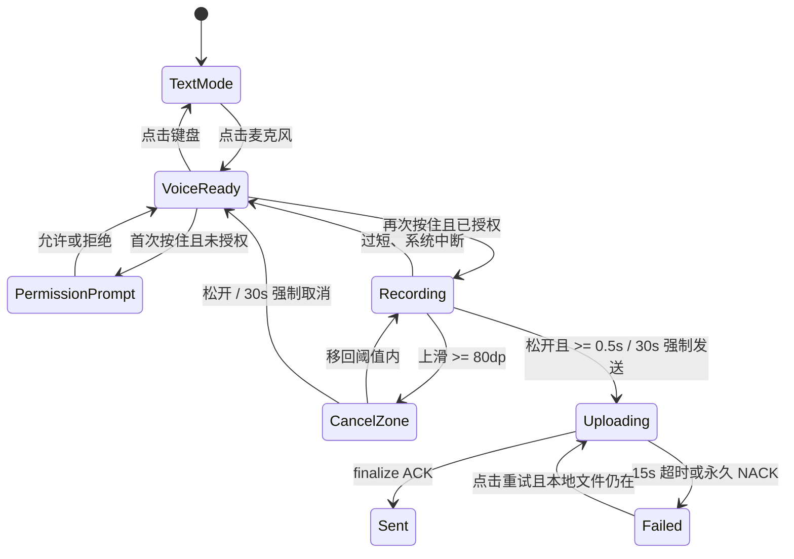

# 用户语音消息

> 状态：需求已确认；实现已完成并以工单 PR #214–#222 合入 `feat/voice`（工单 #205–#213 已关闭），待集成 `dev`。
>
> 范围：手机客户端录制、发送、历史展示与回放；服务端接收、保存、理解并投递给 Agent。
>
> 目标版本：v0.5.0。

## 用户故事

1. 作为 Android 手机客户端用户，我希望在文字输入和按住说话之间切换，以便在不丢失文字草稿的情况下选择更方便的输入方式。
2. 作为 Android 手机客户端用户，我希望按住按钮录音、上滑取消、松开发送，以便用熟悉的手势控制一条语音是否进入对话。
3. 作为 Android 手机客户端用户，我希望录音时能看到音量反馈、已录时长和取消提示，以便确认麦克风正在工作并避免误发。
4. 作为 Android 手机客户端用户，我希望在聊天历史中看到语音时长并按需播放，以便识别、下载和重放自己发出的语音，同时避免无意义的重复下载。
5. 作为对话用户，我希望角色能理解语音中的原话、明确情绪或非语言声音，以便语音获得与文字、图片一致的对话响应。
6. 作为连续对话用户，我希望开始录音、取消录音和提交录音能协调当前回复时间线，以便角色不会在我尚未说完或正在上传时抢答。
7. 作为账户所有者，我希望完全重置用户数据时同时删除聊天记录、图片和语音媒体，以便服务端不残留可再次访问的个人媒体。
8. 作为项目开发者，我希望能通过自动化测试客户端发送测试音频、等待回复并验证历史和下载，以便在没有手工操作手机时验证端到端链路。

### UI/UX



图中尺寸为交互约束，不是像素级视觉稿。实现须复用现有主题颜色、圆角、间距和用户消息气泡，不为语音功能建立第二套视觉系统。历史区域中的用户文字和语音消息均以右边缘为锚点；语音条的发送状态和播放按钮位于气泡左侧，不得把整行误排到左侧。“按住说话”、按压发送和取消状态均使用浅灰色中性表面；取消状态通过文案、上滑指示、触觉反馈和较深一级的中性灰表达，不使用红色。

| 状态 | 左侧模式按钮 | 中部输入区 | 右侧操作 | 页面反馈 |
| --- | --- | --- | --- | --- |
| 文字模式 | 麦克风 | 保留现有文本框；按剩余宽度缩短 | 保留图片和文字发送按钮 | 无遮罩 |
| 语音待录 | 键盘 | 浅灰色圆角“按住说话”按钮，文字使用中性前景色 | 保留图片按钮，隐藏文字发送按钮 | 无遮罩 |
| 正在录音 | 键盘 | 略深一级的浅灰按压态，显示“松开发送” | 图片按钮不可触发新选择 | Live2D 与历史区域覆盖约 55% 黑色遮罩；输入栏不变暗；显示波纹、时长和“上滑取消发送” |
| 取消区 | 键盘 | 中性灰按压态，显示“松开取消”，不使用红色 | 图片按钮不可用 | 上滑至少 80 dp 后提示改为“松开取消发送”，进入时仅振动一次 |

## 验收标准

以下每条标准均包含可独立验证的状态、输入和输出。

### 一、输入模式与权限

#### AC-01 文字与语音模式切换

- **状态**：用户位于 Android 手机聊天页，文本框内可以已有未发送草稿。
- **输入**：点击文本框左侧的麦克风按钮，再点击同位置的键盘按钮。
- **输出**：第一次点击后键盘收起，文本框变为浅灰色圆角“按住说话”按钮，麦克风图标变为键盘图标，文字发送按钮隐藏，图片按钮保留；第二次点击后恢复文本框、麦克风图标和文字发送按钮，原文字草稿仍在。桌面端布局不发生变化。

#### AC-02 首次麦克风授权

- **状态**：应用尚未取得麦克风权限，当前处于语音待录状态。
- **输入**：第一次按下“按住说话”，随后在系统权限框中允许麦克风。
- **输出**：第一次按压只触发系统权限请求，不开始录音、不发送录音开始信号；授权成功后回到语音待录状态，用户必须再次按住才开始录音。

#### AC-03 永久拒绝权限

- **状态**：系统已将麦克风权限标记为不可再次弹窗请求。
- **输入**：用户按下“按住说话”。
- **输出**：应用不录音，展示包含“去设置”的轻提示或对话框；点击后打开当前应用的系统设置页；不产生协调信号、临时音频或聊天气泡。

### 二、录音手势与生命周期

#### AC-04 开始录音

- **状态**：麦克风权限已授予，处于语音待录状态且没有另一条语音正在上传。
- **输入**：用户按住“按住说话”。
- **输出**：立即开始本地 M4A/AAC-LC 录音，发送一次录音开始协调信号；停止本地正在播放的用户语音、天依回放和在线 WebView 音频，复位回放按钮，并使未完成的下载/加载播放请求失效；Live2D 与历史区域变暗，输入栏保持原亮度；出现三层同心波纹、`0'' / 30''` 计时和“上滑取消发送”。

#### AC-05 音量反馈

- **状态**：录音正在进行。
- **输入**：麦克风瞬时音量连续变化。
- **输出**：三层波纹按约 80 ms 周期使用平滑后的音量更新，幅度随音量变化且无明显闪烁；颜色同时结合文字提示表达状态，不以颜色作为唯一提示。

#### AC-06 上滑取消与返回发送区

- **状态**：录音正在进行，初始触点已记录。
- **输入**：手指向上移动至少 80 dp，之后可以移回阈值内并松开。
- **输出**：越过阈值时进入取消区，提示改为“松开取消发送”，按钮切换为较深一级的中性灰，并仅触发一次触觉反馈；取消态不得使用红色，仅通过明确文案、上滑指示、触觉反馈和中性灰层级区分。移回阈值内恢复发送区；在取消区松开则删除本地临时音频、发送录音取消协调信号且不显示气泡，在发送区松开则进入 AC-09。

#### AC-07 过短录音

- **状态**：录音开始不足 0.5 秒。
- **输入**：用户在发送区松开。
- **输出**：应用按取消处理，删除临时音频，发送录音取消协调信号，显示“说话时间太短”轻提示；不生成语音气泡，不上传音频。

#### AC-08 30 秒强制结束

- **状态**：录音持续到客户端计时 30.0 秒。
- **输入**：用户仍按住按钮；手指可能处于发送区或取消区。
- **输出**：客户端立即停止录音；若处于发送区则自动提交，若处于取消区则取消。界面最多显示 30 秒。服务端以解析出的媒体时长为准，接受 0.5–30.5 秒以容忍移动端停止录音的调度误差。

#### AC-09 提交录音

- **状态**：有效录音不少于 0.5 秒，用户在发送区松开，或达到 30 秒且位于发送区。
- **输入**：完整本地 M4A 文件及其时长。
- **输出**：立即生成右对齐的等待发送语音气泡，进入不可撤回的录音提交中状态；此时才开始上传。被取消的音频在任何情况下都不离开手机。

#### AC-10 系统中断

- **状态**：录音正在进行。
- **输入**：应用进入后台、用户离开聊天页、系统中断录音，或录音 API 报错。
- **输出**：应用停止并删除临时音频，按录音取消处理；不上传残片、不显示语音气泡。若应用在录音提交中被杀死，重启后不恢复未完成上传。

### 三、消息气泡、发送状态与回放

#### AC-11 语音条样式和时长

- **状态**：聊天历史包含一条用户语音消息或等待发送的语音气泡。
- **输入**：服务端或本地提供 0.5–30.5 秒时长。
- **输出**：语音条复用用户气泡，整行以历史区域右边缘为锚点，与用户文字气泡右边缘对齐；从左到右为发送状态图标、圆形播放按钮、语音气泡，状态和播放控件不得导致整行左对齐。语音气泡内部从左到右为时长、音频图标；音频图标由一个圆点和三段同心同圆心角圆弧组成。0.5–1.0 秒显示 `1''`，其余秒数向上取整且不超过 `30''`。气泡高度等同单行文字，宽度从 1 秒 76 dp 到 30 秒 200 dp 线性变化。

#### AC-12 乐观发送与失败重试

- **状态**：录音已经提交。
- **输入**：上传过程成功、可重试失败或超过 15 秒自动重试预算。
- **输出**：提交后立即显示等待状态；收到 `finalize` 成功 ACK 后变为已发送；超过总预算或收到永久失败后，在用户消息左侧原发送失败图标的位置显示红色填充的圆形重试按钮，内部使用白色圆弧箭头图标，不再显示发送失败图标。点击后调用发送重试回调，使用仍存在的本地音频并复用同一个逻辑消息 ID；确认发送结果前重复点击无效，显示等待状态，成功后不再显示重试按钮，失败后恢复重试按钮。本地文件不存在时给出明确提示；服务端不得创建重复语音消息。

#### AC-13 按需下载和播放

- **状态**：用户点击历史语音的播放按钮。
- **输入**：本地缓存可能命中或未命中；服务端可能成功或失败返回音频。
- **输出**：命中缓存时直接播放；未命中时按钮显示加载状态，以 Bearer Token 下载本人音频，原子写入缓存后播放。播放中按钮变为停止方块；同一时刻只播放一条语音且不自动播放。同一消息的并发点击共享一个下载任务；失败后恢复播放图标并给出轻提示，可再次点击重试。

#### AC-14 本地音频缓存

- **状态**：应用获得一条本地录音或完成历史音频下载。
- **输入**：音频进入缓存，缓存总量可能超过 100 MiB。
- **输出**：刚录制的本地文件直接作为该消息初始缓存；缓存以 100 MiB 为上限，按 LRU 删除最久未使用且当前未播放的项目。历史页面加载不主动下载音频，应用重启后允许再次按需下载。

#### AC-15 录音期间收到角色输出

- **状态**：用户正在录音，服务端仍发送 Agent 文本或音频输出。
- **输入**：客户端收到一条 Agent 输出。
- **输出**：文本正常进入历史；可持久化音频正常保存到本地但不播放。被录音打断或录音期间到达的整条语音（包括录音结束后才到达的尾包）不自动补播，取消、提交和后台中断均遵循此规则；用户后续可手工重放。若该服务端回复仍处于可打断阶段，录音开始信号按 AC-18 打断它。

### 四、上传、持久化与鉴权

#### AC-16 分片上传成功

- **状态**：已提交的音频为 `audio/mp4`、M4A 容器、AAC-LC 编码，原始字节不超过 1 MiB，客户端声明不超过 32 个分片且每片解码后不超过 48 KiB。
- **输入**：通过现有 `/chat_ws` 按 `begin → chunk* → finalize` 发送，所有操作使用稳定的幂等 ID。
- **输出**：服务端允许乱序到达的分片，校验完整索引、分片边界、拼接总字节、MIME、容器、编码和实际时长，原子落入永久媒体库，并且只向 Stage 接纳一次 `VoiceMessage`。服务端在组装后自行计算内容 SHA-256 用于媒体元数据和幂等校验，客户端不提交摘要。`finalize` 成功 ACK 表示上述动作均已完成，不表示模型已经理解、对话表已经写入或 Agent 已回复。

完成接纳后，Adapter 在已有媒体目录原子保存 `ingress_receipt.json`，包含版本、上传参数、分片 SHA-256、消息 UUID 和时长；媒体存储仅提供所有者校验及凭据读写，不决定 Stage 接纳。内存完成记录仅保存摘要，可在 10 分钟后释放；过期及正常运行时重建后从凭据恢复 ACK，不再次投递协调事件或 VoiceMessage。媒体存在但没有凭据时不得推断已接纳，仍校验内容并继续尝试接纳；旧版本媒体也遵循此规则。

凭据写入失败时，本进程保留轻量完成记录且不按 TTL 丢弃，后续重试再次尝试落盘；未落盘记录达到上传容量配置上限时拒绝新增上传，避免无界增长。凭据损坏/读取失败返回可重试错误，不重新接纳。凭据随媒体删除。此方案基于稳定运行的单进程接纳编排：Stage 接纳与凭据落盘之间不是跨模块事务，不保证在该窗口崩溃后的 exactly-once，也不恢复已经丢失的 Stage 内存任务；成功 ACK 仍只表示接纳，不表示理解和回复已完成。

#### AC-17 分片重试、冲突和资源限制

- **状态**：上传断线、ACK 丢失、分片重复、内容冲突、超限或长期不完整。
- **输入**：同一用户重发同一操作，或提交不合法数据。
- **输出**：同索引同字节重放成功 ACK；同索引不同字节返回永久冲突；客户端存活时在 15 秒总预算内从失败操作继续，重连后复用 ID；每个用户最多一条未完成上传，服务端默认最多 128 条未完成上传且可配置；不完整上传 10 分钟后清理。Base64、格式、大小、分片数或时长不合法时返回稳定 NACK，且不会落库或进入 Stage。

#### AC-18 音频历史和本人下载

- **状态**：认证用户请求对话历史，或请求下载某条音频消息。
- **输入**：历史查询；或 `GET /media/audio/{message_uuid}` 并携带 Bearer Token。
- **输出**：历史只返回语音元数据和客户端占位文案，不返回 Base64、模型转写、情绪或声音描述；下载接口只允许消息所有者访问，按 `(user_id, message_uuid, type=audio)` 解析媒体并流式返回 `audio/mp4`。越权、未知、已删除或非音频消息不得泄露媒体是否属于其他用户。

### 五、Stage 协调与 Agent 理解

#### AC-19 开始录音和打开图片选择的打断语义

- **状态**：Stage 已有 pending 输入或正在基于既有输入生成回复，且当前回复尝试可能处于可打断或不可打断阶段。
- **输入**：收到 `VoiceRecordingStarted` 或 `ImageSelectionOpened`。
- **输出**：仅当 chat handle 仍在运行、尚未形成正式回复且允许打断时，取消该 handle 并把尚未消费的既有输入恢复到 pending。`StartThinking` 状态通知不关闭该窗口；正式回复形成后 handle 不再因普通刺激取消，已排队 ActionPlan 及正在执行的 realize 均继续，其他 handle（包括预处理）不取消。随后仅在存在 pending 时重设时间线：语音开始后 40 秒，图片选择打开后 60 秒。

#### AC-20 取消、提交、失败和理解完成的时间线

- **状态**：Stage 存在待处理输入或语音提交窗口。
- **输入**：依次可能收到录音取消、`user_voice.begin`、上传失败、完整 `VoiceMessage` 或语音预处理完成。
- **输出**：录音取消后 deadline 为 1 秒；`begin` 被 Adapter 转成 `VoiceRecordingCommitted` 后 deadline 为 15 秒；上传最终失败后 deadline 为 1 秒；完整语音进入 pending 后必须等待预处理，不得提前回复；预处理完成后 deadline 为 1 秒。语音成功时，被打断后恢复的旧输入和语音进入同一个回复批次。

#### AC-21 图片选择关闭保持一致

- **状态**：Stage 因图片选择打开而等待，且存在 pending。
- **输入**：收到 `ImageSelectionClosed`。
- **输出**：不再额外取消回复尝试，deadline 设为 1 秒；现有图片选择行为同步采用 AC-19 的可打断判定，不保留当前“只延长、不打断”的旧语义。

非空 `UserTyping`（`text_length > 0`）同样按上述边界尝试取消 chat handle，并在有 pending 时将等待截止时间重设为事件到达时间加 `typing_wait`（默认 10 秒）；持续打字持续顺延。空打字事件不取消 handle，有 pending 时解除打字等待、尽快调度。成功打断后，handle 清理其 `thinking` 标记，无其他思考请求时发送 `WAITING` 停止思考表现；不可打断的回复不因打字事件被强制切换状态。

#### AC-22 音频理解成功

- **状态**：完整 `VoiceMessage` 已进入 Agent 预处理，永久媒体可由所有者身份解析。
- **输入**：音频包含清晰语音、明确情绪、无语音声音，或语音与显著声音的组合。
- **输出**：使用 `qwen3.8-omni-flash` 得到同时包含 `transcript`、`emotion`、`sound_description` 三个键的结构化结果，每个值为字符串或 `null`；由服务端转换为 `AudioUnderstandingResult`，派生 `AudioUnderstandingStatus.UNDERSTOOD`，再通过唯一的 `render_audio_context` 方法确定性构造非空音频描述，并以 `PreprocessedInput.text` 投递给后续 Agent。说话内容尽量逐字保留，只有情绪明确时才描述情绪，无文字时描述声音。

#### AC-23 音频理解重试与降级

- **状态**：音频理解请求超时、网络或供应商报错，或返回空白/不可解析的结构化结果。
- **输入**：第一次模型调用失败。
- **输出**：等待 1 秒后重试一次，每次调用最多 20 秒；第二次仍失败时构造 `AudioUnderstandingStatus.NOT_UNDERSTOOD`，三个理解字段均为 `None`，由 `render_audio_context` 生成 `[音频]听不清`，视为预处理成功并在 1 秒后允许 Stage 回复。已发送气泡保持成功，不因理解降级改为发送失败；日志不记录音频、Base64、完整转写或完整描述。

#### AC-24 必要配置失败

- **状态**：业务 ServerRuntime 初始化。
- **输入**：`QWEN_API_KEY` 或已确认的音频模型配置缺失、非法。
- **输出**：业务运行时显式启动失败并给出不含密钥的配置错误；管理 Web 仍可启动和使用。运行期间的供应商故障按 AC-23 降级，不使服务端整体退出。

### 六、用户重置、兼容客户端与测试入口

#### AC-25 完全重置用户

- **状态**：管理员或既有流程触发“完全重置用户”。
- **输入**：一个有效用户 ID；用户可能拥有聊天记录、向量/缓存、图片和语音媒体。
- **输出**：幂等删除聊天记录、相关向量/缓存、图片和语音；任一步骤失败则整体结果为失败并指出失败步骤，重试安全，不返回虚假成功。重置完成后原图片和音频均无法再通过鉴权接口访问。

#### AC-26 未适配客户端的兼容显示

- **状态**：桌面端或 CLI 读取包含 `type=audio` 的历史。
- **输入**：服务端返回语音元数据。
- **输出**：客户端至少显示 `[语音消息]` 占位，不崩溃、不尝试自动下载或播放；产品级发送、下载、重放和桌面录音仍保留在 TODO，不纳入本次交付。

#### AC-27 测试用 CLI 端到端链路

- **状态**：本地或 CI 启动了可用服务端和离线假音频理解模型。
- **输入**：测试驱动读取一个合法 M4A 文件，使用真实 WebSocket 协议发送并等待服务端回复。
- **输出**：驱动自动校验各操作 ACK、只产生一条语音消息、观察到 listening/thinking/回复事件、回复在限定时间内完成、历史存在语音元数据、Bearer 下载成功且 SHA-256 与原文件一致；任一条件不符时以非零退出。该入口可以增加最小内部 transport/session 方法，但不得新增用户可见的 CLI 语音命令。

## 模块与架构

### 当前实现基线

本节描述写 Spec 时已经存在的事实，不表示目标功能已经可用。

1. `server/src/domain/agent/stimulus.py` 已有 `VoiceMessage(media_ref, transcript, client_msg_id)` 占位领域类型；`ChatStage` 也把它归为内容输入。
2. WebSocket 业务事件集合已包含 `user_voice`，但 `server/src/adapter/websocket/_input.py` 会明确拒绝它，尚无 wire payload 协议。
3. `ChatPreprocessingHandler` 收到 `VoiceMessage` 时只产生 `text=None`，不会理解音频。
4. `AudioContent` 只保存一个文字字段；历史响应没有语音时长和下载能力。
5. 名称中立的 `PermanentMediaStore` 和 `FilesystemMediaResolver` 实际只校验图片，不能保存或解析音频。
6. `ImageSelectionOpened` 当前只延长等待，不会打断可打断回复；本功能会按 AC-19 有意改变该行为。
7. 现有 LLM/VLM 适配器不承载音频；音频理解是一个新的真实外部服务边界。

### 目标架构



架构遵循现有 `App → web → adapter → Stage → Agent` 调用链。分片、Base64、重放和临时文件只存在于 WebSocket Adapter 的深模块内部；Stage 和 Agent 只接触协调事实、`MediaRef` 和完整 `VoiceMessage`，不理解分片协议。

### 发送数据流



### Stage 时间线规则

| 输入或结果 | 是否为正式对话内容 | 对可打断回复的动作 | 存在 pending 时的新 deadline |
| --- | --- | --- | --- |
| `VoiceRecordingStarted` | 否 | 取消回复，恢复未消费输入 | 40 秒 |
| `ImageSelectionOpened` | 否 | 取消回复，恢复未消费输入 | 60 秒 |
| `VoiceRecordingCancelled` | 否 | 不新增取消 | 1 秒 |
| `ImageSelectionClosed` | 否 | 不新增取消 | 1 秒 |
| `VoiceRecordingCommitted` | 否 | 不新增取消 | 15 秒 |
| `VoiceUploadFailed` | 否 | 不新增取消 | 1 秒 |
| 完整 `VoiceMessage` 到达 | 是 | 沿用内容输入规则 | 阻塞，等待预处理 |
| 语音预处理完成或降级完成 | 是 | 无 | 1 秒 |

普通刺激（新文本/图片/完整语音、非空打字、录音开始、打开选图）只查询在途 chat handle 的请求级打断许可。Agent 在正式回复落库和计划交付前关闭许可；Stage 一旦接纳非 `StartThinking` 计划，永久关闭该批次的普通取消入口，即使计划已执行完而 handle 尚未返回也不重新开放。普通刺激不撤销 handle 已结束的批次、不移除排队计划、不取消 realize，也不发送 `CancelDelivery`；断线、退出交互和服务关闭仍执行独立的生命周期取消。Stage 不撤销已产生的副作用；手机客户端仍按 AC-04 停止当前音频播放，二者是不同边界。

### 模块划分

| 模块 | 归属 | 职责 | 明确不负责 |
| --- | --- | --- | --- |
| 语音输入组件与状态控制器 | `app` 聊天页 | 模式切换、权限、手势阈值、计时、音量动画、系统中断清理 | 分片校验、服务端理解 |
| `VoiceRecorder` | `app` 平台能力边界 | 用少量稳定方法封装当前 Expo 录音 API，输出 M4A/AAC-LC、时长和 metering | UI、上传队列、历史播放 |
| 语音发送项 | `app` 现有消息发送/重试机制 | 将一条语音作为一个不可交错的持久发送项，内部执行 begin/chunk/finalize、15 秒预算和 ACK 关联 | 把每个 chunk 暴露成独立聊天消息 |
| 语音播放与缓存 | `app` | 单实例播放、点击后下载、并发下载合并、100 MiB LRU、原子缓存 | 页面打开时预取全部历史音频 |
| WebSocket 帧处理 | `server/src/web/websocket` | 鉴权、帧大小边界、`server_ack`/NACK 发送 | 音频业务校验、组装、Stage 时间线 |
| `VoiceUploadAssembler` | `server/src/adapter/websocket` | 隐藏 begin/chunk/finalize/abort、Base64、临时分片、幂等、限额、TTL、完整校验与 finalize 编排 | 模型调用、对话回复 |
| 语音协调映射 | `server/src/adapter/websocket` | 将 wire 事件转换为领域协调 Stimulus；把完成上传转换为 `VoiceMessage` | 在 Adapter 内直接修改 Stage 私有状态 |
| `ChatStage` | `server/src/stage` | pending、可打断判定、恢复旧输入、40/60/15/1 秒时间线、等待预处理 | 解析 M4A、调用阿里云 |
| `PermanentMediaStore` / `MediaResolver` | `server/src/infrastructure/media` | 按 owner 保存、解析和删除图片/音频；原子发布；媒体类型校验 | 对话业务、Agent prompt |
| `AudioUnderstandingSkill` | Agent SharedSkills | owner 绑定解析、调用音频模型模块、重试、业务结构校验、规范文本构造、降级 | 模型供应商通信、分片上传、公开 HTTP 响应 |
| `AudioModelModule` | `server/src/infrastructure/models` | 与现有 `VLMModule` 采用一致的注册、配置、客户端委托、调用观测和响应信封；生产使用阿里云适配器，测试注入假模块 | 媒体所有权、Stage 调度、Agent 音频描述规范 |
| 对话持久化与历史 API | Server 数据库/Web | 保存语音元数据，历史脱敏，鉴权流式下载 | 向普通客户端暴露模型理解文本 |
| 完全重置用户编排 | Server 既有重置流程 | 幂等删除聊天、向量/缓存和所有者媒体，并报告失败步骤 | 假装跨数据库与文件系统具备单事务 |
| 测试 CLI 驱动 | 既有 CLI 测试能力 | 真实协议发送文件、等待并断言回复/历史/下载 | 提供正式用户语音命令 |

深模块约束：

1. 不为每一步新增转发接口。分片复杂度集中在一个 `VoiceUploadAssembler` 外部接口后。
2. 音频模型执行与现有图片模型执行统一归入 `infrastructure/models`：新增与 `VLMModule` 平行的 `AudioModelModule`，复用模型注册、客户端委托和观测模式；不为本功能强行把图片与音频合成一个大而泛化的类。音频业务结果解析、重试、规范化和降级仍属于 `AudioUnderstandingSkill`。
3. 扩展现有媒体库，不再建立一套“语音专用文件库”。媒体库内部可按 `media_kind` 选择校验器，外部仍使用统一 `MediaRef`。
4. 测试以深模块可观察结果为主，避免固定临时目录结构、私有字段或调用次数之外的实现细节。

### 接口规范

#### 1. WebSocket 顶层信封

沿用现有格式和 `/chat_ws` 鉴权：

```json
{
  "type": "user_voice",
  "client_msg_id": "<1-128 chars>",
  "ts": 1780000000000,
  "payload": {}
}
```

手机客户端必须在 `auth.payload.capabilities` 中声明 `negative_ack_v1`。录音协调事件是瞬时事件，ACK 超时后可丢弃；已提交语音是持久发送项，必须按本节规则重试。

#### 2. 录音协调事件

| wire `type` | payload | Adapter 输出 | 幂等语义 |
| --- | --- | --- | --- |
| `user_voice_recording_started` | `{ "recording_id": "uuid" }` | `VoiceRecordingStarted` | 同一 `recording_id` 只影响一次时间线 |
| `user_voice_recording_cancelled` | `{ "recording_id": "uuid" }` | `VoiceRecordingCancelled` | 重复取消成功但不重复修改 Stage |

`recording_id` 在一次按住到取消/提交期间稳定。权限弹窗不产生 `started`；小于 0.5 秒、系统中断和手势取消产生 `cancelled`。提交没有额外 wire 事件：`user_voice` 的 `begin` 同时被 Adapter 映射为一次 `VoiceRecordingCommitted`，避免两个消息之间的竞态。

#### 3. `user_voice` 分阶段 payload

`upload_id` 等于客户端语音气泡的逻辑消息 UUID，并在手工重试时保持不变。

`begin`：

```json
{
  "type": "user_voice",
  "client_msg_id": "<upload_id>:begin",
  "payload": {
    "phase": "begin",
    "upload_id": "<uuid>",
    "mime_type": "audio/mp4",
    "container": "m4a",
    "codec": "aac_lc",
    "byte_length": 345678,
    "total_chunks": 8
  }
}
```

`chunk`：

```json
{
  "type": "user_voice",
  "client_msg_id": "<upload_id>:chunk:0",
  "payload": {
    "phase": "chunk",
    "upload_id": "<uuid>",
    "chunk_index": 0,
    "audio_base64": "<base64>"
  }
}
```

`finalize`：

```json
{
  "type": "user_voice",
  "client_msg_id": "<upload_id>:finalize",
  "payload": {
    "phase": "finalize",
    "upload_id": "<uuid>"
  }
}
```

`abort` 仅供客户端在提交后的本地读取失败、预算耗尽或明确终止时尽力清理服务端会话：

```json
{
  "type": "user_voice",
  "client_msg_id": "<upload_id>:abort",
  "payload": {
    "phase": "abort",
    "upload_id": "<uuid>"
  }
}
```

`abort` 不能删除已经 finalize 的消息；未 finalize 时清理临时分片并向 Stage 提交一次 `VoiceUploadFailed`。连接断开不能立即等同失败，因为客户端允许在 15 秒窗口内重连；预算终止或 TTL 到期才完成清理。

#### 4. 上传限制和校验顺序

| 项目 | 约束 |
| --- | --- |
| MIME | 固定 `audio/mp4` |
| 容器 / 编码 | M4A / AAC-LC |
| 客户端目标时长 | 0.5–30.0 秒 |
| 服务端实际时长 | 0.5–30.5 秒，服务端解析结果权威 |
| 原始总字节 | 不超过 1 MiB |
| 单分片原始字节 | 不超过 48 KiB |
| 分片数 | 1–32，索引从 0 开始且完整覆盖 |
| 用户并发未完成上传 | 1 |
| 服务端并发未完成上传 | 默认 128，可配置 |
| 未完成上传 TTL | 10 分钟 |
| 客户端自动上传预算 | 从 `begin` 首次发送起总计 15 秒 |

服务器先验证信封和字段边界，再解码单片 Base64；`begin` 不接收客户端声明时长。客户端测得的时长只用于录音交互与发送前判断，不参与服务端预检或一致性校验。`finalize` 时验证索引完整覆盖 `0..total_chunks-1`、每片大小、拼接字节数与 `byte_length` 一致、文件签名、容器、编码和服务端解析的实际时长，随后由服务端计算完整内容 SHA-256 并原子持久化。客户端不提交内容摘要。不得依靠 Uvicorn 默认帧上限代替业务限制。M4A 元数据解析必须使用进程内纯 Python 能力，不把系统 `ffmpeg` 作为部署前提。

这里的 M4A 指 MP4 家族的纯音频容器，不要求 `ftyp` 必须带 Apple 的 `M4A ` 品牌；兼容 Android 的 `mp42/isom`。品牌不能证明媒体是纯音频：应检查容器层级和边界，录音只允许单条未加密 AAC-LC 音频轨，拒绝视频、额外轨道、受保护样本和损坏结构。服务端解析容器及编码元数据，不承诺逐帧解码验证；不得通过重写品牌或转码来绕过校验。

客户端正常按索引顺序发送，服务端允许乱序保存。相同用户、`upload_id`、索引和相同字节的重复 chunk 返回成功；字节不同则返回永久 `UPLOAD_CONFLICT`。不同用户使用相同 `upload_id` 必须完全隔离。

#### 5. ACK 与错误

继续使用现有 `server_ack`，`reply_to` 等于操作的 `client_msg_id`。对 `user_voice`，各阶段 ACK 是阶段性业务 ACK，而不是现有普通消息的“进入内存 ingress”语义：

- `begin` ACK：上传会话已经建立或同参数重放已确认，`VoiceRecordingCommitted` 已被 Stage 接纳。
- `chunk` ACK：该索引字节已通过边界校验并保存到上传会话。
- `finalize` ACK：完整音频已校验并原子进入永久媒体库，且恰好一个 `VoiceMessage` 已被 Stage 接纳；payload 同时返回稳定的 `message_uuid` 和服务端解析的 `duration_ms`，供客户端把乐观气泡与历史记录关联。它不返回内部 `media_id`。
- `abort` ACK：未完成上传已被清理或本来就不存在；已 finalize 时返回永久冲突。

建议 NACK 码：

| code | retryable | 说明 |
| --- | --- | --- |
| `VOICE_UPLOAD_NOT_FOUND` | `true` | 会话丢失；客户端可用同一逻辑 ID 从 begin 重放 |
| `VOICE_MISSING_CHUNKS` | `true` | finalize 时分片不完整；客户端补发缺失索引 |
| `OVERLOADED` | `true` | 全局未完成上传达到上限或队列背压 |
| `VOICE_UPLOAD_CONFLICT` | `false` | 相同 ID/索引出现不同参数或字节 |
| `VOICE_TOO_LARGE` | `false` | 总字节、分片字节或分片数超限 |
| `VOICE_UNSUPPORTED_MEDIA` | `false` | MIME、容器或编码不符 |
| `VOICE_INVALID_DURATION` | `false` | 服务端解析时长不在允许范围 |
| `BAD_MESSAGE` | `false` | 信封、字段、Base64 或索引非法 |

网络断开、ACK 超时和可重试 NACK 使用同一 `client_msg_id` 重试。对于已经完成但 finalize ACK 丢失的情况，服务端必须重放成功 ACK且不得再次投递 `VoiceMessage`。现有短期幂等表需要保存由服务端计算的操作 payload 摘要或把语音操作交由 assembler 判定，不能仅凭 ID 静默吞掉内容冲突；完整媒体的 SHA-256 同样由服务端在组装后生成。

#### 6. 领域 Stimulus

目标领域类型如下；公共字段继续由现有 `Stimulus` 提供：

```python
VoiceRecordingStarted(recording_id: str)
VoiceRecordingCancelled(recording_id: str)
VoiceRecordingCommitted(upload_id: str)
VoiceUploadFailed(upload_id: str, reason: str)
VoiceMessage(
    message_uuid: str,
    media_ref: MediaRef,
    transcript: str | None,
    client_msg_id: str,
    duration_ms: int,
)
```

约束：

1. 协调 Stimulus 不进入正式对话历史，也不作为 Agent 上下文文本。
2. 本版本 App 上传的 `VoiceMessage.media_ref` 必须存在，`transcript` 在进入预处理前为 `None`。
3. `VoiceMessage.message_uuid` 是服务端按用户、角色和逻辑 `upload_id` 确定性生成的合法 UUID，也是后续 `ConversationEntry.entry_id`。
4. `VoiceMessage.client_msg_id` 使用逻辑 `upload_id`，而不是某个分片操作 ID。
5. `VoiceUploadFailed.reason` 仅使用稳定类别，不包含原始异常、路径或音频内容。
6. 为未来 v1.0 本地理解保留 `transcript` 字段，但本版本不信任客户端提交的理解结果。

#### 7. 媒体库接口

扩展现有 `PermanentMediaStore` 和 `MediaResolver`，不建立平行的语音仓库：

```python
persist_audio(
    *,
    media_ref: MediaRef,
    owner_user_id: str,
    data: bytes,
    mime_type: str,
    duration_ms: int,
) -> None

resolve(
    media_ref: MediaRef,
    *,
    owner_user_id: str,
    expected_kind: Literal["image", "audio"] | None = None,
) -> ResolvedMedia

delete_owned_by(*, owner_user_id: str) -> MediaDeletionReport
```

媒体元数据至少包含 `media_kind`、`mime_type`、`owner_user_id`、`byte_length` 和服务端计算的 `sha256`；音频增加 `duration_ms`、容器和编码。`PermanentMediaStore` 根据已组装的完整字节计算摘要，调用方不得传入客户端声明摘要。保存延续现有临时目录到最终目录的原子发布语义；相同 owner、media ID 和相同内容可幂等重放，其他重放均冲突。解析时必须同时校验 owner 和 `expected_kind`。

`delete_owned_by` 同时删除图片和语音，并返回删除数量及失败项，供完全重置流程决定成功与否。本版本不承诺跨数据库与文件系统的强原子事务，但所有删除步骤必须幂等、可重复执行且不能返回虚假成功。

#### 8. 音频模型模块与 Skill

通用模型执行归入 `server/src/infrastructure/models`，与图片理解使用的 `VLMModule` 保持一致的模块装配方式。`AudioModelModule` 的窄接口只表达“用音频和 prompt 调用模型并返回统一响应信封”，不包含 Agent 的情绪、声音描述或降级语义：

```python
class AudioModelModule:
    async def generate_response(
        self,
        audio_base64: str,
        **prompt_values,
    ) -> dict: ...
```

`AudioModelModule` 复用 Infrastructure 现有模型配置、prompt、客户端委托、调用观测和响应解析模式。生产 Adapter 使用阿里云 `qwen3.8-omni-flash`，测试向 Skill 注入离线假模块。本功能不要求重构现有 `VLMModule`；图片和音频先统一基础设施层的生命周期和约定，而不是强制共用一个媒体参数接口。

模型必须输出以下完整 JSON 结构；三个键都必须存在，即使值为 `null`：

```json
{
  "transcript": "今晚一起吃饭吧。",
  "emotion": null,
  "sound_description": "随后响起短促的掌声。"
}
```

字段约束：

1. `transcript`：尽量逐字的说话内容；没有可识别语言时为 `null`。
2. `emotion`：仅描述声音中能够明确识别的说话情绪；不明确或没有说话时为 `null`。
3. `sound_description`：独立描述有意义的非语言声音，不重复转写内容；没有时为 `null`。
4. 缺少任一键、出现非字符串且非 `null` 的值、三个值全部空白，或 `transcript=null` 但 `emotion` 非空，均视为不可解析结果并触发重试。

Agent 内部把模型响应转换为以下业务结果，不把它放入 Infrastructure：

```python
@dataclass(frozen=True)
class AudioUnderstandingResult:
    transcript: str | None
    emotion: str | None
    sound_description: str | None
```

有效结果必须满足 `transcript` 或 `sound_description` 至少一个为非空白字符串；`emotion` 不单独构成“已理解”。理解状态不是模型输出字段，由 `AudioUnderstandingSkill` 根据校验结果派生。`AudioUnderstandingSkill` 负责：

1. 用 `request.user_id` 解析 owner-bound `MediaRef` 并要求 `expected_kind="audio"`。
2. 将音频编码为受控 Data URI，调用 `AudioModelModule`，并把统一响应解析成 `AudioUnderstandingResult`。
3. 每次模型调用超时 20 秒，重试前等待 1 秒。
4. 对网络、供应商、超时、空白或不可解析结果重试一次。
5. 将结构化结果确定性转为规范文本，而不是直接信任模型生成最终 prompt。
6. 两次失败后返回成功降级结果 `[音频]听不清`。
7. 构造 `AudioContent` 和非空 `PreprocessedInput.text`，使 Stage 结束预处理等待。

生产 Adapter 使用服务端 `QWEN_API_KEY`；业务运行时初始化时调用依赖检查。密钥缺失/非法属于启动配置错误，模型运行失败属于单条输入的可降级错误。

#### 9. 上下文规范

音频理解状态是 Agent context 的领域枚举，只有两个值：

```python
class AudioUnderstandingStatus(str, Enum):
    UNDERSTOOD = "understood"
    NOT_UNDERSTOOD = "not_understood"
```

`AudioContent` 在内存中必须持有枚举，而不是字符串。`transcript`、`emotion`、`sound_description` 都是必传关键字参数，允许显式传入 `None`，不允许通过省略字段表达未知：

```python
@dataclass(frozen=True, kw_only=True)
class AudioContent:
    media_id: str
    mime_type: str
    duration_ms: int
    understanding_status: AudioUnderstandingStatus
    transcript: str | None
    emotion: str | None
    sound_description: str | None
    text: str = field(init=False)

    def __post_init__(self) -> None:
        object.__setattr__(
            self,
            "text",
            render_audio_context(
                status=self.understanding_status,
                transcript=self.transcript,
                emotion=self.emotion,
                sound_description=self.sound_description,
            ),
        )
```

构造不变量：

1. `UNDERSTOOD` 必须至少具有非空白 `transcript` 或 `sound_description`。
2. `emotion` 只有在 `transcript` 非空时才允许非空。
3. `NOT_UNDERSTOOD` 必须令 `transcript`、`emotion`、`sound_description` 全部为 `None`。
4. `text` 只能由 `render_audio_context` 派生，调用方不能单独传入，避免结构化字段与上下文文本不一致。

`render_audio_context` 是唯一的上下文拼接方法，属于 Agent context，不属于模型 Adapter：

```python
def render_audio_context(
    *,
    status: AudioUnderstandingStatus,
    transcript: str | None,
    emotion: str | None,
    sound_description: str | None,
) -> str:
    if status is AudioUnderstandingStatus.NOT_UNDERSTOOD:
        return "[音频]听不清"

    clauses: list[str] = []
    if transcript:
        if emotion:
            clauses.append(f"用户带着{emotion}的情绪说：“{transcript}”")
        else:
            clauses.append(f"用户说：“{transcript}”")
    if sound_description:
        clauses.append(sound_description)
    return "[音频]" + "；".join(clauses)
```

Skill 在调用该方法前负责去除字段首尾空白，并保证 `sound_description` 是可独立拼接的客观短句。转写和声音描述各自保留必要标点；拼接方法只插入分号，不擅自改写字段内容。

最终进入 Agent 上下文的文本示例：

| 输入类别 | 规范文本 |
| --- | --- |
| 清晰语音，无明确情绪 | `[音频]用户说：“今晚一起吃饭吧。”` |
| 清晰语音，有明确情绪 | `[音频]用户带着生气的情绪说：“别再这样了。”` |
| 无可识别文字 | `[音频]一段连续的猫叫声，背景中有轻微风声。` |
| 语音与有意义声音混合 | `[音频]用户带着开心的情绪说：“成功啦。”；随后响起掌声。` |
| 两次理解失败 | `[音频]听不清` |

规范化要求：

1. 转写尽量逐字保留口头语、重复和停顿词，只做理解所需的标点整理。
2. 不确定的情绪不写入；不得凭说话内容推断用户情绪。
3. 有清晰语音时以转写为主，只有对语义有贡献的显著非语言声音才追加。
4. 无语音时使用简短、客观的声音描述，不推断未被音频直接支持的事件。
5. 规范文本用于 Agent 上下文和服务端对话存储，不通过普通历史接口返回给客户端。

#### 10. 对话数据和历史响应

数据库继续使用既有 conversation 表，不保存 Base64 或音频字节。现有 `Conversation.uuid` 是全局字符串主键，能够保存标准 UUID 字符串；语音消息使用服务端 UUIDv5 作为稳定逻辑身份：

```python
message_uuid = str(
    uuid5(
        NAMESPACE_URL,
        json.dumps(
            ["conversation-audio", user_id, character_id, upload_id],
            ensure_ascii=False,
            separators=(",", ":"),
        ),
    )
)
```

该身份包含用户、角色和逻辑上传 ID，不直接采用客户端 UUID，因此不同用户或角色复用同一 `upload_id` 不会产生主键冲突。Adapter 在 `VoiceMessage` 中携带此 `message_uuid`，Agent 不重复实现 UUID 算法。

`ChatPreprocessingHandler` 在理解完成或降级完成后按以下方式构造唯一的正式对话：

```python
audio = AudioContent(
    media_id=stimulus.media_ref.media_id,
    mime_type=resolved_media.mime_type,
    duration_ms=stimulus.duration_ms,
    understanding_status=status,
    transcript=result.transcript,
    emotion=result.emotion,
    sound_description=result.sound_description,
)
entry = ConversationEntry(
    entry_id=stimulus.message_uuid,
    timestamp=fact_time,
    source=ConversationSource.USER.value,
    content=audio,
)
await plans.context.conversation.append((entry,))
prepared = PreprocessedInput(
    stimulus_id=stimulus.stimulus_id,
    text=audio.text,
    conversation_entry_ids=(entry.entry_id,),
)
```

`fact_time` 使用 Stage/Agent 的服务端事实时间，不信任客户端 `ts`。模型失败时仍构造 `AudioContent`，只是传入 `NOT_UNDERSTOOD` 和三个 `None` 字段。

音频记录目标结构为：

| 字段 | 存储位置 | 说明 |
| --- | --- | --- |
| `type=audio` | 对话行 | 区分文本、图片、音频 |
| 规范音频描述 | `content` | Agent 使用的 `[音频]...` 文本 |
| `media_id` | `meta_data` | 指向永久媒体库 |
| `mime_type` | `meta_data` | 固定 `audio/mp4` |
| `duration_ms` | `meta_data` | 服务端解析值 |
| `understanding_status` | `meta_data` | `AudioUnderstandingStatus` 入库时转换为 `understood` 或 `not_understood` |
| `transcript` | `meta_data` | 可空；内部审计/后续能力使用 |
| `emotion` | `meta_data` | 可空；只保存明确情绪 |
| `sound_description` | `meta_data` | 可空；无文字或混合声音使用 |

存储转换必须显式处理枚举和空值：

```python
ConversationItem(
    uuid=entry.entry_id,
    timestamp=entry.timestamp.isoformat(sep=" ", timespec="microseconds"),
    source=entry.source,
    type="audio",
    content=entry.content.text,
    data={
        "media_id": entry.content.media_id,
        "mime_type": entry.content.mime_type,
        "duration_ms": entry.content.duration_ms,
        "understanding_status": entry.content.understanding_status.value,
        "transcript": entry.content.transcript,
        "emotion": entry.content.emotion,
        "sound_description": entry.content.sound_description,
    },
)
```

从数据库恢复上下文时，`_decode_entry` 必须将字符串重新构造成 `AudioUnderstandingStatus`，再构造 `AudioContent`；由其重新派生的 `text` 必须与数据库 `content` 相同，不同则视为持久数据不一致，不能静默使用其中一份。

`ConversationService.add_conversations` 需要补充基于全局 `uuid` 的幂等语义：不存在时插入并增加计数；已存在且 `user_id`、`character_id`、`type=audio`、`media_id` 相同则返回成功但不重复增加计数；已存在但这些身份字段不同则返回稳定冲突。当前实现遇到重复主键会失败，因此这是本功能必须实现的目标行为，而不是当前已经具备的能力。

普通历史接口对 `type=audio` 只返回：

```json
{
  "uuid": "<message_uuid>",
  "source": "user",
  "type": "audio",
  "content": "[语音消息]",
  "timestamp": "<existing format>",
  "duration_ms": 15320,
  "audio_available": true
}
```

不得返回 `media_id` 的文件路径语义、规范音频描述、transcript、emotion 或 sound_description。`audio_available=false` 表示元数据存在但媒体已不可用，客户端显示失败态而不是循环下载。

#### 11. 鉴权音频下载

新增接口：

```http
GET /media/audio/{message_uuid}
Authorization: Bearer <message_token>
```

成功响应为 `200`、`Content-Type: audio/mp4`、正确 `Content-Length` 和二进制流，不返回公共永久 URL。鉴权顺序为：验证 token → 按当前用户和 message UUID 查询 `type=audio` 对话行 → 取内部 media ID → 按 owner 和 audio kind 解析。越权、未知和已删除统一使用不泄露跨用户存在性的响应。接口不接受客户端直接提供 media ID。

#### 12. 客户端播放缓存接口约束

缓存身份只使用不可变的 `message_uuid`；历史响应和 `finalize` ACK 已提供该字段，不要求额外的媒体版本、摘要或下载校验头。一个 `message_uuid` 对应的媒体内容一旦 finalize 就不得被原位替换；相同逻辑身份上传不同字节必须返回冲突。若未来需要替换媒体内容，必须生成新的消息身份或另行设计显式缓存失效协议。

下载先写临时文件，收到完整成功响应后原子替换以 `message_uuid` 命名的正式缓存。同一 `message_uuid` 维护单个 in-flight Promise。缓存模块启动时扫描实际 M4A 文件，恢复原子写入的 `index.json` 最近访问时间；索引缺失或损坏时按文件修改时间恢复，清除孤立临时文件并执行 100 MiB LRU 淘汰。索引只保存可恢复元数据，大小以实际文件为准。finalize ACK 后将上传缓存迁移到 `message_uuid`，刷新历史和重启均复用同一份文件。淘汰器不得删除当前播放、加载或正在下载的文件。退出登录和完全重置本地用户时，先使旧缓存操作失效、取消并等待在途下载结束，再清除该用户语音缓存，禁止晚到下载恢复旧文件；普通 App 重启不要求保留未完成上传状态。

#### 13. 配置默认值

| 配置 | 默认值 | 说明 |
| --- | --- | --- |
| 音频模型 | `qwen3.8-omni-flash` | 本版本固定服务端调用 |
| 单次模型超时 | 20 秒 | 每次尝试独立计时 |
| 模型重试 | 1 次 | 首次加一次重试 |
| 重试间隔 | 1 秒 | 固定等待 |
| 录音开始等待 | 40 秒 | Stage 配置项 |
| 图片选择等待 | 60 秒 | 保持现有目标值，并增加打断语义 |
| 提交上传等待 | 15 秒 | Stage 与客户端自动上传总预算一致 |
| 取消/失败/理解完成等待 | 1 秒 | 存在 pending 时 |
| 未完成上传 TTL | 10 分钟 | 服务端清理 |
| 全局未完成上传上限 | 128 | 可配置 |
| 手机缓存上限 | 100 MiB | LRU |

### 状态与不变量

手机客户端语音状态机：



必须始终成立：

1. 取消的录音不产生语音消息、不上传、不进入上下文。
2. 一个逻辑 `upload_id` 最多对应一条永久媒体和一个 `VoiceMessage`。
3. `VoiceMessage` 进入 Stage 前音频已经完整校验并永久保存。
4. Stage 不因未完成语音预处理而回复；降级结果也是完成预处理。
5. 历史接口不暴露机器理解文本，下载接口不接受裸 media ID。
6. 任一客户端同时只录制一条、上传一条、播放一条语音。
7. 录音、上传和播放的停止只影响各自边界，不将“客户端停止播放”误作“服务端回复已取消”。

### 失败处理

| 失败点 | 用户可见结果 | 服务端/客户端后续动作 |
| --- | --- | --- |
| 麦克风权限拒绝 | 不录音；可去设置 | 不发送协调信号 |
| 录音 API / 系统中断 | 取消，无气泡 | 删除临时文件，发送取消信号（若已开始） |
| begin/chunk 可重试失败 | 气泡保持等待 | 同 ID、退避重试，总预算 15 秒 |
| 永久媒体校验失败 | 发送失败图标 | 清理上传会话；Stage 1 秒后处理旧 pending |
| finalize ACK 丢失 | 仍可能显示等待 | 重发 finalize；服务端回放 ACK，不重复消息 |
| 模型两次失败 | 气泡仍为已发送 | 写 `[音频]听不清`，Stage 继续 |
| 历史下载失败 | 播放图标恢复并轻提示 | 点击时再次下载 |
| 完全重置部分失败 | 重置操作明确失败 | 返回失败步骤，允许幂等重试 |

### 验证范围

实现 PR 至少提供以下证据；“相关通过”不能写成“全量回归通过”。

1. **App 逻辑测试**：权限各状态、草稿保留、80 dp 双向阈值、单次触觉、0.5 秒、30 秒两区域、约 80 ms metering 平滑、后台/导航/异常清理、音频优先级、乐观气泡、以 `message_uuid` 为唯一缓存身份的按需下载、并发下载合并、单播放和 100 MiB LRU。
2. **WebSocket/Assembler 集成测试**：成功、乱序、缺片、重复同字节、同索引冲突、非法 Base64、MIME/容器/编码错误、大小/分片限制、拼接总长度、实际时长、服务端摘要生成、TTL、跨用户隔离、全局过载、断线续传、ACK 丢失、手工重试仍只有一个 `VoiceMessage`。
3. **Stage 测试**：语音开始 40 秒、提交 15 秒、取消/失败/理解完成 1 秒、图片打开 60 秒；可打断和不可打断；恢复旧 pending；预处理阻塞；旧输入与语音合批；降级结果不丢失。
4. **Agent 测试**：清晰语音、明确情绪、纯声音、混合声音、缺键、错误类型、空白结构、超时、一次重试、最终降级；覆盖 `AudioUnderstandingStatus` 两个枚举值和非法字段组合，逐项断言 `render_audio_context` 的拼接结果、`AudioContent.text` 与 `PreprocessedInput.text`，不要求供应商自由文本逐字固定。
5. **媒体、对话、历史与重置测试**：owner、kind、原子发布、确定性 `message_uuid`、`ConversationEntry` 构造、枚举入库/出库、数据库 content 与重新渲染文本一致、同身份重复写不增加计数、身份冲突失败、历史脱敏、Bearer 下载、跨用户拒绝、删除后不可访问、图片与语音同时清理、部分失败报告和幂等重试。
6. **离线端到端测试**：使用假模型运行 AC-27，必须等待服务端回复并自动校验是否符合预期。
7. **外部模型可选测试**：显式环境开关启用真实 `qwen3.8-omni-flash`，至少覆盖清晰语音、纯声音和带明显情绪语音；只断言结构、非空和关键类别，不要求精确文本；默认 CI 不运行。
8. **Android 真机手工验收**：权限首次/永久拒绝、深浅色、弱网/重连、上滑返回、30 秒、后台中断、录音时来消息、历史懒下载、播放互斥和缓存淘汰。

## 备注

### 关键技术选型

1. **录音**：当前 Expo 54 使用 `expo-av` 录制，并通过窄 `VoiceRecorder` 隔离已弃用 API；输出固定 M4A/AAC-LC。迁移到 `expo-audio` 是后续维护项，不扩大本功能范围。
2. **传输**：复用 `/chat_ws`，音频在提交后切成 Base64 分片；不新增并行上传通道。语音作为一个发送队列项，防止后续文本/图片插入其 begin 和 finalize 之间。
3. **媒体**：复用并深化现有永久媒体库，原始音频不进数据库。音频元数据使用进程内纯 Python 解析器（实现可选 `mutagen`），不依赖系统 `ffmpeg`。
4. **理解**：`infrastructure/models` 中的 `AudioModelModule` 生产适配阿里云 `qwen3.8-omni-flash`，并与现有图片模型模块统一配置、客户端委托、调用观测和响应信封；Agent 的 `AudioUnderstandingSkill` 负责业务结构解析、重试、规范化和降级。
5. **安全**：本版本不增加应用层静态加密；依赖 owner 鉴权、受控媒体根目录和主机磁盘保护。任何日志不得包含音频/Base64、密钥、完整转写或完整音频描述。
6. **架构决策记录**：本 Spec 已完整限定当前可配置且可逆的选型，暂不新增 ADR；若后续更换传输通道、媒体所有权模型或本地理解成为跨版本硬约束，再单独记录 ADR。

### 兼容与文档同步

实现时同时更新：

1. `server/docs/dev/统一事件协议.md`：新增协调事件、`user_voice` payload、阶段 ACK 与 NACK 语义。
2. `docs/代码地图.md`：若落盘后的模块名或关键调用链发生变化，更新 App、Adapter、Stage、Agent 和媒体链路。
3. `CONTEXT.md`：实现采用本文定义的“录音提交中”和“语音上传失败”等术语；若领域命名改变，先更新词汇表再改代码。
4. `docs/TODO.md`：保留桌面端、CLI 产品能力和 v1.0 客户端 Key 理解待办；测试用 CLI 不视为这些产品待办已完成。

### 后续待办

1. CLI 支持发送音频文件，并下载自己发送的音频文件。
2. 桌面端支持发送音频文件，并下载、重放自己发送的音频文件。
3. 桌面端支持录制并发送语音消息。
4. 迁移手机录音实现到 `expo-audio`。
5. v1.0 允许用户配置客户端模型 Key，在本地理解图片和音频并把理解结果上传服务端；届时必须另行设计结果信任、版本、签名/审计和服务端回退规则。
6. 若产品需要，在后续版本增加失败语音的异步重新理解；本版本不做。

### 非目标

1. 不适配桌面端录制、发送、下载或播放语音；不提供正式 CLI 语音命令。
2. 不实现实时语音通话、实时 ASR、边录边传、流式 Agent 理解或服务端回传转写字幕。
3. 不在录音取消前上传任何音频；不支持提交后的用户撤回。
4. 不在 App 启动时恢复被杀进程前的录音或未完成上传。
5. 不自动下载全部历史语音，不自动播放新语音消息。
6. 不把 Base64、音频字节或公开媒体 URL 写入对话表。
7. 不向普通历史接口返回模型转写、情绪或声音描述。
8. 不增加媒体应用层静态加密，不宣称数据库与文件系统删除具备强原子事务。
9. 不在本版本使用客户端配置的模型 Key，不接受客户端自报理解结果作为可信上下文。
10. 不在模型理解失败后异步重新理解；失败立即降级为 `[音频]听不清`。
11. 不因本功能重写现有消息、Stage 或媒体架构；只在真实变化点增加窄接口并深化既有模块。

### 审核要求

根据《开发守则》，本文档须由非作者开发者审核后才作为交付依据。审核至少确认：验收标准可观察且无冲突；`finalize` ACK 的增强语义可实现；Stage 可打断边界没有误撤销副作用；媒体所有权和完全重置链路完整；测试证据能够覆盖本 Spec 声明的范围。
