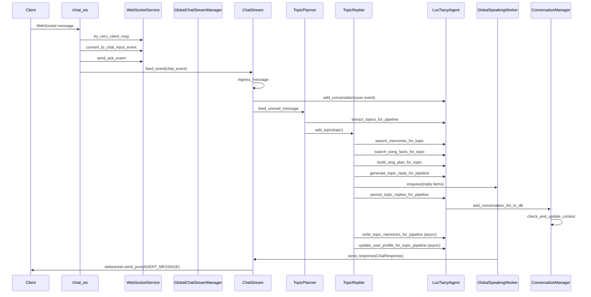

# chat_ws 消息全链路说明

本文描述一条消息从 WebSocket 入口 `/chat_ws` 进入，到回复消息最终回传到客户端的完整路径。内容基于当前代码实现，按真实调用顺序展开。

## 1. 启动阶段：链路依赖装配

入口文件：`server_main.py`

在应用启动时，`startup_event` 会完成依赖初始化并组装 `ServiceHub`：

- `init_luotianyi_agent(...)`
  - 初始化 `LuoTianyiAgent`
  - 注入 Agent 私有运行时依赖（redis、vector_store、sql_session_factory、song_session_factory）
- `ServiceHub(...)`
  - `websocket_service`
  - `gcsm` (GlobalChatStreamManager)
  - `global_speaking_worker`
  - `agent`
- `gcsm.start_cleanup_task(...)`
- `global_speaking_worker.start_if_needed()`

这一步决定了后续请求处理过程中，消息在各模块间如何流转。

---

## 2. WebSocket 入口：接入、认证、接收消息

入口函数：`server_main.py` 中 `chat_ws(...)`

### 2.1 建连与认证

1. `await websocket.accept()`
2. `await websocket_service.send_system_ready_event(websocket)`
3. 创建 `WebSocketConnection(websocket=..., user_uuid=None, user_name=None)`
4. `await ws_connection.auth(websocket_service)`
   - 内部循环读取消息：`WebSocketService.try_recv_client_msg(...)`
   - 遇到 `USER_AUTH` 事件后调用：`WebSocketService.handle_auth_event(...)`
   - 验证通过后 `ws_connection.set_user(...)`

### 2.2 绑定聊天流

认证成功后：

- `chat_stream = gcsm.get_or_register_chat_stream(ws_connection, service_hub=service_hub)`

`GlobalChatStreamManager.get_or_register_chat_stream(...)` 行为：

- 首次用户：创建 `ChatStream`，注入 `ServiceHub`，启动常驻任务
- 重连用户：复用已有 `ChatStream`，替换连接

### 2.3 主循环收包

`chat_ws` 主循环：

1. `event = await websocket_service.try_recv_client_msg(ws_connection)`
2. 若是心跳 `HB_PING`：`await websocket_service.handle_ping_event(...)`
3. 否则转换业务事件：`chat_event = websocket_service.convert_to_chat_input_event(event)`
4. 聊天事件先 ACK：`await websocket_service.send_ack_event(ws_connection, event)`
5. 投递进聊天流：`await chat_stream.feed_event(chat_event)`

---

## 3. ChatStream：入站标准化与双路分发

核心类：`src/pipeline/chat_stream.py` 中 `ChatStream`

入口方法：`feed_event(event: ChatInputEvent)`

对于用户消息（`USER_TEXT` / `USER_IMAGE`）会做两件事：

1. 入站预处理：`await ingress_message(self.service_hub, self.user_name, event)`
2. 用户消息入库：`await self.service_hub.agent.add_conversation(self.service_hub, self.user_uuid, event)`

然后无论是否文本/图片，都会进入话题规划：

- `await self.topic_planner.feed_unread_message(event)`

### 3.1 ingress 预处理做了什么

`src/pipeline/modules/ingress.py`：

- 图片事件：`_process_image_message(...)`
  - 保存图片
  - 调用 `service_hub.agent.vision_module.describe_image(...)`
  - 把图像描述写回 `message.text`
- 文本/图片：调用 `extract_song_entities(...)`
  - 若提取到实体，写入 `message.payload["terms"]`

---

## 4. TopicPlanner：把未读消息提取成话题

核心类：`src/pipeline/topic_planner.py` 中 `TopicPlanner`

### 4.1 接收未读

`feed_unread_message(...)`：

- 用户输入中事件（typing）会调整等待超时
- 其他消息写入 `UnreadStore`
- 唤醒后台处理协程

### 4.2 常驻处理协程

`start_processing()` 启动 `message_processor()`，它循环执行：

1. 从 `UnreadStore + ListenTimer` 决定是否立即提取或等待补全
2. 快照未读：`unread_store.snapshot()`
3. 调用 `_extract_topics(...)`
   - 主路径：`service_hub.agent.extract_topics_for_pipeline(...)`
   - 失败降级：`_fallback_extract(...)`
4. 提交提取结果：`_commit_extraction_result(...)`
5. 分发提取出的 topic：`_consume_topics(...)`

### 4.3 topic 分发到 replier

`ChatStream` 初始化时做了绑定：

- `self.topic_planner.set_topic_consumer(self.topic_replier.add_topic)`

因此 `_consume_topics(...)` 会逐条调用：

- `await self.topic_replier.add_topic(topic)`

---

## 5. TopicReplier：检索、生成回复、发送、落库

核心类：`src/pipeline/topic_replier.py` 中 `TopicReplier`

### 5.1 常驻消费 topic

`start_processing()` 启动 `topic_processor()`，循环：

1. `topic = await topic_queue.get()`
2. `await _reply_one_topic(topic)`

### 5.2 单个 topic 的处理流程 `_reply_one_topic(...)`

并发准备阶段（`asyncio.gather`）：

- `_memory_search(...)`
  - 调用 `agent.search_memories_for_topic(...)`
- `_fact_search(...)`
  - 调用 `agent.search_song_facts_for_topic(...)`
- `_sing_plan(...)`
  - 调用 `agent.build_sing_plan_for_topic(...)`

生成回复：

- `reply_items = await agent.generate_topic_reply_for_pipeline(...)`
  - 内部会读取上下文、用户画像，并调用主聊天模块生成 `TopicReplyResult` 列表

逐条分发回复：

- `await _dispatch_reply_item(...)`
  - text: `global_speaking_worker.enqueue(SpeakingJob(..., job_content=item.reply_text))`
  - sing: 组装 `SongSegmentChat(...)` 后入全局 speaking 队列

回复后持久化（你刚打通的链路）：

- `await agent.persist_topic_replies_for_pipeline(...)`
  - 将 `reply_items` 转成 `ConversationItem` 列表
  - 调 `conversation_manager.add_conversation_list_to_db(...)`
  - 在 `ConversationManager` 内部触发 `check_and_update_context(...)`
  - 若超过阈值，会异步触发 `_update_context(...)` 做上下文压缩摘要

回复后记忆写入（异步）：

- `await _schedule_memory_write(...)`
  - 创建后台任务
  - 调 `agent.write_topic_memories_for_pipeline(...)`

回复后用户画像更新（异步）：

- `await _schedule_user_profile_update(...)`
  - 创建后台任务
  - 调 `agent.update_user_profile_for_topic_pipeline(...)`
  - 内部调用 `memory_manager.update_user_profile_by_topic(...)`
  - 以 `history + current_dialogue + current_profile` 进行独立 LLM 调用
  - 若返回非空新画像：
    - 更新 SQL `users.description`
    - 更新内存数据库缓存 `user_description:{user_id}`

---

## 6. 回传链路：GlobalSpeakingWorker -> ChatStream -> WebSocket

### 6.1 全局 speaking worker 串行消费

`src/pipeline/global_speaking_worker.py`：

- `enqueue(job)` 将任务入队
- `_run()` 单消费者循环：
  1. 根据 `job_content` 组装 `ChatResponse`
  2. `await job.chat_stream.send_response(resp)`

### 6.2 ChatStream 发送给前端

`ChatStream.send_response(response)`：

1. 构造事件：`ws_service._make_event(WSEventType.AGENT_MESSAGE, response.model_dump())`
2. 下发：`await ws_connection.websocket.send_json(event)`

至此，一条由 `/chat_ws` 接收的用户消息，经过规划与回复后，最终作为 `AGENT_MESSAGE` 事件回传客户端。

---

## 7. 关键接口调用清单（按先后）

1. `chat_ws(...)`
2. `WebSocketService.send_system_ready_event(...)`
3. `WebSocketConnection.auth(...)`
4. `WebSocketService.try_recv_client_msg(...)`
5. `WebSocketService.handle_auth_event(...)`
6. `GlobalChatStreamManager.get_or_register_chat_stream(...)`
7. `WebSocketService.convert_to_chat_input_event(...)`
8. `WebSocketService.send_ack_event(...)`
9. `ChatStream.feed_event(...)`
10. `ingress_message(...)`
11. `LuoTianyiAgent.add_conversation(...)`
12. `TopicPlanner.feed_unread_message(...)`
13. `TopicPlanner.message_processor(...)`
14. `LuoTianyiAgent.extract_topics_for_pipeline(...)`
15. `TopicReplier.add_topic(...)`
16. `TopicReplier.topic_processor(...)`
17. `LuoTianyiAgent.search_memories_for_topic(...)`
18. `LuoTianyiAgent.search_song_facts_for_topic(...)`
19. `LuoTianyiAgent.build_sing_plan_for_topic(...)`
20. `LuoTianyiAgent.generate_topic_reply_for_pipeline(...)`
21. `GlobalSpeakingWorker.enqueue(...)`
22. `LuoTianyiAgent.persist_topic_replies_for_pipeline(...)`
23. `ConversationManager.add_conversation_list_to_db(...)`
24. `ConversationManager.check_and_update_context(...)`
25. `TopicReplier._schedule_memory_write(...)`
26. `LuoTianyiAgent.write_topic_memories_for_pipeline(...)`
27. `TopicReplier._schedule_user_profile_update(...)`
28. `LuoTianyiAgent.update_user_profile_for_topic_pipeline(...)`
29. `MemoryManager.update_user_profile_by_topic(...)`
30. `GlobalSpeakingWorker._run(...)`
31. `ChatStream.send_response(...)`
32. `websocket.send_json(...)`

---

## 8. 时序图（简化）

---

## 9. 说明

- 本链路是“WebSocket 在线会话”路径，区别于 `/chat` HTTP 流式接口。
- 回复发送与数据库持久化已经解耦：
  - 发送由 `GlobalSpeakingWorker` 串行保障顺序
  - 回复落库和上下文压缩检查由 `persist_topic_replies_for_pipeline(...)` 驱动
  - 记忆写入由独立异步任务执行（best effort）
  - 用户画像更新由独立异步任务执行（best effort）
- 如果后续引入更多事件类型（例如工具调用、系统事件），建议在 `WebSocketService.convert_to_chat_input_event(...)` 统一收口，再扩展 `ChatStream.feed_event(...)` 分发策略。
